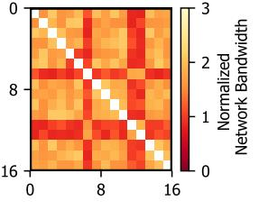

# *C. Heterogeneous Network*

The heterogeneous networks are common in modern data centers designed for training the large-scale pre-trained mod-

(a) Hierarchical network topology illustrating fast paths (blue) under the same edge switch and slower paths (red) through multiple switch layers.

(b) Normalized network bandwidth heatmap obtained by profiling 16 G instances in an AWS environment.

Fig. 6: Heterogeneous inter-node communication.

els. First, there is a significant bandwidth gap between intranode and inter-node communication. For intra-node communication, it uses highly-optimized dedicated networks such as NVLink [64], which can provide a bandwidth of up to 900 GB/s (NVLink 4.0 [65]). In contrast, inter-node communication relies on networks like InfiniBand [66] or Ultra Ethernet [67], which offer significantly lower bandwidth than the dedicated networks, typically up to 100 Gbps (12.5 GB/s).

Moreover, the inter-node network itself has considerable heterogeneity, as shown in Figure 6. Figure 6a illustrates the scenarios where bandwidth heterogeneity arises in modern data centers. Modern data centers employ a hierarchical network topology with multiple switch layers, such as edge switches and distribution/core switches. This structure causes significant variability in inter-node bandwidth. For example, nodes connected under the same edge switch (blue path) have higher bandwidth, while nodes connected through multiple switch layers (red path) face much lower bandwidth [68]. To quantify this inter-node heterogeneity, we conduct network bandwidth profiling between 16 nodes within the same region on Amazon EC22 . Figure 6b shows the profiling results in which certain nodes (i.e., 7, 12, 13) exhibit up to 50% lower bandwidth than other node pairs.

Note that the large-scale pre-trained models demand substantial computational and memory resources, and the models end up being distributed across multiple nodes or racks. Therefore, the current distributed training frameworks have no choice but to use heterogeneous networks for training the large-scale pre-trained models. However, existing frameworks often lack optimizations that take into account heterogeneous networks, leading to suboptimal performance.

