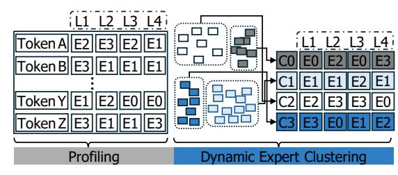

# Observation 4

The large-scale distributed frameworks employ heterogeneous networks for training the Transformer MoE models, but they often fail to achieve their performance because of a lack of topology-aware communication optimization.

2We focus on the cloud environment rather than in-house data centers. Although the dedicated in-house data centers may offer homogeneous internode networks, they entail significant initial setup and maintenance costs.

Fig. 7: The portion of unnecessary zeros and the latencies of all-to-all communications during each training epoch.

#### D. Design Goals

Based on observations, we set our design goals as follows:

- **All-to-all communication optimization.** We propose *adaptive all-to-all communication* to minimize communication volume by removing unnecessary zero padding.
- Balanced expert selection. We propose *dynamic expert clustering*, facilitating more balanced expert selection.
- Heterogeneous network-aware data placement. We propose topology-aware expert remapping to fully leverage any type of network configuration.

#### IV. SCALEMOE

#### A. Adaptive All-to-all Communication

**Existing all-to-all communication.** The MoE layer involves two all-to-all communications: one after the gating network and another after FFNs (i.e., *experts*). For each GPU, input tokens pass through the gating network, which returns their corresponding expert indices. By using these expert indices and expert-to-GPU mapping information, the training frameworks categorize input tokens into multiple groups for each target GPU. Since the number of selected experts can vary for the given input tokens, the state-of-the-art distributed training frameworks compute the maximum group size across GPUs and then apply zero padding to each per-GPU token group to achieve a uniform all-to-all message size [3].

This approach works well when the expert selection is well-balanced; however, its efficiency significantly decreases as the expert selection becomes heavily skewed toward specific experts. As the expert selection becomes more imbalanced, the communication volume of unnecessary zeros increase accordingly. To identify the performance implications of this zero padding, we measure the ratio of unnecessary zeros during the training process. Figure 7 shows the portion of unnecessary zeros and the corresponding all-to-all communication latency. In the early stage of training, the ratio of unnecessary zeros is 88%, and it quickly rises to 98%.

Adaptive all-to-all communication. We propose the *adaptive all-to-all communication* to resolve high all-to-all communication problem by eliminating zero transfers. Rather than using zero padding, our approach accurately identifies the required number of tokens for both input and output slices. By leveraging this information, ScaleMoE transmits only the necessary values, thereby significantly reducing communication volume and all-to-all communication latency.

Fig. 8: The overview of adaptive all-to-all. At runtime, Scale-MoE monitors the per-expert selection counts (e.g., GPU-1: 4–1–3–2) in each GPU, aggregates them across devices via an all-gather operation, and uses them to compute input/output slice sizes for buffer allocation.

Fig. 9: The overview of dynamic expert clustering. At runtime, ScaleMoE profiles each token's expert selections (e.g., Token A selects E2, E3, E2, and E1) across MoE layers (e.g., L1–L4), and performs replication based on the profiling results. Then, it applies clustering based on expert selection patterns (e.g., C0–C3). The replicating experts step is omitted for simplicity.

Figure 8 shows the high-level overview of adaptive all-to-all communication. In this example, we assume there are four experts, each expert allocated to each GPU, and each GPU receives ten input tokens. For each GPU, ScaleMoE monitors the expert selection counts for the input tokens (Monitoring). In this example, on GPU-1, four tokens select expert-1, one token selects expert-2, three tokens select expert-3, and two tokens select expert-4. Then, ScaleMoE aggregates these expert selection counts from all GPUs (All-gather). By doing so, ScaleMoE can now figure out the exact number of required tokens for each expert, both for input ( $i^{th}$  column for GPU-i) and output ( $j^{th}$  row for GPU-j) slices. With these input and output slices, ScaleMoE can successfully transfer only the necessary data (Adaptive all-to-all).

As shown, the adaptive all-to-all communication requires extra communication to aggregate the expert selection counts from all GPUs (All-gather). However, zero padding elimination leverages the router's per-token expert indices to compute slice sizes, thereby avoiding any additional computation; the All-gather overhead is negligible compared to the volume of unnecessary zero transfers.

#### B. Dynamic Expert Clustering

To reduce the load imbalance in expert selection, we propose *dynamic expert clustering*. Figure 9 shows the overview of this process. We use the expert selection history from the previous epoch to predict the current expert selection for given input tokens. To do so, ScaleMoE profiles per-token expert

Fig. 10: The ratio of changes in expert selection for each token between two consecutive epochs. Here, the per-token expert selection becomes more stable as training progresses.

