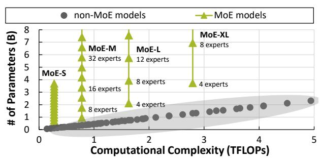

# 1 Introduction

Mixture-of-Experts (MoE) [\(Shazeer et al.,](#page-10-0) [2017;](#page-10-0) [Du et al.,](#page-8-0) [2022;](#page-8-0) [Riquelme et al.,](#page-10-1) [2021;](#page-10-1) [Jiang et al.,](#page-9-0) [2023\)](#page-9-0) integrate multiple smaller sub-models or "experts" within a comprehensive ensemble model. The key enabling factor behind their success lies in the incorporation of learnable gating networks, which efficiently allocate input tokens to different experts. It improves the performance and scalability of models without increasing the computational complexity [\(Clark](#page-8-1) [et al.,](#page-8-1) [2022;](#page-8-1) [Hwang et al.,](#page-9-1) [2022\)](#page-9-1), effectively *decoupling* the computational cost from the parameter size.

*Proceedings of the* 41 st *International Conference on Machine Learning*, Vienna, Austria. PMLR 235, 2024. Copyright 2024 by the author(s).

Parameters in MoE models can easily exceed billions, requiring a significant amount of memory for training. To train such models, expert parallelism [\(Fedus et al.,](#page-8-2) [2022;](#page-8-2) [Lep](#page-9-2)[ikhin et al.,](#page-9-2) [2020\)](#page-9-2) has become a de facto standard, wherein each GPU exclusively handles one or more experts. This assigns experts across GPUs while replicating non-expert parameters on each GPU, allowing multiple experts to run concurrently within a single GPU.

Recent research has been pushing MoE models beyond 128 experts to improve model accuracy [\(Puigcerver et al.,](#page-9-3) [2023;](#page-9-3) [Clark et al.,](#page-8-1) [2022;](#page-8-1) [Koishekenov et al.,](#page-9-4) [2022;](#page-9-4) [Rajbhandari](#page-10-2) [et al.,](#page-10-2) [2022;](#page-10-2) [Fedus et al.,](#page-8-2) [2022\)](#page-8-2). However, scaling MoE models requires additional GPUs due to the increased memory footprint, even though the computational complexity remains the same. Thus, existing solutions for training large MoE models (e.g., FairSeq, DeepSpeed-MoE, Tutel) demand a large array of GPUs, limiting the ability of many researchers to train or even refine these models. For example, training MoE-L with 8 experts is feasible with four A100 GPUs, but scaling it to 128 experts demands 52 GPUs, which is a significant hurdle to most academic researchers.

To address the problem, ES-MoE improves the scalability of MoE models beyond the GPU memory limit and enhances the training efficiency of large MoE models. It is the first work to target the settings where the memory footprint of MoE expert models exceeds the GPU memory capacity. Our approach involves offloading expert parameters and optimizer states to the host, which reduces the GPU memory footprint, allowing it to process larger minibatches within limited GPU memory for greater throughput. It facilitates the flexible assignment of experts to GPUs, providing the chance to balance the computational load across GPUs. However, realizing the idea involves handling new challenges:

- Unlike traditional systems in which an expert is statically assigned to a GPU, ES-MoE adopts dynamic scheduling wherein experts are placed on GPUs based on the output of the gating network. This prevents prefetching the experts onto GPUs, potentially causing the pipeline stalls.
- With optimizer states stored in CPU memory, transferring them back to GPU is expensive. Thus, model optimization must operate on the CPU, which takes more time.

\*Equal contribution 1Kim Jaechul Graduate School of AI, KAIST, Daejeon, Republic of Korea 2 School of Electrical Engineering, KAIST, Daejeon, Republic of Korea. Correspondence to: Dongsu Han <dhan.ee@kaist.ac.kr>.

1The source code is available at [https://github.com](https://github.com/kaist-ina/es-moe) [/kaist-ina/es-moe](https://github.com/kaist-ina/es-moe).

Figure 1: MoE models decouple the computational complexity from the number of parameters.

• Scaling the number of experts exacerbates token load imbalance. This disparity leads to the *straggler problem* [\(Harlap et al.,](#page-9-5) [2016\)](#page-9-5). Although techniques such as sparse matrix multiplication [\(Gale et al.,](#page-8-3) [2022\)](#page-8-3) have been proposed, existing designs do not scale well.

Our design resolves the challenges by introducing dynamic expert placements, and pipelined CPU optimizations, while offloading expert parameters for virtually unlimited scaling. ES-MoE employs expert-level scheduling that strategically manages expert parameter uploads to enable pipelined expert processing that overlaps the GPU-CPU communication with expert computation to maximize the GPU utilization. In contrast to generic pipelining methods that operate on a layer-by-layer basis and wait for the entire layer to finish, our expert-level pipelining starts optimization as soon as an individual expert finishes its computation. In addition, ES-MoE balances the load across GPUs by managing the placement of experts considering their load.

We provide a comprehensive evaluation of the scalability and throughput of ES-MoE with GPT-based [\(Radford](#page-9-6) [et al.,](#page-9-6) [2019\)](#page-9-6) MoE models. ES-MoE accommodates up to 66.5 times more experts than existing frameworks and is able to fine-tune 15B parameter language models with just 4 GPUs. It completed the fine-tuning on 100 M tokens in 6.5 hours using datasets [\(Williams et al.,](#page-10-3) [2017\)](#page-10-3) containing 16 M tokens to significantly improve the accuracy. It achieves a notable increase in throughput of up to 11.6× over generic offloading methods, and up to 2.12× compared to the state-of-the-art method, Tutel [\(Hwang et al.,](#page-9-1) [2022\)](#page-9-1).

