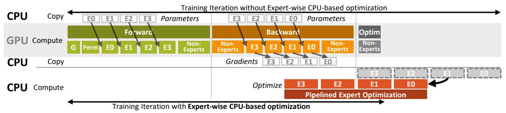
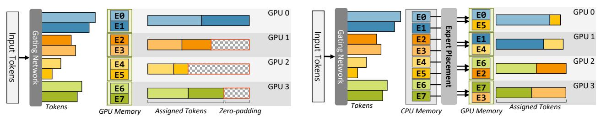
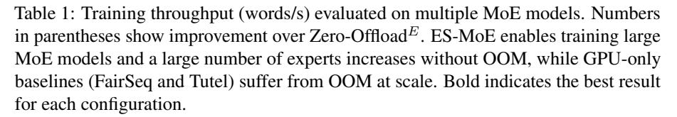
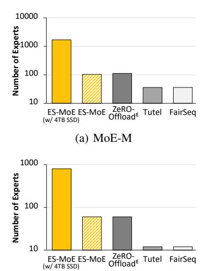
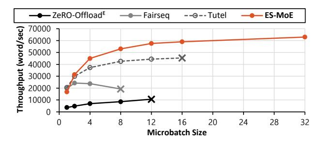
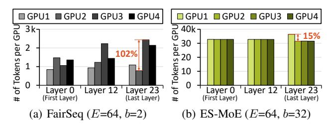
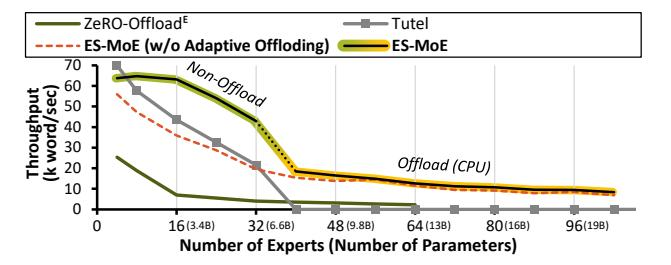

# 3 Problem and Motivation

MoE models can be easily scaled to attain enhanced model performance by adding more experts but without increasing the computational cost, as shown in [Figure 1.](#page-1-1) GPT-L has 760 million parameters, but its MoE counterpart, MoE-L can reach 2.11 billion parameters with 4 experts and 14.8 billion parameters with 32 experts, while having the same computational cost as GPT-L.

However, scaling MoE-based models with existing frameworks, in practice, presents challenges for two key reasons. First, although the model inherently decouples computational complexity from the model size, the underlying system does not support decoupling computation from memory. As a result, increasing the number of experts requires adding more GPUs, which is not always a viable option for many researchers. For instance, training MoE-L with 8 experts is feasible with only four A100 GPUs, scaling the model to 128 experts requires 52 GPUs, substantially increasing the barrier. Second, scaling the number of experts exacerbates existing inefficiencies in computation, which further limits GPU utilization. We expose the issues in greater detail.

Large memory footprint. Existing systems demand large amounts of GPU memory for the following reasons: First, they load all experts on GPUs as they execute the expert computations simultaneously. Adding more experts increases the GPU memory requirements for model memory and optimizer states. Second, the use of batch matrix multiplication in expert computation requires creating a dispatch mask to reorder the tokens so that they can be sent to the correct expert according to the decision of the gating network. However, this dispatch mask is essentially a *huge* table that maps tokens to experts with a dimension of (number of tokens after zero-padding)×(number of tokens) [\(Huang et al.,](#page-9-13) [2023\)](#page-9-13), occupying substantial memory. For example, training MoE-L with a batch size of 32 and 1024 tokens per batch requires *at least* 48 GiB for the mask.

GPU underutilization. Scaling up the number of experts results in GPU under-utilization for the following reasons: First, as the input batch (input tokens) gets distributed across

experts, increasing the number of experts proportionally reduces the number of tokens per expert. This decrease in the token count per expert in MoE models leads to lower GPU utilization. Second, the demand for large memory creates memory pressure and limits the size of microbatches; e.g., training MoE-M with 4 experts and four A100 40GB GPUs allows the microbatch size of 8, but increasing to 32 experts drops the size to 2, reducing training throughput by 46.2%. Finally, increasing the number of experts exacerbates the token load imbalance, which can be quantified by the fraction of zero-padding required to evenly distribute the load across all experts relative to the total workload. Empirical data from training the MoE-L model show that with 8 experts, the token load imbalance in the initial training phase reaches up to 17% (i.e. 17% of computations are used for computing zero padding) but with 32 experts, it increases to 39%.

Limited GPU availability. Securing a large number of GPUs for model training is a significant challenge for many researchers, especially those in academic settings and small organizations [\(Holmes & Gardizy,](#page-9-14) [2023;](#page-9-14) [Kuperman,](#page-9-15) [2023\)](#page-9-15). Most cloud providers impose stringent resource quotas on individuals, due to the limited availability of GPUs [\(Google](#page-8-5) [Cloud,](#page-8-5) [2024\)](#page-8-5). The situation worsens during peak demand periods, making it difficult for individuals to obtain even a few GPUs. This barrier often prevents researchers from the opportunity to train or even fine-tune large MoE models.

### 4 ES-MoE Design

Goals. We present a design of ES-MoE that tackles the challenges described in [§3](#page-2-0) in scaling training MoE-based models. Specifically, ES-MoE achieves the following goals:

- Scalable w.r.t. the number of experts: ES-MoE must be able to scale to a large number of experts without having to add more GPUs.
- Improve efficiency in training: It should improve the GPU utilization by supporting larger mini-batches, mitigating the token imbalance, and minimizing any overhead introduced from scaling.
- Preserve model accuracy: It must maintain the integrity of a model by maintaining mathematical equivalence to preserve the model accuracy.

Key approach. The key idea of ES-MoE is to offload expert parameters from the GPU to host memory and storage, which allows us to accommodate larger models than the GPU memory permits. With our careful pipelining of expert loading and computation, we effectively minimize the overhead of copying parameters to and from GPUs ([§4.1\)](#page-3-0).

The offloading of experts opens up two new opportunities for enhancing the training throughput. First, the offloaded experts alleviate the GPU memory pressure and free memory, which can be used to increase the batch size for training. This allows ES-MoE to fully utilize the parallelism in GPUs

Figure 2: ES-MoE overlaps expert's computation and communication and pipelines CPU optimization at the expert granularity to overlap with the backward pass of the layer. E0, ..., E3 indicate experts in the same layer. G and Perm respectively indicate the gating network and token permutation phase.

and thus increase the training speed. Second, the experts have to be dynamically loaded to GPUs for computation, which gives us an opportunity to place experts on the GPUs in a way that evenly balances the load across GPUs without having to use zero-padding (§4.2). Finally, ES-MoE adapts the degree of offloading based on the number of experts per GPU and the maximum number of experts a GPU can accommodate in its memory (§4.3).

#### 4.1 Expert-wise Offload and Processing

ES-MoE offloads expert parameters and optimizer states, while efficiently scheduling the upload, download, and optimization of individual experts. It maintains only the followings states in the GPU memory: non-expert parameters, parameters of the expert being used at the moment, and their activations. The remaining offloaded state is kept on either the host memory or storage. The offloading allows ES-MoE to scale the number of experts beyond the GPU memory limit, unlike layer-wise offloading (Ren et al., 2021; Rajbhandari et al., 2021) which causes out-of-memory when the experts in a layer exceeds the GPU memory capacity.

Pipelined expert processing. A key challenge in offloading experts is that its upload must be carefully scheduled so that they minimize GPU stalls. Training an MoE block starts with tokens passing through the gating network (G in Figure 2). Based on the output of the gating network, ES-MoE places experts on GPUs to evenly distribute load across GPUs, calculated by the expert placement module (detailed in §4.2). After the decision, ES-MoE uploads the experts to the GPUs according to the decision. However, this poses a challenge because the expert placement on GPUs can only be determined after the gating network is executed, leaving too little time to upload all experts assigned to a GPU, leading to potential GPU stalls.

To address this, ES-MoE implements a careful pipeline of the tasks to be completed following the output of the gating network. The tasks include token permutation, expert upload, and expert processing. Before being fed to the experts, the tokens are reordered in the permutation phase for the token exchange across GPUs. Although the token permutation time is too short to complete the upload of multiple experts, it usually gives sufficient time for transferring a single expert. Thus, ES-MoE overlaps the permutation phase (Perm in Figure 2) with the time required to upload the first expert. Subsequent experts are then processed sequentially, ensuring concurrent expert computation and upload, reducing the perceived expert loading time.

**Supporting larger batches.** ES-MoE differs from other GPU-based schemes (e.g., Tutel) in that it does *not* use batched matrix multiplication. This is due to the incompatibility of expert-wise offloading with batched matrix multiplication, which requires all experts to be loaded into GPU memory. Interestingly, not using batched matrix multiplication brings a significant benefit in reducing the GPU memory footprint. Instead of creating a large dispatch mask required for the batched matrix multiplication, ES-MoE sequentially assigns tokens to the target expert based on the gating network decision, saving memory substantially.

The GPU memory saved by this sequential approach allows for larger batch sizes, which results in improved throughput. For example, when training MoE-L, this approach allows ES-MoE to handle  $8 \times$  larger microbatches, which translates into  $3.1 \times$  throughput improvements (Table 3).

Comparing memory-saving techniques, we can compare ES-MoE's sequential approach with the sparse batched matrix multiplication introduced by MegaBlocks (Gale et al., 2022). MegaBlocks reduces the memory required for the dispatch mask and improves throughput by eliminating zero padding. MegaBlocks particularly becomes efficient as the number of experts increases (i.e., the batched matrices become sparser). However, MegaBlocks is only useful when the GPU memory is abundant since it requires all experts to be loaded into GPU memory for batched matrix multiplication. In contrast, ES-MoE's sequential approach doesn't require all experts to be loaded into GPU memory at the same time, allowing training of larger batches.

**Expert-wise CPU-based optimization.** Due to the large memory footprint of optimizer states, the use of a CPU-based optimizer is inevitable. However, the CPU-based optimizer is extremely slower compared to a GPU-based

(a) Traditional MoE training (static expert placement)

(b) ES-MoE (dynamic expert placement)

Figure 3: Example of training a MoE model with 4 GPUs and 8 experts. E0 to E7 indicates separate experts in the same layer. Dynamic expert placement of ES-MoE eliminates the need for zero padding, achieving high efficiency.

optimizer (e.g., 31x slower with Adam). On top of this, existing frameworks apply optimizer at the granularity of the entire model (Hwang et al., 2022; Lepikhin et al., 2020) or the entire layer (Pudipeddi et al., 2020). As the number of experts in MoE-based models grows, the processing time of CPU-based optimization increases, resulting in GPU stalls.

To address the challenge, ES-MoE introduces expert-wise CPU-based optimization, which enables concurrent CPU optimization and GPU computation. ES-MoE runs the optimizer at the granularity of individual experts—ES-MoE initiates the optimizer for each expert as soon as each expert completes its backward pass (Figure 2), instead of waiting for the entire layer to complete the backward pass. This is especially useful for models with many layers and experts since the optimization of layers close to the output can be hidden by the GPU's processing of other layers.

Note this is different from delayed update used in ZeRO-Offload (Ren et al., 2021), where the parameter update is delayed to overlap CPU optimizations with the next iteration. Although delayed update hides the latency of CPU-based optimization, it introduces "staleness", affecting final model accuracy (Dai et al., 2018). In contrast, ES-MoE performs updates at the granularity of the expert without introducing staleness and maintains the original model accuracy.

Offloading experts to SSD. Although CPU RAM is expandable, this expandability does not apply to cloud environments, where most researchers train their models. Cloud providers offer only predetermined sets of GPU, CPU, and RAM configurations for each type of virtual machine instance. For example, AWS instance type p3.4xlarge offers four V100 GPUs, but only provides 244 GiB of CPU RAM. To access larger amounts of RAM, researchers must opt for more expensive higher-tier instances, resulting in increased costs. Instead, cloud providers offer highly scalable storage solutions, such as AWS Elastic File System (EFS), which can scale almost without limit.

To exploit highly scalable storage, ES-MoE extends its offloading strategy to include fast storage devices, such as SSDs, allowing it to scale beyond the CPU memory capacity. To enable this, ES-MoE uses a virtual memory (VM)- like method with prefetching; it maintains a limited set of experts in CPU memory, and evicts them using the Least Recently Used (LRU) cache policy. The key to this system is the prefetching of experts using the predictable sequence of forward and backward passes in training. This enables efficient expert handling between CPU memory and storage without bottlenecks and is superior to using naïve VM for two reasons: First, the naïve approach lacks application-level knowledge and can fetch the next expert only after a page fault, which may stall the training. Second, it allows more efficient data transfers, as ES-MoE prefetches experts onto DMA-able non-pageable (pinned) memory area. When using a naïve VM approach, experts must be copied from the pageable memory to the pinned memory.

#### 4.2 Dynamic Expert Placement on GPUs

Existing work on training MoE suffers from load imbalance across GPUs that arise from the skewed distribution of tokens across experts (Figure 3(a)). This is because experts are fixed on the GPU memory, whereas the distribution of tokens changes over time. However, in ES-MoE, because experts are loaded on the GPUs on demand and each GPU processes multiple experts sequentially, the placement of experts can be adapted to the distribution of tokens on a per-batch basis such that the aggregate load on a GPU is balanced, as shown in Figure 3(b). Our dynamic expert placement effectively decouples the load-balancing decision from the token routing decision.

We now explain how ES-MoE decides the placement of n experts on k GPUs, where n is often much greater than k. Distributing experts across GPUs to balance the token load is similar to minimum makespan scheduling (Vazirani, 2001) whose goal is to minimize the finishing time of the last task. This is known as a strong NP-hard problem (Garey, 1997). To ensure fast expert upload and token transfer, we require an approximate solution. We adopt a greedy scheduling algorithm from (Graham, 1969) that gives a  $\frac{4}{3}$ -approximation for the problem. This algorithm sorts the experts by the expert processing times, modeled as the maximum of the expert upload time plus the expert processing time determined by the number of tokens as-

signed. It then assigns each expert to the group with the lowest accumulated processing times.

This algorithm runs efficiently on the CPU in a short time (< 2.69 us). Considering that expert computation and upload take a few milliseconds, running the expert placement algorithm does not block the training process. The complexity of the algorithm is O(m∗logn+m∗logm), where m is the number of experts and n is the number of GPUs. However, in most cases, n << m and m is at most hundreds, so the actual runtime of this algorithm is trivial.

#### 4.3 Adaptive Offloading

This section introduces additional optimizations regarding expert offloading. While the CPU offloading and pipelined expert processing are useful in scaling MoE models, they do not provide performance benefits when training smaller models that fit within the aggregate GPU memory and/or when the number of tokens allocated to each expert is so small that its computation time is too short to hide the delay of uploading another expert. To automatically attain the best performance in any setting, ES-MoE introduces adaptive offloading, in which the degree of offloading is determined based on the number of experts per GPU and the maximum number of experts a GPU can accommodate in its memory.

GPU only. In the limited scenario where all expert parameters and optimizer states fit within the GPU memory, ES-MoE operates with all experts kept within the GPU memory, achieving training throughput gain from the zero-padding elimination. As ES-MoE does not offload experts, we cannot obtain benefits coming from the dynamic expert placement, thus the load across GPUs may vary as in other baselines. However, ES-MoE still outperforms other baselines as it saves GPU memory by avoiding creating large dispatch masks and allows training with larger batches, which contributes to higher GPU utilization.

Offload with expert pinning. As the number of experts increases, expert loading time relative to the processing time also increases, potentially causing GPU stalls. To mitigate this, ES-MoE pins a few heavily used experts on each GPU. Pinning experts allows greater time to dynamically load other experts and reduces the number of expert I/O, thus improving the GPU utilization. The token load of an expert does not vary much from one iteration to the next in the training phase. Thus, ES-MoE pins the top np experts to each GPU from the previous iteration and use dynamic placement for remaining experts. We empirically set np as 25% of the number of experts in each GPU.

### 5 Evaluation

We evaluate ES-MoE against several state-of-the-art training frameworks, including a generic CPU offloading framework and and those optimized for training MoE-based models. Our main findings are as follows:

- ES-MoE shows excellent scalability with an increasing number of experts and model size, allowing training of 64 expert MoE-L with only 4 GPUs, while all other frameworks suffer from OOM.
- ES-MoE enhances training throughput up to 17.5× compared to the framework that supports offloading and 2.13× compared to existing frameworks optimized for training MoE models, all while preserving mathematical equivalence to original training semantics.

Implementation. ES-MoE is implemented on top of the Fairseq framework [\(Ott et al.,](#page-9-18) [2019\)](#page-9-18). For CPU-based optimization, we adopt the efficient CPU Adam optimizer by DeepSpeed [\(Microsoft,](#page-9-19) [2023\)](#page-9-19). We implement ES-MoE with 3.3k lines of Python and 3.0k lines of C++ code.

Setup. We conduct our experiment on a GPU node with four NVIDIA A100 with 40 GB of GPU memory and an AMD EPYC 7543 processor (32 cores) and 512 GiB DDR4 CPU memory. The node uses PCIe 4.0 for CPU-GPU communication and NVLink (600 GB/s) for GPU-GPU communication, enabling efficient token exchange between GPUs.

Baselines. We compare ES-MoE with frameworks optimized for training MoE-based models, including Fairseq's Gshard [\(Lepikhin et al.,](#page-9-2) [2020\)](#page-9-2) and Tutel [\(Hwang et al.,](#page-9-1) [2022\)](#page-9-1). In addition, to compare with a CPU offloading scheme, we use a modified version of ZeRO-Offload [\(Ren](#page-10-6) [et al.,](#page-10-6) [2021\)](#page-10-6). The original ZeRO-Offload, which offloads parameters layer by layer, fails to handle a large number of experts causing OOM. Thus, we extend it to support expert-wise offloading and name this version Zero-OffloadE. For all frameworks, we enable activation checkpointing [\(Griewank & Walther,](#page-9-20) [2000;](#page-9-20) [Chen et al.,](#page-8-10) [2016\)](#page-8-10).

Models. We evaluate ES-MoE using GPT-derived Mixtureof-Experts (MoE) language models, MoE-S, MoE-M, MoE-L, and MoE-XL introduced in [Gale et al.](#page-8-3) [\(2022\)](#page-8-3). We provide details of the models, including their hyperparameters in [Appendix A.1.](#page-11-0) We train the models using the WikiText-103 dataset with a vocabulary size of 51,200. We employ the top-1 gating mechanism that directs tokens to the top-ranked expert. We incorporate the imbalance loss technique from [Fedus et al.](#page-8-2) [\(2022\)](#page-8-2), with a coefficient of 0.01, to align with previous research [\(Fedus et al.,](#page-8-2) [2022;](#page-8-2) [Rajbhandari et al.,](#page-10-2) [2022;](#page-10-2) [Lepikhin et al.,](#page-9-2) [2020\)](#page-9-2). In line with standard practices, we apply mixed precision training [\(Micikevicius et al.,](#page-9-21) [2017\)](#page-9-21), using 16-bit (fp16) for parameters and 32-bit (fp32) for the optimizer state, enhancing numerical stability. We maintain a per-device batch size of 32; for frameworks other than ES-MoE, we employ smaller microbatches to prevent OOMs during training and use gradient accumulation.

|           |       |                  | Training Throughput (words/s)      |         |        |        |         |
|-----------|-------|------------------|------------------------------------|---------|--------|--------|---------|
| # Experts | Model | Param.           | $\overline{\text{Zero-Offload}^E}$ | FairSeq | Tutel  | ES-MoE |         |
| 8         | MoE-S | 521 M            | 46321                              | 82631   | 123152 | 163217 | (3.52x) |
|           | MoE-M | 1.76 B           | 18784                              | 27772   | 57605  | 65352  | (3.48x) |
|           | MoE-L | 3.93 B           | 8677.3                             | 21542   | 25526  | 38173  | (4.40x) |
| 16        | MoE-S | 974 M            | 24469                              | 60142   | 96314  | 158904 | (6.49x) |
|           | MoE-M | $3.37\mathrm{B}$ | 6987.7                             | 23705   | 43480  | 63150  | (9.04x) |
|           | MoE-L | 7.56 B           | 4674.4                             | OOM     | OOM    | 20247  | (4.33x) |
| 32        | MoE-S | 1.88 B           | 12847                              | 47088   | 76776  | 148673 | (11.6x) |
|           | MoE-M | $6.60\mathrm{B}$ | 3987.3                             | 17252   | 21587  | 42946  | (10.8x) |
|           | MoE-L | 14.8 B           | 2166.9                             | OOM     | OOM    | 10217  | (4.72x) |
| 64        | MoE-S | 3.70 B           | 6702.8                             | 31644   | 55124  | 117150 | (17.5x) |
|           | MoE-M | 13.0 B           | 2225.7                             | OOM     | OOM    | 12623  | (5.67x) |
|           | MoE-L | 29.3 B           | OOM                                | OOM     | OOM    | 1240.8 | (NaN)   |

Figure 4: ES-MoE is highly scalable, accommodating up to  $5 \times (67 \times \text{with SSD})$  more experts compared to other frameworks.

(b) MoE-L

#### 5.1 Scalability and Performance

Table 1 shows the training throughput of each framework as we increase the number of experts for MoE-based models. For each framework, we use the microbatch size that maximizes its own throughput. Frameworks that rely solely on GPU memory, such as FairSeq, Tutel, and MegaBlocks, fail to complete due to out-of-memory (OOM) as we increase the model size. FairSeq and Tutel struggle to train MoE-L models with 16 or more experts, even with the smallest microbatch of one. Zero-OffloadE encounters OOM when the memory usage exceeds the CPU memory capacity; the 512 GiB RAM is insufficient for training MoE-L models with 64 or more experts. In contrast, ES-MoE efficiently scales to accommodate large models by offloading experts to host CPU memory and storage (SSD), successfully training 29 B-parameter MoE-L with only 4 GPUs.

The result demonstrates that ES-MoE delivers a superior training throughput in all cases, from models of 0.5B to 58B parameters. It outperforms Zero-Offload by up to  $11.6\times$  and MoE-specialized frameworks by up to  $3.16\times$ . The significant performance benefit comes from its ability to handle larger batch sizes, the pipelined offloading design, and the elimination of extra computation from zero-padding, resulting in the highest training throughput across a widerange of scenarios, as detailed in §5.2.

**LLM fine-tuning with 4 GPUs.** Table 2 shows the fine-tuned result of a pre-trained Fairseq-MoE-15B model on three different datasets, SST-2 (Socher et al., 2013),

| Dataset             | SST-2 | MNLI          | BoolQ         |
|---------------------|-------|---------------|---------------|
| Zero-shot accuracy  | 51.6% | 49.3%         | 60.9%         |
| Fine-tuned accuracy | 88%   | <b>78.2</b> % | <b>68.5</b> % |

Table 2: Fine-tuned results of pre-trained Fairseq-MoE-15B model achieved in only **6.5 hours** with 4 GPUs.

MNLI (Williams et al., 2017), and BoolQ (Williams et al., 2017), trained for 100 M tokens without freezing layers. Fine-tuning the model on existing systems requires at least 400 GB of GPU memory and 64 GPUs (Ott et al., 2019). ES-MoE, on the other hand, allows fine-tuning the same model using only 4 GPUs in about 6.5 hours, without compromising model accuracy, unlike low-rank approximation (e.g., LoRA (Hu et al., 2021)) that reduces memory footprint at the expense of accuracy.

Maximum supported model size. We evaluate the scalability of each framework by comparing the maximum number of experts each can handle with 4 GPUs. Figure 4 shows the result for MoE-M and MoE-L models. ES-MoE demonstrates exceptional scalability, surpassing all baselines by supporting up to  $5\times$  more experts and  $4.78\times$  larger model with host memory. The result shows that ES-MoE's scalability is not limited to the GPU memory, but can accommodate larger MoE models as much as host memory and storage permits. With 4 TB of SSD, ES-MoE can scale up to  $67\times$  more experts  $(63\times$  larger number of parameters) compared to the baselines. In contrast, FairSeq and Tutel, are constrained by GPU memory and they can train up to only 12

Figure 5: Training throughput of MoE-M with 16 experts while varying the microbatch size. ES-MoE achieves the best training throughput by supporting larger microbatches.

experts (5.7 M params) with MoE-L. They rely on batched matrix multiplication, which requires creating large dispatch masks. The existence of zero-padding even increases the size of the mask, exacerbating the problem.

#### 5.2 Component-wise Benefit

All three design components considerably benefit performance. We analyze the benefit of each.

Benefit of expert-wise processing. The expert-wise processing effectively reduces GPU memory usage, allowing ES-MoE to handle larger microbatches and makes the GPU run more efficiently. As shown in Figure 5, ES-MoE accommodates 2.67× larger batches than those manageable by other frameworks, allowing it to perform up to 5.91× faster compared to Zero-OffloadE. Because Zero-OffloadE constantly offloads experts to CPU memory, it introduces significant overhead and suffers from limited training throughput. It also struggles to handle larger microbatches due to inefficiencies associated with zero padding, which can take up to 24%. In contrast, ES-MoE stands out by enabling the training of much larger microbatches, up to 32, achieving superior training throughput. Note that adjusting the size of the microbatch does *not* impact model accuracy.

Next, we quantify the benefit of our pipelined expert processing, which enables concurrent CPU optimization and GPU computation. This leads to shorter iteration times in all cases where the experts are offloaded. Compared to ES-MoE without pipelined expert optimization, ES-MoE achieves up to 63.0% higher throughput on MoE-M with 32 experts, resulting from 61.1% higher GPU utilization.

Benefit of dynamic expert placement. ES-MoE's dynamic expert placement effectively distributes the workload across GPUs, significantly reducing token imbalance. To demonstrate this, we compare the number of tokens assigned to each GPU when training the MoE-M model with 64 experts. As shown in Figure 6(a), FairSeq (and other GPU-based baselines as well) shows a significant discrepancy reaching 102% difference in the number of tokens assigned between

Figure 6: The number of tokens assigned to each GPU, evaluated on MoE-M. E and b indicate the number of experts and the microbatch size respectively. Only the first, middle, and last layers are shown out of 24 layers in the model.

Figure 7: Throughput of ES-MoE measured with MoE-M while varying the number of experts.

the most and least burdened GPUs. In contrast, ES-MoE's dynamic expert placement enables balancing the load across GPUs, reducing the gap down to 15%, as shown in Figure 6(b). Note that the number of tokens differs in two figures because FairSeq requires the use of the smaller microbatch size due to memory constraints, while we use a large microbatch size of 32 for ES-MoE.

Benefit of adaptive offloading. ES-MoE offloads experts only when the aggregate GPU memory does not allow it to load the entire model. It has three modes of operation: 1) non-offload, when the GPUs aggregate capacity allows it to load the entire model; 2) offload to CPU memory; 3) offload to CPU memory and SSD. Figure 7 shows the throughput comparison as the number of experts increases. We compare the performance of ES-MoE, Tutel, and ES-MoE without adaptive offload. The model we use is MoE-M. Up to 32 experts (6.6 B parameters), ES-MoE trains the model without offloading. As ES-MoE is able to use larger microbatch size and eliminate zero padding, its performance is better than Tutel. It is also better than ES-MoE without adaptive offload because it does not unnecessarily offload the experts to the CPU and incurs communication overhead. The other two baselines do not scale beyond 32 experts due to the memory limit. In contrast, ES-MoE scales beyond the aggregate GPU memory capacity. Additionally, the strategy of expert pinning proves to be effective; pinning 25% of experts in an MoE-M model with 32 experts resulted in a 22.8% improvement in throughput, compared to ES-MoE without expert pinning (red dotted line). However,

| Scheme                               | Thpt. (Tokens/s) |          |  |
|--------------------------------------|------------------|----------|--|
| ES-MoE                               | 20,247           |          |  |
| – Expert pinning (§4.3)           | 19,501           | (-3.8%)  |  |
| – Optimizer overlapping (§4.1)    | 17,943           | (-8.7%)  |  |
| – Larger batch size (§4.1)        | 5,959            | (-301%)  |  |
| – Zero-padding elimination (§4.2) | 4,674            | (-27.4%) |  |
| (=ZeRO-OffloadE)                     |                  |          |  |

Table 3: Ablation study with MoE-L with 16 experts. Results are cumulative across rows.

as the number of tokens for an expert decreases, it reduces computational efficiency. When the number of experts is above 104, ES-MoE starts to use the SSD offloading experts.

Ablation study. We report the results of an ablation study on the MoE-L model with 16 experts in [Table 3.](#page-8-6) We evaluate the impact of four techniques: larger batch size, optimizer overlap, zero-padding elimination, and expert pinning. By eliminating each technique sequentially, we evaluate their individual contributions to training throughput. Note that our ES-MoE and ZeRO-OffloadE variant includes upload overlapping. The results show that all design components significantly benefit performance, and increasing the batch size has the most significant effect, achieving 3.01× improvement.

