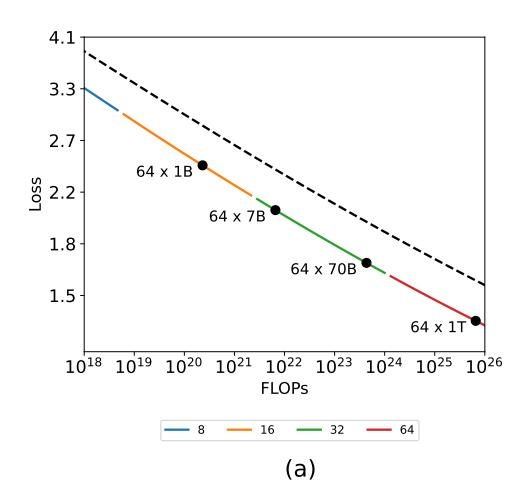
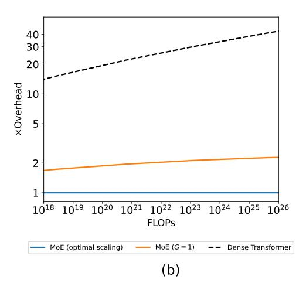
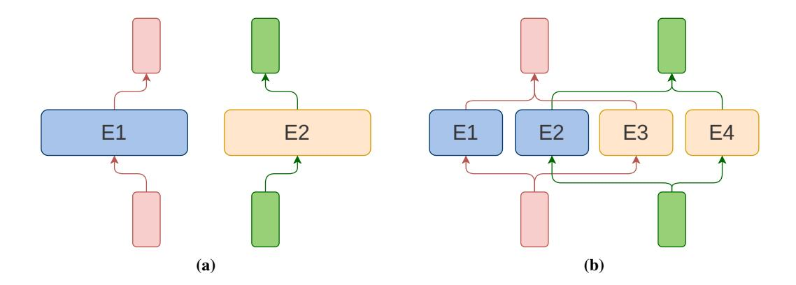
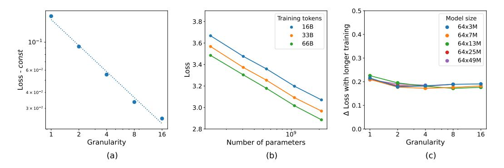
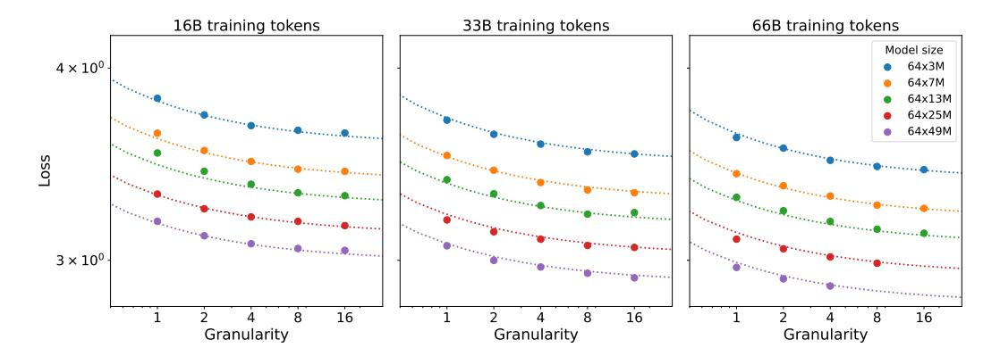
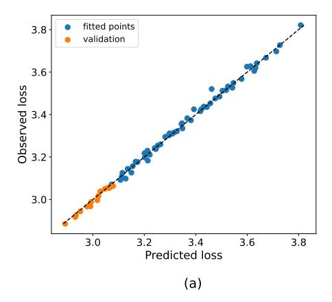
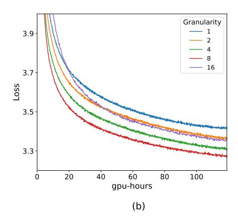

# SCALING LAWS FOR FINE-GRAINED MIXTURE OF EXPERTS

| Jakub Krajewski ∗ University of Warsaw IDEAS NCBR | Jan Ludziejewski ∗ University of Warsaw IDEAS NCBR | Kamil Adamczewski IDEAS NCBR                      | Maciej Pioro ´ IPPT PAN IDEAS NCBR                   |
|---------------------------------------------------------|----------------------------------------------------------|------------------------------------------------------|------------------------------------------------------------|
| Michał Krutul University of Warsaw IDEAS NCBR     | Szymon Antoniak University of Warsaw IDEAS NCBR    | Kamil Ciebiera University of Warsaw IDEAS NCBR | Krystian Krol´ University of Warsaw IDEAS NCBR       |
| Tomasz Odrzygo´zd´ z´ TradeLink                      | Piotr Sankowski University of Warsaw IDEAS NCBR    | Marek Cygan University of Warsaw Nomagic       | Sebastian Jaszczur ∗ University of Warsaw IDEAS NCBR |

### ABSTRACT

Mixture of Experts (MoE) models have emerged as a primary solution for reducing the computational cost of Large Language Models. In this work, we analyze their scaling properties, incorporating an expanded range of variables. Specifically, we introduce a new hyperparameter, granularity, whose adjustment enables precise control over the size of the experts. Building on this, we establish scaling laws for fine-grained MoE, taking into account the number of training tokens, model size, and granularity. Leveraging these laws, we derive the optimal training configuration for a given computational budget. Our findings not only show that MoE models consistently outperform dense Transformers but also highlight that the efficiency gap between dense and MoE models widens as we scale up the model size and training budget. Furthermore, we demonstrate that the common practice of setting the size of experts in MoE to mirror the feed-forward layer is not optimal at almost any computational budget.

### 1 INTRODUCTION

In recent years, we have witnessed Large Language Models (LLMs) achieve exceptional performance in tasks across numerous domains [\(Chowdhery et al., 2022;](#page-11-0) [Yin et al., 2023;](#page-15-0) [Agostinelli et al., 2023\)](#page-11-1). However, training those massive models incurs high computational costs, measured in millions of GPU-hours [\(Touvron et al., 2023b\)](#page-14-0), enabled only by enormous budgets [\(Scao et al., 2023\)](#page-13-0) and leading to non-negligible carbon footprints [\(Faiz et al., 2024\)](#page-12-0). To combat these obstacles, the research community has been striving to increase the efficiency of LLMs. One promising approach that has lately been gaining visibility is the use of Mixture of Experts (MoE) methods. Models such as Switch [\(Fedus et al., 2022\)](#page-12-1) and Mixtral [\(Jiang et al., 2024\)](#page-12-2) have already demonstrated that it is possible to achieve comparable effectiveness with significantly lower computational costs.

In the context of the current trend of increasing budgets for training language models, a question arises: will MoE models continue to be attractive in the future? This is an important issue, as other studies have stated that the gap in efficiency between MoE and standard Transformers narrows at

Contributions: Jakub implemented fine-grained MoE, ran experiments, and oversaw the course of the project. Jan designed and implemented the scaling laws, also optimized and tuned the fine-grained MoE implementation. Kamil A. provided significant advice on many aspects of the project. Maciej experimented with the block design and, with Michał, provided considerable technical support. Szymon, Kamil C., Krystian, and Tomasz contributed to the project and the engineering in various ways. Marek, along with Piotr, provided high-level scientific advice. Sebastian came up with the initial idea, started the project, and supervised it while setting the research direction and leading experiments and analyses. Correspondence to <s.jaszczur@uw.edu.pl>. ∗ Equal contribution.

Figure 1: Mixture-of-Experts can be *always* considered more efficient than dense Transformers, regardless of the model size. (a) Compute Optimal scaling curves for MoE and standard Transformers. The dashed line represents a dense Transformer. Colors denote optimal granularity for the given FLOPs training budget. (b) Relative number of FLOPs needed to train Transformer and Vanilla MoE (MoE with G=1) to achieve the performance of MoE with compute optimal G.

scale (Artetxe et al., 2022) or even that traditional dense models may outperform MoE as the size of the models increases (Clark et al., 2022).

In this paper, we argue that previous claims lose their validity when we relax certain implicit assumptions regarding the training process, present in previous research. In particular, we refer to the fixed training duration and the constant size of experts in MoE models.

Our results suggest that a compute-optimal MoE model trained with a budget of  $10^{20}$  FLOPs will achieve the same quality as a dense Transformer trained with a  $20\times$  greater computing budget, with the compute savings rising steadily, exceeding  $40\times$  when budget of  $10^{25}$  FLOPs is surpassed (see Figure 1). Importantly, we show that the standard practice of fixing the size of experts in MoE to be the same as feed-forward layer is *almost never* optimal.

Our main contributions are:

- 1. Introducing a new hyperparameter granularity. Adjusting this parameter allows us to determine the optimal size of experts in MoE models, which translates into increased efficiency.
- 2. Deriving new scaling laws for MoE models that incorporate variable training duration, the number of parameters, and granularity. Such scaling laws allow us to calculate optimal training hyperparameters for MoE models.
- 3. Demonstrating that, with optimal settings, MoE models can always outperform traditional Transformers at any computing budget. This is a conclusion contrary to the results from Clark et al. (2022).

The code used to produce the results described in this work is open-sourced at github.com/llm-random/llm-random.

### 2 RELATED WORK

**Mixture of Experts.** In the context of language modeling, MoE was first introduced by Shazeer et al. (2017) as a sparsely gated layer between stacked blocks of LSTM (Hochreiter & Schmidhuber, 1997). A similar technique was proposed in the context of Transformers by Shazeer et al. (2018) and Lepikhin et al. (2020). Fedus et al. (2022) proposed to route each input to only a single expert and designed a modified initialization scheme to reduce training instability. Numerous studies

have proposed to modify the original routing method. Lewis et al. (2021) used a linear assignment algorithm to postprocess token-expert mappings and ensure even expert selections. Roller et al. (2021) suggested another approach involving deterministic hash functions. Zhou et al. (2022) proposed expert choice routing, eliminating the need for additional load balancing losses. Puigcerver et al. (2023) designed a fully-differentiable Soft MoE architecture.

Concurrently to our work, Dai et al. (2024) proposed to modify the MoE layer by segmenting experts into smaller ones and adding shared experts to the architecture. Independently, Liu et al. (2023) suggested a unified view of sparse feed-forward layers, considering, in particular, varying the size of memory blocks. Both approaches can be interpreted as modifying granularity. However, we offer a comprehensive comparison of the relationship between training hyperparameters and derive principled selection criteria, which they lack.

**Scaling laws.** Scaling laws are empirically derived equations relating the loss of a model with variables such as the number of parameters, training samples, or the computational budget. In the case of dense Transformers, scaling laws were first studied by Kaplan et al. (2020), who observed power law relationships between the final model perplexity and model and dataset size. This work was extended by Hoffmann et al. (2022) by considering variable cosine cycle lengths and formulating a modified functional form of the scaling equation.

Scaling laws have also been proposed for other architectures and training scenarios. Henighan et al. (2020) studied autoregressive modeling across various modalities, while Ghorbani et al. (2021) considered machine translation. Frantar et al. (2023) explored the impact of pruning on vision and language Transformers, deriving optimal sparsity for a given compute budget. Clark et al. (2022) studied the scaling of MoE when changing model size and number of experts on a fixed dataset, concluding that routed models are more efficient only until a certain model size. In this work, we challenge that claim by considering a variable, optimal dataset size for both model families (see Section 6.3).

#### 3 BACKGROUND

#### 3.1 Model Architecture

**Transformer.** A standard decoder-only Transformer (Radford et al., 2018a;b; Kaplan et al., 2020; Brown et al., 2020) consists of an embedding layer, a stack of alternating attention and feed-forward layers, and an unembedding layer. In the model, each input token is converted by the embedding layer into a vector of size  $d_{\text{model}}$ , the dimension maintained across all the layers in the residual stream.

The feed-forward component consists of two linear transformations and a nonlinearity  $\phi$  in between. It can be described as  $FFN(x) = \phi(xW_1 + b_1)W_2 + b_2$ , with  $W_1$  mapping from  $d_{\text{model}}$  to  $d_{\text{ff}}$ , and  $W_2$  back to the original  $d_{\text{model}}$ . It is standard (Radford et al., 2018a; Rae et al., 2022; Touvron et al., 2023a; Jiang et al., 2023) to set the hidden dimension as  $d_{\text{ff}} = 4 \cdot d_{\text{model}}$ .

Feed-forward layers contain the majority of Transformer parameters and require the biggest computational budget counted in terms of FLOPs. Subsequently, they are the main focus of the Mixture of Experts models considered in this work.

**Mixture of Experts.** The core idea behind MoE in Transformers is to replace the feed-forward layer with a set of  $N_{\rm expert}$  experts. The size of each expert is typically (Fedus et al., 2022; Zhou et al., 2022; Jiang et al., 2024) set to mirror the original dimensions of the layer, with the hidden expert dimension  $d_{\rm expert}$  equal to  $d_{\rm ff}$ . Therefore, the total number of parameters in MoE scales linearly with the number of experts. However, the computational cost remains approximately constant as each input is routed and then processed by a subset of experts.

Figure 2: (a) Standard MoE layer with G = 1 (b) Corresponding MoE layer with G = 2. Each of the original experts is split into two granular ones. The split occurs in the hidden dimension of an expert. Increasing G allows for a more precise mapping between experts and tokens. Since for granularity G, the token is routed to G granular experts, the number of parameters activated per token is the same in both cases.

### 3.2 SCALING LAWS

Dense Transformers. Large Transformer-based models are known to approximately obey the power-law relationship between final loss L, model size N, and number of training tokens D. This relationship is often called *Chinchilla scaling laws* described by [Hoffmann et al.](#page-12-8) [\(2022\)](#page-12-8) as

$$\mathcal{L}(N,D) = c + \frac{a}{N^{\alpha}} + \frac{b}{D^{\beta}}.$$
 (1)

The power-law formula is composed of three distinct terms that characterize the intrinsic entropy of data, constraints of the model, and limitations in the training data. The term c represents the minimum possible error intrinsic to the data. The remaining two terms are suboptimality terms, which address the limitations in function representation owing to the size of the model and in data signified by the number of tokens. In the limit, with infinite data and model size, the loss is reduced to c.

Mixture of Experts. For MoE Transformer-based models, [Clark et al.](#page-11-3) [\(2022\)](#page-11-3) formulated the final loss for a constant dataset size D of 130B tokens, allowing for variations in the expansion rate E, as:

$$\mathcal{L}(N, E) = \left(\frac{10^{d/a}}{N}\right)^a \left(\frac{1}{E}\right)^{b+c\log N}.$$
 (2)

However, this result has a notable limitation as it can be applied only to the original dataset size. The scalability and effectiveness are constrained in this scenario because it is crucial to align the number of training samples with the available computational resources for optimal use. As per [Kaplan et al.](#page-12-7) [\(2020\)](#page-12-7) and [Hoffmann et al.](#page-12-8) [\(2022\)](#page-12-8), maintaining a constant dataset size while scaling up the neural network size leads to undertraining, resulting in a model that does not perform to its full potential.

### 4 GRANULARITY

As described in Section [3,](#page-2-0) in the standard setting, the inner dimension of each expert network, dexpert, is equal to dff, which is the same size as the feed-forward layer of the base model.

In this work, we suggest an alternative approach where the hidden dimension of the expert is not necessarily set to mirror that of the standard feed-forward layer. Instead, it can be adjusted to a value that is the most effective. This approach allows the configuration of MoE to be articulated in terms of two key hyperparameters: *granularity* (G) and *expansion rate* (E). In the following parts of this work, we will also use the term *active* parameters to refer to the non-embedding parameters used to produce output for a single token, except routing. The number of active parameters is denoted as Nact.

Let dexpert be the hidden dimension of a single expert. Granularity is defined as

$$G = \frac{d_{\rm ff}}{d_{\rm expert}}.$$

In other words, granularity denotes the multiplier factor for the change in the size of an expert from the original standard model, defined as G = 1. In this work, we investigate G > 1 where experts are smaller than in the standard layer.

Note that increasing granularity does not affect the number of active parameters. As G increases, the number of experts that process the token grows proportionally to G. In other words, for granularity G, a token is routed to G fine-grained experts, thereby keeping the number of active parameters constant. See Fig. [2](#page-3-0) for visualization.

We then define the *expansion rate*, which describes the increase in the number of parameters from a standard transformer layer to a MoE layer. Given that, NMoE and Nff denote the total number of parameters in a MoE layer excluding routing and the standard feed-forward layer, respectively. The expansion rate E is then defined as

$$E = \frac{N_{\text{MoE}}}{N_{\text{ff}}}.$$

Expansion rate can also be seen as the total number of parameters in a MoE layer compared to its active parameters.

The concept of the expansion rate is intricately linked to the number of experts through the idea of granularity. Indeed, the definitions of both granularity and expansion rate extend and refine our understanding of the number of experts, symbolized as Nexpert.

$$N_{\text{expert}} = G \cdot E \tag{3}$$

For non-granular models, where G = 1, the expansion rate is equal to the number of experts.

Intuitively, increasing granularity for a given expansion rate gives the model more flexibility in mapping datapoints to experts, potentially improving performance. We incorporate the notion of granularity into our scaling laws in Section [5.](#page-4-0) The discussion about practical tradeoffs in changing this parameter is given in Section [6.](#page-7-0)

### 5 SCALING LAWS

Granularity determines changes in the architecture of MoE. In this section, we answer a central question of this work: whether the granular MoE models follow scaling laws and, if so, how granularity affects them. Thus, we aim to derive a parametric scaling law for predicting the final loss value L based on granularity G, total number of non-embedding parameters N, and number of training tokens D.

We run over 100 experiments on the decoder-only Transformer architecture, with each feed-forward component replaced by a Mixture of Experts layer. Those experiments involve training models with sizes ranging from 129M to 3.7B parameters across different training durations, from 16B to 130B tokens. We consider logarithmically spaced values of granularity between 1 and 16. To constrain the search space, E = 64 is fixed, following the recommendations of [Clark et al.](#page-11-3) [\(2022\)](#page-11-3). In addition, we also run experiments with dense Transformers to compare their performance with MoE. The details of all architectures, the training procedure, and hyperparameter choices are described in detail in Appendix [A.](#page-16-0)

In the subsequent part of this paper, we will use the notation E × Nact to describe a MoE model with Nact active parameters and expansion rate E.

Figure 3: (a) The effect of G on  $\mathcal{L}_{N,D}(G)$  for constant N and D. Both axes are in the log-scale. The results suggest the linear relationship between  $\log(G)$  and  $\log(\mathcal{L}-c)$ . The given values are  $N=64\times25M$ , D=16B, const=3.12. The plots for additional values of N and D can be found in Appendix F. (b) The impact of varying the number of parameters N on the loss for fixed granularity G=4. For other granularity values, see Appendix F. (c) The difference in the loss between training for 16B and 65B tokens for all model sizes and granularity values. The model size is reported as the expansion rate and the number of active parameters.

#### 5.1 POWER LAW WITH RESPECT TO GRANULARITY

We first answer the question of whether granular models follow the scaling laws. In Figure 4(a), it can be seen that increasing granularity results in a lower loss. The returns follow approximately an exponential pattern, converging to a positive constant. The empirical relationship given by Figure 3(a) suggests the following power-law dependence of loss on a varying granularity for given N and D and constants g, h and  $\gamma$  that may be dependent on them,

$$\mathcal{L}_{N,D}(G) = \frac{g_{N,D}}{G^{\gamma_{N,D}}} + h_{N,D}.$$
(4)

### 5.2 SCALING THE MODEL AND DATASET SIZE

As outlined in Section 3.2, the power-law given by Eq. 1 consists of three terms that describe inherent data entropy and limitations in function representation and data. This derivation is independent of the architecture. In particular, the Eq. 1 also holds for constant granularity. Empirically, we observe a power law relationship in N and D analogous to that in dense models as depicted in Figure 3(b) for a fixed value of granularity (see also Fig. 1, Kaplan et al. (2020)). Furthermore, the validity of this functional form is verified by fit in Section 5.4.

Since we know that separate scaling laws are valid for given granularities, in the general form, the parameters in Eq. 1 can be dependent on the model's granularity:

$$\mathcal{L}_G(N,D) = c_G + \frac{a_G}{N^{\alpha_G}} + \frac{b_G}{D^{\beta_G}}.$$
 (5)

#### 5.3 THE FORM OF THE JOINT SCALING LAW

Following the above observation that models with constant granularity obey Chinchilla scaling laws given by Eq. 1, the key question arises as to how the general notion of granularity G can be incorporated into the joint scaling law. Moreover, the scaling law formula from Eq. 5 for constant N and D has to be representable by Eq. 4. This is because the former is a more general equation, encompassing shared hyper-parameters across all N, D, and G. It is anticipated to align with the latter, consisting of distinct power laws, each with specific parameters for different N and D values. Consequently, the objective is to identify a function that fulfills these criteria.

Figure 4: Fit of the scaling laws compared to the experimental results.

$$\mathcal{L}(N, D, G) = \mathcal{L}_{N,D}(G) = \mathcal{L}_{G}(N, D)$$

$$= \frac{g_{N,D}}{G^{\gamma_{N,D}}} + h_{N,D} = c_G + \frac{a_G}{N^{\alpha_G}} + \frac{b_G}{D^{\beta_G}}$$
(6)

In the subsequent sections, we aim to determine which of these parameters remain independent of G and identify their functional form. Furthermore, we present some rationale for the structure of our formula.

Lower Bound. Consider the limit of Eq. [5](#page-5-1) for N and D growing to infinity:

$$\lim_{\substack{N \to \infty \\ D \to \infty}} \mathcal{L}(N, D, G) = c_G. \tag{7}$$

with the constant term cG dependent on granularity. This is contradictory to the fact that it captures the inherent entropy of the dataset. Lower bound of the achievable loss when training bigger models on more samples should not depend on the architecture, therefore parameter cG = c is constant for all granularities.

Granularity and Number of Tokens D. As seen in Figure [3\(](#page-5-0)c), the benefit of training a model on a larger dataset is almost the same for each granularity value. This suggests that there is no interaction between D and G. Therefore, we can assume that

$$\frac{b_G}{D^{\beta_G}} = \frac{b}{D^{\beta}}. (8)$$

Granularity and Model Size N. We consider α to be a constant that describes how the function scales with N. In this work, we assume polynomial functional forms that rule out the potential dependency of α on G given the form of Eq. [4.](#page-5-2) Therefore, the only element dependent on G is aG:

$$\mathcal{L}(N, D, G) = c + \left(\frac{g}{G^{\gamma}} + a\right) \frac{1}{N^{\alpha}} + \frac{b}{D^{\beta}}.$$
 (9)

Finally, one could consider omitting the constant a in the equation above, and it would still reduce to [4](#page-5-2) for constant N and D. However, this would mean that a model with infinite granularity and a small number of active parameters can achieve the perfect perplexity of the lower bound. We assume that a sparse MoE (Mixture of Experts) model is unlikely to surpass the performance of an equivalent dense model that has a matching total number of parameters, all of which are active. This means that constant a can act as a marginal improvement due to granularity.

Subsequently, we fit parameters in Eq. [9](#page-6-1) to describe the scaling of MoE. For comparison, we also perform fitting for dense transformer given by Eq. [1.](#page-3-2) Similarly to [Hoffmann et al.](#page-12-8) [\(2022\)](#page-12-8), we use Huber loss [\(Huber, 1964\)](#page-12-13), with δ = 0.1. The optimization is performed using the BFGS algorithm. We include a weight decay of 5e − 4 to enhance generalization. We start with fitting parameters in Eq. [9](#page-6-1) and then find architecture-dependent coefficients α, β, A and B in Eq. [1.](#page-3-2) We observe a good fit, with RMSE = 0.015. The values are presented in Table [1.](#page-7-2) We depict the results in Figure [4.](#page-6-0)

Figure 5: (a) Validation of the scaling laws. (b) Training loss curves for model with  $N=64\times7M$ , D=66B tokens, measured against wall-clock time on NVIDIA A100 GPU. G=8 leads to the best performance, as for G=16 the routing cost dominates gains from granularity. We model the increased cost of routing by measuring FLOPs for each configuration.

### 5.4 FITTING THE PARAMETRIC SCALING LAW

Table 1: Values of the fitted coefficients.

| Model | a    | $\alpha$ | b    | β     | g   | $\gamma$ | c    |
|-------|------|----------|------|-------|-----|----------|------|
| MoE   | 18.1 | 0.115    | 30.8 | 0.147 | 2.1 | 0.58     | 0.47 |
| Dense | 16.3 | 0.126    | 26.7 | 0.127 | -   | -        | 0.47 |

We validate the stability of the fit by excluding the top 20% of models with the lowest perplexity and finding the coefficients based on the remaining experiments. We observe that the formula remains almost unchanged in this scenario (see Table 5 in Appendix B). The validation RMSE is 0.019. Results are depicted in Figure 5 (a).

### 5.5 MOE SCALING PROPERTIES

Comparing the part of the formula that approximates underfitting (that is, dependent on training tokens) in MoE  $(30.8D^{-0.147})$  and Transformer  $(26.7D^{-0.127})$ , we can infer that MoE models need longer training to perform competitively but scale better after reaching that point. Nonetheless, this moment may still precede the compute optimal for both models. On the other hand, we can see that the exponent on dense models  $\alpha=-0.126$  scales better with a total number of parameters than the MoE counterpart  $\alpha=-0.115$ . This should not be surprising since dense models use all parameters on each token contrary to MoE, which gains a computational advantage by activating only a subset of them. Therefore, the fair comparison of the performance has to take into account FLOPs used by each model type. In the next section, we find compute-optimal granularity for a given FLOP budget.

#### 6 OPTIMAL ALLOCATION OF COMPUTATIONAL BUDGET

In Section 5, we show that higher granularity leads to lower loss for the same number of training steps. This is not always the case if we consider the wall-clock time. As depicted in Figure 5 (b), in practice for too high values of G (relative to  $d_{\rm model}$ ), training can be bottlenecked by the routing cost. Practical modeling of this situation is possible by measuring FLOPs in routing. In this section we find optimal N, D, G for a given computational budget F by solving the following optimization problem,

#### 6.1 Computational Cost of Granularity

It is important to acknowledge that increasing granularity can lead to some challenges in training the model, namely higher computational and communication costs and a larger memory footprint. The main component responsible for higher costs is the increase in routing operations due to a larger pool of granular experts. This increase is proportional to the value of G. For standard, non-granular MoE models (G=1), the routing overhead still exists, although it has been considered negligible.

Taking into account the routing operation overhead, the number of used FLOPs F is described by the following formula:

$$F = (12d_{\text{model}}^2 c_f + d_{\text{model}} EGc_r) \cdot D \cdot n_{\text{blocks}}, \tag{10}$$

given expansion rate E, granularity G, and constants that denote FLOPs per active parameter ratio, respectively, within routing  $(c_r)$  and within the rest of the network  $(c_f)$ . The term  $12d_{\rm model}^2$  is the number of active parameters within a transformer block, while  $d_{\rm model}EGc_r$  is the number of active parameters within a routing network. The in-depth analysis of constants  $c_r$  and  $c_f$  can be found in Appendix E. We exclude embedding and unembedding from the FLOPs calculations, following Hoffmann et al. (2022).

Observe that, in contrast to scenarios where routing operations are omitted, the FLOPs calculation that incorporates routing overhead relies on both  $d_{\rm model}$  and  $n_{\rm blocks}$ . Consequently, an additional condition is required to determine the scaling of  $d_{\rm model}$  and  $n_{\rm blocks}$  in relation to an increase in N, the number of parameters. It is noted that minor variations in the depth-to-width ratio are not significant (Kaplan et al., 2020). Following this analysis, we opt to adopt the assumption that  $d_{\rm model} = 64n_{\rm blocks}$ .

The total number of parameters in the feed-forward layer, excluding the routing matrix, is  $2E d_{\rm ff} d_{\rm model} = 8E d_{\rm model}^2$ , and  $4d_{\rm model}^2$  in attention (key, query, value, and output projection). This results in the following formula for the total number of parameters,  $N = d_{\rm model}^2 \cdot (8E+4) \cdot n_{\rm blocks}$ .

#### 6.2 Compute Optimal Formula

Taking into consideration we need to solve the following optimization problem, given F,

$$\begin{split} & \underset{N,D,G}{\text{minimize}} & \quad \mathcal{L}(N,D,G) \\ & \text{subject to} & \quad F = (12d_{\text{model}}^{2}c_{f} + d_{\text{model}}EGc_{r}) \cdot D \cdot n_{\text{blocks}} \\ & \quad N = d_{\text{model}}^{2} \cdot (8E+4) \cdot n_{\text{layers}}, \\ & \quad d_{\text{model}} = 64 \cdot n_{\text{lavers}}. \end{split}$$

All these constraints are reducible to a one-dimensional optimization problem, which is, however, hard to solve analytically. Therefore we approximate the solution using Brent's method (Brent, 1971). The results of this optimization for varying FLOPs budgets are plotted in Figure 1 while the optimal configurations of parameters for selected model sizes are presented in Table 2. To validate the uncertainty of these predictions, we follow Hoffmann et al. (2022) and calculate the 10th and 90th percentiles estimated via bootstrapping data (see Appendix C for the detailed results).

#### 6.3 MoE is Always More Efficient

Contrary to the results from Clark et al. (2022), in Figure 1 we can see, that Mixture-of-Experts can be always considered more efficient than dense Transformers, regardless of the model size. According to our previous observations from Section 5.5, MoE models scale better with optimal training. However, for short training schedules, they may under-perform dense models. This means that for constant training time and increasing model size, there exists a point where both models will become very under-trained, in which scenario dense models surpass MoE. This shows why in Clark et al. (2022), where varying the number of training tokens has not been considered, MoE was predicted to be under-performing for models bigger than 1T. However, when all training hyper-parameters N, D, G are properly selected to be compute-optimal for each model, the gap between dense and sparse models only increases as we scale.

Table 2: Compute optimal training hyper-parameters for MoE models. Optimal N and D follow approximately similar relation to these of [Hoffmann et al.](#page-12-8) [\(2022\)](#page-12-8) for active parameters around the range of 1B to 10B parameters, requiring comparably longer training for smaller models and shorter for bigger ones. Higher granularity is optimal for larger compute budgets.

| N         | D       | G  | FLOPs    | Loss  |
|-----------|---------|----|----------|-------|
| 64 x 100M | 4.37B   | 8  | 2.95e+18 | 3.133 |
| 64 x 1B   | 28.94B  | 16 | 1.93e+20 | 2.491 |
| 64 x 3B   | 72.90B  | 16 | 1.41e+21 | 2.245 |
| 64 x 7B   | 137.60B | 32 | 6.46e+21 | 2.076 |
| 64 x 70B  | 941.07B | 32 | 4.16e+23 | 1.694 |
| 64 x 300B | 2.96T   | 64 | 5.69e+24 | 1.503 |
| 64 x 1T   | 7.94T   | 64 | 4.97e+25 | 1.367 |

## 7 DISCUSSION

Extreme Granularity. In Section [5,](#page-4-0) we argue that model performance improves with increasing granularity. This postulate largely aligns with the empirical findings of our study. Nonetheless, at exceedingly high granularity levels, such as G = 64 in models characterized by dmodel = 256 and E = 64, there is an observable decline in performance. This phenomenon is particularly evident in scenarios where the number of parameters in the routing mechanism exceeds active parameters in actual experts. Additionally, as described in Section [6,](#page-7-0) the utility of such high granularity is predominantly restricted to models of substantial size. In alignment with the principles outlined by [Hoffmann et al.](#page-12-8) [\(2022\)](#page-12-8), this research focuses more on findings that can be broadly applied rather than delving into the specific details of these corner-case situations. However, it is hypothesized that the efficiency of models with significantly high granularity could be potentially enhanced through careful expert initialization or modifications to the routing algorithm. These ideas are set aside to be investigated in future studies.

Varying Expansion Rate. In this study, due to computational resources constraint, we focus on E = 64, as recommended by [Clark et al.](#page-11-3) [\(2022\)](#page-11-3). This value of E was also used for the largest models in other works [\(Du et al., 2022;](#page-12-14) [Zhou et al., 2022\)](#page-15-1) and the best-performing configuration in [Fedus](#page-12-1) [et al.](#page-12-1) [\(2022\)](#page-12-1). Nonetheless, we acknowledge the importance of considering different expansion rates, as different levels of E may be chosen based on factors like the target size of the model in memory. Therefore, in Appendix [D,](#page-17-3) we present the results of the study for E = 16 and show that the main findings of this work are still valid in such cases.

Including E in the formula. Another possible advancement would be to unify all of the factors N, D, G and E in one formula. While this would open the possibility of studying the relationships between coefficients in more detail, it would also be hard to practically recommend the optimal configuration in such a scenario using only FLOPs. This is because larger values of E typically lead to better performance but also incur additional memory requirements. Therefore, the choice of expansion rate may be heavily dependent on the available hardware configuration. We leave a detailed study of these factors for future work.

Modeling the cost of granularity. It is important to note that the exact estimation of the training cost of MoE models is dependent on the training setup, hardware, and implementation. Specifically, increasing G can lead to higher transfer costs, depending on the adopted model of distributed training. Therefore, the precise selection of hyperparameters should be made considering these factors. In this work, we model the cost of operations using FLOPs, which is common in the Scaling Laws literature [\(Kaplan et al., 2020;](#page-12-7) [Hoffmann et al., 2022;](#page-12-8) [Frantar et al., 2023\)](#page-12-11). Additionally, we would like to note that in our setup, we observe significant gains of fine-grained MoE measured as wall-clock time needed to achieve given perplexity (see Fig. [5](#page-7-3) (b) for an example).

