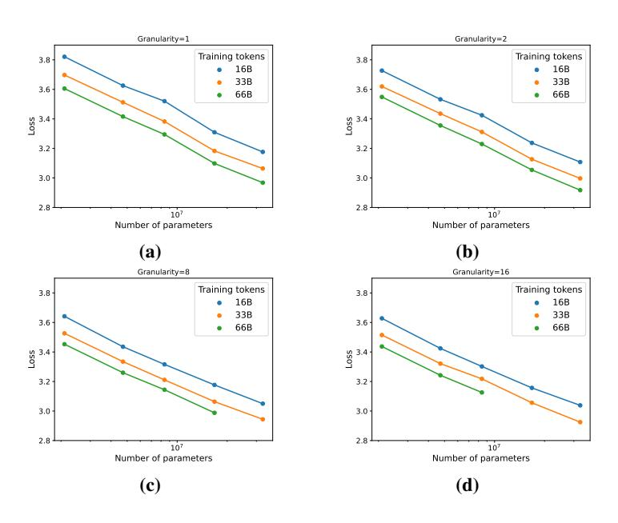
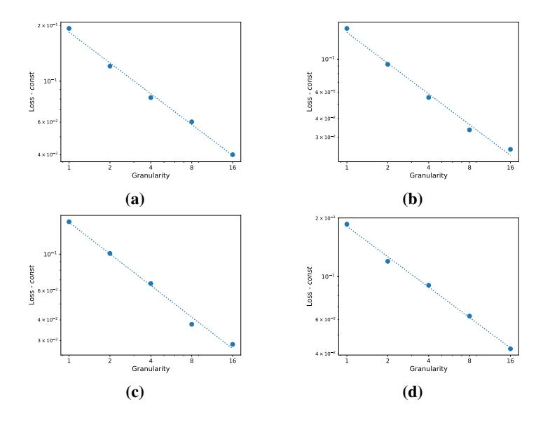

# E FLOPS CONSTANTS

The number of FLOPs F used in Transformer training, considering the routing operation overhead in MoE, can be described by the following formula:

$$F = (12d_{\text{model}}^2 c_f + d_{\text{model}} EGc_r) \cdot n_{\text{tokens}} \cdot n_{\text{layers}}$$
(11)

Following [Hoffmann et al.](#page-12-8) [\(2022\)](#page-12-8), we assume cf to be 6. This is interpreted as 6 FLOPs for each pair of an active parameter (in linear projection) and a processed token. The breakdown of operations is as follows:

- During the forward pass, 2 operations (single multiplication and single addition) are used to compute the matrix multiplication of an input and linear projection.
- During the backward pass, 2 operations are used to compute gradients wrt. the input.
- During the backward pass, 2 operations are used to compute gradients wrt. the weights of linear projection.

In our work, we have assumed the routing constant, cr, to be 14, with the breakdown presented below. The exact number of operations may depend on the implementation of routing, but it will be between 6 and 20. However, our main conclusions of the paper are resistant to different assumptions of this constant.

- During the forward pass, 2 operations are used to compute the expert logits based on an input and "routing linear projection".
- During the backward pass, 2 operations are used to compute gradients for "routing linear projection" wrt. the input.
- During the backward pass, 2 operations are used to compute gradients for "routing linear projection" wrt. the weights of linear projection.
- During the forward pass, 2 operations are used to route input tokens to chosen experts.
- During the forward pass, 2 operations are used to route expert outputs to chosen tokens and multiply those outputs by the routing score.
- During the backward pass, 2 operations are used to route gradients from output tokens to experts.
- During the backward pass, 2 operations are used to route gradients from experts to input tokens.

Similarly to the calculation of FLOPs for  $c_f$ , FLOPs come in pairs as each multiplication is followed by an addition (used to accumulate outputs or gradients).

### F ADDITIONAL VISUALIZATIONS

Figure 6: Illustration of scaling N and D for constant granularity value of: (a) G=1 (b) G=2 (c) G=8 (d) G=16.

Figure 7: Illustration of scaling granularity when N, D are fixed for: (a)  $N = 64 \times 25M, D = 16B,$  const = 3.12 (b)  $N = 64 \times 49M, D = 16B,$  const = 3.02 (c)  $N = 64 \times 25M,$  D = 32B, const = 3.03 (d)  $N = 64 \times 49M,$  D = 32B, const = 2.88