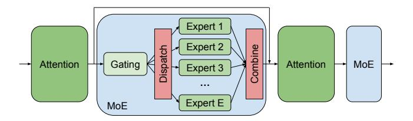

# *CCS Concepts:* • Computing methodologies $\rightarrow$ Parallel algorithms.

*Keywords:* Distributed Deep Learning; Large Language Model; Mixture-of-Experts; Scheduling

Permission to make digital or hard copies of all or part of this work for personal or classroom use is granted without fee provided that copies are not made or distributed for profit or commercial advantage and that copies bear this notice and the full citation on the first page. Copyrights for components of this work owned by others than ACM must be honored. Abstracting with credit is permitted. To copy otherwise, or republish, to post on servers or to redistribute to lists, requires prior specific permission and/or a fee. Request permissions from permissions@acm.org.

EuroSys '24, April 22–25, 2024, Athens, Greece
© 2024 Association for Computing Machinery.
ACM ISBN 979-8-4007-0437-6/24/04.
https://doi.org/10.1145/3627703.3650083

#### **ACM Reference Format:**

Shaohuai Shi<sup>1</sup>, Xinglin Pan<sup>2</sup>, Qiang Wang<sup>1</sup>, Chengjian Liu<sup>3</sup>, Xiaozhe Ren<sup>4</sup>, Zhongzhe Hu<sup>4</sup>, Yu Yang<sup>4</sup>, Bo Li<sup>5</sup>, Xiaowen Chu<sup>2,5</sup>. 2024. ScheMoE: An Extensible Mixture-of-Experts Distributed Training System with Tasks Scheduling. In *Nineteenth European Conference on Computer Systems (EuroSys '24), April 22–25, 2024, Athens, Greece.* ACM, New York, NY, USA, 14 pages. https://doi.org/10.1145/3627703. 3650083

### 1 Introduction

It has been well known that large language models (LLMs) have achieved significant breakthroughs in many neural language processing (NLP) and computer vision tasks with increasing model sizes (e.g., BERT [11] with 340 million parameters, GPT-3 [6] with 175 billion parameters, PaLM [9] with 540 billion parameters, etc.). However, scaling LLMs requires a linear increase of compute with respect to the model size. Recently, the sparsely activated mixture-of-experts (MoE) technology, which was first proposed in 1990s [17], is integrated into LLMs [18, 39] to scale the model size to trillions of parameters with requiring only a sub-linear increase of computations [13, 18, 26, 38]. Compared to the traditional dense layer, which should be computed for every input, an MoE layer consists of multiple dense layers (called experts) and only a few experts are dynamically activated to compute the output for each input data [18]. Thus, the model size can be scaled to approximately *E* times with *E* experts per MoE layer compared to the dense model, but the computational cost of MoE is only slightly larger than the dense counterpart. For example, Switch Transformer [13] scales to 1.5 trillion parameters with 15 MoE layers, each of which has 2048 experts, from the dense model that has only several billion parameters. However, when training MoE models on a large-scale GPU/TPU cluster, it would introduce critical performance issues that make the distributed training system scale badly [14, 16].

Specifically, in training MoE models, the input data (e.g., tokens) of MoE layers should be dynamically (every minibatch) routed to different experts for computation, but the experts may be located on different workers when one worker (e.g., GPU) cannot store all experts [18]. It means that the

<span id="page-1-0"></span>**Table 1.** Step time and A2A time in training four MoE models on a 32-GPU (Nvidia RTX2080Ti) cluster (with 100Gb/s InfiniBand) running on a highly optimized MoE system, Tutel [16]. Each layer has 32 experts that are evenly distributed to the 32 GPUs. "Ratio" indicates the ratio of A2A time over the step time. More details about the model configurations can be found in Table 5.

| # Layers | # Parameters<br>(Million) | A2A Time<br>(ms) | Step time (ms) | Ratio (%) |
|----------|---------------------------|------------------|----------------|-----------|
| 12       | 73                        | 252.6            | 497.1          | 50.8      |
| 16       | 81                        | 324.8            | 623.0          | 52.1      |
| 20       | 89                        | 419.3            | 768.9          | 54.5      |
| 24       | 97                        | 507.4            | 863.6          | 58.8      |

input data should be transferred to particular GPUs, which is generally implemented by an all-to-all (A2A) collective communication [7] to distribute the data (dispatch) to different GPUs; and the results of experts located in different GPUs are then collected by another A2A operation (combine) [18]. The communication time of A2A operations is critical to the overall training performance. As reported in [16, 18], training MoE models on large-scale TPUs [18] or high-end A100 GPUs [16] requires extensive A2A communication time occupying 40%-50% of the overall step time. We also conducted experiments on a moderate 32-GPU (RTX2080Ti) cluster and the results are shown in Table 1. It illustrates that the A2A communication time occupies 50%-60% of the overall step time. Even worse, the communication time of A2A is significantly increased with an increased number of tokens, number of experts, embedding size, and number of GPUs.

Existing studies try to optimize the training performance of MoE models in three orthogonal directions: 1) design loadbalancing routing functions [13, 19, 55] to make the computation workloads of distributed GPUs more balanced, 2) design efficient communication approaches including communicationefficient 1D or 2D hierarchical A2A algorithms [1, 16, 26, 31, 36] and data compression algorithms [52] to reduce the communication volume, and 3) design task scheduling algorithms [14, 16, 20, 22, 30] to interleave communication tasks and computing tasks so that some communication costs can be hidden. In terms of system optimizations, the latter two directions are of importance to improve the scaling efficiency of distributed systems while preserving the fast convergence property of MoE layers. Though the existing dedicated systems have been tailor-designed for training MoE models, they still have several limitations: 1) limited extensibility to support newly designed communication-efficient methods for data transfer in the A2A operations, 2) sub-optimality of the A2A algorithms in utilizing the bandwidth of intra- and inter-connects on modern heterogeneous GPU clusters, and 3) sub-optimality of the scheduling algorithms to interleave the computing tasks and communication tasks.

Table 2. Notations

<span id="page-1-2"></span>

| Name | Description                                         |
|------|-----------------------------------------------------|
| P    | The number of workers (or GPUs) in the cluster.     |
| B    | # of samples per GPU (or local mini-batch size).    |
| L    | # of tokens per sample (or sequence length).        |
| N    | # of assigned tokens per expert.                    |
| E    | Total number of experts.                            |
| M    | Embedding size of a token.                          |
| H    | Hidden size of the feed-forward layer in experts.   |
| k    | Top- $k$ experts should be selected for each token. |

To this end, in this work, we propose ScheMoE, an extensible and efficient MoE system with optimal task scheduling, for efficiently training MoE models, where we make the following main technical contributions. (1) We modularize the time-consuming operations including data compression (a computing task), collective communication (a communication task), and expert computation (a computing task) so that these operations are easily customized with newly designed implementations (§3). (2) Based on the modularized operations, we propose an adaptive optimal scheduling algorithm to pipeline the communication and computing tasks to improve the training efficiency (§4). (3) We design a novel all-to-all algorithm, Pipe-A2A (§5), that pipelines the intranode communications and inter-node communications such that the intra-node bandwidth and inter-node bandwidth can be simultaneously utilized to improve communication efficiency. (4) We conduct extensive experiments on a 32-GPU cluster with 8 nodes connected by a 100Gb/s Infini-Band network using customized MoE layers and real-world transformer-based MoE models (§6). Experimental results show that: 1) ScheMoE outperforms Tutel [16] by 22% time efficiency on average on training 675 different MoE layers with different configurations. 2) Pipe-A2A achieves significant improvement  $(1.4\times-2\times)$  over NCCL<sup>1</sup>, the 1D-hierarchical A2A algorithm [31], and the 2D-hierarchical A2A algorithm [16] when the message size is large (e.g.,  $\geq$  200MB). 3) ScheMoE runs 1.09×-1.3× faster on average than the existing state-ofthe-art MoE systems (Tutel and Faster-MoE [14]) on training four customized MoE models that are configured with commonly used settings.

## 2 Background and Motivation

For ease of presentation, we summarize some frequently used notations throughout the paper in Table 2.

Distributed training with GPU/TPU clusters using different parallel techniques including data-parallel [10], model-parallel [10], and pipeline-parallel [15] has become a de-facto training scheme to optimize LLMs. However, the parallel technique in distributed training of MoE models is different.

<span id="page-1-1"></span><sup>&</sup>lt;sup>1</sup>https://developer.nvidia.com/nccl

Multiple experts in an MoE layer are distributed to different GPUs as a single GPU cannot fit all parameters of multiple experts, which is called expert parallelism [14, 18].

<span id="page-2-0"></span>

**Figure 1.** A typical MoE structure with *E* experts.

#### <span id="page-2-2"></span>2.1 MoE Layer

In sparsely activated transformer models, an MoE layer is used to replace the original feed-forward dense layer (fflayer). Specifically, the MoE layer consists of a gating function and multiple fflayers (or called experts). For each input (e.g., a token,  $I_i$ ), only top-k experts (k can be 1 [13] or 2 [18]) are selected to generate the outputs for the next layer. A typical structure of the MoE layer is shown in Fig. 1.

**Gating function.** The gating function is a small learnable neural network, denoted as a function g followed by a softmax probability, that determines which experts should be activated for each input. Let I denote the input tensor with a shape of (B, L, M) for the gating function, and G = g(I) denote its output with a shape of (E, C, M), where C is the maximum number of tokens assigned to an expert. C is also called expert capacity. C is then C is then C is that is, the C is the C is the C is that is, the C is the C is the tensor that should be routed to the C is a small learnable neural network.

**Expert.** There are multiple *fflayers* in an MoE layer, each of which is called an expert. Let E denote the number of experts in an MoE layer. The  $i^{th}$  expert  $(e_i)$  handles G[i,:,:] for each mini-batch of data, i.e.,  $Q_i = e_i(G[i,:,:]) \in \mathbb{R}^{C \times M}$ . All the outputs, in the current MoE layer, should be combined as a single tensor, i.e.,  $Q = combine(Q_1, Q_2, ..., Q_E) \in \mathbb{R}^{B \times L \times M}$ . And Q is the input for the following layer (e.g., an attention layer) of MoE.

**Dynamic workloads.** Due to the dynamic routing feature of the gating function, the number of assigned tokens for each expert is different and the same expert may have a different number of tokens at different training iterations. As the gating function g is trained from the data, the routing results based on g may cause the workloads of experts to be extremely unbalanced. To alleviate this problem, an expert capacity C is typically required to balance the workloads [18]. A hyper-parameter f, called capacity factor, is set to calculate the capacity

$$C = f \times k \times \frac{B \times L}{F},\tag{1}$$

where *L* is the configured sequence length for training.

<span id="page-2-1"></span>

**Figure 2.** An example of expert-parallel and data-parallel training of an MoE model in a *P*-GPU cluster. Each GPU holds two experts. Tokens are dispatched (and combined) to (and from) particular experts though all-to-all operations.

## 2.2 Distributed Training of MoE Models

The main goal of MoE is to scale the number of parameters while preserving the compute cost almost unchanged or sub-linearly increased. Due to the memory constraint of modern accelerators (e.g., GPU or TPU), the whole model (or one MoE layer) cannot fit in one worker. Thus, experts should be stored to different workers, which is called expert parallelism. As the mini-batch data in synchronous stochastic gradient descent (SGD) [10] is distributed to multiple workers in data parallelism, which is a de-facto approach in distributed training of DNNs, the input data for each MoE layer is different. According to the gating function, the input tokens may be routed to the experts that are located on a different worker. It means that the data located at GPU i may be dispatched to GPU j, which introduces some communication costs and can be implemented by an A2A collective operation [14, 16, 18]. After experts complete their computations, the outputs should be combined back to their own workers, which can also be implemented as an A2A collective operation. An example of distributed training of the MoE layer is shown in Fig. 2. In an MoE model, the MoE layer is trained with expert parallel, while other layers are trained with typical parallelisms like data parallel.

#### 2.3 Performance Bottlenecks in MoE Training

Compared to the traditional hybrid parallelism (e.g., 3D parallelism [29]) in training LLMs, the newly introduced dispatch and combine operations in MoE take significant communication overheads using A2A. According to existing works [14, 16, 18] and our experimental results (Table 1) on our testbed (details in §6.1), the time costs of A2A operations may contribute to 50%-60% of the overall training time. In the MoE layer, the A2A operations mainly occupy network resources, which are *communication tasks* and the expert computations mainly occupy the GPU computational resources, which are computing tasks. The high time costs

<span id="page-3-1"></span>

(b) Pipelining with a degree of 2.

Figure 3. Execution timelines of an MoE layer.

of A2A communications are mainly caused by the following three aspects.

Difficult schedule. In the MoE layer, there exists high data dependency between A2A communication tasks and expert computing tasks. In feed-forward propagation during training, 1) the input data of experts come from the previous layer whose data should be dispatched through the A2A primitive according to the gating function, and 2) the outputs of experts should be synchronized to be combined through another A2A primitive for their next layers' computations. It means that the two A2A communication tasks (dispatch and combine) and the expert computing tasks should be sequentially executed without any overlapping as shown in Fig. 3(a). Note that, during backpropagation, the data dependency between A2A communication tasks and expert computing tasks is reversed. Existing systems (e.g., Faster-MoE [14], Tutel [16], Lina [20]) pipeline the A2A communications with expert computations by virtually partitioning the input tokens into multiple chunks (smaller tensors) so that the A2A communication tasks are possible to be overlapped with expert computation tasks. As shown in Fig. 3(b), the input tensor with shape (D, P) is partitioned into two tensors with shape (D/2, P) so that the two separate tensors for expert computations are overlapped with the A2A communications (during dispatch or combine). There are extensive studies providing scheduling algorithms in data-parallel distributed training (e.g., MG-WFBP [41], ByteScheduler [34], etc.), 3Dparallel with a combination of data-parallel, pipeline-parallel, and tensor-parallel (e.g., PipeDream [28], Alpa [51]), and parallel training with gradient compression (e.g., Optimus-CC [45], CupCake [48]). These systems need to carefully explore the different training patterns that have different data dependencies for computing and communication tasks. It is challenging to design a uniform formulation and thus requires dedicated design of schedulers to maximize the training performance. In MoE training with expert-parallel, it is a new paradigm introducing the dynamic data routing and a new A2A communication pattern with particular data dependencies that are different from traditional distributed training. Recent studies [16, 43, 49] have also revealed this

problem and proposed particular schedules to improve the training performance of MoE systems.

However, the elapsed times of A2A communications and expert computations are affected by different settings including model configurations (e.g., M, D, E, etc.), hardware environments (e.g., GPU type, P, network bandwidth, topology [8], etc.), and A2A algorithms (e.g., hierarchical A2A [16, 31]), which easily makes the training time performance sub-optimal in existing pipelining approaches.

**Large communication volume.** As introduced in §2.1, the input tensor of A2A has a shape of  $(E, f \times k \times \frac{B \times L}{E}, M)$ , which has a message size of

$$S = f \times k \times B \times L \times M \times b/8 \tag{2}$$

in bytes using b-bit floating-point precision representation for each element. Typically b=32 (i.e., float32) in DNN training. In A2A on a P-GPU cluster, each GPU receives (and sends) data from (and to) other P-1 GPUs, each of which has a message size of S/P. Thus, the communication volume for each A2A operation is (P-1)S/P. Practically, the volume can be millions of bytes per A2A operation in MoE training. There exist some studies [52] proposing data compression techniques (e.g., 16-bit and ZFP [21]) to reduce the communication volume.

However, data compression requires computing resources, thus introducing extra computational costs, which may not bring benefits without careful design.

Heterogeneity of GPU clusters. Modern GPU clusters are mostly heterogeneous, where one node is equipped with multiple GPUs. The intra-node GPU communication speed is normally faster than the inter-node counterpart. For example, the intra-node interconnect is PCIe3.0x16 (16-32GB/s) or NVLink (300-600GB/s) while the inter-node interconnect is Ethernet (10-32Gb/s) or InfiniBand (56-200Gb/s). There are some studies developing hierarchical A2A algorithms, like 1D-Hierarchical A2A (1DH-A2A) [31] and 2D-Hierarchical A2A (2DH-A2A) [2, 16]) to better utilize the high-speed intra-node connections.

However, they cannot fully utilize the whole bandwidth resources as different communication primitives of 1DH-A2A or 2DH-A2A should be sequentially executed.

In this work, we aim to address the above three problems by proposing an extensible and efficient MoE training system with task scheduling, together with a novel pipelined A2A algorithm.

## <span id="page-3-0"></span>3 System Design

Making the performance-related APIs be abstractions in a scheduling framework is under-explored. In existing state-of-the-art MoE systems (like Tutel [16], Faster-MoE [14], Lina [20] and SmartMoE [49]), they are particularly designed for their proposed scheduling algorithms. When some parts are changed (e.g., a new A2A algorithm is

<span id="page-4-0"></span>

**Figure 4.** Overview of ScheMoE. The MoE layer is configured with our abstraction module that supports feed-forward and backward propagation during training. The computing and communication tasks during forward and backward are put into the task queue, which will be profiled to measure their performance by the Profiler. The meta-data (e.g., time performance models) is used by the scheduler to determine the optimal execution order of all tasks.

introduced), their schedules may not work or their performance is sub-optimal. This motivates the design philosophy of our system, ScheMoE, to provide an extensive framework, which supports 1) flexible scheduling of communication and computing tasks and 2) easy integration of newly implemented A2A and data compression algorithms. The overview of ScheMoE is shown in Fig. 4.

#### 3.1 Abstractions of Tasks

To achieve the above two goals in ScheMoE, we first design abstractions of computing tasks (data compression, data decompression, and expert computation) and communication tasks (A2A communication) for the MoE layer. We design three abstraction modules for the MoE layer: AbsCompressor, AbsAlltoAll, and AbsExpert. Note that these modules preserve the automatic differentiation feature of modern deep learning (DL) frameworks like PyTorch<sup>2</sup>. That is, in an MoE layer, the execution tasks (including forward and backward) are abstracted to our defined modules as shown in Fig. 4(1). The inputs and outputs of the abstraction module are kept identical to the traditional MoE layer.

**AbsCompressor.** The compression abstraction provides data compression (AbsCompressor.compress) of the input tokens so that the communication volume for its following A2A operation can be reduced. As the compressed data after transfer should be recovered for expert computation, the compressed data will be decompressed through AbsCompressor.decompress. Any data compression algorithms are

supported in our system for scheduling. We have implemented several commonly used compressors including low-bit floating-point representations (16-bit and 8-bit) and ZFP compression [21, 52].

**AbsAlltoAll.** The A2A abstraction provides the A2A operation on a GPU cluster. Users are able to customize A2A algorithms without affecting the logic of training. The AbsAlltoAll abstraction takes the data from the output of AbsCompressor.compress as its input, and completes an A2A operation, whose outputs are further fed back to the AbsCompressor.decompress. We have implemented the default A2A algorithm provided by NCCL (NCCL-A2A), 1DH-A2A proposed by Hetu [31], 2DH-A2A proposed by Tutel and DeepSpeed-MoE, and our newly designed pipelined A2A algorithm (§5). The A2A operations with different algorithms are possible to be scheduled in our system.

**AbsExpert.** The expert abstraction provides the expert computation which is typically a small neural network with *fflayers. fflayers* can typically well utilize GPU computing resources as their operators are matrix multiplication operations that are highly optimized on modern GPUs or TPUs. This abstraction is mainly used for easy profiling of its computation time and scheduling (§3.2). We do not provide particular customization for this abstraction as the default *fflayers* are fast enough.

The default execution order of tasks in the MoE layer is data compression (computing task), A2A operation (communication task), data decompression (computing task), expert computation (computing task), data compression (computing task), A2A operation (communication task), and data decompression (computing task) in the forward propagation. The execution order of backward propagation is the reverse operation of forward operations, thus we mainly focus on discussing the time performance of forward propagation.

### <span id="page-4-2"></span>3.2 Generic Scheduler

The ScheMoE system is able to schedule the execution order of all tasks from the abstraction module in the MoE layer. The tasks are first en-queued and their execution order is determined by a customized scheduling algorithm (Scheduler in Fig. 4(4)) which can utilize the meta-data of the time performance of different tasks from the profiler.

Task Queue. To enable the scheduler to determine the execution order of the tasks, the original tasks from all the abstraction modules are put into the task queue. In an MoE layer (forward or backward), there are two compression tasks, two decompression tasks, one expert computation task, and two A2A communication tasks (a total of 7) if the input tensor from the gating function is not partitioned. As the input tensor is possible to be partitioned to multiple tensors without affecting the training results [14, 16], the total number of tasks is also enlarged with a higher degree of partition for the input tensor.

<span id="page-4-1"></span><sup>&</sup>lt;sup>2</sup>We use PyTorch as our base DL framework to demonstrate our system, but the key idea of our design can be easily extended to other DL frameworks like TensorFlow.

**Profiler.** All the tasks in the task queue of an MoE layer will be profiled to measure their time performance so that we can build performance models for different types of tasks (§4). No matter which algorithms are configured for the abstraction module, one can profile their time performance and predict their elapsed times on the current running cluster with the built performance models in our system.

**Scheduler.** The meta-data of elapsed times is available from the Profiler. Scheduler re-orders the en-queued tasks to a new execution order without breaking their original data dependency. Note that it is possible to execute communication tasks and computing tasks in parallel to enable the pipelining of different tasks. A user-friendly interface to decide the scheduling scheme is defined to allow users to easily customize scheduling algorithms in our system.

#### 3.3 Implementation

We implement our system, ScheMoE<sup>3</sup>, atop PyTorch with its C/C++ and CUDA extension feature. The core engine of our ScheMoE is mainly implemented using C/C++ with around 1,200 lines of code. We also adopt third-party libraries to support different customized algorithms in ScheMoE, such as ZFP<sup>4</sup>, NCCL<sup>5</sup>, Hetu<sup>6</sup>, and Tutel<sup>7</sup>.

```
#include "abstract_comm.h"

#include "abstract_compressor.h"

class ZFPCompressor: public AbsCompressor{
public:
    Tensor compress(const Tensor&);
    Tensor decompress(const Tensor&);
}

class PipeAlltoAll: public AbsAlltoAll {
public:
    void all_to_all(const Tensor&, const Tensor&, size_t);
}
```

**Listing 1.** Code sample of implementing the abstractions in C/C++.

```
import ScheMoE

z

scheMoE.init()

compressor_impl = ScheMoE.ZFPCompressor

all_to_all_impl = ScheMoE.PipeAlltoAll

moe_module = ScheMoE.MOELayer(**kwargs,
```

**Listing 2.** Code sample of using ScheMoE in Python. "moe\_module" can be used as a normal nn.Module instance in PyTorch.

<span id="page-5-8"></span>

(c) The optimal overlap with r = 2.

Figure 5. Execution timelines of different schedules.

**User usage.** For the customized algorithms, users can implement their own compressors and A2A algorithms by inheriting our abstract interfaces as shown in Listing 1. For AbsCompressor, the "compress" and "decompress" interfaces should be implemented. For AbsAlltoAll, only the "all\_to\_all" interface should be implemented.

For using the MoE layer, as shown in Listing 2, one can instantiate a new instance of an MoE layer, which can be used as a normal nn.Module in PyTorch. Lines 4 and 5 are optional if users do not provide newly implemented algorithms.

