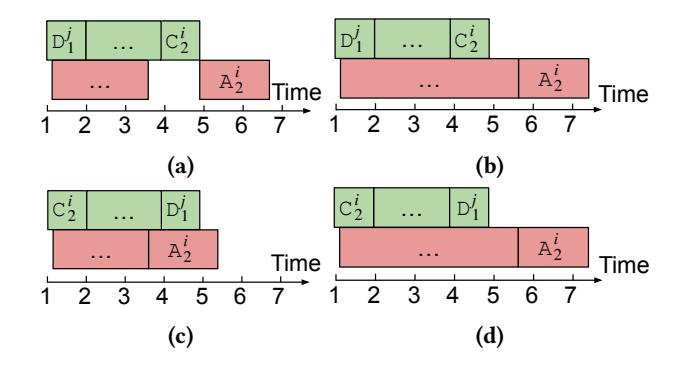

# 4 Optimal Scheduling Algorithm

Our ScheMoE allows an easy extension for implementing new schedule algorithms to determine the task execution order. We propose an optimal scheduling algorithm, named OptSche, with some practical constraints. Assuming that the input tensor is uniformly partitioned to multiple equal-size tensors (say r), the abstraction module has a total of  $7 \times r$ tasks. Given a r degree of partitioning, we derive an optimal scheduling algorithm for the execution order such that the communication tasks and computing tasks can be maximally overlapped. Note that a larger r enables a higher degree for pipelining, but it may decrease the arithmetic intensity of computation as the workload on the GPU per kernel launch becomes smaller. Thus, determining r to achieve better performance is another optimization problem, which has been studied in [43] and [16]. Orthogonal to the methods in choosing the best r, our scheduling algorithm instead determines the optimal order of all compute and communication tasks for any given  $r \ge 2$ . To simplify the problem, we use r = 2to demonstrate our scheduling algorithm and conduct experiments, but it is also applicable to r > 2.

## 4.1 Problem Formulation

According to the abstraction module, there are 7 tasks in the feed-forward phase (and the same for backpropagation). We use  $C_1$ ,  $A_1$ ,  $D_1$ , E,  $C_2$ ,  $A_2$ ,  $D_2$  to denote the tasks of the first data compression, the first A2A, the first data decompression,

&lt;sup>3Code is available at https://github.com/Fragile-azalea/ScheMoE.

&lt;sup>4https://github.com/LLNL/zfp

&lt;sup>5https://developer.nvidia.com/nccl

&lt;sup>6https://github.com/Hsword/Hetu

&lt;sup>7https://github.com/microsoft/tutel

expert computation, the second data compression, the second A2A, and the second data decompression, respectively for the input tensor without partitioning. If the input tensor is partitioned to r equal-size parts, each task will be partitioned to r independent sub-tasks. The partitioned tasks can be represented as

$$\mathbb{T} = \{ C_1^i, A_1^i, D_1^i, E^i, C_2^i, A_2^i, D_2^i | 1 \le i \le r \},$$
 (3)

where  $A_1^i$  and  $A_2^i$  are communication tasks (CommTasks) and others are computing tasks (CompTasks). Due the resource competition, we assume that any two same types of tasks cannot execute simultaneously, while a communication task and a computing task are allowed to run simultaneously. Let  $\tau(\cdot)$  and  $t(\cdot)$  denote the beginning execution timestamp of running a task and its elapsed time respectively. Note that the execution times for the first and second same tasks (e.g.,  $C_1^i$  and  $C_2^j$ ) are the same. The data dependency of different tasks can be represented as follows, for  $1 \le i \le r$ ,

$$\tau(\mathsf{A}_1^i) \ge \tau(\mathsf{C}_1^i) + t(\mathsf{C}_1^i),\tag{4}$$

$$\tau(\mathsf{D}_1^i) \ge \tau(\mathsf{A}_1^i) + t(\mathsf{A}_1^i),\tag{5}$$

$$\tau(\mathsf{E}^i) \ge \tau(\mathsf{D}_1^i) + t(\mathsf{D}_1^i),\tag{6}$$

$$\tau(\mathsf{C}_2^i) \ge \tau(\mathsf{E}^i) + t(\mathsf{E}^i),\tag{7}$$

$$\tau(\mathsf{A}_2^i) \ge \tau(\mathsf{C}_2^i) + t(\mathsf{C}_2^i),\tag{8}$$

$$\tau(\mathsf{D}_2^i) \ge \tau(\mathsf{A}_2^i) + t(\mathsf{A}_2^i). \tag{9}$$

The default execution order (as shown in Fig. 5(a) with r = 1) without overlapping takes the time of

$$t_1 = \sum_{e \in \mathbb{T}} t(e). \tag{10}$$

For  $r \ge 2$ , there are overlaps between CommTasks and CompTasks (as shown in Fig. 5(b) with r = 2), the execution time can be represented as

$$t_r = \sum_{e \in \mathbb{T}} t(e) - t_{hidden}, \tag{11}$$

where  $t_{hidden}$  is the hidden time in overlapping. Thus, our goal is to find an execution order under the constraints of (4)-(9) such that the hidden time is maximized thus  $t_r$  is minimized. The intuitive understanding of the optimal solution is ensuring the tasks to be executed in an order that un-blocks later tasks quicker.

## 4.2 Optimal Solution

**Theorem 1.** Assume that an MoE layer is trained with our ScheMoE framework and the partitioned tasks have the constraints of (4)-(9). The optimal execution order for minimizing Eq.(11) is

$$(\mathsf{C}_1^1\mathsf{C}_1^2\cdots\mathsf{C}_1^r)(\mathsf{D}_1^1\mathsf{E}^1\mathsf{C}_2^1)(\mathsf{D}_1^2\mathsf{E}^2\mathsf{C}_2^2)\cdots(\mathsf{D}_1^r\mathsf{E}^r\mathsf{C}_2^r)(\mathsf{D}_2^1\mathsf{D}_2^2\cdots\mathsf{D}_2^r) \tag{12}$$

**Figure 6.** Demonstration of one case. (a)  $D_1^J$  runs before  $C_2^i$  and  $A_2^i$  can be immediately started after  $C_2^i$ . (b)  $D_1^J$  runs before  $C_2^i$  and  $A_2^i$  can be only started after its previous communication tasks finish. (c) Exchanging the order of  $D_1^J$  and  $C_2^i$  from (a) makes  $A_2^i$  can be started earlier. (d) Exchanging the order of  $D_1^J$  and  $C_2^i$  from (b) cannot make  $A_2^i$  begin later.

for the computing tasks and the communication tasks are directly executed when their predecessor tasks have been completed, that is

$$\tau(\mathsf{A}_1^i) = \begin{cases} \tau(\mathsf{C}_1^1) + t(\mathsf{C}_1^1) & i = 1\\ \max\{\tau(\mathsf{C}_1^i) + t(\mathsf{C}_1^i), \tau(\mathsf{A}_1^{i-1}) + t(\mathsf{A}_1^{i-1})\} & i > 1 \end{cases}, \tag{13}$$

and

$$\tau(\mathsf{A}_2^i) = \begin{cases} \max\{\tau(\mathsf{C}_2^1) + t(\mathsf{C}_2^1), \tau(\mathsf{A}_1^r) + t(\mathsf{A}_1^r)\} & i = 1 \\ \max\{\tau(\mathsf{C}_2^i) + t(\mathsf{C}_2^i), \tau(\mathsf{A}_2^{i-1}) + t(\mathsf{A}_2^{i-1})\} & i > 1 \end{cases}. \tag{14}$$

*Proof.* First, we prove that for any  $1 \le i < j \le r$ ,  $\mathsf{D}_1^j$  begins after  $\mathsf{C}_2^i$  is not worse than reversing their order. Note that the computation time of exchanging the order of  $\mathsf{C}_2^i$  and  $\mathsf{D}_1^j$  would not be changed. If  $\mathsf{D}_1^j$  begins before  $\mathsf{C}_2^i$ , the possible beginning time of  $A_2^i$  will be larger than or equal to that  $\mathsf{D}_1^j$  begins later than  $\mathsf{C}_2^i$ . Thus,  $\mathsf{D}_1^j$  should begin after  $\mathsf{C}_2^i$ . An easy-to-understand demonstration is present in Fig. 6.

Second, we prove that for any  $1 \le i < j \le r$ ,  $D_1^j$  begins after  $C_1^i$  is not worse than reversing their order. Similar to the previous case, if  $D_1^j$  begins before  $C_1^i$ , the beginning time of  $A_1^i$  will be larger than or equal to that  $D_1^j$  begins after  $C_1^i$ . Thus,  $D_1^j$  should begin after  $C_1^i$ .

Third, we prove that for any  $1 \le i < j \le r$ ,  $D_2^j$  begins after  $C_2^i$  is not worse than reversing their order. If  $D_2^j$  begins before  $C_2^i$ , the beginning time of  $A_2^i$  will be larger than or equal to that  $D_2^j$  begins after  $C_2^i$ . Thus,  $D_2^j$  should begin after  $C_2^i$ .

Fourth, we prove that for any  $1 \le i < j \le r$ ,  $C_2^j$  begins after  $E^i$  is not worse than reversing their order. If  $C_2^j$  begins before  $E^i$ , the beginning time of  $A_2^i$  will be larger than or equal to that  $C_2^j$  begins after  $E^i$ . Thus,  $C_2^j$  should begin after  $E^i$ 

**Figure 7.** An example of Pipe-A2A on a 2-node cluster, where each node has 4 GPUs. Intra-node communications are able to be overlapped with inter-node communications.

Putting all the above four cases and using the constraints of (4)-(9), we can conclude that exchanging any two tasks from the order of Eq.(12) cannot make the elapsed-time of the MoE layer shorter, which completes the proof.

An example of r=2 of the optimal solution is shown in Fig. 5(c), where the step time cannot be made shorter by exchanging the order of any two computing tasks under the constraints of (4)-(9).

