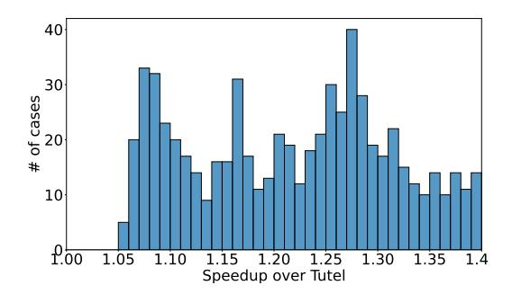
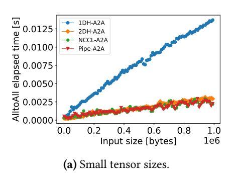
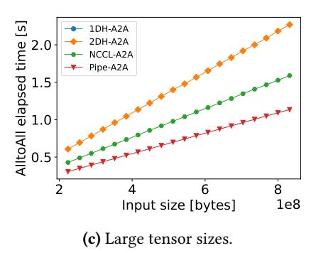

# 5 Pipelined All-to-all Algorithm

To better utilize the heterogeneous bandwidth on modern GPU clusters, we design a new A2A algorithm called Pipelined All-to-all (or Pipe-A2A). An A2A operation consists of a series of Send (and Recv) operations, which send (and receive) a particular part of data to (and from) corresponding GPUs. To better utilize the network resources of both intranode bandwidth and inter-node bandwidth, we enable the intra-node Send/Recv operations to be pipelined with the inter-node Send/Recv operations.

Assume that the A2A operation is running on a heterogeneous GPU cluster with N nodes and each node has M GPUs, i.e.,  $P = N \times M$ . Formally, for an input tensor  $I_i$  located on GPU i,  $I_i^j$  indicates the data that should send to GPU j,  $0 \le i, j \le P - 1$ . Let SR(i, j) denote the pair of Send and Recv operations between GPU i and j. If GPU i and GPU j are located in the same node, then SR(i, j) is an intra-node operation, otherwise, it is an inter-node operation. For the A2A collective, there are totally P SR operations, i.e.,

$$SR(i, 0), SR(i, 1), \dots, SR(i, P - 1).$$
 (15)

Note that SR(i, i) only requires an in-memory copy, but we also regard it as an intra-node operation for ease of presentation. Normally, the P operations should be executed sequentially, which means the intra-node operations have no opportunity to be overlapped with inter-node operations. In Pipe-A2A, we introduce two asynchronous communication streams, one is for intra-node communication (Intra-Stream) and one is for inter-node communication (Inter-Stream).

One SR can be viewed as one task. For any task SR(i, j), if GPU i and GPU j are located in the same node, it uses Intra-Stream to do the communication, otherwise, it uses Inter-Stream to do the communication. As Intra-Stream and

**Table 3.** The hardware configuration of servers.

| Name    | Model                                   |
|---------|-----------------------------------------|
| CPU     | Dual Intel Xeon Gold 6230 CPU@2.10GHz   |
| GPU     | ×4 RTX2080Ti (@1.35GHz, 11GB Memory)    |
| Memory  | 512GB DDR4                              |
| PCIe    | 3.0 (×16)                               |
| Network | Mellanox MT27800 (ConnectX-5) @ 100Gb/s |

**Table 4.** Configurations of MoE layers (k = 1 and E = P).

| Parameter | Candidate Values              |
|-----------|-------------------------------|
| В         | {2, 4, 8}                     |
| f         | {1.0, 1.1, 1.2}               |
| L         | {512, 1024, 2048}             |
| Н         | {512, 1024, 2048, 4096, 8192} |
| M         | {512, 1024, 2048, 4096, 8192} |

Inter-Stream occupy different inter-connect resources, these two streams can be executed simultaneously. As shown in Fig. 7 with an 8-GPU example on 2 nodes, by asynchronously executing the intra-node and inter-node communications, one can hide some communication costs compared to sequentially executing all communication tasks without any interleaves. In modern GPU clusters, the intra-node interconnect typically has a higher bandwidth or lower latency than the inter-node interconnects. Therefore, intra-node communication costs could be fully hidden by inter-node communications. Compared to NCCL-A2A, which executes all SR operations sequentially, Pipe-A2A allows intra-node operations and inter-node operations to be executed concurrently. If the bandwidth or the latency between intra-node and inter-node interconnects are comparable, our Pipe-A2A could achieve significant improvement over sequentially executed without pipelining.

#### 6 Evaluation

#### 6.1 Experimental Settings

**Testbed.** We conduct experiments on a 32-GPU cluster, which consists of 8 nodes connected with 100Gb/s InfiniBand. Each node has the same configuration and is equipped with four Nvidia Geforce RTX2080Ti GPUs connected with PCIe3.0x16. The details of hardware are shown in Table 3. The DL framework is PyTorch-1.10 [33] under a software environment of Ubuntu-18.04, CUDA-10.2, cuDNN-7.6, OpenMPI-4.1.4, and NCCL-2.13.

**Model configurations.** (1) *Customized MoE layers*: Similar to Tutel, we cover a variety of typical configurations of MoE layers by choosing a combination of input parameters whose ranges are shown in Table 4. We set the number of experts equal to the number of GPUs (i.e., 32 in our experiments) and k = 2. Some cases that require memory larger

| MoE Name        | Base Model     | # Params    | # Params | Dataset      | MoE Configuration |     |      |      |     |    |    |
|-----------------|----------------|-------------|----------|--------------|-------------------|-----|------|------|-----|----|----|
|                 |                | (Attention) | (MoE)    |              | 𝑓                 | 𝐵   | 𝐿    | 𝐻    | 𝑀   | 𝑘  | 𝐸  |
| Transformer-MoE | Transformer    | 90M         | 403M     | wmt14_en_fr  | 1.0               | -   | -    | 2048 | 512 | 1  | 8  |
| GPT2-Tiny-MoE   | GPT2-Tiny      | 32M         | 1M       | wikitext-103 | 1.0               | 4   | 256  | 64   | 64  | 2  | 32 |
| CT-MoE          | CusTransformer | 97M         | 403M     | wmt14_en_fr  | 1.0               | 136 | 31   | 512  | 512 | 1  | 32 |
| BERT-Large-MoE  | BERT-Large     | 139M        | 6442M    | bookcorpus   | 1.0               | 1   | 4096 | 1024 | 1   | 32 | 32 |

Table 5. Configurations of MoE models. For Transformer-MoE, × = 4, 906 instead of setting and separately.

than the capacity of GPU memory (11GB) and cannot run on our cluster are excluded, so we conduct totally 676 valid cases for the experiments.

(2) Real-world MoE models: Similar to Faster-MoE [\[14\]](#page-12-7), we also choose three popular NLP models, i.e., Transformer [\[47\]](#page-13-18) for the translation task on the wmt14\_en\_fr[8](#page-8-1) English-French translation dataset [\[5\]](#page-12-19), GPT2-Tiny[9](#page-8-2) for the language modeling task on the wikitext-103 dataset [\[46\]](#page-13-19), and a relatively large BERT-Large [\[11\]](#page-12-0) model for the pretraining task on the bookcorpus dataset [\[54\]](#page-13-20). We also customize an NLP model (named Cus-Transformer) that can be configured with a different number of layers (12, 16, 20, and 24 for our experiments). We replace all the feed-forward layers in Transformer, GPT2-Tiny, Cus-Transformer, and BERT-Large with MoE layers to construct MoE models. Due to the memory constraint in our testbed, we configure the number of local experts on each GPU to 1, i.e., = . The details of the configuration are shown in Table [5.](#page-8-0)

## 6.2 Convergence of Data Compression

Table 6. Convergence performance under different compression methods. The higher BLEU, the better model performance. The lower perplexity, the better model performance.

|            | Validation Performance |               |  |  |
|------------|------------------------|---------------|--|--|
| Method     | Transformer-MoE        | GPT2-Tiny-MoE |  |  |
|            | (BLEU)                 | (Perplexity)  |  |  |
| Base       | 45.51                  | 128.8         |  |  |
| MoE        | 46.61                  | 106.8         |  |  |
| MoE w/FP16 | 46.59                  | 106.85        |  |  |
| MoE w/INT8 | 46.68                  | 110.35        |  |  |
| MoE w/ZFP  | 46.58                  | 106.87        |  |  |

As the data compression approaches like quantization with low-bit floating point precision (e.g., 16-bit or 8-bit) and the ZFP approach are lossy algorithms, we conduct convergence experiments on two real-world MoE models with two datasets to verify if the lossy compression can preserve

model accuracy. Since the end-to-end training time to converge would be very long under our limited testbed, we mainly use relatively small models to verify their convergence performance. The results are shown in Table [6.](#page-8-3) For each method, we train the same number of iterations (i.e., 434,850 and 500,000 iterations for Transformer-MoE and GPT2-Tiny-MoE, respectively).

First, MoE models have significant improvement in model performance (i.e., higher BLEU or lower perplexity) over Base models, which matches the conclusion of existing studies [\[18,](#page-12-4) [19\]](#page-12-10). Second, MoE w/FP16 has almost no impact on the model convergence using only a 16-bit floating-point precision representation of input data. It enables mixed-precision training, which would better utilize modern hardware resources with tensor cores, without particularly tuning hyperparameters on MoE layers. Third, MoE w/INT8 has a dramatic performance decrease in GPT2-Tiny-MoE (from 106.8 to 110.35) as it has a large data loss using an 8-bit integer to train the model. Though it can reduce the communication volume of A2A by 4 times compared to the 32-bit counterpart, the accuracy loss may not be acceptable for AI practitioners. The results indicate that the current INT8 compression approach could not be applied in MoE models in some applications. Fourth, MoE w/ZFP preserves model accuracy in both models and it can reduce the communication volume by four times (only 8-bit is required using ZFP for each element on average) as MoE w/INT8. Thus, ZFP compression could be an effective way to improve the training time performance with little impact on the model convergence. We use MoE w/ZFP to study its time performance in our ScheMoE.

### 6.3 Step time Performance

Table 7. Step time (mean±std) in CT-MoE-. Three independent runs are measured for each experiment.

| System     | Time (ms) |           |           |           |  |  |
|------------|-----------|-----------|-----------|-----------|--|--|
|            | 𝑥 = 12 | 𝑥 = 16 | 𝑥 = 20 | 𝑥 = 24 |  |  |
| Tutel      | 497±9     | 623±2     | 769±3     | 864±3     |  |  |
| Faster-MoE | 506±7     | 640±8     | 845±10    | 1003±16   |  |  |
| ScheMoE    | 454±4     | 552±1     | 658±1     | 774±8     |  |  |

Customized MoE layers. Using the combination of Table [4](#page-7-5) to construct MoE layers, there are 675 valid cases

8<https://huggingface.co/datasets/wmt14>.

9 It is a language model that has similar architecture with GPT2, but it has relatively small dimensions compared to GPT2 [\[35\]](#page-13-21). The source code of the model (named "transformer\_lm\_gpt2\_tiny") can be found at: [https:](https://github.com/facebookresearch/fairseq/models/transformer_lm.py) [//github.com/facebookresearch/fairseq/models/transformer\\_lm.py](https://github.com/facebookresearch/fairseq/models/transformer_lm.py).

**Figure 8.** Statistic of the speedup over Tutel.

(OOM cases are excluded) successfully measured in both Tutel and ScheMoE using our 32-GPU cluster. In all valid cases, ScheMoE is always faster than Tutel. The statistic of the speedup of ScheMoE over Tutel is shown in Fig. 8. On average, ScheMoE achieves 22% improvement over Tutel.

**CT-MoE-***x* **models.** We configure CT-MoE-*x* with a different number of layers (i.e., x) to study the iteration time performance using our ScheMoE. As shown in the previous subsection, data compression with ZFP can achieve the target model accuracy under the same number of iterations as the original version, so we only measure the step time to compare different training systems. The results are shown in Table 7. It shows that ScheMoE achieves 9%-17% and 11%-30% improvement over Tutel and Faster-MoE, respectively. Note that for both Tutel and Faster-MoE, we use their official releases open-sourced at GitHub. There are slight differences in A2A implementations between Tutel and Faster-MoE to support their own scheduling algorithms. Though both of them pipeline the communication tasks with computing tasks, the A2A communication time cannot be well overlapped. Instead, ScheMoE is able to schedule different tasks in a more intelligent manner such that the communication tasks are maximally overlapped. We will dive into the details with an ablation study to see the separate benefits of our proposed optimizations in §6.5.

**Table 8.** End-to-end performance on BERT-Large-MoE. Faster-MoE runs OOM.

| Name Time (mean ± std in r |                  | Speedup |
|----------------------------|------------------|---------|
| Tutel                      | $783.3 \pm 11.8$ | 1.0×    |
| ScheMoE                    | $672.9 \pm 28.4$ | 1.16×   |

BERT-Large-MoE model. In the large MoE model of BERT-Large-MoE, which has totally ~6.5 billion parameters, our ScheMoE runs 1.16× faster than Tutel, while Faster-MoE runs OOM, which may be caused by the improper handling of imbalanced tokens on different GPUs. In this model, Pipe-A2A does not contribute to the overall improvement as the input size for the A2A collective is 524,288 bytes, and the performance of A2A and NCCL-A2A is similar with small

or median message sizes (more details are shown in the following subsection). The ZFP compression algorithm and the scheduling algorithm contribute around 70% and 30% to the overall improvement, respectively.

#### 6.4 A2A Performance

To provide a full comparison between different A2A algorithms, we conduct experiments with different sizes of tensors including 1) small: [1K, 1M], 2) median: [1M, 200M], and 3) large: [200M, 2G] in bytes on our 32-GPU cluster. The results are shown in Fig. 9. It is seen that Pipe-A2A outperforms all the other A2A algorithms in all cases. Particularly, when the message size is small or median, our Pipe-A2A runs only 3%-5% improvement over NCCL-A2A and 2DH-A2A, while the three are much faster than 1DH-A2A. When the message size is larger than 200M, which is also common on extremely large sparse models, Pipe-A2A achieves up to around 2× and 1.4× speedups over 2DH-A2A and NCCL-A2A, respectively. Due to the hardware limitation, we only conduct the performance under our testbed, but we plan to evaluate our algorithm on other supercomputers and public cloud GPU clusters, which we leave as our future work.

**Table 9.** Notions for the ablation study.

| Name       | w/ ZFP   | w/ Pipe-A2A | w/ Scheduling |
|------------|----------|-------------|---------------|
| Naive      | X        | Х           | Х             |
| ScheMoE-Z  | ✓        | Х           | Х             |
| ScheMoE-ZP | ✓        | ✓           | Х             |
| ScheMoE    | <b>✓</b> | <b>✓</b>    | ✓             |

#### 6.5 Ablation Study

We conduct the ablation study to demonstrate the benefits of different components (i.e., w/ ZFP, w/ Pipe-A2A, and w/ scheduling). The corresponding notations are shown in Table 9. The configuration of the chosen MoE layer has parameters of B = 8, f = 1.2, L = 2048, H = 8192, and M = 8192. The step time on our testbed w/ different components is shown in Table 10. It is seen that the ScheMoE-Z achieves a significant speedup over the naive version as it can compress the communication volume by 4 times while almost preserving the model accuracy (as shown in Table 6). Our Pipe-A2A helps ScheMoE-ZP improve the time performance by 13.8% over ScheMoE-Z. Compared to the improvement on the BERT-Large-MoE model, Pipe-A2A contributes much higher on the CT-MoE model. The reason is the A2A input size of CT-MoE is 640MB, which is the size that Pipe-A2A can significantly outperform NCCL-A2A as shown in Fig. 9(c). The scheduling feature further improves the time performance by another 9% over ScheMoE-ZP. Putting all three optimizations together, ScheMoE runs 2.4× faster than the Naive version.

**Figure 9.** Time performance of different A2A algorithms. 3 independent runs are conducted and their averages are measured. 1DH-A2A runs OOM with large tensor sizes.

**Table 10.** Step time of the MoE layer under different components. The speedup is using the Naive method as the baseline.

| Name       | Time (mean $\pm$ std in ms) | Speedup |  |  |
|------------|-----------------------------|---------|--|--|
| Naive      | $2401 \pm 22$               | 1.0×    |  |  |
| ScheMoE-Z  | $1264 \pm 5$                | 1.9×    |  |  |
| ScheMoE-ZP | 1110 ± 5                    | 2.2×    |  |  |
| ScheMoE    | 1019 ± 2                    | 2.4×    |  |  |

#### 7 Discussion

Though we present some improvements of our ScheMoE over existing state-of-the-art MoE training systems, the time efficiency may still have chances for further improvement.

**Performance of data compression.** On one hand, though data compression is possible to reduce communication traffic, it also introduces computation overhead. One should consider whether the benefits from the reduced communication time can cover the cost of computation. In some hardware environments (e.g., communication is fast on NVLink), data compression may sacrifice the time performance. On the other hand, if the data compression is introduced to the backpropagation phase, which may easily have gradient vanishing [4] or exploding [32] problems, it may make the model training divergent or slow convergence. There are some studies like AC-GC [12] and EXACT [24] aiming to compress activation data, but they are mainly designed for saving memory. The data compression in A2A may be further explored to reduce the communication size while preserving model accuracy.

**Performance of Pipe-A2A.** The benefit of Pipe-A2A comes from the overlapping between intra-node communications and inter-node communications. The reduced time in Pipe-A2A compared to NCCL-A2A (a sequential version) is limited by the maximum overlap between intra-node communications and inter-node communications. Let  $t_1$  and  $t_2$  denote the time of completing a SR task intra-node and internode respectively. For a message, I running a P-GPU (N

nodes and each node has M GPUs), the total times of intranode and inter-node communications would be  $t_{intra} = M \times t_1$ and  $t_{inter} = (P - M) \times t_2$ , respectively. The times of Pipe-A2A and NCCL-A2A can be represented as

$$t_{pipea2a} = \max\{M \times t_1, (P - M) \times t_2\}$$
 (16)

and

$$t_{nccla2a} = M \times t_1 + (P - M) \times t_2, \tag{17}$$

respectively. Therefore, the theoretical maximal speedup of Pipe-A2A over NCCL-A2A is

$$S_{max} = \frac{t_{nccla2a}}{t_{pipea2a}} = \frac{M \times t_1 + (P - M) \times t_2}{\max\{M \times t_1, (P - M) \times t_2\}}.$$
 (18)

The equation indicates that if the difference between  $t_{intra}$  and  $t_{inter}$  is small, then  $S_{max}$  will also be small.

Performance of Scheduling. The key of OptSche in ScheMoE is to maximally overlap the computing tasks and communication tasks. Similar to the comparison between Pipe-A2A and NCCL-A2A, our OptSche algorithm may not have significant improvement over the default schedule when the time gap between computing tasks and communication tasks is large. Thus, in some scenarios (such as A2A occupies only a small proportion of the overall step time), OptSche may achieve very marginal improvement over the default schedule. For example, in the two real-world models (Transformer-MoE and GPT2-Tiny-MoE) that we used to verify the convergence, our ScheMoE achieves only less than 5% improvement over Tutel or ScheMoE w/o OptSche.

In summary, data compression, A2A, and scheduling algorithms still have much potential for further improvement to accelerate MoE training under different hardware and software configurations. We believe the extensible feature of our ScheMoE supporting easy integration of new data compression algorithms, A2A algorithms, and scheduling algorithms would help accelerate the research in this direction.

**Impacts of Different Parallelization Strategies.** Current MoE systems primarily utilize data parallelism (DP) and expert parallelism (EP) to train models like GShard [18] and Tutel [16] when the number of experts matches or exceeds

the number of GPUs or TPUs. Our scheduling algorithm is also designed with a focus on optimizing configurations involving DP and EP. However, the training of extremely large models often necessitates the incorporation of two additional forms of parallelism: tensor parallelism (TP) [\[29\]](#page-13-8) and pipeline parallelism (PP) [\[15\]](#page-12-15). When it comes to integrating TP and PP into ScheMoE, there are three scenarios to consider. First, TP can be exclusively applied to the attention layers, allowing ScheMoE to retain the enhancements described in our paper, as MoE layers are still DP and EP. Second, TP may be applied to expert layers, which is a common approach when the number of experts is smaller than the number of available GPUs [\[36\]](#page-13-5). In this situation, various scheduling strategies are employed to determine the placement of attention and expert layers to reduce overall communication volume, as discussed in [\[44\]](#page-13-23), so that the tasks may be totally different from DP and EP. Thus, the scheduling algorithm in ScheMoE may not be suitable for this scenario, but Pipe-A2A remains applicable. Third, when integrating PP into ScheMoE, it primarily affects the size of input partitions. This may impact the selection of the optimal degree for pipelining, as explored in [\[16,](#page-12-8) [43\]](#page-13-15). However, the scheduling of task ordering remains unaffected. The integration of TP and PP in ScheMoE necessitates the incorporation of efficient 3D-parallelism training systems like Megatron [\[29\]](#page-13-8) or DeepSpeed [\[37\]](#page-13-24). We leave this as our future work.

