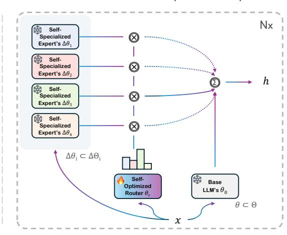

# 1 INTRODUCTION

The remarkable success of Large Language Models (LLMs) has been largely attributed to their generalist nature, allowing them to perform a wide variety of tasks [\(Brown et al., 2020;](#page-10-0) [Touvron et al.,](#page-15-0) [2023;](#page-15-0) [Jiang et al., 2023;](#page-12-0) [Team et al., 2024\)](#page-14-0). Predominantly designed as monolithic architectures, these models rely extensively on large-scale data to embed generalized language capabilities across vast parameter spaces. While effective, this monolithic architecture, as illustrated in Figure [1,](#page-1-0) inherently suffers from significant drawbacks such as inefficiency in scaling [\(Zhang et al., 2024;](#page-16-0) [Wan](#page-15-1) [et al., 2024\)](#page-15-1), susceptibility to forgetting previously learned information when adapted to specialized tasks [\(Kotha et al., 2024;](#page-12-1) [Huang et al., 2024\)](#page-12-2), and a lack of transparency which leads to the black-box nature [\(Zhao et al., 2023\)](#page-16-1).

Meanwhile, the increasing demand to handle domain-specific or expert-level tasks has highlighted the need for specialization of LLMs [\(Cheng et al., 2024;](#page-10-1) [Ling et al., 2023;](#page-13-0) [Feng et al., 2024\)](#page-11-0). However, effective tuning often relies on high-quality, human-annotated data, which is costly and challenging to scale [\(Kang et al., 2023\)](#page-12-3), especially in specialized domains where expertise is scarce and valuable [\(Wu et al., 2023\)](#page-15-2). Self-specialization [\(Kang et al., 2024\)](#page-12-4) offers a promising alternative, aligning models with self-generated synthetic data. While this technique has proven effective in cross-task generalization within a target expert domain, we posit that it may compromise performance in areas outside the target domain.

∗Correspondence to junmo.kang@gatech.edu

Figure 1: Concept of Self-MoE, illustrating the transformation from a monolithic LLM to a compositional system, MiXSE, without extensive resources and addition of significant parameters. MiXSE distinguishes itself from traditional MoEs and other models in post-training, lightweight semantic experts, and/or self-generated synthetic data. The results showcase MiXSE's improved capabilities over the base LLM (e.g., Gemma-7B) across all domains, unlike the knowledge-specialized LLM that compromises other capabilities.

In this paper, we explore the following question: *How can we build compositional LLMs that enjoy versatile expertise, while using minimal resources?* We introduce Self-MoE (Figure [1\)](#page-1-0), an approach that transforms a monolithic model into a compositional [\(Zaharia et al., 2024\)](#page-16-2) system, called MiXSE (MiXture of Self-specialized Experts). This approach differs from prior MoE work using LoRA [\(Hu](#page-12-5) [et al., 2022\)](#page-12-5), which either relies on human-labeled data [\(Wu et al., 2024\)](#page-15-3) or assumes the existence of trained modules [\(Huang et al., 2023;](#page-12-6) [Muqeeth et al., 2024\)](#page-14-1). Instead, our Self-MoE constructs individual lightweight expert modules from scratch using synthetic data, inspired by the concept of self-specialization. Each module is integrated with a shared base LLM, and the entire system is enhanced by a self-optimized routing mechanism. In contrast to monolithic models, which often suffer from forgetting issues when adapted or merged under fixed, static parameters, our modular design preserves the integrity and semantics of each expert. This allows for dynamic, precise handling of various target domain tasks, boosting the model's overall capability, adaptability, and interpretability.

Through extensive empirical studies conducted across a variety of popular domains, including knowledge, reasoning, math, and coding, we find that specialization often comes with trade-offs, typically degrading performance in non-targeted domains. However, our Self-MoE demonstrates substantial overall improvements over a base LLM across all target domains without compromising performance on other tasks. Notably, the compositional nature of our MiXSE appears to exploit synergies among experts, even outperforming all individual specialized experts.

Moreover, MiXSE clearly surpasses other strong baselines such as instance merging and weight merging, under similar settings, while offering better flexibility and interpretability. Detailed analyses highlight the critical role of the routing mechanism and the contribution of semantic experts in achieving these results. Our interpretable visualizations of routing distributions further elucidate how tasks are dynamically allocated to the most relevant experts. Lastly, we further validate that there are no issues related to forgetting unlike monolithic baselines, and that our approach can be applied to various model families and sizes. In summary, our key contributions are as follows:

- We highlight the inherent limitations of monolithic model specialization, where focusing on a specific capability often comes at the cost of degrading performance in other domains.
- We propose Self-MoE, which allows a base, monolithic LLM to upgrade into a modular system of lightweight, self-specialized experts, without requiring extensive human supervision, compute resources, or overhead in active parameters.

#### **Self-Specialization**

#### MiXSE (MiXture of Self-Specialized Experts)

Figure 2: Overview of the **Self-MoE** approach to building a compound system of specialized experts and a router in a self-improving manner. In the Self-Specialization phase (left side), the base LLM is aligned with self-generated synthetic data for each target specialization, producing lightweight expert modules. The right side shows MiXSE where each self-specialized expert is dynamically engaged based on the decisions of the self-optimized router.

We provide comprehensive experiments and analyses across a range of benchmarks, where Self-MoE demonstrates consistent improvements with an average of 6.5%p across domains over a base LLM, outperforming various baselines. Our ablation studies validate the impact of modularity, routing strategies, and the use of self-generated synthetic data. Moreover, our analyses explore routing distributions, forgetting issues, and the applicability of our approach to five different base LLMs.

#### 2 Problem Statement

The primary focus of this work is on self-improving LLMs' target capabilities on the fly, specifically under settings constrained by minimal resources and without the addition of significant parameters. Traditional LLMs, which are generally monolithic, require expensive human-labeled data to be better specialized, thereby limiting their adaptability and scalability when resources are constrained. We hypothesize that a modular, compositional model utilizing self-generated synthetic data for self-improvement can dramatically improve specific target capability, adaptability, and interpretability while reducing dependency on expensive human-annotated datasets.

Specifically, given a base LLM  $\Theta_0$  and a minimal set of seed data (e.g., 100) for each of the target capabilities  $\{T_i\}_{i=1}^n$  (e.g., knowledge, math), our goal is to transform  $\Theta_0$  into an enhanced compositional model  $\Theta_{comp}$  where n target expert modules  $\{\Delta\Theta_i\}_{i=1}^n$  are effectively integrated. Formally, the Self-MoE transformation function is defined as:

$$f_{trans}: (\Theta_0, \{T_i\}_{i=1}^n) \to \Theta_{comp} = \Theta_0 \cup \{\Delta\Theta_i\}_{i=1}^n$$

Here, under our problem setting, the number of parameters of  $\Theta_0$  and  $\Theta_{comp}$  should not be significantly different, necessitating that the expert modules  $\Delta\Theta_i$  be lightweight (i.e., LoRA (Hu et al., 2022)). The available seed data are limited but can be reasonably collected (e.g., 100). Importantly, we do not assume the availability of larger/teacher models at one's hand; instead, we aim to develop a method that enables self-improvement and is designed to be universally applicable.

