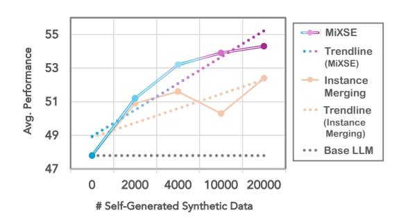

# 4 EXPERIMENTS AND RESULTS

**Datasets.** We evaluate Self-MoE across diverse domains categorized into knowledge, reasoning, math, and coding: MMLU (0- & 5-shot) (Hendrycks et al., 2021a), BBH (3-shot) (Suzgun et al., 2022), GSM8K (8-shot) (Cobbe et al., 2021), and HumanEval (0-shot) (Chen et al., 2021), respectively. For MMLU, we primarily employ the 0-shot setting unless otherwise specified, based on established observations (Dettmers et al., 2023; Lin et al., 2024) that tuning yields only marginal effects in the 5-shot setting for this task. To test generalization (Section 4.4), we additionally evaluate on MATH (4-shot) (Hendrycks et al., 2021b), MBPP (3-shot) (Austin et al., 2021), NaturalQuestions (5-shot) (Kwiatkowski et al., 2019), TriviaQA (5-shot) (Joshi et al., 2017), Hellaswag (0-shot) (Zellers et al., 2019), PIQA (0-shot) (Bisk et al., 2020), and TruthfulQA (0-shot) (Lin et al., 2022).

**Baselines.** To assess the effectiveness of Self-MoE, we compare performance against several baselines that use the same number of active parameters during inference:

- Four Self-Specialized Models (Kang et al., 2024): Trained on self-generated synthetic data for individual domains: knowledge, reasoning, math, and coding.
- Instance Merging (Multi-Task Tuning) (Chung et al., 2024): Leverages the aggregated synthetic data generated by self-specialization to train a model capable of handling multiple tasks.
- TIES (Yadav et al., 2023), DARE (Yu et al., 2024): Advanced weight merging methods integrating multiple expert strengths into a unified model.

We also contextualize these results with computationally intensive methods reported in the literature, despite indirect comparisons: BTM (Li et al., 2022), Sparse Upcycling (Komatsuzaki et al., 2023), BTX (Sukhbaatar et al., 2024), GLAN (Li et al., 2024a), Orca (Mitra et al., 2023), and Merlinite (Sudalairaj et al., 2024) in Appendix D.1.

**Implementation Details.** We adopt Gemma-7B (Team et al., 2024) as a base LLM for our main experiments, and additionally apply Self-MoE to various models, such as LLaMA-2 7B & 13B (Touvron et al., 2023), Mistral 7B (Jiang et al., 2023), and LLaMA-3 8B (AI@Meta, 2024) in Section 4.5. We use 100 seeds to generate 5K synthetic data for each domain, resulting in 20K data. Each LoRA module contributes less than 0.3% to the parameters of the base model, and the router's parameters are negligible, resulting in the added parameters of MiXSE amounting to only about 1%.

Table 1: Main results. All models are built upon the same base LLM, Gemma-7B, taking self-improving approaches and having the same active parameters during inference. Corresponding aligned performances of self-specialization are underscored. Each column's best performance is highlighted in bold, while the gains achieved by our MiXSE over the base LLM are indicated.

| Method                                                                      | Active Params                                 | Knowledge (MMLU)          | Reasoning (BBH)           | Math (GSM8K)                     | Coding (HumanEval)               | Avg.                         |
|-----------------------------------------------------------------------------|--------------------------------------------------|------------------------------|------------------------------|-------------------------------------|-------------------------------------|------------------------------|
| Base LLM                                                                    | 7B                                               | 58.4                         | 56.1                         | 42.5                                | 34.1                                | 47.8                         |
| Specialized LLM for Each Capability                                         |                                                  |                              |                              |                                     |                                     |                              |
| Knowledge Self-Spec. Reasoning Self-Spec. Math Self-Spec. Coding Self-Spec. | 7B + 0.3% 7B + 0.3% 7B + 0.3% 7B + 0.3% | 64.0 60.1 59.3 57.2 | 41.7 60.2 58.9 57.2 | 40.5 41.0 <u>50.0</u> 46.0 | 28.0 28.7 36.0 <u>37.2</u> | 43.6 47.5 51.1 49.4 |
| Merging Methods                                                             |                                                  |                              |                              |                                     |                                     |                              |
| Instance Merging TIES Merging DARE Merging                                  | 7B + 0.3% 7B + 0.3% 7B + 0.3%              | 62.6 63.7 37.7         | 57.6 56.3 59.6         | <b>53.5</b> 38.5 45.0               | 36.0 32.9 34.8                | 52.4 47.9 44.3         |
| MiXSE (Ours)                                                                | 7B + 0.3%                                        | <b>65.6</b> ↑ 7.2            | <b>61.1</b> ↑ 5.0            | <b>52.5</b> ↑ 10.0                  | <b>37.8</b> ↑ 3.7                   | <b>54.3</b> ↑ 6.5            |

#### 4.1 Main Results

In Table 1, we showcase comparative benchmark results of various approaches across four specialized domains: knowledge, reasoning, math, and coding. All baselines use self-generated synthetic data based on the same Base LLM, Gemma-7B, and LoRA for tuning to ensure fair comparisons.

First, we confirm self-specialization markedly enhances target-specific expertise, compared to the base LLM. For instance, we can see substantial gains from corresponding specialized models (e.g., Knowledge Self-Spec. in the knowledge domain): 58.4 to 64.0 in knowledge, 56.1 to 60.2 in reasoning, and so on. However, this focused improvement sometimes comes at the cost of reduced performance in non-targeted areas, as evidenced by the drop in scores for the Knowledge Self-Spec. model in reasoning, math, and coding. This trade-off highlights the inherent limitation of overspecialization. In contrast, our MiXSE, demonstrates consistent improvements across all domains, due to its modular, compositional architecture that makes use of dynamic routing to leverage optimal experts. Surprisingly, it even outperforms all corresponding specialized models, indicating that it effectively synergizes the strengths of each specialization.

In comparison with other static merging methods like Instance Merging, TIES, and DARE, MiXSE stands out for its superior adaptability. While they attempt to combine the strengths of different specialization areas into a single model, they lack the dynamic flexibility that MiXSE offers. Notably, simple instance merging (i.e., multi-task tuning), though effective in enhancing the base LLM across domains, still falls short of achieving the superior average performance of 54.3 seen with MiXSE. This validates the advantages of dynamic expert integration in a compositional system.

## 4.2 ABLATION STUDY

Now that we have verified the effectiveness of MiXSE as a whole, we evaluate the impact of different configurations and components of the system, presented in Table 2. The configurations vary in terms of routing strategies and integration of experts, offering insights into the contributions of each element to the system's overall effectiveness.

We start by examining the Top-k routing strategy, which plays a crucial role in our model. Our findings show that both the Top-1 and Top-2 expert configurations deliver the best performance. This suggests that identifying and leveraging the most relevant expert for a given task is typically sufficient and most effective. On a side note, the similar performances of the different configurations may highlight the robustness of our method. Given the similar performances, we prefer the Top-1 expert setup for better efficiency.

Interestingly, the results also indicate a drop in performance when using All Experts. This can be attributed to that involving all experts regardless of their relevance can introduce noise and dilute

Table 2: Analysis and ablation of the router in our MiXSE. Configurations vary to investigate the optimal number of experts used, to verify the possibility of self-learning for the router, and to see the importance of semantic distinctions among experts within the compositional system.

| Configuration                                         | Knowledge (MMLU)   | Reasoning (BBH)    | Math (GSM8K)             | Coding (HumanEval)       | Avg.              |
|-------------------------------------------------------|-----------------------|-----------------------|-----------------------------|-----------------------------|-------------------|
| Base LLM                                              | 58.4                  | 56.1                  | 42.5                        | 34.1                        | 47.8              |
| Top-k Routing                                         |                       |                       |                             |                             |                   |
| w/ Top-1 Expert w/ Top-2 Experts w/ All Experts | <b>65.6</b> 65.5 65.4 | <b>61.1</b> 60.9 58.9 | 52.5 52.5 <b>54.0</b> | 37.8 <b>38.4</b> 33.5 | <b>54.3 53.</b> 0 |
| Random Routing                                        |                       |                       |                             |                             |                   |
| w/o Self-Optimized Router                             | 59.9                  | 58.5                  | 48.0                        | 36.6                        | 50.8              |
| Experts & Router Joint Training                       |                       |                       |                             |                             |                   |
| w/o Semantic Experts                                  | 64.5                  | 58.1                  | 46.0                        | 33.5                        | 50.5              |

the specific contributions of the most pertinent experts. Additionally, involving more experts than necessary can increase computational overhead.

Furthermore, employing Random Routing serves as a useful setup to highlight the effectiveness of strategic expert selection of our Self-Optimized Router, which is a key component of our MiXSE. We observe that the performance significantly decreases under this configuration, highlighting the router's role in dynamically tailoring the selection of experts according to the specific requirements of each task. The router's ability to discern and activate the most suitable experts based on the context is critical for optimizing performance. Notably, this ability is learned by relying on a very small amount of seed data.

Another interesting finding comes from the configuration where experts and the router are jointly trained, which means that the semantic distinctions among experts may be diluted. This setup substantially decreases performance relative to scenarios where the router and experts are optimized independently. This decline validates that semantic experts play a crucial role in enhancing the system's capability to handle tasks requiring specific expertise, while offering better interpretability (Section 4.3).

## 4.3 ROUTING ANALYSIS

Understanding how MiXSE allocates tasks to its various experts is crucial for gauging its interpretability. By analyzing the routing distributions across four distinct domains, we aim to see whether the system matches queries to the most suitable experts. Figure 3 presents the routing distributions used to solve each benchmark, where the weights are averaged across tokens and layers within individual tasks.

We first observe that the MiXSE's router effectively selects the correct expert for each corresponding target. This is evident from the impressive alignment between tasks and the experts chosen by the router; for example, the knowledge expert predominantly handles knowledge tasks, while the coding expert is routed coding tasks. This highlights the router's ability to learn and apply this routing automatically.

Figure 3: Routing analysis that shows routing distributions over four domains for each benchmark, averaging the weights across tokens within individual tasks.

cally and consistently, making the system's decisions interpretable and trustworthy.

Beyond the direct matching of tasks to domain-specific experts, the router also demonstrates its ability to exploit synergies between different areas of expertise. For instance, the reasoning expert is

Table 3: Investigation on generalization and a forgetting issue of Self-MoE. Non-Target (In-Expertise) indicates where MiXSE does not directly specialize using seed data directly while relevant to targets. Non-Target (Out-of-Expertise) refers to irrelevant cases.

| Category           | Benchmark                     | Base LLM | Instance Merging | MiXSE |  |  |  |  |  |
|--------------------|-------------------------------|-------------|---------------------|-------|--|--|--|--|--|
| Target             |                               |             |                     |       |  |  |  |  |  |
| Academic Knowledge | MMLU                          | 58.4        | 62.6                | 65.6  |  |  |  |  |  |
| Reasoning          | BBH                           | 56.1        | 57.6                | 61.1  |  |  |  |  |  |
| Math               | GSM8K                         | 42.5        | 53.5                | 52.5  |  |  |  |  |  |
| Coding             | HumanEval                     | 34.1        | 36.0                | 37.8  |  |  |  |  |  |
| Target Av          | erage                         | 47.8        | 52.4                | 54.3  |  |  |  |  |  |
|                    | Non-Target (In-Expertise)     |             |                     |       |  |  |  |  |  |
| Math               | MATH                          | 20.7        | 15.3                | 21.4  |  |  |  |  |  |
| Coding             | MBPP                          | 37.8        | 37.6                | 39.6  |  |  |  |  |  |
| Λ                  | Non-Target (Out-of-Expertise) |             |                     |       |  |  |  |  |  |
| World Knowledge    | Natural Questions             | 24.2        | 22.3                | 24.5  |  |  |  |  |  |
| world Knowledge    | TriviaQA                      | 63.9        | 58.6                | 62.5  |  |  |  |  |  |
| Commonsense        | Hellaswag                     | 80.6        | 78.0                | 80.7  |  |  |  |  |  |
| Commonsense        | PIQA                          | 81.1        | 80.1                | 81.2  |  |  |  |  |  |
| Safety             | TruthfulQA                    | 44.7        | 42.2                | 44.3  |  |  |  |  |  |
| Non-Target         | 50.4                          | 47.7        | 50.6                |       |  |  |  |  |  |

frequently involved in tasks across the knowledge, math, and coding, reflecting the system's compositional use of expertise. This explains the reason for MiXSE's superior performances across all domains even beyond all specialized modules in Table 1.

#### 4.4 GENERALIZABILITY TEST

While Self-MoE has shown clear benefits in target benchmarks such as MMLU, BBH, GSM8K, and HumanEval, one may be curious about its generalizability to non-targets, or concerned with the potential issues of specialization such as forgetting. In Table 3, we conduct an investigation using non-targeted benchmarks that were not utilized in building MiXSE.

On MATH and MBPP benchmarks, which can be considered highly relevant to target benchmarks, GSM8K and HumanEval, we find our Self-MoE can still improve over the base LLM even though they were not directly targeted in our training regime. This finding supports the generalizability of the Self-MoE approach.

Concerning the potential side effect of forgetting, we extend our testing to include domains such as world knowledge, common sense, and safety, which are rarely associated with the targets directly. Our experiments show that overall, there are rarely meaningful performance drops when applying our Self-MoE. Only a minor drop is observed with MiXSE in TriviaQA, but this is substantially less than in the case of instance merging. This suggests our approach almost maintains existing knowledge for non-targets while significantly boosting target performances, unlike monolithic baselines.

## 4.5 APPLICABILITY TO OTHER BASE LLMS

Following the successful demonstration of our Self-MoE approach based on Gemma-7B, we now present Figure 4 where we apply Self-MoE to other base LLMs beyond Gemma-7B. We use diverse model variants including LLaMA-2 7B & 13B, Mistral 7B, and LLaMA-3 8B. Our findings suggest that our approach improves all models regardless of the model family, size, and level of base performance. This is significant as it might imply that one can take any monolithic

Figure 4: Results of Self-MoE w/ other LLMs.

model to enjoy a free upgrade to a compositional system that offers better effectiveness, flexibility, and interpretability.

## 4.6 IMPACT OF THE NUMBER OF SYNTHETIC DATA

Figure 5 illustrates the impact of scaling self-generated synthetic data for Self-MoE. As the data scales from 0 to 20K, our MiXSE model demonstrates substantial and consistent improvements over the base one in average performance across domains, suggesting the scalable potential of Self-MoE. Instance Merging, serving as a strong baseline, also benefits from increased data, but the gains progress at a slower rate, as evidenced by linear trendlines. This reflects the inefficiency of the static merging scheme, which, being monolithic, suffers from trade-offs in knowledge gains and forgetting.

Figure 5: Analysis with the varied sizes of self-generated synthetic data for Self-MoE.

#### 4.7 SCALING THE NUMBER OF EXPERTS

In Table 4, we present the results of MiXSE composed of varying numbers of experts, with experts added progressively one at a time in the order of knowledge, reasoning, math, and coding. The results indicate that starting with the knowledge expert, which initially exhibits a performance trade-off, subsequent additions of reasoning, math, and coding experts consistently enhance overall performance.

Table 4: Scaling the number of experts. K: Knowledge expert. R: Reasoning expert. M: Math expert. C: Coding expert.

| # Experts    | Knowledge (MMLU) | Reasoning (BBH) | Math (GSM8K) | Coding (HumanEval) | Avg. |
|--------------|---------------------|--------------------|-----------------|-----------------------|------|
| 0 (Base LLM) | 58.4                | 56.1               | 42.5            | 34.1                  | 47.8 |
| 1 (K)        | 64.0                | 41.7               | 40.5            | 28.0                  | 43.6 |
| 2 (K+R)      | 65.8                | 58.0               | 43.0            | 32.3                  | 49.8 |
| 3 (K+R+M)    | 62.7                | 61.5               | 54.5            | 32.9                  | 52.9 |
| 4 (K+R+M+C)  | 65.6                | 61.1               | 52.5            | 37.8                  | 54.3 |

This highlights the compositional MiXSE's advantage of adaptability and modularity.

#### 4.8 DISCUSSION ON THE OVERHEAD OF SELF-MOE

One possible concern in adapting LLMs into compositional systems using Self-MoE is the potential introduction of overhead. Here, we discuss this aspect in detail, emphasizing that the additional overhead of Self-MoE is minimal while yielding significant performance gains. Essentially, the expert modules in Self-MoE are lightweight LoRA modules, contributing only about 1% additional parameters (total) for four experts, as detailed in Table 5 (Total Params). These experts are sparsely activated, which maintains low active parameters (7B + 0.3%) during inference, thus efficiently minimizing inference overhead. In contrast, traditional MoE models like Mixtral (Jiang et al., 2024) and BTX (Sukhbaatar et al., 2024) typically employ a feedforward network (FFN) layer for each expert, resulting in a significant proportional increase in total parameters as the number of experts grows, as indicated in Table 5, which demands much more memory for model loading. The design choice in Self-MoE leads to better scalability and resource efficiency, especially when the number of experts is scaled to incorporate numerous domains of expertise.

## 5 RELATED WORK

To offer a broader perspective, Table 5 presents a comprehensive summary of various models that, while relevant, are not directly comparable. For further discussions and a more detailed comparison, please refer to Appendix D.1.

Combination of Experts. There have been numerous efforts to combine the strengths of multiple models or modules. The Mixture of Experts (MoE) models such as Switch Transformer (Fedus et al., 2022), GLAM (Du et al., 2022), and Mixtral (Jiang et al., 2024) exemplify this, dynamically allocating tasks based on the expertise of each component for better efficiency and scalability. These models contrast with ours by not prioritizing lightweight experts, resulting in a larger model with more parameters. Unlike their experts implicitly learned during pre-training, Self-MoE explicitly creates semantic experts for targeted improvements.

Table 5: Comprehensive summary of relevant models for references. Detailed discussions are provided in Appendix D.1.

| Method                          | Total Params | Active Params    | Compos- itional | Semantic Experts | Light- weight | Data & Resource -Efficient | w/o Teacher & Labels |
|---------------------------------|-----------------|---------------------|--------------------|---------------------|------------------|----------------------------------|----------------------------|
| Base LLM                        |                 |                     |                    |                     |                  |                                  |                            |
| Gemma 7B                        | 7B              | 7B                  | ×                  | -                   | -                | _                                | -                          |
| LLaMA-2 70B                     | 70B             | 70B                 | ×                  | -                   | -                | -                                | -                          |
| Mixtral 8x7B                    | 47B             | 13B                 | ~                  | ×                   | ×                | -                                | -                          |
| Pre-training Methods            |                 |                     |                    |                     |                  |                                  |                            |
| Branch-Train-Merge (4x7B)       | <24B            | 11.1B               | ~                  | <b>~</b>            | ×                | ×                                | ~                          |
| Sparse Upcycling (4x7B)         | <24B            | 11.1B               | ~                  | ~                   | ×                | ×                                | ~                          |
| Branch-Train-Mix (4x7B)         | <24B            | 11.1B               | ~                  | ~                   | ×                | ×                                | ~                          |
| MoE w/ LoRA                     |                 |                     |                    |                     |                  |                                  |                            |
| PHATGOOSE                       | <4B             | >3B                 | ~                  | ~                   | ~                | ×                                | ×                          |
| MOLE                            | -               | -                   | ~                  | ~                   | ~                | ×                                | ×                          |
| Distillation from Larger Models |                 |                     |                    |                     |                  |                                  |                            |
| GLAN 7B (w/ GPT-4)              | 7B              | 7B                  | ×                  | -                   | -                | ×                                | ×                          |
| Orca-2 7B (w/ GPT-4)            | 7B              | 7B                  | ×                  | -                   | -                | ×                                | ×                          |
| Merlinite 7B (w/ Mixtral 8x7B)  | 7B              | 7B                  | ×                  | -                   | -                | ×                                | ×                          |
| Self-Improving                  |                 |                     |                    |                     |                  |                                  |                            |
| Ours                            | 7B + 1%         | $7\mathrm{B}+0.3\%$ | ~                  | ~                   | ~                | <b>~</b>                         | ~                          |

Another relevant area is merging, involving the weighted averaging of multiple models to form a single, aggregated model (Wortsman et al., 2022; Matena & Raffel, 2022; Ilharco et al., 2023; Jin et al., 2023). One of the leading methods, TIES (Yadav et al., 2023) tackles conflicts and parameter inconsistencies among models. DARE (Yu et al., 2024) further reduces the redundancy of parameters. However, these methods are fundamentally static in that they operate with fixed parameters once merged, which may lead to interference, lacking the dynamic flexibility that MiXSE offers.

There exist notable recent MoE models that similarly explore the utilization of semantic experts, albeit in distinct contexts (Gururangan et al., 2022; Wu et al., 2024; Muqeeth et al., 2024; Sukhbaatar et al., 2024). MOLE relies on human-labeled data, and PHATGOOSE assumes the availability of existing expert models trained by external creators and necessitates additional training for a router on the creators' side. DEMix and BTX rely on extensive pre-training, demanding significant resources, yet it as a pre-trained model holds the potential to complement our self-training approach. Unlike MOLE and PHATGOOSE, our Self-MoE framework creates experts and a router from scratch through self-improvement, while using minimal resources, as contrasted to DEMix and BTX.

**Self-Improvement and Specialization of LLMs.** The pursuit of enhancing the capabilities of LLMs often revolves around an instruction-tuning scheme, which can significantly boost crosstask generalizability (Ouyang et al., 2022; Su et al., 2022; Mishra et al., 2022; Wei et al., 2022). Due to the bottlenecks of expensive annotation costs which lead to limited scalability, the self-training concept (Luo, 2022) has gained attention from the community, where LLMs are aligned with automatically self-generated synthetic instructions (Wang et al., 2023; Sun et al., 2023; Li et al., 2024b). These are distinguished from distillation techniques (Hinton et al., 2015; Kang et al., 2023), which assume a stronger teacher model (Mitra et al., 2023; Li et al., 2024a; Sudalairaj et al., 2024), limiting their applicability.

With the growing need to adapt generalist models to specific domains, Kang et al. (2024) adopts the self-training for specialization, tackling that general instruction tuning is rarely effective in expert domains. While this work lays a foundation for enhancing specialized expertise with minimal resources, we recognize inherent trade-offs in a monolithic structure, such as performance compromises outside specialized domains. Conversely, our Self-MoE achieves uncompromising multiple expertise with a modular approach without extensive resources and adding many parameters.

## 6 Conclusion

In this study, we proposed Self-MoE to build compositional LLMs with self-specialized experts, MiXSE, to enhance targeted capabilities, adaptability, and interpretability without the reliance on ex-

tensive human-labeled data. Empirical evaluations across diverse domains with multiple base models demonstrated that MiXSE significantly enhances base LLM performance and overcomes specialization trade-offs. We believe this work offers a step towards modular, self-improving paradigms which can address the inherent limitations of monolithic models, providing a promising direction for future LLM research.

