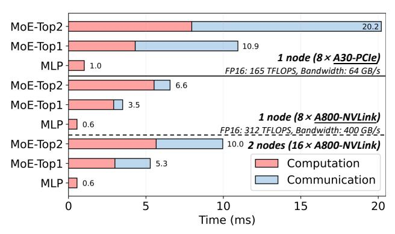
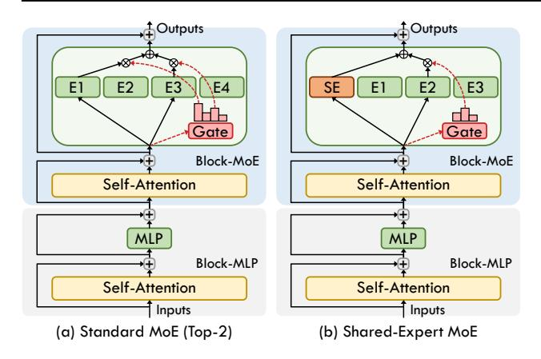
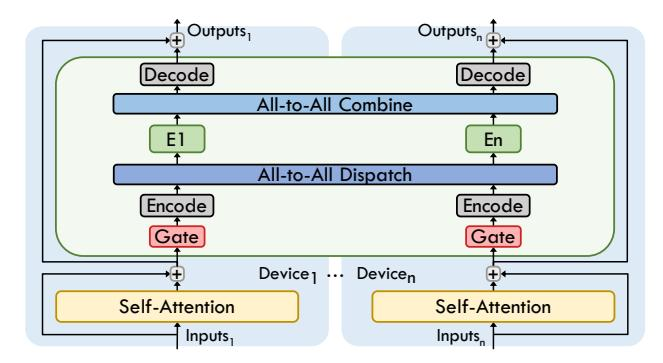
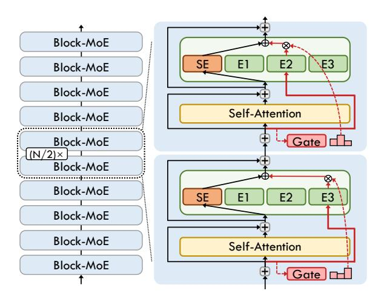
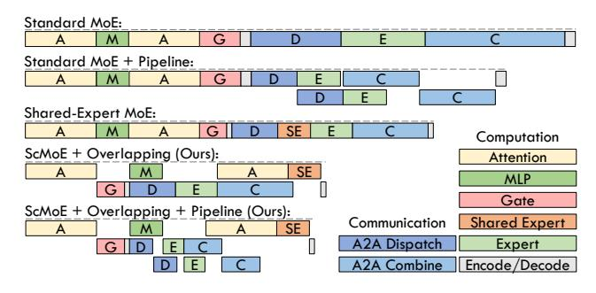

# 1. Introduction

In recent years, Transformer-based large language models (LLMs) have significantly propelled the fields of Natural Language Processing [\(Vaswani et al.,](#page-12-0) [2017;](#page-12-0) [Brown et al.,](#page-9-0) [2020;](#page-9-0) [Wei et al.,](#page-12-1) [2022b;](#page-12-1) [Ouyang et al.,](#page-11-0) [2022;](#page-11-0) [Wei et al.,](#page-12-2) [2022a;](#page-12-2) [Chowdhery et al.,](#page-9-1) [2023;](#page-9-1) [Achiam et al.,](#page-9-2) [2023\)](#page-9-2), Computer Vision [\(Dosovitskiy et al.,](#page-9-3) [2021;](#page-9-3) [Liu et al.,](#page-10-0) [2021\)](#page-10-0), and Multimodality [\(Lu et al.,](#page-10-1) [2019;](#page-10-1) [Zhou et al.,](#page-12-3) [2022;](#page-12-3) [Zhang](#page-12-4) [et al.,](#page-12-4) [2021;](#page-12-4) [Zhu et al.,](#page-12-5) [2023\)](#page-12-5). The sparsely-gated mixtureof-experts (MoE) approach has been integral in increasing parameter counts and enhancing model performance across various modalities [\(Shazeer et al.,](#page-11-1) [2017;](#page-11-1) [Riquelme](#page-11-2)

*Proceedings of the* 42 nd *[International Conference on Machine](#page-11-2) Learning*[, Vancouver, Canada. PMLR 267, 2025. Copyright 2025](#page-11-2) [by the author\(s\).](#page-11-2)

[et al.,](#page-11-2) [2021;](#page-11-2) [Mustafa et al.,](#page-10-2) [2022;](#page-10-2) [Jiang et al.,](#page-10-3) [2024\)](#page-10-3). Expert parallelism [\(Lepikhin et al.,](#page-10-4) [2021;](#page-10-4) [Fedus et al.,](#page-9-4) [2022\)](#page-9-4) has emerged as a viable strategy to efficiently distribute MoE computations over multiple devices, synergizing with conventional parallelism techniques [\(Hwang et al.,](#page-10-5) [2023;](#page-10-5) [Singh](#page-11-3) [et al.,](#page-11-3) [2023\)](#page-11-3) such as data parallelism [\(Rajbhandari et al.,](#page-11-4) [2020;](#page-11-4) [2021\)](#page-11-5) and model parallelism [\(Narayanan et al.,](#page-11-6) [2021;](#page-11-6) [Smith et al.,](#page-11-7) [2022\)](#page-11-7).

Nevertheless, expert parallelism incurs substantial *All-to-All communication* overhead [\(Lepikhin et al.,](#page-10-4) [2021;](#page-10-4) [Fedus](#page-9-4) [et al.,](#page-9-4) [2022\)](#page-9-4), which can contribute to approximately 50% of the total time in intra-node multi-GPUs or multi-nodes distributed environments (see Figure [1\)](#page-1-0), thus forming a critical bottleneck in scaling MoE models [\(Nie et al.,](#page-11-8) [2022;](#page-11-8) [Hwang et al.,](#page-10-5) [2023;](#page-10-5) [Mayer & Jacobsen,](#page-10-6) [2020;](#page-10-6) [Smith et al.,](#page-11-7) [2022\)](#page-11-7). Despite existing optimizations such as hierarchical All-to-All [\(He et al.,](#page-10-7) [2022;](#page-10-7) [Nie et al.,](#page-11-8) [2022\)](#page-11-8) and pipelining [\(Hwang et al.,](#page-10-5) [2023;](#page-10-5) [Zhang et al.,](#page-12-6) [2023\)](#page-12-6) strategies that mitigate communication delays and partially overlap communication with computation, the communication challenge persists due to the inherent sequential dependencies between these operations [\(Wang et al.,](#page-12-7) [2023\)](#page-12-7). To address this constraint, our intuitive idea is to reconstruct the inputs of MoE layer by incorporating not only the current-layer but also the preceding-layer representations through a shortcut connection, thereby refining the communication-computation dependencies and expanding the potential for their overlapping optimization.

In this paper, we propose the shortcut-connected MoE (Sc-MoE) architecture, which completely decouples communication processes from the sequence of conventional MoE models. ScMoE architecture is initially built on the standard top-2 MoE (see Figure [2](#page-2-0) (a)), which typically substitutes the multi-layer perceptron (MLP) module with a top-2 gating MoE module in every second Transformer block (refer to the Transformer block with the MoE module as "current layer", and the preceding one without the MoE module as "preceding layer"). Diverging from the top-2 approach, ScMoE utilizes a top-1 MoE module to process preceding-layer representations via a shortcut connection, while employing a shared expert (an MLP module) to process current-layer representations. These two processes are independently managed in parallel, with their results integrated into the final output of the current layer. Furthermore, the ScMoE

1[The Hong Kong University of Science and Technology](#page-11-2) [\(Guangzhou\). Correspondence to: Jiayi Huang](#page-11-2) <hjy@hkust[gz.edu.cn](#page-11-2)>.

Figure 1. The overhead of MLP and top-2/top-1 MoE in a transformer block of SwinV2-MoE-S [\(Hwang et al.,](#page-10-5) [2023\)](#page-10-5) model, allocating one expert per GPU with expert parallelism. The All-to-All communication takes up 60% of total time on a single node with 8×A30 GPUs, but drops to 15% on 8×A800 due to the latter's 6× higher bandwidth provided by GPU-to-GPU NVLink [\(Foley](#page-9-5) [& Danskin,](#page-9-5) [2017\)](#page-9-5). Despite benefiting from NVLink, communication still approaches 50% due to the lower-bandwidth inter-node Ethernet [\(Li et al.,](#page-10-8) [2020\)](#page-10-8) when scaling across multiple nodes.

architecture can be extended to accommodate MoE models that employ various MoE placement frequencies, such as integrating an MoE module into every Transformer block.

To efficiently overlap the decoupled communication and computation within the ScMoE architecture, we implement an adaptive overlapping parallel strategy that dynamically schedules operators based on actual performance metrics. Compared to existing optimization strategies such as pipelining [\(Huang et al.,](#page-10-9) [2019;](#page-10-9) [Hwang et al.,](#page-10-5) [2023\)](#page-10-5), our approach not only doubles the overlap duration, but also realizes complete overlapping of communication in scenarios where communication time does not exceed the computation duration. Furthermore, our method essentially advances the MoE architecture in algorithm aspect, which is device-agnostic to improve the efficiency of MoE model, thus ensuring a broad applicability across various hardware configurations and maintaining compatibility with current optimizations.

The experimental results reveal that, compared to the standard top-2 MoE, our proposed ScMoE architecture optimally accelerates training by 1.49× and 1.14× in 8×A30- PCIe and 8×A800-NVLink scenarios characterized by high and low communication overheads, respectively, and accelerates inference by 1.82× and 1.21×. Moreover, we perform experiments on different configurations of the Sc-MoE architecture, including shortcut-connected position and coefficient gating network. Considering the optimal accuracy and the relatively longer overlap duration, we favor selecting the intermediate representations between the Attention and MLP modules in the preceding layer as the input for the gate-routed experts. In addition, ScMoE has been demonstrated through experiments and theoretical analysis to attain or exceed the model quality of existing methods

in both vision and language downstream tasks. We also conduct an in-depth analysis and discussion of the ScMoE architecture, investigating the proposed shortcut connection and exploring opportunities for further development.

In summary, our contributions are as follows:

- We propose the shortcut-connected MoE (ScMoE) architecture that breaks the conventional dependency between communication and computation in distributed MoE models, bypassing the restrictions imposed on current communication optimization techniques.
- We develop an adaptive overlapping strategy for advancing expert parallelism with the shortcut-connected MoE, which significantly improves the efficiency of MoE models and ensures broad compatibility.
- We conduct empirical evaluation and theoretical analysis on our methods, confirming that our methods accelerate MoE models while achieving comparable or even better model quality compared to existing methods, and offer in-depth analysis and discussion on the effectiveness of the proposed shortcut connection.

## 2. Background & Related Work

#### 2.1. Sparsely-Gated Mixture of Experts

The sparsely-gated mixture-of-experts [\(Shazeer et al.,](#page-11-1) [2017\)](#page-11-1) (MoE) layer is composed of multiple multi-layer perceptron (MLP) sub-networks, termed "experts," and employs a trainable gating network to selectively activate a subset of these experts during each iteration. Given N expert networks {Ei} N 1 , gating network G and input representation x, the output of MoE module can be written:

$$MoE(x) = \sum_{i=1}^{N} G(x)_i E_i(x).$$
 (1)

Following the prevailing approach in existing MoE research, we use the noisy top-k softmax gating network to select k experts for the computation, formalized by

$$G(x) = Softmax(\overline{TopK}(H(x), k)), \tag{2}$$

$$\overline{TopK}(H(x),k)_i = \begin{cases} H(x)_i, & \text{if } H(x)_i \in TopK(H(x)). \\ -\infty, & \text{otherwise.} \end{cases}$$

(3) H(x)i = (x · Wgate)i + ϵi , (4)

$$\epsilon_i = StandardNormal() \cdot Softplus((x \cdot W_{noise})_i),$$
(5)

where ϵ is tunable Gaussian noise, Wgate and Wnoise denote two trainable weight matrices.

Leveraging sparse output of G(x), this approach significantly increases the number of model parameters without

Figure 2. Illustrations of the standard top-2 MoE architecture (a) and the corresponding shared-expert MoE architecture (b). "SE" in (b) denotes the shared expert.

causing a proportional increase in computational demand. The value of k can be set to 1 or 2 or even higher values. Opting for a larger k moves the model closer to the dense architecture, which generally results in higher prediction accuracy [\(Riquelme et al.,](#page-11-2) [2021\)](#page-11-2), but also leads to greater computational overhead.

Figure [2](#page-2-0) (a) illustrates the prevailing top-2 MoE architecture. Each Transformer block with MoE module, denoted by a light blue block and referred to as "Block-MoE," replaces the MLP with a set of experts ("E1, E2, E3, E4") and a gating network ("Gate"). Following prior work [\(Lepikhin](#page-10-4) [et al.,](#page-10-4) [2021;](#page-10-4) [Du et al.,](#page-9-6) [2022;](#page-9-6) [Shen et al.,](#page-11-9) [2023;](#page-11-9) [Hwang et al.,](#page-10-5) [2023;](#page-10-5) [Lieber et al.,](#page-10-10) [2025\)](#page-10-10), the "Block-MoE" is interspersed with the conventional Transformer block, depicted as a gray block and referred to as "Block-MLP." Additionally, various options exist for the frequency of MoE module placement, including placing an MoE module into every block [\(Jiang](#page-10-3) [et al.,](#page-10-3) [2024;](#page-10-3) [Dai et al.,](#page-9-7) [2024;](#page-9-7) [Qwen,](#page-11-10) [2024;](#page-11-10) [Databricks,](#page-9-8) [2024\)](#page-9-8) or every four blocks [\(Zoph et al.,](#page-12-8) [2022;](#page-12-8) [Xue et al.,](#page-12-9) [2024\)](#page-12-9).

Shared Expert. In contrast to the standard top-2 MoE architecture, the shared-expert MoE incorporates a fixed dense MLP module to process all input tokens, combining its output with the result from the top-1 gating expert for each token, as illustrated in Figure [2](#page-2-0) (b). Given the shared expert SE, the output of the MoE module is formulated as:

$$MoE(x) = SE(x) + \sum_{i=1}^{N} G(x)_i E_i(x).$$
 (6)

This method, originally proposed by DeepSpeed-MoE [\(Ra](#page-11-11)[jbhandari et al.,](#page-11-11) [2022\)](#page-11-11), activates the same number of experts as the standard MoE for computation while reducing dynamic expert selection and communication volume. Extensive empirical results from DeepSpeed-MoE and subsequent studies [\(Dai et al.,](#page-9-7) [2024;](#page-9-7) [Qwen,](#page-11-10) [2024\)](#page-11-10) demonstrate that the shared expert architecture achieves model quality that is on

Figure 3. Illustration of scaling MoE transformer layer across multiple devices with expert parallelism.

par with or even superior to existing approaches, leading to its growing adoption [\(Xue et al.,](#page-12-9) [2024;](#page-12-9) [Wu et al.,](#page-12-10) [2023;](#page-12-10) [Chen et al.,](#page-9-9) [2024;](#page-9-9) [Gou et al.,](#page-10-11) [2023;](#page-10-11) [Gao et al.,](#page-10-12) [2024\)](#page-10-12).

#### 2.2. Expert Parallelism

To facilitate efficient distributed training and inference of MoE models, expert parallelism is proposed to allocate unique experts to each distributed computing device such as GPU and TPU, and map tokens to their corresponding experts through All-to-All communication across participating devices [\(Lepikhin et al.,](#page-10-4) [2021;](#page-10-4) [He et al.,](#page-10-13) [2021;](#page-10-13) [Nie](#page-11-8) [et al.,](#page-11-8) [2022\)](#page-11-8). As illustrated in Figure [3,](#page-2-1) the workflow of MoE employing expert parallelism is segmented into the following sequential operations: gate routing, input encode, All-to-All dispatch, expert computation, All-to-All combine, and output decode. To enhance the efficiency, input encode is employed to aggregate the token data layout to a contiguous format before All-to-All dispatch, and output decode is the inverse process after All-to-All combine. Furthermore, the integration of expert parallelism with other parallelisms [\(Hwang et al.,](#page-10-5) [2023;](#page-10-5) [Singh et al.,](#page-11-3) [2023;](#page-11-3) [Fedus](#page-9-4) [et al.,](#page-9-4) [2022;](#page-9-4) [Zheng et al.,](#page-12-11) [2022\)](#page-12-11) has been explored to support the scaling of larger MoE models on extensive distributed systems. However, the All-to-All communication used for token transfer has been a primary bottleneck limiting the efficiency of distributed MoE models, as shown in Figure [1.](#page-1-0)

## 3. Shortcut-connected MoE Designs

In the prevailing Transformer-based model, the MoE module substitutes MLP to sequentially manipulate intermediate representations [\(Lepikhin et al.,](#page-10-4) [2021;](#page-10-4) [Du et al.,](#page-9-6) [2022;](#page-9-6) [Shen](#page-11-9) [et al.,](#page-11-9) [2023\)](#page-11-9), impeding the efficacy of existing optimization strategies [\(He et al.,](#page-10-7) [2022;](#page-10-7) [Nie et al.,](#page-11-8) [2022;](#page-11-8) [Hwang et al.,](#page-10-5) [2023;](#page-10-5) [Zhang et al.,](#page-12-6) [2023\)](#page-12-6) due to the limited interaction within the MoE module. To address the aforementioned limitations, we propose the shortcut-connected MoE (ScMoE) architecture, which enables optimization opportunities for computation-communication overlap for expert parallelism.

Figure 4. Illustrations of various ScMoE architectures with shortcut connections to different positions of the preceding layer: (a) "Pos-1" output, (b) "Pos-2" intermediate, and (c) "Pos-3" input. The red line indicates the transmission of the preceding-layer representations to the MoE via a shortcut connection. Details regarding pre-layer normalization and dropout procedures have been excluded for simplicity.

#### 3.1. Architectural Design

In this section, we introduce the shortcut-connected MoE (ScMoE) architecture. Unlike the prevailing MoE architectures, illustrated in Figure 2, which focus on processing intermediate representations within the current layer (the Transformer block containing the MoE), the ScMoE processes representations from both the current and preceding layers. Specifically, ScMoE employs a top-1 MoE module to handle representations from the preceding layer via a shortcut connection, while a shared expert processes the current-layer representations. These two operations are conducted independently, with their outcomes integrated into the final output of the current layer, facilitating communication and computation overlap between these two processes.

While the shared expert processes the same intermediate representations in the current layer as the prevailing MoE approaches, we explore three distinct preceding-layer representations for ScMoE's top-1 MoE process, as illustrated in Figure 4. The configurations "Pos-1" (a), "Pos-2" (b), and "Pos-3" (c) represent shortcuts connecting different positions of the preceding layer: output, intermediate, and input, respectively. Given that  $\mathcal{T}_{Atten}$ ,  $\mathcal{T}_{SE}$ , and  $\mathcal{T}_{MLP}$  represent the durations of Attention, Shared Expert, and MLP, respectively, the corresponding overlap durations are (a)  $\mathcal{T}_{Atten} + \mathcal{T}_{SE}$ , (b)  $\mathcal{T}_{Atten} + \mathcal{T}_{SE} + \mathcal{T}_{MLP}$ , (c)  $2\mathcal{T}_{Atten} + \mathcal{T}_{SE} + \mathcal{T}_{MLP}$ .

Using the "Pos-2" configuration as an example, this ScMoE architecture can be formulated as follows:

#### Block-MoE:

$$\mathcal{H}_{l+1}^{\text{ScMoE}} = \mathcal{H}_{l+1}^{MH} + SE^{(l+1)}(\mathcal{H}_{l+1}^{MH}) + \sum_{i=1}^{N} G(\mathcal{H}_{l}^{MH})_{i} E_{i}(\mathcal{H}_{l}^{MH}),$$
(7)

$$\mathcal{H}_{l+1}^{MH} = \mathcal{H}_{l}^{MLP} + \text{MultiHead}_{MoE}^{(l+1)}(\mathcal{H}_{l}^{MLP}), \quad (8)$$

#### Block-MLP:

$$\mathcal{H}_{l}^{MLP} = \mathcal{H}_{l}^{MH} + \text{MLP}^{(l)}(\mathcal{H}_{l}^{MH}), \tag{9}$$

$$\mathcal{H}_{l}^{MH} = \mathcal{H}_{l-1} + \text{MultiHead}_{MLP}^{(l)}(\mathcal{H}_{l-1}), \quad (10)$$

where  $\mathcal{H}_{l+1}^{\text{ScMoE}}$  refers to the output from the MoE sub-layer,  $\mathcal{H}_{l+1}^{MH}$  signifies the output from the Multi-Head Attention (MultiHead) sub-layer MultiHead $_{MoE}^{(l+1)}(\cdot)$  in the (l+1)-th Transformer block ("Block-MoE").  $SE^{(l+1)}(\cdot)$  denotes the shared expert while  $E_1,...,E_N$  represent the N gaterouted experts. The gating network  $G(\cdot)$  is referred to as Equation 2.  $\mathcal{H}_l^{MLP}$  and  $\mathcal{H}_l^{MH}$  are the outputs of the MLP sub-layer MLP $^{(l)}(\cdot)$  and the MultiHead sub-layer MultiHead $_{MLP}^{(l)}(\cdot)$ , respectively, in the l-th Transformer block ("Block-MLP"). Note that we omit the pre-layer normalization and dropout for simplicity.

In our experiments involving three shortcut-connected positions, models configured with "Pos-2" achieve the highest accuracy in both vision and language cases, while also ensuring substantial overlap duration. As a result, we favor selecting "Pos-2" for practical development. Moreover ,the "Pos-2" configuration is used to elucidate the overlapping strategy in Section 3.2. The specifics of the other two configurations can be inferred by analogy.

Additionally, our proposed ScMoE architecture can be adapted to support MoE models with varying MoE placement frequencies. As illustrated in Figure 5, the ScMoE architecture can be integrated into MoE models that incorporate an MoE module into every Transformer block. With more frequent MoE placement, the potential overlap duration for each MoE module is minimized, and the "Pos-1" configuration has already fully utilized the computation duration for the overlap. Conversely, less frequent MoE placement extends the potential overlap duration for each MoE module, which may lead to increased acceleration.

Figure 5. Illustration showcasing the application of the ScMoE (Pos-1) architecture to the MoE model, wherein the MoE module is integrated into each Transformer block.

#### 3.2. Overlapping Strategy for Expert Parallelism

As mentioned in the previous section, the MoE operations in ScMoE architecture are completely decoupled from the backbone network, enabling parallel execution across two independent streams: one for the shared expert process and the other for the MoE process. To enhance efficiency, we implement asynchronous All-to-All communication operators to enable the overlapping of communication and computation within these streams, while computation operators are unable to execute concurrently due to the constraints on computing resources.

**Adaptive Operators Scheduling.** We observe that operator execution times are influenced by the specific model and hardware configuration, necessitating the implementation of adaptive scheduling for operators.

Following the execution order in the MoE stream, we can directly schedule the gate routing and encode operators at the earliest viable position while deferring the decode operator to the latest position, thereby maximizing the potential duration for overlapping. Then, this challenge is distilled into the selection of an optimal position for expert computation among four possible locations ①②③④ within the shared expert stream, as depicted in Figure 6.

Formally, we define the communication costs associated with "All-to-All Dispatch" and "All-to-All Combine" as  $\mathcal{T}_{disp}$  and  $\mathcal{T}_{comb}$ , respectively. The variable  $\mathcal{K}$  is designated to represent the specific location where expert computation is applied. Prior to the expert computation, the computational costs are denoted as  $\mathcal{T}_{comp}^{pre} := \{COMP_1, ..., COMP_{\mathcal{K}-1}\}$ , while the costs following the expert computation are represented as  $\mathcal{T}_{comp}^{post} := \{COMP_{\mathcal{K}+1}, ..., COMP_4\}$ . Consequently, the minimal aggregate time cost for each pair consisting of one Block-

Figure 6. An overview of advanced expert parallelism using our proposed ScMoE architecture and overlapping strategy. The red line represents the decoupled MoE stream and the numbers ① through ④ denote the potential locations for expert computation.

Figure 7. The timeline of different MoE architectures with corresponding parallel strategies, including pipeline and our proposed overlapping strategy. In each timeline, the length of each operator represents its time cost, while multiple rows indicate the utilization of parallel CUDA streams. The standard MoE utilizes top-2 gating, whereas the shared-expert MoE and ScMoE activate one shared expert alongside one gate-routed expert.

## MLP and one Block-MoE is

$$\mathcal{T}_{overall}^{block} = \min_{\mathcal{K}} (|\mathcal{T}_{comp}^{pre} - \mathcal{T}_{disp}| + |\mathcal{T}_{comp}^{post} - \mathcal{T}_{comb}|)$$

$$= \min_{\mathcal{K}} (|\sum_{i=1}^{\mathcal{K}-1} COMP_i - \mathcal{T}_{disp}| + |\sum_{i=\mathcal{K}+1}^{4} COMP_i - \mathcal{T}_{comb}|),$$

$$\mathcal{T}_{overall}^{block} \ge |(\mathcal{T}_{comp}^{pre} + \mathcal{T}_{comp}^{post}) - (\mathcal{T}_{disp} + \mathcal{T}_{comb})|,$$

$$\mathcal{T}_{overall}^{block} \le (\mathcal{T}_{comp}^{pre} + \mathcal{T}_{comp}^{post}) + (\mathcal{T}_{disp} + \mathcal{T}_{comb}).$$

$$(11)$$

To demonstrate the efficiency, we have illustrated the operational timelines of various MoE architectures alongside their respective parallel strategies in Figure 7, exemplified by the selection of location ② for expert computation. Each timeline's operator length corresponds to its execution time, and the presence of multiple rows signifies the utilization of parallel CUDA streams.

The widely-used pipeline parallel strategy equally segments input tokens into smaller fine-grained chunks, enabling concurrent computation and communication dispatched on distinct GPU streams [\(Hwang et al.,](#page-10-5) [2023;](#page-10-5) [Zhang et al.,](#page-12-6) [2023\)](#page-12-6). Contrary to standard MoE with pipelining (*2nd timeline*), our proposed ScMoE with the overlapping strategy (*4th timeline*) significantly reduces the total time. This reduction is attributed to the decrease in absolute communication time, similar to that in the shared-expert MoE (*3rd timeline*), and the overlap of communication with the computation duration (T Atten + T SE + TMLP ), which extends beyond the overlap duration achieved through pipelining.

Our strategy possesses the capability to fully overlap communication if the communication can be accommodated within the overlapping window. This advantage is not shared by the pipeline strategy as it cannot overlap the initial and terminal data transmissions [\(Huang et al.,](#page-10-9) [2019;](#page-10-9) [Narayanan](#page-11-12) [et al.,](#page-11-12) [2019\)](#page-11-12). In cases where communication durations exceed the available overlap duration, our strategy can be augmented with pipelining (*5th timeline*), thus utilizing the expert computation duration to further hide communication.

