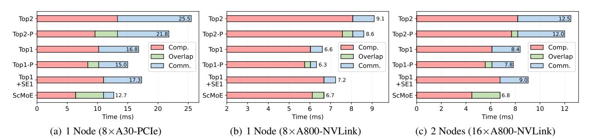

# 4. Experiments

#### 4.1. Experimental Setup

To assess the effectiveness of our proposed overlapping strategy for enhancing expert parallelism, we conduct experiments on three hardware configurations: 8×A30-PCIe, 8×A800-NVLink, and 16×A800-NVLink (across 2 nodes). These configurations cover scenarios with both high and low communication-to-computation ratios. Furthermore, we evaluated our methods using both vision models (SwinV2- MoE) [\(Hwang et al.,](#page-10-5) [2023\)](#page-10-5) and language models (GPT2- MoE, GPT3-MoE, LLaMA2-MoE) [\(Radford et al.,](#page-11-13) [2019;](#page-11-13) [Brown et al.,](#page-9-0) [2020;](#page-9-0) [Touvron et al.,](#page-12-12) [2023\)](#page-12-12). Additional details on the experimental setup are provided in Appendix [A.8.](#page-16-0)

#### 4.2. Analysis of Model Quality and Efficiency

In this section, we assess the quality of the models with our proposed ScMoE architecture. Furthermore, we evaluate the efficiency of ScMoE models in distributed scenarios, which are accelerated through our proposed overlapping strategy for enhancing expert parallelism. To maintain the same computational volume as the standard top-2 MoE, both the experimental shared-expert MoE and our ScMoE utilize one shared expert and one gate-routed expert.

## 4.2.1. VISION MODEL

Table [1](#page-5-0) shows that ScMoE (Pos-2) and the standard top-2 MoE attain a comparable accuracy of 79.3%, while the shared-expert MoE delivers the highest accuracy, with a marginal increase of 0.2%. In 8×A30-PCIe where communication overhead accounts for 60% of the total MoE time, ScMoE (Pos-2) exhibits 30% speed improvement in training and 40% in inference compared to the standard top-2 MoE.

Table 1. Test top-1 accuracy and end-to-end speedup of train and inference (one iteration) for SwinV2-MoE-S [\(Hwang et al.,](#page-10-5) [2023\)](#page-10-5) models with various architectures pre-trained on ImageNet-1K for 90 epochs in the 8×A30-PCIe scenario, using standard MoE with top-2 gating as the baseline.

| Model              | ImageNet-1K | Train      | Inference  |
|--------------------|-------------|------------|------------|
|                    | (Acc@1↑)    | (Speedup↑) | (Speedup↑) |
| Standard top-2 MoE | 79.33%      | 1          | 1          |
| Standard top-1 MoE | 78.95%      | 1.27×      | 1.39×      |
| Shared-Expert MoE  | 79.53%      | 1.24×      | 1.35×      |
| Our ScMoE (Pos-1)  | 79.14%      | 1.36×      | 1.54×      |
| Our ScMoE (Pos-2)  | 79.38%      | 1.43×      | 1.66×      |
| Our ScMoE (Pos-3)  | 79.20%      | 1.49×      | 1.82×      |

In scenarios characterized by a high communication-tocomputation ratio, where communication is hard to be completely overlapped by computation, ScMoE architectures with extended overlap durations can achieve superior speedup. Specifically, ScMoE (Pos-3), which has the longest overlap duration of TAtten+TSE +TMLP , achieves the highest acceleration, with a 1.49× speedup in training and a 1.82× speedup in inference. Furthermore, the three different ScMoE architectures result in minimal variations in accuracy, ranging from 79.14% to 79.38%. Additionally, these methods, which utilize two activated experts, consistently outperform the standard top-1 MoE in terms of model quality, as the top-1 approach activates fewer parameters.

## 4.2.2. LANGUAGE MODEL

To demonstrate the effectiveness of our proposed ScMoE architecture in models with two prevailing MoE placement frequency designs, we perform experiments using the GPT2- MoE-Medium and LLaMA2-MoE models, positioning the MoE module in every second Transformer block for GPT2- MoE and in every Transformer block for LLaMA2-MoE. Specifically, we utilize the ScMoE architecture with the configuration of "Pos-2" on the GPT2-MoE model, since this setup yields the lowest final validation loss in our experiments across various shortcut-connected positions, as discussed in Section [5.2.](#page-8-0) Furthermore, the ScMoE in LLaMA2- MoE adopts the "Pos-1" configuration, as this setup has already maximized the potential overlap duration in the scenario of MoE placement in every block.

As shown in Table [2,](#page-6-0) our ScMoE models achieve the highest average scores, with 38.69 in GPT2-MoE and 38.96 in LLaMA2-MoE. Furthermore, when integrated with our ScMoE, GPT2-MoE experienced an 11% improvement in training speed and an 15% improvement in inference speed compared to the standard top-2 MoE, in the 8×A800- NVLink scenario where communication accounts for 15% of the total MoE time. In LLaMA2-MoE, our ScMoE accelerated training by 1.14× and inference by 1.21×, demonstrating superior efficiency compared to other methods.

Model Method Train Inference HellaSwag PIQA WinoGrande BoolQ ARC-E **OBQA** RACE MathQA AVG.(↑) Standard top-2 27.53 59.19 48.62 59.72 38.43 25.20 23.83 20.37 37.86 GPT2-MoE Shared-Expert  $1.04 \times$ 1.06× 27 23 59.09 51.22 60.00 38.85 26.60 25.07 20.57 38 58 Our ScMoE 1.12× 1.17× 27.70 59.25 52.09 60.76 39.23 25.40 24.98 20.10 38.69 58.26 28.40 60.07 50.83 38.72 24.60 25.17 21.07 38.39 Standard top-2 1 LLaMA2-MoE 25.45 Shared-Expert 1.06× 1.11× 29.08 60.01 50.91 60.92 38.59 24.80 20.80 38.82 29.09 51.38 26.40 Our ScMoE 1.14× 60.55 57.25 38.89 27.08 21.07 38.96 1.21×

Table 2. Comparison of zero-shot evaluation and end-to-end speedup of training and inference (one iteration) for the pre-trained GPT2-MoE and LLaMA2-MoE models with various architectures in the 8×A800-NVLink scenario, using standard top-2 MoE as the baseline.

Figure 8. Overhead analysis for each pair of Block-MLP and Block-MoE within SwinV2-MoE-S model, deployed across three different distributed scenarios. "Topk" denotes the standard top-k MoE, while the one followed by the suffix "P" indicates using pipeline optimization as implemented by Tutel (Hwang et al., 2023). "Top1+SE1" refers to the shared-expert MoE.

#### 4.2.3. Analysis of Overhead and Acceleration

In addition to exhibiting the end-to-end speedup of ScMoE in Tables 1 and 2, we delve into a detailed analysis of the overhead and the acceleration effect with our overlapping strategy, which can be generalized to other MoE models.

In the communication-intensive 8×A30-PCIe scenario (Figure 8(a)), our ScMoE overlaps 70% communication time, resulting in a 27% speed improvement over shared-expert MoE, a 42% improvement over the pipelined standard top-2 MoE, and a 15% improvement over the pipelined standard top-1 MoE. In the 8×A800-NVLink scenario (Figure 8(b)), which features almost minimal communication overhead, our approach maintains its acceleration by fully overlapping.

In multi-node scenario (Figure 8(c)), with 16×A800-NVLink across two nodes, communication incurs more significant overhead than in the single-node 8×A800-NVLink scenario due to the lower-bandwidth inter-node Ethernet (Li et al., 2020). Here, our ScMoE achieves complete overlap, resulting in a 24% speed improvement over the shared-expert MoE, a 43% improvement over the pipelined standard top-2.

In general, our ScMoE delivers a significant acceleration over the standard top-2 MoE, and even outperforms the top-1 MoE when communication exceeds approximately 20% of the total MoE time. Additionally, our ScMoE can fully overlap communication in scenarios where communication does not exceed an estimated 50% of the total MoE time.

#### 5. Discussion

The empirical results presented in Section 4.2 have demonstrated that our proposed ScMoE architecture facilitates efficiency optimizations without compromising model quality. Subsequently, we delve into a more thorough examination of the proposed shortcut connection, uncovering potential underlying reasons for its algorithmic effectiveness, and identifying opportunities for further development.

#### 5.1. Delve into the Proposed Shortcut Connection

#### 5.1.1. Analysis of Gating Behaviors

Firstly, we investigate the use of the same MoE module to select the top-1 expert twice for processing each input token's current-layer and preceding-layer representations, respectively. As illustrated in Figure 9(a), we observe that the same gating network typically selects the same expert for the two representations of most tokens. As the training progresses, the token percentage of repeating selection initially escalates, peaking at 98%, and then diminishes, with a significant drop manifested in the last MoE sub-layer.

Next, we measure the L2 distance (similarity) between each token's preceding-layer and current-layer representations. Figure 9(b) illustrates that, as training advances, the L2 distance initially decreases with network depth, then increases, and ultimately reaches its maximum value in the final layer. Since the gating network is used to classify the representa-

Figure 9. Results from the analysis of the proposed shortcut connection, during the 90-epoch training (including a 10-epoch warm-up) of the SwinV2-MoE-S model (Hwang et al., 2023). Employing the same MoE module to select the top-1 expert twice for processing each input token's two representations from the current and preceding layers, respectively, (a) illustrates the percentage of tokens that retain the same expert selection across the current layer and preceding layer, (b) shows the L2 distance between these two representations. Using the DGMoE, which imposes a constraint against repeatedly selecting the same expert, (c) presents the average gating score for the preceding-layer representations, (d) displays the average gating score for the current-layer representations.

tions, this similarity may lead to the repeated selection of the same experts, as evidenced by the correlation between the results in Figure 9(a) and 9(b).

Furthermore, we trained an experimental MoE model incorporating specialized MoE modules that select the top-1 expert twice for processing each input token's current-layer and preceding-layer representations. We observe that this experimental architecture achieves a model quality equivalent to the standard top-1 MoE, despite incurring the same computational cost as the top-2 MoE. Interestingly, this architecture can achieve model quality comparable to the standard top-2 MoE by imposing a constraint on the MoE module that ensures the selection of a different expert for the current layer than for the preceding layer. We refer to this enhanced experimental architecture as DoubleGating MoE (DGMoE), with further details provided in Appendix A.2. With this constraint, we observe gating score behaviors are similar to those of the standard top-2 MoE (Riquelme et al., 2021), as illustrated in Figure 9(c) and 9(d).

#### 5.1.2. Analysis of Similarity in Representations

Based on the observations mentioned above, we believe that the similarity between each token's preceding-layer and current-layer representations is crucial to understanding these outcomes and validating the effectiveness of our proposed ScMoE model. Assuming that the representations of the preceding layer and the current layer are identical, utilizing the same expert to process these two representations is equivalent to employing a single expert to process only the current-layer representations, thereby resulting in model quality comparable to that of the standard top-1 MoE. On the other hand, assigning distinct experts to the two representations of each token is equivalent to activating two experts to process the current-layer representations, thereby achieving model quality similar to that of the standard top-2.

Figure 10. Analysis of cosine similarity in intermediate representations. The representations include the input to the first layer (denoted as 'In') and the outputs of the Attention (e.g., '1A') and MLP/MoE (e.g., '1M') sublayers within each Transformer block.

Moreover, we analyze the similarities in the intermediate representations of the Swin-MoE-Small and GPT2-MoE-Medium models, which use the standard top-2 MoE, as illustrated in Figure 10(a) and 10(b). It is evident that the representations from adjacent Transformer blocks exhibit a cosine similarity close to 1.0, highlighting their high degree of similarity. Consequently, our proposed ScMoE architecture assigns distinct experts to the two representations of each token (a shared expert for current-layer representations and routed experts for preceding-layer representations), thereby preserving behavior akin to the standard top-2 and shared-expert MoE architectures and ensuring comparable model quality. Similar observations in LLaMA2-MoE and OLMoE (Muennighoff et al., 2024), as demonstrated in Appendix A.9, further confirm the generalizability of our ScMoE to other models.

In addition, we provide a theoretical analysis of our proposed ScMoE architecture in Appendix A.1, elucidating the propagation of gradients to guarantee consistent training and preserve model quality.

#### 5.2. Configuration of ScMoE Architecture

Coefficient Gating Network. In contrast to the gate-routed expert, the shared expert is fixed to process all representations without computing a gating score through the gating network. Therefore, some work [\(Qwen,](#page-11-10) [2024;](#page-11-10) [Rajbhan](#page-11-11)[dari et al.,](#page-11-11) [2022\)](#page-11-11) employs a coefficient gating network CG to generate the coefficient for combining the outputs of gate-routed and shared experts. Specifically, the coefficient gating network is a linear layer that uses the MoE module's input representation as its input to generate the coefficient.

We conduct experiments on ScMoE using three distinct methods for combining the outputs of gate-routed experts and shared experts: (1) Direct Add, (2) CG-1, and (3) CG-2. The Direct Add method, indicated by Equation [6,](#page-2-2) involves directly summing the outputs from both the shared expert and the gate-routed expert. For each input token x ∈ R n, the MoE outputs using CG-1 and CG-2, which generate coefficients for the combination, can be expressed as follows: CG*-1:*

$$coef = Sigmoid(W_{CG} \cdot x), \quad W_{CG} \in \mathbb{R}^{1 \times n}, \quad (14)$$

$$MoE(x) = \operatorname{coef} \cdot SE(x) + \sum_{i=1}^{N} G(x)_{i} E_{i}(x), \quad (15)$$

CG*-2:*

$$coef = softmax(W_{CG} \cdot x), \quad W_{CG} \in \mathbb{R}^{2 \times n}, \quad (16)$$
$$MoE(x) = coef[0] \cdot SE(x) + coef[1] \cdot \sum_{i=1}^{N} G(x)_{i} E_{i}(x).$$

As shown in Table [3,](#page-8-1) the configuration of CG-1 achieves the lowest final validation loss among the three combination methods, all of which are set to Pos-2. Moreover, ScMoE models with three configurations consistently outperform both the standard top-2 and the shared-expert MoE (configured with CG-2 according to [\(Rajbhandari et al.,](#page-11-11) [2022\)](#page-11-11)).

Shortcut-connected Position. While the Pos-1 configuration can maximize the potential overlap duration when MoE is placed in every block, using different configurations of shortcut-connected positions (Pos-1, Pos-2 or Pos-3) when placing MoE in every second block will result in variations in overlap duration and model quality. Therefore, we conduct experiments to identify its optimal configuration.

As shown in Table [3,](#page-8-1) ScMoE (Pos-2) achieves the lowest final validation loss among the configurations tested, all of which utilize the CG-1 setup. This outcome mirrors the findings from the vision experiments detailed in Table [1,](#page-5-0) where Pos-2 also delivers the highest accuracy.

As illustrated in Figure [10\(b\),](#page-7-5) the input and intermediate representations of the first layer differ significantly from those of subsequent layers, with the MLP/MoE altering the representations more substantially than Attention. Therefore, we explore modifying the first MoE module to utilize

Table 3. Comparison of the final validation loss of GPT-2 MoE pre-training across various MoE methods and configurations.

| MoE Method           | Configuration                               | Final Validation loss (↓)                    |
|----------------------|---------------------------------------------|----------------------------------------------|
| Standard top-2 MoE   | -                                           | 3.270405                                     |
| Shared-Expert MoE    | -                                           | 3.240592                                     |
| Our ScMoE (Pos-2) | Direct Add CG-1 CG-2                  | 3.236811 3.224763 3.232943             |
| Our ScMoE (CG-1)  | Pos-1 Pos-2 Pos-3 Pos-2 (L0 Pos-1) | 3.237530 3.224763 3.241349 3.225626 |

Pos-1 while the remaining modules employ Pos-2, a configuration referred to as Pos-2 (L0 Pos-1). This setup results in a slightly higher loss compared to Pos-2 alone. Observations of varying shortcut-connected positions reveal that the superior performance of Pos-2 suggests the model quality of ScMoE is not necessarily improved by connecting more similar or dissimilar intermediate representations.

Consequently, we select the ScMoE configuration of CG-1 and Pos-2 for the experimental GPT2-MoE model, with its evaluations presented in Table [2.](#page-6-0)

## 5.3. Optimization for Memory-Limited Inference

Existing studies [\(Hwang et al.,](#page-10-15) [2024;](#page-10-15) [Yi et al.,](#page-12-13) [2023\)](#page-12-13) offload expert parameters to CPU memory in memory-limited inference scenarios where GPU cannot store the full MoE model. These studies utilize information in preceding layers to predict expert selection for the current MoE layer, enabling early expert migration from CPU to GPU and overlapping it with model computation. In contrast to existing speculative expert migration methods, we implement an expert offloading strategy with overlapping determinate migration, built upon our ScMoE that inherently advances expert selection to the preceding layer. The experimental results demonstrate that our expert offloading strategy reduces peak GPU memory usage by up to 60% and decreases expert migration costs by up to 75% through overlapping with computation. More details are shown in Appendix [A.3.](#page-14-0)

## 6. Conclusion

The inherent dependency between communication and computation in conventional distributed MoE models hinders parallel optimization techniques to improve execution efficiency. To address this, we propose a shortcut-connected MoE (ScMoE) architecture, and develop a communication overlapping parallel strategy. Through empirical evaluation and theoretical analysis, our approaches demonstrate better execution efficiency while maintaining or exceeding the model quality of existing methods. In addition, we provide an insightful analysis and discussion of ScMoE.

(17)

## Acknowledgements

We thank the anonymous reviewers for their valuable comments. This work was supported in part by the Guangdong Provincial Project (No. 2023QN10X252), the Guangdong Basic and Applied Basic Research Foundation (No. 2023A1515110353), and GDIC. This research was conducted on the High-Performance Computing Platform of HKUST(GZ).

