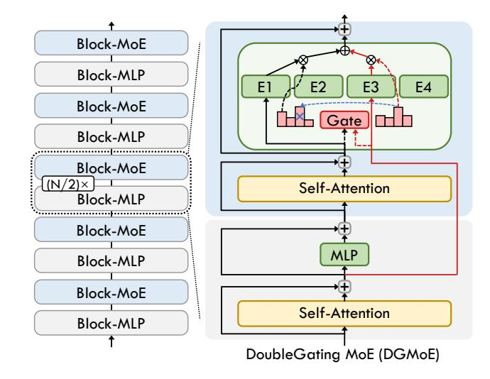

# Impact Statement

This paper presents work whose goal is to advance the field of Machine Learning. There are many potential societal consequences of our work, none which we feel must be specifically highlighted here.

## References

- Achiam, J., Adler, S., Agarwal, S., Ahmad, L., Akkaya, I., Aleman, F. L., Almeida, D., Altenschmidt, J., Altman, S., Anadkat, S., et al. GPT-4 Technical Report. *arXiv preprint arXiv:2303.08774*, 2023.
- Amini, A., Gabriel, S., Lin, S., Koncel-Kedziorski, R., Choi, Y., and Hajishirzi, H. MathQA: Towards Interpretable Math Word Problem Solving with Operation-Based Formalisms. In *Proceedings of the 2019 Conference of the North American Chapter of the Association for Computational Linguistics: Human Language Technologies, Volume 1 (Long and Short Papers)*, pp. 2357–2367, 2019.
- Bisk, Y., Zellers, R., Gao, J., Choi, Y., et al. PIQA: Reasoning about Physical Commonsense in Natural Language. In *Proceedings of the AAAI Conference on Artificial Intelligence*, volume 34, pp. 7432–7439, 2020.
- Brown, T., Mann, B., Ryder, N., Subbiah, M., Kaplan, J. D., Dhariwal, P., Neelakantan, A., Shyam, P., Sastry, G., Askell, A., et al. Language Models Are Few-Shot Learners. *Advances in Neural Information Processing Systems*, 33:1877–1901, 2020.
- Chen, S., Jie, Z., and Ma, L. LLaVa-MoLE: Sparse Mixture of LoRA Experts for Mitigating Data Conflicts in Instruction Finetuning MLLMs. *arXiv preprint arXiv:2401.16160*, 2024.
- Chowdhery, A., Narang, S., Devlin, J., Bosma, M., Mishra, G., Roberts, A., Barham, P., Chung, H. W., Sutton, C., Gehrmann, S., et al. PaLM: Scaling Language Modeling with Pathways. *Journal of Machine Learning Research*, 24(240):1–113, 2023.
- Clark, C., Lee, K., Chang, M.-W., Kwiatkowski, T., Collins, M., and Toutanova, K. BoolQ: Exploring the Surprising Difficulty of Natural Yes/No Questions. In *Proceedings*

- *of the 2019 Conference of the North American Chapter of the Association for Computational Linguistics: Human Language Technologies, Volume 1 (Long and Short Papers)*, pp. 2924–2936, 2019.
- Clark, P., Cowhey, I., Etzioni, O., Khot, T., Sabharwal, A., Schoenick, C., and Tafjord, O. Think you have Solved Question Answering? Try ARC, the AI2 Reasoning Challenge. *arXiv preprint arXiv:1803.05457*, 2018.
- Dai, D., Deng, C., Zhao, C., Xu, R., Gao, H., Chen, D., Li, J., Zeng, W., Yu, X., Wu, Y., et al. DeepSeekMoE: Towards Ultimate Expert Specialization in Mixture-of-Experts Language Models. In *Proceedings of the 62nd Annual Meeting of the Association for Computational Linguistics (Volume 1: Long Papers)*, pp. 1280–1297, 2024.
- Databricks. Introducing DBRX: A New Stateof-the-Art Open LLM, March 2024. URL [https://www.databricks.com/blog/](https://www.databricks.com/blog/introducing-dbrx-new-state-art-open-llm) [introducing-dbrx-new-state-art-open-llm](https://www.databricks.com/blog/introducing-dbrx-new-state-art-open-llm).
- Dehghani, M., Gouws, S., Vinyals, O., Uszkoreit, J., and Kaiser, L. Universal Transformers. In *International Conference on Learning Representations*, 2018.
- Dosovitskiy, A., Beyer, L., Kolesnikov, A., Weissenborn, D., Zhai, X., Unterthiner, T., Dehghani, M., Minderer, M., Heigold, G., Gelly, S., Uszkoreit, J., and Houlsby, N. An Image is Worth 16x16 Words: Transformers for Image Recognition at Scale. In *International Conference on Learning Representations*, 2021.
- Du, N., Huang, Y., Dai, A. M., Tong, S., Lepikhin, D., Xu, Y., Krikun, M., Zhou, Y., Yu, A. W., Firat, O., Zoph, B., Fedus, L., Bosma, M. P., Zhou, Z., Wang, T., Wang, Y. E., Webster, K., Pellat, M., Robinson, K., Meier-Hellstern, K. S., Duke, T., Dixon, L., Zhang, K., Le, Q. V., Wu, Y., Chen, Z., and Cui, C. GLaM: Efficient Scaling of Language Models with Mixture-of-Experts. In *International Conference on Machine Learning*, pp. 5547–5569. PMLR, 2022.
- Du, Z., Li, S., Wu, Y., Jiang, X., Sun, J., Zheng, Q., Wu, Y., Li, A., Li, H., and Chen, Y. SiDA: Sparsity-Inspired Data-Aware Serving for Efficient and Scalable Large Mixtureof-Experts Models. *Proceedings of Machine Learning and Systems*, 6:224–238, 2024.
- Fedus, W., Zoph, B., and Shazeer, N. Switch Transformers: Scaling to Trillion Parameter Models with Simple and Efficient Sparsity. *The Journal of Machine Learning Research*, 23(1):5232–5270, 2022.
- Foley, D. and Danskin, J. Ultra-Performance Pascal GPU and NVLink Interconnect. *IEEE Micro*, 37(2):7–17, 2017.

- Gao, C., Chen, K., Rao, J., Sun, B., Liu, R., Peng, D., Zhang, Y., Guo, X., Yang, J., and Subrahmanian, V. Higher Layers Need More LoRA Experts. *arXiv preprint arXiv:2402.08562*, 2024.
- Gokaslan, A. and Cohen, V. OpenWebText Corpus. [http://Skylion007.github.io/](http://Skylion007.github.io/OpenWebTextCorpus) [OpenWebTextCorpus](http://Skylion007.github.io/OpenWebTextCorpus), 2019.
- Gou, Y., Liu, Z., Chen, K., Hong, L., Xu, H., Li, A., Yeung, D., Kwok, J. T., and Zhang, Y. Mixture of Cluster-Conditional LoRA Experts for Vision-Language Instruction Tuning. *arXiv preprint arXiv:2312.12379*, 2023.
- He, J., Qiu, J., Zeng, A., Yang, Z., Zhai, J., and Tang, J. FastMoE: A Fast Mixture-of-Expert Training System. *arXiv preprint arXiv:2103.13262*, 2021.
- He, J., Zhai, J., Antunes, T., Wang, H., Luo, F., Shi, S., and Li, Q. FasterMoE: Modeling and Optimizing Training of Large-Scale Dynamic Pre-Trained Models. In *Proceedings of the 27th ACM SIGPLAN Symposium on Principles and Practice of Parallel Programming*, pp. 120–134, 2022.
- Huang, G., Liu, Z., van der Maaten, L., and Weinberger, K. Q. Densely Connected Convolutional Networks. In *Proceedings of the IEEE Conference on Computer Vision and Pattern Recognition*, pp. 4700–4708, 2017.
- Huang, Y., Cheng, Y., Bapna, A., Firat, O., Chen, D., Chen, M. X., Lee, H., Ngiam, J., Le, Q. V., Wu, Y., and Chen, Z. GPipe: Efficient Training of Giant Neural Networks using Pipeline Parallelism. In *Advances in Neural Information Processing Systems*, volume 32, pp. 103–112, 2019.
- Hwang, C., Cui, W., Xiong, Y., Yang, Z., Liu, Z., Hu, H., Wang, Z., Salas, R., Jose, J., Ram, P., et al. Tutel: Adaptive Mixture-of-Experts at Scale. *Proceedings of Machine Learning and Systems*, 5:269–287, 2023.
- Hwang, R., Wei, J., Cao, S., Hwang, C., Tang, X., Cao, T., and Yang, M. Pre-gated MoE: An Algorithm-System Co-Design for Fast and Scalable Mixture-of-Expert Inference. In *2024 ACM/IEEE 51st Annual International Symposium on Computer Architecture (ISCA)*, pp. 1018–1031. IEEE, 2024.
- Jiang, A. Q., Sablayrolles, A., Roux, A., Mensch, A., Savary, B., Bamford, C., Chaplot, D. S., Casas, D. d. l., Hanna, E. B., Bressand, F., et al. Mixtral of Experts. *arXiv preprint arXiv:2401.04088*, 2024.
- Lai, G., Xie, Q., Liu, H., Yang, Y., and Hovy, E. RACE: Large-scale ReAding Comprehension Dataset From Examinations. In *Proceedings of the 2017 Conference on Empirical Methods in Natural Language Processing*, pp. 785–794, Copenhagen, Denmark, September 2017. Association for Computational Linguistics.

- Lan, Z., Chen, M., Goodman, S., Gimpel, K., Sharma, P., and Soricut, R. ALBERT: A Lite BERT for Selfsupervised Learning of Language Representations. In *International Conference on Learning Representations*, 2019.
- Lepikhin, D., Lee, H., Xu, Y., Chen, D., Firat, O., Huang, Y., Krikun, M., Shazeer, N., and Chen, Z. GShard: Scaling Giant Models with Conditional Computation and Automatic Sharding. In *International Conference on Learning Representations*, 2021.
- Li, A., Song, S. L., Chen, J., Li, J., Liu, X., Tallent, N. R., and Barker, K. J. Evaluating Modern GPU Interconnect: PCIe, NVLink, NV-SLI, NVSwitch and GPUDirect. *IEEE Transactions on Parallel and Distributed Systems*, 31(1):94–110, 2020.
- Lieber, O., Lenz, B., Bata, H., Cohen, G., Osin, J., Dalmedigos, I., Safahi, E., Meirom, S., Belinkov, Y., Shalev-Shwartz, S., et al. Jamba: A Hybrid Transformer-Mamba Language Model. In *International Conference on Learning Representations*, 2025.
- Liu, Z., Lin, Y., Cao, Y., Hu, H., Wei, Y., Zhang, Z., Lin, S., and Guo, B. Swin Transformer: Hierarchical Vision Transformer using Shifted Windows. In *2021 IEEE/CVF International Conference on Computer Vision*, pp. 9992– 10002. IEEE, 2021.
- Lu, J., Batra, D., Parikh, D., and Lee, S. ViLBERT: Pretraining Task-Agnostic Visiolinguistic Representations for Vision-and-Language Tasks. In *Advances in Neural Information Processing Systems*, pp. 13–23, 2019.
- Mayer, R. and Jacobsen, H.-A. Scalable Deep Learning on Distributed Infrastructures: Challenges, Techniques, and Tools. *ACM Computing Surveys (CSUR)*, 53(1):1–37, 2020.
- Merity, S., Xiong, C., Bradbury, J., and Socher, R. Pointer Sentinel Mixture Models. In *International Conference on Learning Representations*, 2017.
- Mihaylov, T., Clark, P., Khot, T., and Sabharwal, A. Can a Suit of Armor Conduct Electricity? A New Dataset for Open Book Question Answering. In *Proceedings of the 2018 Conference on Empirical Methods in Natural Language Processing*, pp. 2381–2391, 2018.
- Muennighoff, N., Soldaini, L., Groeneveld, D., Lo, K., Morrison, J., Min, S., Shi, W., Walsh, P., Tafjord, O., Lambert, N., et al. OLMoE: Open Mixture-of-Experts Language Models. *arXiv preprint arXiv:2409.02060*, 2024.
- Mustafa, B., Riquelme, C., Puigcerver, J., Jenatton, R., and Houlsby, N. Multimodal Contrastive Learning with LIMoE: the Language-Image Mixture of Experts. In

- *Annual Conference on Neural Information Processing Systems*, 2022.
- Narayanan, D., Harlap, A., Phanishayee, A., Seshadri, V., Devanur, N. R., Ganger, G. R., Gibbons, P. B., and Zaharia, M. PipeDream: Generalized Pipeline Parallelism for DNN Training. In *Proceedings of the 27th ACM Symposium on Operating Systems Principles (SOSP)*, pp. 1–15, 2019.
- Narayanan, D., Shoeybi, M., Casper, J., LeGresley, P., Patwary, M., Korthikanti, V., Vainbrand, D., Kashinkunti, P., Bernauer, J., Catanzaro, B., Phanishayee, A., and Zaharia, M. Efficient Large-Scale Language Model Training on GPU Clusters Using Megatron-LM. In *International Conference for High Performance Computing, Networking, Storage and Analysis (SC)*, pp. 58, 2021.
- Nie, X., Zhao, P., Miao, X., Zhao, T., and Cui, B. HetuMoE: An Efficient Trillion-scale Mixture-of-Expert Distributed Training System. *arXiv preprint arXiv:2203.14685*, 2022.
- Ott, M., Edunov, S., Baevski, A., Fan, A., Gross, S., Ng, N., Grangier, D., and Auli, M. Fairseq: A Fast, Extensible Toolkit for Sequence Modeling. In *Proceedings of the 2019 Conference of the North American Chapter of the Association for Computational Linguistics (Demonstrations)*, pp. 48–53, 2019.
- Ouyang, L., Wu, J., Jiang, X., Almeida, D., Wainwright, C., Mishkin, P., Zhang, C., Agarwal, S., Slama, K., Ray, A., et al. Training Language Models to Follow Instructions with Human Feedback. *Advances in Neural Information Processing Systems*, 35:27730–27744, 2022.
- Patel, P., Choukse, E., Zhang, C., Shah, A., Goiri, ´I., Maleki, S., and Bianchini, R. Splitwise: Efficient Generative LLM Inference Using Phase Splitting. In *2024 ACM/IEEE 51st Annual International Symposium on Computer Architecture (ISCA)*, pp. 118–132. IEEE, 2024.
- Qwen. Qwen1.5-MoE: Matching 7B Model Performance with 1/3 Activated Parameters", February 2024. URL [https://qwenlm.github.io/blog/](https://qwenlm.github.io/blog/qwen-moe/) [qwen-moe/](https://qwenlm.github.io/blog/qwen-moe/).
- Radford, A., Wu, J., Child, R., Luan, D., Amodei, D., Sutskever, I., et al. Language Models Are Unsupervised Multitask Learners. *OpenAI blog*, 1(8):9, 2019.
- Rajbhandari, S., Rasley, J., Ruwase, O., and He, Y. ZeRO: Memory Optimizations toward Training Trillion Parameter Models. In *SC20: International Conference for High Performance Computing, Networking, Storage and Analysis*, pp. 1–16. IEEE, 2020.

- Rajbhandari, S., Ruwase, O., Rasley, J., Smith, S., and He, Y. ZeRO-Infinity: Breaking the GPU Memory Wall for Extreme Scale Deep Learning. In *Proceedings of the International Conference for High Performance Computing, Networking, Storage and Analysis*, pp. 1–14, 2021.
- Rajbhandari, S., Li, C., Yao, Z., Zhang, M., Aminabadi, R. Y., Awan, A. A., Rasley, J., and He, Y. DeepSpeed-MoE: Advancing Mixture-of-Experts Inference and Training to Power Next-Generation AI Scale. In *International Conference on Machine Learning*, pp. 18332–18346. PMLR, 2022.
- Riquelme, C., Puigcerver, J., Mustafa, B., Neumann, M., Jenatton, R., Pinto, A. S., Keysers, D., and Houlsby, N. Scaling Vision with Sparse Mixture of Experts. In *Annual Conference on Neural Information Processing Systems*, pp. 8583–8595, 2021.
- Sakaguchi, K., Bras, R. L., Bhagavatula, C., and Choi, Y. WinoGrande: An Adversarial Winograd Schema Challenge at Scale. *Communications of the ACM*, 64(9):99– 106, 2021.
- Shazeer, N., Mirhoseini, A., Maziarz, K., Davis, A., Le, Q. V., Hinton, G. E., and Dean, J. Outrageously Large Neural Networks: The Sparsely-Gated Mixture-of-Experts Layer. In *International Conference on Learning Representations*, 2017.
- Shen, L., Wu, Z., Gong, W., Hao, H., Bai, Y., Wu, H., Wu, X., Bian, J., Xiong, H., Yu, D., et al. SE-MoE: A Scalable and Efficient Mixture-of-Experts Distributed Training and Inference System. *arXiv preprint arXiv:2205.10034*, 2022.
- Shen, S., Yao, Z., Li, C., Darrell, T., Keutzer, K., and He, Y. Scaling Vision-Language Models with Sparse Mixture of Experts. In *Findings of the Association for Computational Linguistics: EMNLP 2023*, pp. 11329–11344, 2023.
- Singh, S., Ruwase, O., Awan, A. A., Rajbhandari, S., He, Y., and Bhatele, A. A Hybrid Tensor-Expert-Data Parallelism Approach to Optimize Mixture-of-Experts Training. In *Proceedings of the 37th International Conference on Supercomputing (ICS)*, pp. 203–214, 2023.
- Smith, S., Patwary, M., Norick, B., LeGresley, P., Rajbhandari, S., Casper, J., Liu, Z., Prabhumoye, S., Zerveas, G., Korthikanti, V., Zheng, E., Child, R., Aminabadi, R. Y., Bernauer, J., Song, X., Shoeybi, M., He, Y., Houston, M., Tiwary, S., and Catanzaro, B. Using DeepSpeed and Megatron to Train Megatron-Turing NLG 530B, A Large-Scale Generative Language Model. *arXiv preprint arXiv:2201.11990*, 2022.

- Soboleva, D., Al-Khateeb, F., Myers, R., Steeves, J. R., Hestness, J., and Dey, N. SlimPajama: A 627B Token Cleaned and Deduplicated Version of RedPajama. https://cerebras.ai/blog/slimpajama-a-627btoken-cleaned-and-deduplicated-version-of-redpajama, June 2023. URL [https://huggingface.co/](https://huggingface.co/datasets/cerebras/SlimPajama-627B) [datasets/cerebras/SlimPajama-627B](https://huggingface.co/datasets/cerebras/SlimPajama-627B).
- Touvron, H., Martin, L., Stone, K., Albert, P., Almahairi, A., Babaei, Y., Bashlykov, N., Batra, S., Bhargava, P., Bhosale, S., et al. Llama 2: Open Foundation and Fine-Tuned Chat Models. *arXiv preprint arXiv:2307.09288*, 2023.
- Vaswani, A., Shazeer, N., Parmar, N., Uszkoreit, J., Jones, L., Gomez, A. N., Kaiser, L., and Polosukhin, I. Attention is All you Need. In *Annual Conference on Neural Information Processing Systems*, pp. 5998–6008, 2017.
- Wang, S., Wei, J., Sabne, A., Davis, A., Ilbeyi, B., Hechtman, B., Chen, D., Murthy, K. S., Maggioni, M., Zhang, Q., Kumar, S., Guo, T., Xu, Y., and Zhou, Z. Overlap Communication with Dependent Computation via Decomposition in Large Deep Learning Models. In *Proceedings of the 28th ACM International Conference on Architectural Support for Programming Languages and Operating Systems, Volume 1*, pp. 93–106. ACM, 2023.
- Wei, J., Tay, Y., Bommasani, R., Raffel, C., Zoph, B., Borgeaud, S., Yogatama, D., Bosma, M., Zhou, D., Metzler, D., et al. Emergent Abilities of Large Language Models. *Transactions on Machine Learning Research*, 2022a.
- Wei, J., Wang, X., Schuurmans, D., Bosma, M., Xia, F., Chi, E., Le, Q. V., Zhou, D., et al. Chain-of-Thought Prompting Elicits Reasoning in Large Language Models. *Advances in Neural Information Processing Systems*, 35: 24824–24837, 2022b.
- Wu, B., Liu, S., Zhong, Y., Sun, P., Liu, X., and Jin, X. Loongserve: Efficiently Serving Long-Context Large Language Models with Elastic Sequence Parallelism. In *Proceedings of the ACM SIGOPS 30th Symposium on Operating Systems Principles*, pp. 640–654, 2024.
- Wu, X., Huang, S., and Wei, F. MoLE: Mixture of LoRA Experts. In *The Twelfth International Conference on Learning Representations*, 2023.
- Xue, F., Shi, Z., Wei, F., Lou, Y., Liu, Y., and You, Y. Go Wider Instead of Deeper. In *Proceedings of the AAAI Conference on Artificial Intelligence*, volume 36, pp. 8779– 8787, 2022.

- Xue, F., Zheng, Z., Fu, Y., Ni, J., Zheng, Z., Zhou, W., and You, Y. OpenMoE: An Early Effort on Open Mixture-of-Experts Language Models. In *Forty-first International Conference on Machine Learning*, 2024.
- Yi, R., Guo, L., Wei, S., Zhou, A., Wang, S., and Xu, M. EdgeMoE: Fast On-Device Inference of MoE-based Large Language Models. *arXiv preprint arXiv:2308.14352*, 2023.
- Zellers, R., Holtzman, A., Bisk, Y., Farhadi, A., and Choi, Y. HellaSwag: Can a Machine Really Finish Your Sentence? In *Proceedings of the 57th Annual Meeting of the Association for Computational Linguistics*, 2019.
- Zhang, P., Li, X., Hu, X., Yang, J., Zhang, L., Wang, L., Choi, Y., and Gao, J. VinVL: Revisiting Visual Representations in Vision-Language Models. In *Proceedings of the IEEE/CVF Conference on Computer Vision and Pattern Recognition*, pp. 5579–5588, 2021.
- Zhang, Z., Yang, D., Xia, Y., Ding, L., Tao, D., Zhou, X., and Cheng, D. MPipeMoE: Memory Efficient MoE for Pre-trained Models with Adaptive Pipeline Parallelism. In *IEEE International Parallel and Distributed Processing Symposium (IPDPS)*, pp. 167–177, 2023.
- Zheng, L., Li, Z., Zhang, H., Zhuang, Y., Chen, Z., Huang, Y., Wang, Y., Xu, Y., Zhuo, D., Xing, E. P., Gonzalez, J. E., and Stoica, I. Alpa: Automating Inter- and Intra-Operator Parallelism for Distributed Deep Learning. In *16th USENIX Symposium on Operating Systems Design and Implementation (OSDI 22)*, pp. 559–578, 2022.
- Zhou, K., Yang, J., Loy, C. C., and Liu, Z. Learning to Prompt for Vision-Language Models. *International Journal of Computer Vision*, 130(9):2337–2348, 2022.
- Zhu, D., Chen, J., Shen, X., Li, X., and Elhoseiny, M. MiniGPT-4: Enhancing Vision-Language Understanding with Advanced Large Language Models. In *The Twelfth International Conference on Learning Representations*, 2023.
- Zoph, B., Bello, I., Kumar, S., Du, N., Huang, Y., Dean, J., Shazeer, N., and Fedus, W. ST-MoE: Designing Stable and Transferable Sparse Expert Models. *arXiv preprint arXiv:2202.08906*, 2022.

## A. Appendix

#### A.1. Theoretical Analysis

In this section, we delve deeper into the understanding of our proposed shortcut-connected MoE (ScMoE) architecture, presenting a theoretical foundation focused on the propagation of gradients to guarantee consistent training and preserve model quality. Our analysis is confined to the ScMoE (Pos-2) architecture as depicted in Figure 4(b); however, the same principles and derivations can be easily extended to other shortcut-connected MoE architectures. Building upon Equations 7 to 10, we can derive

$$\mathcal{H}_{l+1} = \mathcal{H}_{l}^{MH} + \left( \text{MLP}^{(l)}(\mathcal{H}_{l}^{MH}) + \text{MultiHead}^{(l+1)}(\mathcal{H}_{l}^{MH} + \text{MLP}^{(l)}(\mathcal{H}_{l}^{MH})) + \text{SE}^{(l+1)}(\mathcal{H}_{l}^{MH} + \text{MLP}^{(l)}(\mathcal{H}_{l}^{MH}) + \text{MultiHead}^{(l+1)}(\mathcal{H}_{l}^{MH} + \text{MLP}^{(l)}(\mathcal{H}_{l}^{MH}))) + \sum_{i=1}^{N} G(\mathcal{H}_{l}^{MH})_{i} E_{i}(\mathcal{H}_{l}^{MH}) \right),$$
(18)

$$\mathcal{H}_{l}^{MH} = \mathcal{H}_{l-1} + \text{MultiHead}^{(l)}(\mathcal{H}_{l-1}). \tag{19}$$

It is observable that Equations 18 and 19 share an identical structural expression. Consequently, we consider each pair of Block-MoE and Block-MLP layers as a single entity, and every sub-layer, denoted as  $\mathcal{F}$ , with its corresponding parameters  $\mathcal{W}_l$ , conforms to the equation

$$x_{l+1} = x_l + \mathcal{F}_{\mathcal{W}_l}(x_l). \tag{20}$$

Here,  $x_l$  represents the input, and  $x_{l+1}$  represents the output of the l-th sub-layer. By applying this relationship recursively, the output of the uppermost L-th sub-layer,  $x_L$ , can be deduced as follows

$$x_L = x_l + \sum_{i=l}^{L-1} \mathcal{F}_{W_l}(x_l).$$
 (21)

Let's consider the loss function as  $\mathcal{E}$ . Using the chain rule, we can calculate the derivative of the loss with respect to  $x_l$ , and we have

$$\frac{\partial \mathcal{E}}{\partial x_l} = \frac{\partial \mathcal{E}}{\partial x_L} \frac{\partial x_L}{\partial x_l} = \frac{\partial \mathcal{E}}{\partial x_L} \left( 1 + \frac{\partial}{\partial x_l} \sum_{i=1}^{L-1} \mathcal{F}_{\mathcal{W}_i}(x_i) \right). \tag{22}$$

It's clear that the additive component of the error gradient  $\frac{\partial \mathcal{E}}{\partial x_L}$  ensures direct information propagation back to any sub-layer  $x_l$ . Additionally, its advantage is that the number of product elements on the right side is independent of the network's depth. Therefore, as L increases, it is less likely to encounter the gradient vanishing or exploding problem, ensuring stable training and sustained performance levels in our proposed MoE architectures.

Figure 11. Illustration of the experimental DoubleGating MoE (DGMoE) architecture.

#### A.2. Analysis of the DoubleGating MoE (DGMoE)

To delve deeper into our architecture with shortcut connection, we introduce the DoubleGating MoE (DGMoE) architecture, which employs dual top-1 gating mechanisms to independently process the representations from the preceding and current layers, as illustrated in Figure 11. Building upon Equations 7 to 10, and contrasting with ScMoE, DGMoE can be formulated as

$$\mathcal{H}_{l+1}^{\text{DGMoE}} = \mathcal{H}_{l+1}^{MH} + \sum_{i=1}^{N} (G(\mathcal{H}_{l+1}^{MH})_{i} E_{i}(\mathcal{H}_{l+1}^{MH}) + G(\mathcal{H}_{l}^{MH})_{i} E_{i}(\mathcal{H}_{l}^{MH})),$$
(23)

where  $\mathcal{H}_{l+1}^{\mathrm{DGMoE}}$  refers to the output from the MoE module.

However, as delineated in Equation 23, a potential issue arises when a token at the current layer selects the same top-1 expert as the preceding layer, inadvertently collapsing the intended top-2 gating mechanism into a de facto top-1 gating mechanism. To mitigate this, we introduce a constraint that ensures the activation of two distinct experts. In practice, this is achieved by first documenting the indices of experts triggered by the preceding-layer representations. Subsequently, if the preceding-layer representation coincidentally targets the same expert as the current layer, that is, if  $\overline{TopK}(H(\mathcal{H}_{l}^{MH}),1)=\overline{TopK}(H(\mathcal{H}_{l+1}^{MH}),1)$ , we activate the second-highest-ranking expert from the top-2 selection for the current layer, *i.e.*,  $\overline{TopK}(H(\mathcal{H}_{l+1}^{MH}),2)_2$ .

As illustrated in Table 6 and Table 7, our DGMoE achieves comparable accuracy to the standard top-2 MoE across both vision and language tasks. Meanwhile, our ScMoE demonstrates performance more akin to the shared-expert MoE.

