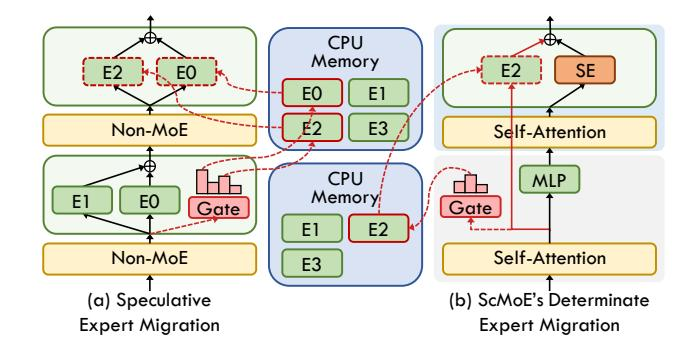
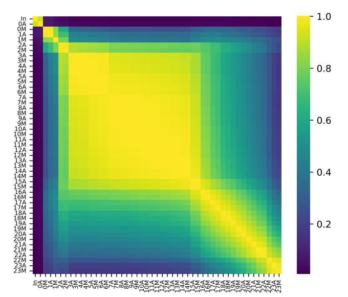

# A.3. Shortcut-connected MoE for Optimizing Memory-Limited Inference

While MoE effectively enhances LLMs in terms of model quality, it faces significant deployment challenges during on-device inference due to high memory demand. A common approach is to offload expert parameters to CPU memory (Shen et al., 2022) in scenarios where GPU memory is insufficient to store the entire MoE model. Moreover, decoder-only models use an autoregressive process for natural language generation (NLG) inference tasks, allowing for per-token processing of MoE. Specifically, only the two activated experts (top-2 gating) for each token need to be transferred from CPU to GPU memory for computation, thereby reducing peak GPU memory usage.

Since the migration of activated expert parameters from CPU to GPU, which occurs after expert selection, blocks expert computation until the transfer is complete, existing studies (Hwang et al., 2024; Yi et al., 2023; Du et al., 2024) have explored prefetching the experts. For instance, Pre-gated MoE (Hwang et al., 2024) uses information from preceding layers to predict expert selection, allowing for preloading of expert parameters into GPU memory, as shown in Figure 12 (a). This method enables overlapping the expert migration duration with the computation of preceding modules. Moreover, speculative expert migration methods adjust only the expert selection process, while expert computation continues along the same data flow of representations as in standard MoE.

However, speculative expert migrations can suffer from estimation inaccuracies, as they deviate from the original logic of pre-trained models, potentially reducing inference accuracy. In contrast, our proposed ScMoE architecture utilizes the gate-routed expert to compute the preceding-layer representations, inherently facilitating early expert migration well before the expert computation in the current layer. This allows us to implement an expert offloading strategy with overlapping determinate migration, maintaining the pre-trained logic.

Additionally, existing expert migration methods cannot be adapted to overlap communication in expert parallelism. This is because they do not decouple dependencies in the data flow of expert processing representations, and therefore cannot adjust the All-to-All communication of these representations

#### A.3.1. EXPERT OFFLOADING STRATEGY

We implement an expert offloading strategy that keeps nonexpert and shared expert modules in GPU memory while offloading other gate-routed experts to CPU memory. After the Attention module in the preceding layer generates intermediate representations, the gate determines expert se-

Figure 12. Illustrations of various expert migration methods to improve the efficiency of expert offloading: (a) speculative expert migration, exemplified by Pre-gated MoE (Hwang et al., 2024), and (b) our ScMoE's determinate expert migration. The red dashed line indicates expert selection and the transfer of expert parameters from CPU memory to GPU memory, while the black or red solid lines represent the data flow of representations processed by the Attention, MLP, and expert modules.

Figure 13. Peak GPU memory usage (a) and MoE block latency (b) for various memory-limited inference methods applied to the GPT2-MoE-Medium (8 experts per MoE module) and GPT3-MoE-XL models using ScMoE. "GPU-only" indicates that the entire model is stored in GPU memory. "Offload" refers to our strategy of offloading expert parameters to CPU with blocking expert migration. "Offload-Async" denotes the use of asynchronous expert migration to overlap its duration.

lection and issues asynchronous migration of the activated expert, as illustrated in Figure 12(b). This approach allows expert migration to overlap with the computation duration. Importantly, expert selection in our method adheres to the logic of the pre-trained ScMoE model, without speculation.

#### A.3.2. EVALUATION

We evaluate our proposed expert offloading strategy on models with our ScMoE (Pos-2) architecture, using a platform with a single A30-PCIe GPU. As demonstrated in Figure 13(a), our expert offloading strategy reduces peak GPU memory usage by 50% for the GPT2-MoE-Medium model and by 60% for the GPT3-MoE-XL model when deployed in the inference scenario using a single A30-PCIe GPU. Furthermore, it is anticipated that models with more

Table 4. Comparison of validation perplexity and end-to-end speedup analysis of train and inference (one iteration) for our pre-trained GPT3-MoE-XL [\(Brown et al.,](#page-9-0) [2020\)](#page-9-0) models with various architectures in 8×A800-NVLink scenario, using standard MoE with top-2 gating as the baseline. "ScMoE-2" refers to the activation of one shared expert and two gate-routed experts.

| Model          | Validation (Perplexity↓) | Train (Speedup↑) | Inference (Speedup↑) |
|----------------|-----------------------------|---------------------|-------------------------|
| Standard top-2 | 17.52                       | 1                   | 1                       |
| Our ScMoE      | 16.46                       | 1.12×               | 1.18×                   |
| Standard top-3 | 17.26                       | 0.94×               | 0.92×                   |
| Our ScMoE-2    | 16.27                       | 1.05×               | 1.08×                   |

gate-routed experts in each MoE module will experience a larger percentage reduction in GPU memory usage.

Since the offloaded expert parameters must be loaded into the GPU memory for expert computation, the blocking execution of this expert migration results in significant overhead. As shown in Figure [13\(b\),](#page-14-3) the blocking expert migration introduces an additional overhead of 80% in GPT2- MoE-Medium and 240% in GPT3-MoE-XL, substantially increasing the MoE block latency. To mitigate this issue, our strategy of asynchronously executing the determinate expert migration effectively reduces the additional costs by 75% in GPT2-MoE-Medium and 25% in GPT3-MoE-XL.

Furthermore, it is evident that expanding the model size from Medium to XL significantly raises the cost proportion related to expert migration. This is because the per-token decoding process during inference is memory-bound [\(Patel](#page-11-15) [et al.,](#page-11-15) [2024;](#page-11-15) [Wu et al.,](#page-12-14) [2024\)](#page-12-14). The larger model size leads to a proportional increase in the duration of memory transfer, without a corresponding increase in computation time.

## A.4. Analysis of More Activated Experts

As increasing the number of activated experts within standard MoE is correlated with enhancements in model quality, we implement this augmentation in our ScMoE by increasing the count of gate-routed experts that process the preceding-layer representations, while maintaining the process of current-layer representations. To investigate the benefits of more activated experts, we implement the ScMoE-2, which employs top-2 experts for the preceding layer and one shared expert for the current layer.

Comparative analyses with the standard top-3 MoE, which has the same computational volumes as our ScMoE-2, reveal that our ScMoE architectures maintain superiority in both model quality and efficiency, as evidenced in Table [4.](#page-15-1) Furthermore, akin to the standard MoE, our ScMoE consistently improves with additional expert activation, shown by a decrease in validation perplexity from 16.46 with ScMoE to 16.27 with ScMoE-2.

Table 5. Comparison of top-1 accuracy on the ImageNet-1K test set for SwinV2-MoE-S models, using Direct Add and CG-1.

| Model             | CG-1   | Direct Add |
|-------------------|--------|------------|
| Shared-Expert MoE | 79.53% | 79.02%     |
| Our ScMoE (Pos-1) | 79.14% | 78.78%     |
| Our ScMoE (Pos-2) | 79.38% | 78.98%     |
| Our ScMoE (Pos-3) | 79.20% | 78.29%     |

Table 6. Comparison of top-1 accuracy on the ImageNet-1K test set for SwinV2-MoE-S and SwinV2-MoE-B models with various architectures: top-2/top-1 gating standard MoE, shared-expert MoE, our DGMoE, and ScMoE, each pre-trained for 90 epochs on the ImageNet-1K classification dataset.

| Model              | SwinV2-MoE-S (Acc@1↑) | SwinV2-MoE-B (Acc@1↑) |
|--------------------|--------------------------|--------------------------|
| Standard top-2 MoE | 79.33%                   | 80.48%                   |
| Standard top-1 MoE | 78.95%                   | 80.05%                   |
| Shared-Expert MoE  | 79.53%                   | 80.62%                   |
| Our DGMoE (Pos-2)  | 79.35%                   | 80.51%                   |
| Our ScMoE (Pos-2)  | 79.38%                   | 80.56%                   |

Although activating more experts incurs higher time costs, the efficiency improvements of our overlapping strategy remain significant. For instance, our ScMoE-2 requires merely 95% and 93% of the time cost necessary for the standard top-2 MoE respectively in training and inference, despite processing increased computational loads.

#### A.5. Coefficient Gating Network in Vision Task

As shown in Table [5,](#page-15-2) the incorporation of the coefficient gating network significantly enhances model performance in our experimental vision tasks. In the absence of the coefficient gating network, the quality of MoE architectures with shared experts declines from that of a standard top-2 MoE to that of a standard top-1 MoE, despite maintaining the same computational volume as the standard top-2 MoE.

#### A.6. Evaluation Across Different Model Sizes

Table [6](#page-15-0) and Table [7](#page-16-1) illustrate that our experimental MoE architectures consistently achieve analogous model quality across different model sizes, as expounded in the detailed analysis within the main body of this paper.

## A.7. Share MoE Across Multiple Layers via Shortcut Connections

From a certain point of view, our shortcut-connected MoE architectures can be conceptualized as the sharing of one MoE module across multiple transformer layers. Parameter sharing across different layers has been validated as a method to enhance parameter efficiency and improve model

Table 7. Comparison of zero-shot perplexity on WikiText-103 for our pre-trained GPT2-MoE-Small and GPT2-MoE-Medium (8 experts per MoE module) models with various architectures.

| Model              | GPT2-MoE-Small (Perplexity↓) | GPT2-MoE-Medium (Perplexity↓) |
|--------------------|---------------------------------|----------------------------------|
| Standard top-2 MoE | 31.60                           | 19.18                            |
| Shared-Expert MoE  | 29.15                           | 17.94                            |
| Our DGMoE (Pos-2)  | 31.52                           | 18.91                            |
| Our ScMoE (Pos-2)  | 29.10                           | 17.62                            |

quality, as evidenced in existing research [\(Lan et al.,](#page-10-16) [2019;](#page-10-16) [Dehghani et al.,](#page-9-11) [2018;](#page-9-11) [Xue et al.,](#page-12-15) [2022;](#page-12-15) [Huang et al.,](#page-10-17) [2017\)](#page-10-17).

The empirical analysis of our novel MoE architectures suggests that the MoE modules shared across multiple layers via shortcuts could offer a more parameter-efficient solution. We conduct experiments on a preliminary architecture DGMoE-Share which shares a single MoE for two pairs of transformer blocks. It reduces the parameter count from 157M to 124M, while maintaining the same volume of expert computation as the standard top-1 MoE. The DGMoE-Share achieves a 78.45% accuracy on the vision task, incurring a minimal accuracy decrement of 0.5% relative to the standard top-1 MoE. We anticipate the discovery of more efficient architectures through future explorations. Additionally, the optimization of training hyperparameters for the shortcut-connected MoE requires more investigation.

#### A.8. Experimental Details

Hardware Configurations. To assess the effectiveness of our proposed overlapping strategy for enhancing expert parallelism, we conducted experiments on three hardware configurations: 8×A30-PCIe, 8×A800-NVLink and 16×A800-NVLink (across 2 nodes). These configurations cover scenarios with both high and low communication-tocomputation ratios. Additionally, we evaluate our proposed expert offloading strategy on a configuration with a single A30-PCIe GPU.

Experiments on Vision Model. To evaluate the efficacy of our MoE architectures on vision tasks, we conduct experiments on SwinV2-MoE model, which is a state-of-the-art vision transformer model built upon the Tutel MoE framework [\(Hwang et al.,](#page-10-5) [2023;](#page-10-5) [Liu et al.,](#page-10-0) [2021\)](#page-10-0). Specifically, we pre-train the SwinV2-MoE models with various MoE architectures on ImageNet-1K image classification dataset, and subsequently evaluate their accuracy on the corresponding test set. It is noteworthy that the integration of the MoE module within SwinV2 is confined to stages 3 and 4, with our architectural enhancements being selectively applied to the MoE modules in stage 3—the deepest submodel. Given our hardware constraints, we configure each MoE module with 8 experts, assigning one expert per GPU device. Table [9](#page-17-1) summarizes the hyperparameters for training the Swin-MoE models including SwinV2-MoE-S and SwinV2- MoE-B. Specifically, the experiments related to overhead and acceleration analysis in a 2-node (16×A800-NVLink) scenario utilize 16 experts per MoE module, while other cases use 8 experts. To maintain the comparability of our experiments, we limit our modifications solely to the MoE architectures and keep the hyperparameters and random seeds consistent. In addition, the experimental results related to efficiency are the averages of multiple samples over different periods.

Experiments on Language Model. For natural language generation (NLG) tasks, we utilize the standard implementations of GPT-2 [\(Radford et al.,](#page-11-13) [2019\)](#page-11-13), GPT-3 [\(Brown](#page-9-0) [et al.,](#page-9-0) [2020\)](#page-9-0) and LLaMA-2 [\(Touvron et al.,](#page-12-12) [2023\)](#page-12-12) from Fairseq [\(Ott et al.,](#page-11-16) [2019\)](#page-11-16), augmented with Tutel MoE to construct GPT2-MoE, GPT3-MoE and LLaMA2-MoE models. Specifically, we implement GPT2-MoE and GPT3-MoE by substituting the MLP with MoE in the second Transformer block of every consecutive pair, while implement LLaMA2-MoE by by substituting the MLP with MoE in every Transformer block. For models undergoing zero-shot evaluation on downstream tasks such as HellaSwag [\(Zellers](#page-12-16) [et al.,](#page-12-16) [2019\)](#page-12-16), PIQA [\(Bisk et al.,](#page-9-12) [2020\)](#page-9-12), WinoGrande [\(Sak](#page-11-17)[aguchi et al.,](#page-11-17) [2021\)](#page-11-17), BoolQ [\(Clark et al.,](#page-9-13) [2019\)](#page-9-13), ARC-Easy [\(Clark et al.,](#page-9-14) [2018\)](#page-9-14), OpenBookQA [\(Mihaylov et al.,](#page-10-18) [2018\)](#page-10-18), RACE [\(Lai et al.,](#page-10-19) [2017\)](#page-10-19), and MathQA [\(Amini et al.,](#page-9-15) [2019\)](#page-9-15), we pre-train the models using various architectures on a 1B token subset of the SlimPajama-627B dataset [\(Sobol](#page-12-17)[eva et al.,](#page-12-17) [2023\)](#page-12-17). For models evaluated on WikiText-103 [\(Merity et al.,](#page-10-20) [2017\)](#page-10-20), we conduct pre-training with different architectures on the OpenWebtext dataset [\(Gokaslan &](#page-10-21) [Cohen,](#page-10-21) [2019\)](#page-10-21). Table [8](#page-17-2) summarizes the hyperparameters for training the GPT2-MoE-Small, GPT2-MoE-Medium, GPT3-MoE-XL and LLaMA-MoE models.

*Table 8.* Hyperparameters for GPT-MoE and LLaMA2-MoE models.

| Parameter               | GPT2-MoE-Small | GPT2-MoE-Medium | GPT3-MoE-XL | LLaMA2-MoE |
|-------------------------|----------------|-----------------|-------------|------------|
| Num. layers             | 12             | 24              | 24          | 24         |
| Embedding dim           | 768            | 1024            | 2048        | 2048       |
| Num. attention heads    | 12             | 16              | 32          | 16         |
| Num. KV heads           | 12             | 16              | 32          | 4          |
| Num. experts per layer  | 8              | 16              | 8           | 8          |
| MoE frequency           | 1/2            | 1/2             | 1/2         | 1          |
| Num. parameters         | 323M           | 1.7B            | 4.1B        | 6.7B       |
| Context/sequence length | 1K             | 2K              | 2K          | 2K         |
| Capacity factor         | 2.00           | 2.00            | 2.00        | 2.00       |
| MoE loss coefficient    | 0.01           | 0.01            | 0.01        | 0.01       |

Table 9. Hyperparameters for SwinV2-MoE models.

| Parameter              | SwinV2-MoE-S     | SwinV2-MoE-B   |
|------------------------|------------------|----------------|
| Image size             | 192×192          | 192×192        |
| Window size            | $12\times12$     | 12×12          |
| Embedding dim          | 96               | 128            |
| Num. layers            | [2, 2, 18, 2]    | [2, 2, 18, 2]  |
| Num. attention heads   | [ 3, 6, 12, 24 ] | [4, 8, 16, 32] |
| Num. experts per layer | 8/16             | 8              |
| Batch size             | 1024             | 1024           |
| Epochs                 | 90               | 90             |
| Warmup epochs          | 10               | 10             |
| Base LR                | 1.25e-4          | 1.25e-4        |
| Warmup LR              | 1.25e-7          | 1.25e-7        |
| Min LR                 | 1.25e-6          | 1.25e-6        |
| Capacity factor        | 1.25             | 1.25           |
| MoE loss coefficient   | 0.01             | 0.01           |

## A.9. Additional Examples of Intermediate Representations Similarities

Figure 14. Intermediate representation similarities in LLaMA2-MoE.

Figure 15. Intermediate representation similarities in OLMoE (Muennighoff et al., 2024).