# SIDA-MOE: SPARSITY-INSPIRED DATA-AWARE SERVING FOR EFFICIENT AND SCALABLE LARGE MIXTURE-OF-EXPERTS MODELS

Zhixu Du 1 Shiyu Li 1 Yuhao Wu 1 Xiangyu Jiang 2 Jingwei Sun 1 Qilin Zheng 1 Yongkai Wu 2 Ang Li 3 Hai "Helen" Li 1 Yiran Chen 1

#### **ABSTRACT**

Mixture-of-Experts (MoE) has emerged as a favorable architecture in the era of large models due to its inherent advantage, i.e., enlarging model capacity without incurring notable computational overhead. Yet, the realization of such benefits often results in ineffective GPU memory utilization, as large portions of the model parameters remain dormant during inference. Moreover, the memory demands of large models consistently outpace the memory capacity of contemporary GPUs. Addressing this, we introduce SiDA-MoE (Sparsity-inspired Data-Aware), an efficient inference approach tailored for large MoE models. SiDA-MoE judiciously exploits both the system's main memory, which is now abundant and readily scalable, and GPU memory by capitalizing on the inherent sparsity on expert activation in MoE models. By adopting a data-aware perspective, SiDA-MoE achieves enhanced model efficiency with a neglectable performance drop. Specifically, SiDA-MoE attains a remarkable speedup in MoE inference with up to 3.93× throughput increasing, up to 72% latency reduction, and up to 80% GPU memory saving with down to 1% performance drop. This work paves the way for scalable and efficient deployment of large MoE models, even with constrained resources. Code is available at: https://github.com/timlee0212/SiDA-MoE.

#### 1 Introduction

Recently, rapid advances in large models with shocking performance have surprised the community in several areas, such as vision (Ramesh et al., 2022; Kirillov et al., 2023; Saharia et al., 2022), language (Brown et al., 2020; OpenAI, 2023; Smith et al., 2022), decision making (Yang et al., 2023), and robotics (Vemprala et al., 2023). For example, GPT-4 has demonstrated its capability that is comparable or even exceeds human-level understanding on several tasks (OpenAI, 2023), and DALLE-2 can generate astonishing high-quality images. The outstanding performance of large models heavily relies on the outrageous number of parameters, namely the scaling law (Kaplan et al., 2020). Broadly speaking, the scaling law asserts that as the model size increases, various characteristics such as training loss, test performance, and the amount of required data exhibit predictable scaling behaviors.

Mixture-of-Experts (MoE), a classical model architecture, enjoys the advantage that naturally fits the era of large mod-

Proceedings of the 7th MLSys Conference, Santa Clara, CA, USA, 2024. Copyright 2024 by the author(s).

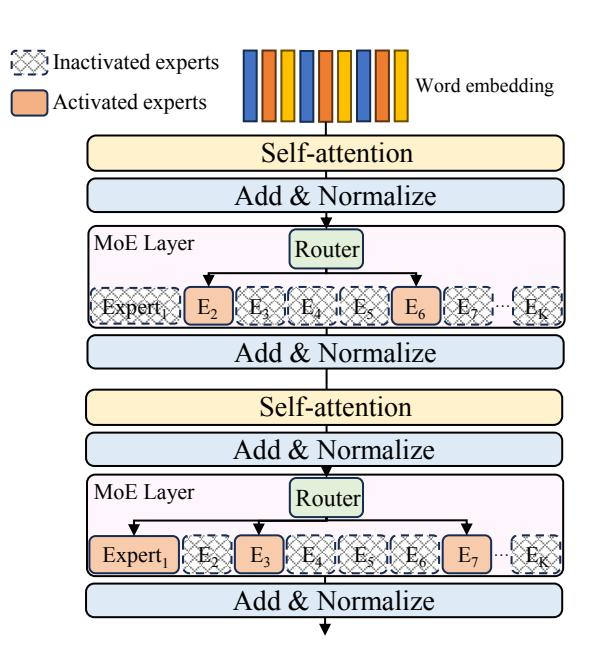

Figure 1. Diagram Showcasing the Architecture of MoE-based Transformers. Within each MoE layer only a limited number of experts are activated for inference.

els. MoE can improve the model's performance by drastically increasing the number of parameters while only incurring little computational overhead. Although the number of parameters involved in the forward pass of an MoE model remains almost unchanged, research (Fedus et al., 2022)

&lt;sup>1Department of Electrical and Computer Engineering, Duke University, Durham, USA 2Department of Electrical and Computer Engineering, Clemson University, Clemson, USA 3Department of Electrical and Computer Engineering, University of Maryland, College Park, USA. Correspondence to: Zhixu Du <zhixu.du@duke.edu>.

suggests that augmenting parameter counts using the MoE architecture still conforms to the scaling law. Encouraged by the advantage, many MoE-based large models have been proposed and achieved overwhelming performance in computer vision (Li et al., 2023a; Riquelme et al., 2021; Xue et al., 2022), natural language processing (Shazeer et al., 2017; Fedus et al., 2022), Specifically, the Sparsely-Gated Mixture-of-Experts (Shazeer et al., 2017) scales LSTM models to 137 billion parameters, which improves the model capacity by 1000× with marginal computational overhead increase. Switch Transformers (Fedus et al., 2022) scale to 1.6 trillion parameters with the same perplexity as T5-XXL (Raffel et al., 2020) while 4× speedup during inference. However, the success of MoE comes with sacrifices in effective GPU memory utilization, incurring large memory occupation while only a small fraction of parameters residing in the memory are effective for inference of the current batch. Fig. 1 depicts the architecture of MoE-based transformers, where only a small portion of experts are activated in each MoE layer during each inference.

Further, with the trend of model scaling, we have observed a substantial gap between the memory demands of large models and the memory capacity of GPUs. For instance, in the past three years, the number of parameters in state-of-the-art models has scaled from 175 billion in GPT-3 (Brown et al., 2020) to 1.76 trillion in the newly announced GPT-4 (OpenAI, 2023), showing an over  $10\times$  increase. Contrarily, the memory capacity of high-end GPUs remains around 80GB (Choquette, 2023), and commodity GPUs are still limited to 48GB or even smaller. This growing discrepancy motivates techniques to improve memory utilization efficiency. Thus, we seek to answer a compelling research question:

How to serve large Mixture-of-Experts models in an efficient and scalable manner under constrained memory?

Previous efforts have studied the efficiency problem of MoE models to some extent. Deepspeed-MoE (Rajbhandari et al., 2022) optimizes the MoE module in the Deepspeed framework for efficient grouping and scheduling. A later version of the work (Aminabadi et al., 2022) focused on optimizing the inference efficiency with optimized computation kernels and careful coordination of communication and parallelism. Tutel (Hwang et al., 2023) enables adaptive parallelism and pipelining at runtime. However, these methods only focus on optimizing device-to-device communication but ignore the data-awareness, not to mention exploiting the data-awareness to improve efficiency during inference. The data-awareness refers to a design where the technique or strategy is determined based on the incoming data. Our proposed framework embraces the data-awareness which brings three advantages. Firstly, the data-awareness can squeeze the sparsity leading to a further increase in memory efficiency compared to previous methods. Secondly, the

Table 1. Comparison of SiDA-MoE and Baseline Methods. This table delineates the capabilities of various methods in terms of data-awareness, effective GPU memory utilization, and inference speed on large MoE models. SiDA-MoE excels in its data-aware approach with high effective GPU memory utilization and high inference speed on large MoE models.

| Methods   | Data-aware | Effective GPU memory utilization | Inference speed on large MoE |
|-----------|------------|----------------------------------|---------------------------------|
| Standard  | Х          | low                              | slow                            |
| Deepspeed | X          | medium                           | slow                            |
| Tutel     | ×          | medium                           | slow                            |
| SiDA-MoE  | <b>√</b>   | Extremely high                   | Extremely high                  |

data-awareness preserves the structure crucial for a sample's unique features, better maintaining the model's performance. *Thirdly*, the data-awareness offers better adaptability since the framework varies according to data distribution.

In this paper, we present an efficient inference system, i.e., SiDA-MoE (Sparsity-inspired Data-Aware), for serving large MoE models. By noticing that modern server CPUs support terabytes (TB) of main memory, dwarfing GPU capacity, SiDA-MoE dynamically leverages both main memory and GPU memory by exploiting sparsity in MoE models in a data-aware manner. We summarize the comparison in Table 1 between SiDA-MoE and baselines. Specifically, SiDA-MoE contains two threads that run in parallel, an inference thread and a hash-building thread. The hash-building thread exploits the sparsity of expert activation in a dataaware manner, whose core is a network-based hash function. Specifically, the hash function is an offline trained predictor that predicts the experts to be activated. In this work, we employ a LSTM (Hochreiter & Schmidhuber, 1997) with sparse attention and a truncated knowledge distillation to boost the performance of the hash function. The inference thread offloads inactivated experts predicted by the hash-building thread to maximize effective GPU memory utilization. Besides, SiDA-MoE also brings significant speedup during inference. Our contributions are summarized as follows:

- To the best of our knowledge, SiDA-MoE is the first *sparsity-inspired data-aware* system serving for efficient and scalable inference on large MoE models.
- We propose an offline training strategy to build a dataaware hash function deployed in SiDA-MoE that replaces the router function in MoE layers. Our design boosts the throughput of MoE models up to 3.93× and reduces the latency down to 28%.
- Our offloading scheme achieves up to 80% GPU memory saving with only less than 1% performance drop.
  Our hash function can achieve up to 99% prediction accuracy on expert activation.

The paper is organized in the following manner: In Sec-

tion 2, we will introduce the background and motivation. Section 3 is devoted to the framework of SiDA-MoE, our observation of the expert activation pattern, and our design of the offline trained hash function. In Section 4, we present our experimental results. Section 5 and 6 are devoted to related works and discussions, respectively. Finally, Section 7 will conclude the paper.

#### 2 BACKGROUND AND MOTIVATION

In this section, we present the background and motivation for SiDA-MoE. We employ the following notation throughout this paper: a denotes a scalar, a represents a vector, a signifies a matrix, and a indicates a set. The notation a is used to denote the set a vector, a Unless explicitly stated otherwise, all experiments are conducted with a batch size of 1 to isolate the influence of batch size.

#### 2.1 Mixture of Experts

Since the first proposal of Mixture-of-Experts (MoE) (Jacobs et al., 1991; Jordan & Jacobs, 1994), different MoE models have been proposed based on various experts models, for example, hidden Markov models (Jordan et al., 1996), Gaussian Process (Tresp, 2000), and support vector machine (Collobert et al., 2001). With the rise of deep learning, Eigen et al. propose the use of several sets of routers and experts to build a stacked model, namely Deep MoE (Eigen et al., 2013).

A MoE layer consists of a router function, denoted as  $h(\cdot; \boldsymbol{W}_r)$ , followed by K experts in parallel, denoted as  $\{f_i(\cdot; \boldsymbol{\theta}_i)\}_{i=1}^K$ . Usually, the router function is set as a linear function, i.e.,  $h(\mathbf{x}; \boldsymbol{W}_r) = \boldsymbol{W}_r^{\top} \mathbf{x}$  where  $\boldsymbol{W}_r \in \mathbb{R}^{d \times K}$  for input  $\mathbf{x} \in \mathbb{R}^d$ , and experts are multi-layer perceptrons (MLPs) with a non-linear activation function (Chen et al., 2022; Fedus et al., 2022; Shazeer et al., 2017). The output of a MoE layer takes the form:

$$M(\mathbf{x}; \mathbf{W}_r, \boldsymbol{\theta}_1, ..., \boldsymbol{\theta}_K) = \sum_{i \in \mathbb{T}} \alpha_i(\mathbf{x}) f_i(\mathbf{x}; \boldsymbol{\theta}_i), \quad (1)$$

where  $\mathbb{I}$  contains the selected indices of experts and the scaling factor  $\alpha_i$  is defined as

$$\alpha_i(\mathbf{x}) = \frac{\exp\{\boldsymbol{W}_r[:,i]^{\top}\mathbf{x}\}}{\sum_{j=1}^K \exp\{\boldsymbol{W}_r[:,j]^{\top}\mathbf{x}\}}.$$

Different selection mechanism of  $\mathbb{I}$  leads to different models. The soft-routing model (Jordan & Jacobs, 1994) selects all experts, i.e.,  $\mathbb{I} = [K]$ , which leads to high computational overheads. The switch-routing model (Fedus et al., 2022) selects the top-1 expert, i.e.,  $\mathbb{I} = \arg\max_{i \in [K]} \alpha_i(\cdot)$ , introducing little extra computational overhead.

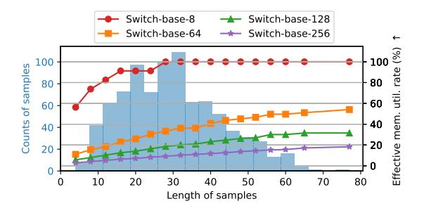

Figure 2. Memory Efficiency of Switch Transformers on SST2. The *x*-axis represents the length of the sentence and the bar records the counts of sentences of corresponding length. The line represents the effective memory utilization for Switch Transformer on SST2 with a varied sentence length. Down to 5% utilization can be observed for large models.

#### 2.2 Low Effective Utilization of GPU Memory

Encouraged by the advantage of MoE-based large models that drastically increasing the number of parameters leads to little computational overhead, many large-scale architectures have been proposed such as the Sparsely-Gated MoE (Shazeer et al., 2017), Gshard (Lepikhin et al., 2020), and Switch Transformers (Fedus et al., 2022). Specifically, the Sparsely-Gated MoE proposes a trainable router function to determine the expert to be activated for each sample, which makes it possible to build very large MoE-based models as it improves the computational efficiency by a large margin compared to the soft-routing selecting all experts. The Sparsely-Gated MoE scales LSTM models to 137 billion parameters achieving outstanding performance. Switch Transformers, the most widely used transformer-based large MoE, converts T5 models (Raffel et al., 2020) to their MoE versions. All Switch Transformers outperform their foundation dense model with the same FLOPs.

In our study, we found that large MoE models do not efficiently utilize GPUs. As shown in Eq. 1, we denote an expert as activated if  $i \in \mathbb{I}$ . Inactivated experts remain idle in the forward pass, leading to low effective GPU memory utilization. Effective GPU memory refers to the memory storing parameters that are effective for the forwarding of the model. The inactivated experts occupy a large amount of GPU memory while remaining idle, leading to low effective GPU memory utilization. To quantitatively analyze the GPU memory utilization, we provide a summary of Switch Transformers on model size and MoE layer size in Table 2. It is shown that for all Switch Transformers, especially the large ones, MoE layers occupy a large portion of GPU memory. Meanwhile, most of the parameters of the MoE layers are idle during one forward pass. To ascertain the amount of ineffective GPU memory, we feed samples from the SST2 dataset to Switch Transformers and record the corresponding effective memory utilization rates. The

Table 2. *Memory Occupation of Switch Transformers*. This table highlights the allocation of parameters in gigabytes (GB) for different models. MoE parameters dominate memory usage, especially in larger models. In contrast, mainstream GPUs peak at 48GB, with many at 24GB, while mobile GPUs range from 4GB to 12GB.

|                 | Model (GB) | MoE (GB) | Percentage (%) |
|-----------------|------------|----------|----------------|
| Switch-base-8   | 2.298      | 1.7932   | 78.03          |
| Switch-base-64  | 14.112     | 13.608   | 96.42          |
| Switch-base-128 | 27.614     | 27.11    | 98.17          |
| Switch-base-256 | 54.62      | 54.114   | 99.07          |

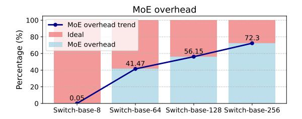

Figure 3. MoE Overhead on SST2. The bar depicts the percentage breakdown for MoE overhead and Ideal Inference time. Up to 72% time on Switch-base-256 are occupied by MoE overhead, including expert selection, expert invocation, and communication. Notably, the occupation of expert selection overhead scales up as model size increases.

results are depicted in Fig. [2.](#page-2-0) For large Switch Transformers such as Switch-base-128 and Switch-base-256, the ineffective GPU memory for short sentences is around 24GB and 50GB, respectively. Even for the longest sentences with 80 tokens, the ineffective GPU memory is around 20GB and 46GB, respectively. Our method, SiDA-MoE, can save all ineffective GPU memory, outperforming baselines by a large margin. Further results on GPU memory reduction across datasets can be found in Section [4.](#page-7-0)

#### 2.3 High MoE Overhead

Apart from the low effective GPU memory utilization, we also observed a high MoE overhead that includes expert selection, expert invocation, and additional communication costs when inference with MoE architectures. We conduct experiments on SST2 with multiple Switch Transformer models and provide the profiling results in Fig. 3. It is shown that the MoE overhead consumes over 72% of the total inference time for Switch-base-256, which is a bottleneck of inference on MoE models. Notably, the overhead associated with MoE escalates with the scale of the model, further emphasizing the imperative of addressing the bottleneck in inference efficiency. We account for this for the default implementation that invokes every expert, irrespective of whether any tokens are assigned to it to align with hardware for efficient computation with a huge amount of requests. In our modified implementation used as a proxy for ideal,

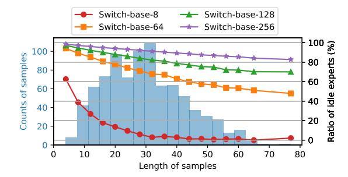

Figure 4. Expert Activation in Switch Transformers on SST2. The x-axis denotes sentence length, with bars illustrating the counts of given lengths. The line depicts the ration of idle experts. Notably, Switch-base-256 and Switch-base-128 activate less than 20% and 40% of their experts, respectively.

where we replace the router with a lookup table, we only invoke an expert if there is token assigned to that expert to suit the resource constraints scenario.

Remark 1 *Given that we simulate an inference scenario with a small batch size, the input to each expert is minimal. Consequently, the invocation overhead surpasses the computation itself — meaning the number of experts called dictates the overall inference time.*

#### 2.4 Sparse Activation of Experts in Large MoE Models

The sparse selection of experts is one of the critical observations that motivate SiDA-MoE. Our observation verifies that only a small portion of experts will be activated during inference.

For each token, the router function will select either top-K [\(Shazeer et al.,](#page-13-0) [2017\)](#page-13-0) or top-1 [\(Fedus et al.,](#page-11-0) [2022\)](#page-11-0) experts inducing a token level expert activation sparsity. However, the sparsity on sentences, typically with 512 or 768 tokens, remains elusive. Not to mention in the training stage, an expert loading balance loss must be applied, which forces the router to assign an almost equal number of tokens to each expert. Otherwise, router's outputs will collapse to few experts leading to capacity degradation [\(Chen et al.,](#page-11-0) [2022\)](#page-11-0).

We test Switch Transformers with different number of experts on the SST2 dataset and report the sentence level sparsity in Fig. 4. Our observation verifies that the sparse activation pattern still exists at the sentence level for large MoE models such as Switch-base-128 and Switch-base-256. As shown in the figure, down to less than 40% experts and 20% experts are activated for Switch-base-128 and Switchbase-256, respectively. Even for the longest sentences with around 80 tokens, the ratio of idle experts is still higher than 70% for Switch-base-128 and 80% for Switch-base-256.

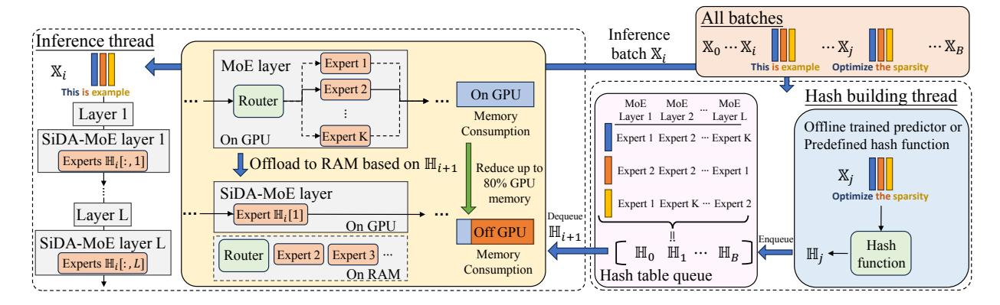

Figure 5. Overview of SiDA-MoE. SiDA-MoE contains two threads, the inference and hash-building thread, that run concurrently. As each batch  $\mathbb{X}_j$  arrives, the hash-building thread constructs the expert hash table  $\mathbb{H}_j$  and queues it. In tandem, the inference thread processes the preceding batch  $\mathbb{X}_i$ , dynamically managing experts in MoE layers based on the hash table  $\mathbb{H}_i$ .

#### 3 SIDA-MOE

#### 3.1 Overview: workflow

We introduce a novel framework, Sparsity-inspired Data-Aware (SiDA-MoE), for efficient inference of large MoE models, whose overview is shown in Fig. 5. SiDA-MoE contains two parallel threads that run simultaneously, namely the *Inference thread* and the *Hash-building thread*. Consider a sequence of incoming batches, batch  $\mathbb{X}_j$  is fed to the hash-building thread to build the hash table  $\mathbb{H}_j$  storing expert activation patterns for batch  $\mathbb{X}_j$ , which will be pushed to the hash table queue. At the same time, the inference thread is handling the precedent batch  $\mathbb{X}_i$  and operating dynamical offloading on MoE layers based on the hash table  $\mathbb{H}_i$ .

Hash-building thread. The Hash-building thread consists of two components, a hash function and a hash table queue. For each incoming batch  $(\widehat{1}$ -a), the hash function will determine experts to be activated for each token at each layer and the corresponding scaling factor  $\alpha$   $(\widehat{1}$ -b). The predictions are stored in the hash table  $\mathbb{H}_j$  for the batch  $\mathbb{X}_j$  and pushed to the hash table queue  $(\widehat{1}$ -c). The hash function can be a predefined hash function if the MoE model is trained with the Hash layer (Roller et al., 2021). More commonly, for the MoE model using trained router functions, such as Switch Transformers, the hash function will be offline trained. We propose hash function training techniques dedicated to modern MoE models, which will be introduced in later sections.

**Inference thread.** The inference thread performs two tasks, i.e., dynamically load activated experts and offload inactivated experts according to the hash table built by the hash-building thread, and use the SiDA-MoE MoE layers to inference input batches. Specifically, for each incoming batch  $\mathbb{X}_i$  (2)-a), the inference thread will first pop the hash table  $\mathbb{H}_i$  from the hash table queue (2)-b) and remain idle if  $\mathbb{H}_i$ 

is not found. Notably, in practice, the inference thread takes a longer time to inference a batch than the hash-building thread to build a hash table for a batch. As a result, the inference thread never idles except at the very beginning. With the popped hash table  $\mathbb{H}_i$ , the next step is to dynamically load and offload experts. Based on GPU memory budgets and the expert activation pattern of the current batch, the inference thread will load activated experts to GPU and offload inactivated experts to RAM ((2)-c). A first-in-first-out (FIFO) scheme is applied on experts if no memory budgets remain. The dynamical loading task of a MoE layer will be done right after the finish of inference on the previous batch following the pipeline parallelism mechanism (Huang et al., 2019). Note that, in our system, all routers are offloaded to the main memory and do not participate in the forward pass. Lastly, the incoming batch  $X_i$  will be forwarded using the SiDA-MoE MoE layers specific to  $\mathbb{X}_i$  ((2)-d). Algorithm 1 shows the end-to-end pipeline.

#### 3.2 Design challenges

In the design of SiDA-MoE, we spot three key challenges.

Challenge 1: How to efficiently obtain experts that are to be offloaded beforehand? Given the observation that experts are activated sparsely, it is trivial to save GPU memory by offloading inactivated experts to RAM. However, this naive implementation sacrifices the latency since expert activation patterns are inaccessible without the output of the router functions. It incurs large overheads to move experts between CPU and GPU after each router function as it breaks the forwarding pipeline. We propose to use an offline-trained hash function to acquire the expert activation pattern before inference starts for each batch. Furthermore, we design the hash function to run independently of model inference and build a hash-building thread running in parallel with the inference thread to achieve the efficiency requirements. By employing the hash-building thread, SiDA-MoE

achieves outstanding latency compared to baselines since the expert selection, dynamical offloading, and inference all run in parallel.

Challenge 2: How to leverage sparse cross-embedding dependency on experts activation to design a lightweight offline trained hash function? Considering the inference efficiency and the GPU memory consumption of the system, the hash function must be a lightweight predictor. However, simple predictors can hardly capture the contextual information of the sequence and can be easily distracted. Hence, it becomes crucial to enforce the predictor to focus on critical information. We empirically verify that there exists a sparse cross-embedding dependency on expert activation, i.e., a limited number of embeddings in the sequence jointly affect expert activation. This sparse cross-embedding dependency sheds light on the success of lightweight predictors. However, it is impractical and inefficient to rule out all possible outcomes to find the cross-embedding dependency for every token. In response to the challenge, we propose a sparse attention mechanism on LSTM that enforces the predictor to focus on the most important embedding automatically.

Challenge 3: How to improve the expert selection accuracy and approximate the scaling factor simultaneously? The hash function needs to determine not only the expert activation but also the scaling factor  $\alpha$  in Eq. 1. As the scaling factor is derived from the SoftMax logits output from the model, it is natural to apply knowledge distillation (KD), setting the router functions as teacher models and the hash function as the student model. However, it is impossible for the hash function to approximate the scaling factor distribution over all experts by KD due to the limited capacity of the hash function. To solve this challenge, we propose to use a truncated knowledge distillation (TKD), where the KD loss is computed over the top-T experts. However, the TKD cannot guarantee adequate prediction accuracy. We further add a cross-entropy loss to boost the prediction accuracy.

We introduce how SiDA-MoE deals with each challenge in detail in the following sections.

## 3.3 Data-Aware and Efficient Expert Activation Prediction

SiDA-MoE proposes a data-aware solution to efficiently obtain the experts to be offloaded beforehand. Specifically, we propose to use an offline trained hash function that takes the sequence of embedding as input and predicts all the activated experts for each token in the sequence. Training data of the hash function are pairs of input token embeddings and MoE expert activation patterns. SiDA-MoE, augmented by the data-aware expert activation prediction, enjoys two advantages while compromising little loss of model performance down to less than 1%. *Firstly*, the system can acquire the activation pattern of each sample beforehand and operate

dynamically loading and offloading according to the GPU memory budget without interrupting the inference process. Secondly, since the hash function determines the expert activation across all the MoE layers for a sample independently of the inference, the system can build the hash function in a hash-building thread running in parallel with the inference thread. By doing this, we can remove the overhead caused by expert selection from the inference time, which boosts the throughput up to  $3.93\times$ .

Previous works have also been proposed to improve the router function of MoE, such as the Hash layer (Roller et al., 2021) and the Base layer (Lewis et al., 2021). SiDA-MoE is orthogonal to these router functions as they can be accommodated in the hash-building thread. For MoE models with trained routers, we propose to train an LSTM as the hash function with the sparse attention boosted with our truncated knowledge distillation, detailed in the following sections.

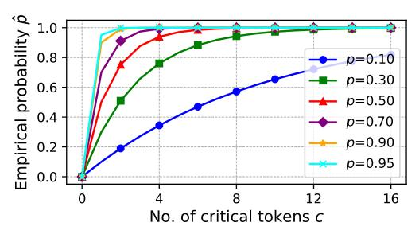

Figure 6. Visualization of Eq. 2 over Different p and c.

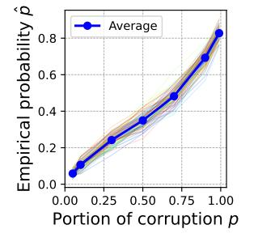

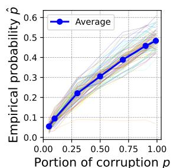

- (a) Tokens dependency.
- (b) Positions dependency.

Figure 7. Cross-embedding Dependency for Expert Activation on Switch-base-128 on C4. The x-axis shows the proportion of corruption, while the y-axis represents the empirical probability of expert activation change. Over 100 random embedding positions are examined, with the average trend displayed.

#### 3.4 LSTM with Sparse Attention

### 3.4.1 Sparse cross-embedding dependency on expert activation

In the MoE layer, each word embedding will be fed to the router function to decide which expert to activate for in-

ference of the token. However, the expert activation does not solely depend on the embedding corresponding to the token due to the self-attention layer before each MoE layer (shown in Fig. [1\)](#page-0-0), where the word embedding is mixed together. Because of the positional embedding, the position of tokens will also affect the expert activation. While the process by which embeddings collectively influence expert activation is complex, we identify a sparse cross-embedding dependency on expert activation, indicating that only a limited number of other tokens and positions are critical to the expert activation for the current token.

Suppose a sequence of length L, and let ci denote the number of critical tokens for the token at position i. We define the critical tokens as tokens in the sequence other than the selected i-th token, whose changes lead to a change in expert activation of the i-th token. In order to empirically verify that ci is a small number for all i, we consider finding a combinatorial equation involving ci and quantities we can measure. Consider selecting a set of tokens from the sequence excluding the i-th token, the probability that the set contains a critical token is formulated as below:

$$\mathbb{E}[\hat{p}_i] = 1 - \frac{\binom{L-1-c_i}{\lfloor pL \rfloor}}{\binom{L-1}{\lfloor pL \rfloor}}.$$
 (2)

where ⌊pL⌋ denotes the size of the set and p denotes the portion of selection over the sequence. Note that the probability that the selected set of tokens contains a critical token is equal to the probability that the i-th token's expert activation changes, denoted as pˆi , if we change all selected tokens in the set. We denote the process of changing the tokens in a sequence as 'corruption.' Given Eq. 2, p and pˆ are quantities that we can empirically acquire, that is, by randomly selecting a portion p of tokens, we can empirically measure the probability that the i-th token's expert activation changes. We show in Fig. [6](#page-5-0) the relation between c and pˆ under different p.

Empirically, to study the token dependency of the token at position i, the corruption is executed by randomly modifying a fraction p of chosen tokens from [L] − {i} to values distinct from their original and the i-th token. To examine the position dependency for the i-th token, the corruption also involves randomly choosing a fraction p of positions from [L] − {i} and swapping the token positions. We use the English division in the dataset C4 [\(Raffel et al.,](#page-13-0) [2020\)](#page-13-0) to measure the probability that the i-th token's expert activation changes under different p, depicted in Fig. [7.](#page-5-0) We set the length L = 512 and truncate or pad sentences which are not of length 512. We randomly test over 100 word embedding positions (i.e., 100 i's) on Switch-base-128 and plot all of them in Fig. [7](#page-5-0) with the average trend shown. Fig. [7a](#page-5-0) and Fig. [7b](#page-5-0) show the cross-embedding dependency of the token and position, respectively. Only a large portion of

corruption leads to high chances of expert activation change, which demonstrates that most of the other tokens do not have an impact on the expert activation of the current token.

By combining Fig. [6](#page-5-0) and Fig. [7,](#page-5-0) we can read the best approximation of ci based on different pairs of (p, pˆ) in Fig. [7,](#page-5-0) where we find that the best approximation of cˆ ranges from 1 to 4 demonstrating the sparse cross-embedding dependency.

#### *3.4.2 Design of the hash function*

The design of the hash function must satisfy the following conditions: (1) be able to capture the sequential information, (2) be lightweight to preserve efficiency, and (3) be able to extract and focus on the critical embedding automatically. We adopt a 2-layer LSTM followed by a fully connected layer to align the first two conditions. Further, we add one fully connected layer to compress the embedding dimension. To achieve the third condition, we adopt the sparse attention mechanism with the SparseMax activation [\(Martins &](#page-12-0) [Astudillo,](#page-12-0) [2016\)](#page-12-0).

Attention mechanism. The attention mechanism was first proposed in [\(Bahdanau et al.,](#page-11-0) [2015\)](#page-11-0), which has been proven to be influential in the realm of deep learning. The attention mechanism was proposed to allow the decoder to focus on different parts, resolving the problem that the encoder encodes the entire sentence. Given a query q and a set of key-value pairs (k, v), the attention mechanism computes a weighted sum of values based on the similarity of the query to the keys. Formally, the attention weights w and the output o are computed as o = P i wivi with

$$w_i = \frac{\exp(\operatorname{score}(\boldsymbol{q}, \boldsymbol{k}_i))}{\sum_j \exp(\operatorname{score}(\boldsymbol{q}, \boldsymbol{k}_j))},$$

where score(q, k) is a function that calculates the similarity between the query and a key. One common choice for score is the dot product of the query and key.

We append one attention layer right after the LSTM layer where the key, value, and query are all set as the output sequence from LSTM. Consequently, each embedding will be a weighted sum of the sequence with weights proportional to the similarity between two vectors. The attention mechanism allows the predictor to pay different attention to different embeddings. However, the naive attention mechanism cannot impose a sparse focus. We further apply the SparseMax activation over w.

SparseMax activation. In contrast to the SoftMax activation, which provides a dense distribution, that is, nonzero probabilities assigned to all classes or positions, the SparseMax [\(Martins & Astudillo,](#page-12-0) [2016\)](#page-12-0) provides a sparse distribution, where zero probability is assigned to many positions. We apply the SparseMax activation over the attention weights w to obtain a sparse attention mechanism. Given

#### Algorithm 1 SiDA-MoE workflow

Assume batches of inputs  $\{X_i\}_{i=0}^{B-1}$ . Let M denote the MoE model, h denote the hash function,  $\mathbb{H}$  denote the hash table that stores the expert activation, and k denote the index of experts.

#### **Inference Thread:** Hash Building Thread: **for** each batch $X_i$ **do for** each batch $X_i$ **do** Dequeue $\mathbb{H}_i$ . for each MoE layer l and for each MoE layer l and each token s do Expert $k \leftarrow h_l(\mathbb{X}_i)[s]$ . each token s do Check Expert $\mathbb{H}_i[l][s]$ . $\mathbb{H}_i[l][s] \leftarrow \text{Expert } k.$ If not on GPU: to cuda. end for end for Enqueue $\mathbb{H}_i$ . $M_{\text{SiDA-MoE}} \leftarrow M$ . end for end Hash Building Thread output = $M_{SiDA-MoE}(X_i)$ . end for end Inference Thread

an input vector  $\boldsymbol{w} \in \mathbb{R}^L$ , the SparseMax transformation is defined as:

$$\operatorname{SparseMax}(\boldsymbol{w}) = \operatorname{argmin}_{\boldsymbol{u} \in \Delta^{L-1}} \|\boldsymbol{u} - \boldsymbol{w}\|_2^2,$$

where  $\Delta^{L-1}$  denotes the (L-1)-dimensional simplex, i.e.,

$$\Delta^{L-1} = \{ \boldsymbol{u} \in \mathbb{R}^{L} | \boldsymbol{u} \ge 0, \sum_{i=1}^{L} u_i = 1 \}.$$

Although the expert selection is affected by other tokens in the sequence, the current token is always the most crucial on expert selection. Hence, we adopt the residual connection (He et al., 2016) to boost the performance right before the final fully connected layer.

#### 3.5 Truncated Knowledge Distillation

The hash function of SiDA-MoE is required to predict the expert to be activated and the corresponding scaling factor  $\alpha$ . Knowledge distillation (KD) (Hinton et al., 2015), which aims to minimize the distance of logits between the teacher and student model, should be the best training strategy for our hash function. However, the capacity of our hash function, 2-layer LSTM, is far less capable than the MoE model. The predictor cannot fully capture the behavior of logits of the router functions in the MoE model. The naive usage of KD greatly harms the performance of the system.

We propose Truncated KD (TKD) to tackle the challenge. Different from the traditional KD, the truncated KD only considers positions with top-T SoftMax logit, which helps the hash function focus more on predicting the scaling factor for experts with a higher chance of being activated. Notably, large T can provide a smooth ground truth for the hash function, while small T enforces the hash function to be more focused on fewer experts. Further, we add the cross entropy loss to ensure the prediction accuracy. The training objective is  $\lambda \mathcal{L}_{\text{CE}} + \mathcal{L}_{\text{TKD}}(T)$ .

#### 4 EXPERIMENT

We extensively evaluate SiDA-MoE on different datasets. Specifically, we first show the GPU memory reduction ratio of SiDA-MoE demonstrating a memory saving up to 80%. We then report the throughput and latency of SiDA-MoE and baselines, where SiDA-MoE achieves up to  $3.93\times$  improvements in terms of throughput with little performance degradation down to less than 1%. Our hash function achieves a prediction accuracy of up to 99%. Also, SiDA-MoE achieves the best efficiency under different GPU memory budgets.

**Implementation.** We implement the proposed SiDA-MoE framework atop the readily available Switch Transformer implementation in transformer (Wolf et al., 2019), albeit not without substantial additional engineering effort. Enabling performant slice extraction poses challenges, as the MoE must maintain fine-grained associations between experts and hash table slices across layers and iterations. We optimize the parallel invocation of experts through meticulous inter-thread coordination, as naive parallelism introduces serious race conditions. The SiDA-MoE manager tackles intricate scheduling across the main training thread and the concurrent prediction thread, synchronizing via a shared queue that demands careful contention management. The main thread must then judiciously merge predictor outputs with the model state to orchestrate expert device placement, avoiding costly overheads like GPU-CPU data transfers.

**Setup.** We select three baselines namely, Standard, Deepspeed, and Tutel. The Standard baseline refers to the standard inference of the model. The Deepspeed refers to the Deepspeed implementation (Aminabadi et al., 2022) of the model, and the Tutel (Hwang et al., 2023) is designed for MoE models by enabling adaptive parallelism. We select three datasets from GLUE (Wang et al., 2018) and Super-GLUE (Wang et al., 2019). Specifically, we select SST2 and MRPC from GLUE for short sentences and mid-length sentences, and MultiRC from SuperGLUE for long sentences. We test most of the experiments on a server with an A-100 80GB GPU and 64 Intel(R) Xeon(R) Platinum 8358 CPU @ 2.60GHz CPUs. We investigate Switch-base-8, Switch-base-64, Switch-base-128, and Switch-base-256 on efficiency, where the number indicates the number of experts in each MoE layer in the Switch Transformer. And we select Switch-base-8 and Switch-base-128 to fine-tune on selected datasets as the representatives on accuracy analysis, considering the representativeness and limited resources. Our hash function in the hash building thread is trained on the train set of the dataset with the true hash table and evaluated on the test set of the dataset.

**Evaluation metrics.** We follow standard evaluation metrics for SST2, MRPC, and MultiRC, i.e., classification accuracy for SST2 and F1 score for MRPC and MultiRC. Further,

we evaluate the fidelity of SiDA-MoE, which refers to how much performance can be preserved compared to original models. We refer the hash hits rate as the prediction accuracy on the expert activation of our hash function.

Hyperparameters We use AdamW (Loshchilov & Hutter, 2019) optimizer for fine-tuning the Switch Transformers and training the hash function. We set the batch size as 1 when measuring the latency and memory usage to eliminate the disturbance of the batch size. We select T=30 in the truncated KD with learning rate 5e-5, batch size 64,  $\lambda=0.005$ , and train to converge. For fine-tuning Switch Transformers, we set learning as 5e-5 and fine-tune with 16000 max steps. We select top-1 experts from the hash function for SST2 and top-3 experts for MRPC and MultiRC when evaluating SiDA-MoE.

#### 4.1 GPU Memory Saving

We report the GPU memory saving in Fig. 8. For short sentences in SST2, SiDA-MoE can achieve over 80% GPU memory reduction. For samples in MRPC whose lengths are clustered between 50 and 80, the GPU memory reduction remains substantial, yielding savings of 6.28GB and 19.84GB GPU memory for Switch-base-128 and Switch-base-256, respectively. Furthermore, even when processing long paragraphs in MultiRC with lengths ranging from 200 to 500, the rate of GPU memory reduction retains over 40% and 20%, leading to a save of 4.52GB for Switch-base-128 and 9.92GB for Switch-base-256.

#### 4.2 Latency and Throughput

Apart from the GPU memory saving, SiDA-MoE also achieves overwhelming efficiency in terms of throughput and latency (see Fig. 9). Specifically, SiDA-MoE exceeds the average of baselines by  $2.60\times$  and  $3.93\times$  on throughput for large MoE models such as Swicth-base-128 and Switch-base-256 on SST2. Even for MultiRC containing long sentences, SiDA-MoE exceeds the average throughput of baselines by  $1.26\times$  on Switch-base-128 and  $1.57\times$  on Switch-base-256.

We also investigate the inference latency of SiDA-MoE and baselines (see Fig. 10). For large MOE models such as Switch-base-128 and Switch-base-256, SiDA-MoE reduces the inference latency to 25% on SST2 and MRPC and to 60% on MultiRC. The improvements come from our design of the hash-building thread that resolves the MoE overhead.

#### 4.3 Efficiency under Limited GPU Memory Budgets

We investigate the efficiency under different GPU memory budgets with different offloading methods on Switch-base-128 and Switch-base-256 since large MoE models are more resource-sensitive. Under a limited GPU memory budget,

*Table 3.* Evaluation of SiDA-MoE's Perplexity. SiDA-MoE retains the perplexity well, especially for large Switch Transformers. For example, the perplexity only drops 3.52 for Switch-base-256.

| Backbone        | Pretrained ppl. (↓) | SiDA-MoE ppl. (↓) |
|-----------------|---------------------|-------------------|
| Switch-base-8   | 6.68                | 18.49             |
| Switch-base-64  | 4.93                | 11.84             |
| Switch-base-128 | 4.86                | 11.73             |
| Switch-base-256 | 4.59                | 8.11              |

Table 4. Evaluation of SiDA-MoE's Performance Preservation. SiDA-MoE retains as much as 99% of the performance on the Switch-base-8 model and maintains over 95% on the Switch-base-128 model, resulting in down to less than 1% performance drop.

| Backbone        |           | SST2   | MRPC   | MultiRC |
|-----------------|-----------|--------|--------|---------|
|                 | Finetuned | 92.20  | 89.14  | 56.70   |
| Switch-base-8   | SiDA-MoE  | 90.59  | 86.91  | 56.11   |
|                 | Fidelity  | 98.25% | 97.49% | 98.95%  |
|                 | Finetuned | 93.57  | 89.66  | 59.95   |
| Switch-base-128 | SiDA-MoE  | 87.04  | 83.01  | 55.49   |
|                 | Fidelity  | 93.02% | 92.59% | 92.56%  |

SiDA-MoE will offload and cache inactivated experts in a first-in-first-out manner1, while all other baselines implement the model parallelism, where only layers required for inference will be kept on the GPU. The results of throughput versus GPU memory budgets are shown in Fig. 11. SiDA-MoE achieves better throughput under all GPU memory budgets across all datasets, demonstrating that SiDA-MoE employs a better offloading strategy under limited GPU memory budgets.

#### 4.4 Capabilities as Pretrained Models

We replace the router function with its approximation. Theoretically, our hash function approximates the density distribution of the router function, so the output will be similar. Empirically, to provide better sense on the performance degradation of Switch Transformers as pretrained models, we measure and report the perplexity of several Switch Transformers on the C4 dataset (Raffel et al., 2020), where Switch Transformers are pretrained. Results are shown in Tab. 3. Note that there is a drop in perplexity degradation as models getting larger, since larger models have stronger resistance to experts miss-classification caused by the hash function. The following two sections show the results on finetuned downstream tasks.

#### 4.5 Fidelity Analysis

We conduct the fidelity analysis to check how much performance SiDA-MoE can preserve. As Table. 4 shows, SiDA-MoE can preserve up to nearly 99% accuracy lead-

&lt;sup>1For fair comparison with baselines, we use FIFO, although other strategies could also be effective.

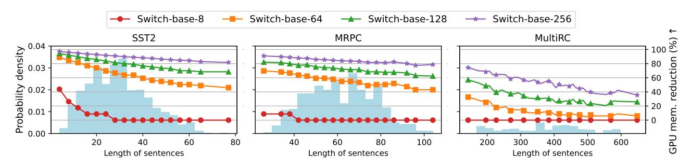

Figure 8. GPU Memory Reduction Rate by SiDA-MoE for Switch Transformers Across Datasets. SiDA-MoE achieves over 60% and 80% reduction on SST2 and MRPC for Switch-base-128 and Switch-base-256, respectively. And in MultiRC, with sentence lengths of 200-500, memory reductions of over 40% for Switch-base-256 and 20% for Switch-base-128 are noted.

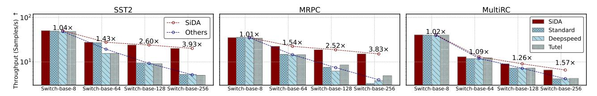

Figure 9. Throughput of Different Methods for Switch Transformers Across Datasets. SiDA-MoE achieves outstanding throughput for large MoE models on all three datasets with various sentence length and comparable results for small MoE models. Specifically, SiDA-MoE achieves  $2.60\times$ ,  $3.93\times$  more throughput on SST2,  $2.52\times$ ,  $3.83\times$  more on MRPC, and  $1.26\times$ ,  $1.57\times$  more throughput on MultiRC for Switch-base-128 and Switch-base-256, respectively.

Table 5. Top-3 Hash Hits Rate. Demonstrating SiDA-MoE's exemplary accuracy on expert activation prediction up to over 99% across various models.

| Backbone        | SST2   | MRPC   | MultiRC |
|-----------------|--------|--------|---------|
| Switch-base-8   | 99.00% | 97.41% | 91.74%  |
| Switch-base-128 | 98.78% | 98.65% | 90.49%  |

ing to a performance degradation down to less than 1% for Switch-base-8. For Switch-base-128, the fidelity is up to 96% leading to a performance loss down to 3%. Our results demonstrate the superiority of SiDA-MoE, which achieves low inference latency and low GPU memory occupation with negligible loss on the model's performance.

#### 4.6 Hash Hits Rate

SiDA-MoE adopts a predictor to predict the experts to be activated for each token. We investigate the accuracy of the predictor in the hash-building thread, which we refer to as the hash hits rate. Results can be found in Table 5 where we report top-3 accuracy. For very long sentences, such as the MultiRC dataset, the hash hits rate can achieve over 90%.

#### 5 RELATED WORK

With the rise of LLM, efficient serving for large models has become a hot topic. Much research has been done by adopting classical model compression methods, such as knowledge distillation (Fu et al., 2023; Li et al., 2023b; Tan et al., 2023; Wang et al., 2023; Wu et al., 2023; Gu et al., 2023; Zhou et al., 2023; Yuan et al., 2023a), quantization (Chee et al., 2023; Frantar et al., 2022; Lin et al., 2023; Cheng et al., 2023; Liu et al., 2023a;b; Shang et al., 2023; Shao et al., 2023; Xiao et al., 2023; Yuan et al., 2023b), and pruning (Frantar & Alistarh, 2023; Ji et al., 2023; Ma et al., 2023; Sun et al., 2023; Xia et al., 2023; Li et al., 2023c). Further, others have been exploring more efficient network architectures (Del Corro et al., 2023; Liu et al., 2023c; Miao et al., 2023; Jiang et al., 2023b; Ning et al., 2023; Spector & Re, 2023; Xu et al., 2023). Besides, some have tackled the efficiency problem from a data perspective by performing text compression (Chevalier et al., 2023; Ge et al., 2023; Valmeekam et al., 2023; Jiang et al., 2023a). However, these works are not specifically designed for MoE models and ignore the sparse expert activation patterns. SiDA-MoE exploits the expert activation patterns to achieve efficient inference. Furthermore, SiDA-MoE is orthogonal to methods such as quantization and pruning, which can be applied to the activated expert networks.

Deploying deep neural networks under resource-limited scenarios has long been an active research area (Mao et al., 2017; Zhou et al., 2019; Wang et al., 2020; Qiu et al., 2024). The efficient deployment of MoE-based models has gain more and more attention recently. SE-MoE (Shen et al., 2022) considers a sophisticated communication scheduling strategy design to improve the throughput in inference.

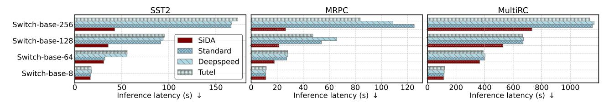

Figure 10. Comparison of Inference Latency Across Different Methods. SiDA-MoE consistently outperforms baselines, especially evident on Switch-base-256 model with latency reduced down to 28%. Notably, improvements are more pronounced as sentence lengths decrease.

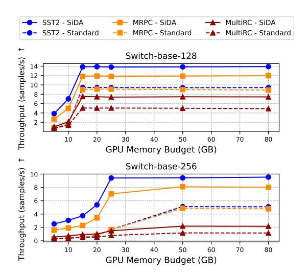

Figure 11. Throughput Efficiency Relative to GPU Memory Budget. SiDA-MoE's advantage is particularly pronounced in constrained GPU memory scenarios, showcasing its superior efficiency by offloading experts compared to the conventional model parallelism, here denoted as 'Standard'.

Specifically, SE-MoE uses dynamic scheduling to overlap movement from CPU memory and inference computation in GPU memory. However, we propose a look-ahead strategy in a data-aware manner. Further, we observe and exploit the inherited sparsity on expert activation in MoE, while SE-MoE considers distillation and compression to reduce the MoE graph. Besides, M3ViT (Fan et al., 2022) proposes a co-design framework and Edge-MoE (Sarkar et al., 2023) accomplish the hardware design of M3ViT. Fan et al. introduce MoE-based models to multi-task learning to allow efficient on-device multi-task learning for both training and inference. SiDA-MoE is different in the sense that the sparse expert path in M3ViT is enforced by the multi-tasks, while we observe and exploit the inherited sparse expert activation pattern in MoE based-model.

We also notice several concurrent works specifically designed for efficient MoE-based model inference (Huang et al., 2023; Kong et al., 2023; Yi et al., 2023). However, SiDA-MoE is orthogonal to these works, which focus on designing better scheduling for caching experts. SiDA-MoE explores a data-aware path that predicts the experts to be

activated. The data-aware approach and the caching scheduling can be combined to achieve better efficiency.

#### 6 DISCUSSION

Enhanced Hierarchical Offloading. While SiDA-MoE offers offloading capabilities between main memory and GPU memory, its limitations are defined by the storage capacity of the main memory. This poses challenges, especially when deploying massive models like Switch-c-2048 with almost 5TB of parameters. A logical progression would be to introduce a layered offloading mechanism that fluidly transfers experts between GPU memory, main memory, and SSD storage. Such an advanced hierarchical approach in SiDA-MoE would make it adept at handling models of any magnitude.

#### **Optimized Hash Graph for Expert Activation Storage.**

Currently, SiDA-MoE utilizes an LSTM model to function as its hash system. It's evident that the expert activation is conditionally contingent upon the activation patterns observed in preceding MoE layers. To enhance efficiency, an ideal hash function could be designed as a graph. This graph would capture and store these conditional dependencies, enabling rapid and effective extraction of expert activation.

#### 7 CONCLUSION

In summary, this paper presents SiDA-MoE, a novel data-aware method that adeptly addresses the challenges posed by the memory constraints of GPUs when serving expansive models, specifically leveraging the sparsity inherent in MoE architectures. Further, SiDA-MoE deploys an offline trained hash function running in the hash-building thread, which alleviates the expert selection overhead by a large margin. Through judicious utilization of both main and GPU memory, SiDA-MoE offers a promising route for serving large MoE models under limited GPU budgets with nearly zero performance setbacks.

#### 8 ACKNOWLEDGEMENTS

This work was supported in part by NSF 2112562 and ARO W911NF-23-2-0224.

### REFERENCES

- Aminabadi, R. Y., Rajbhandari, S., Awan, A. A., Li, C., Li, D., Zheng, E., Ruwase, O., Smith, S., Zhang, M., Rasley, J., et al. Deepspeed-inference: enabling efficient inference of transformer models at unprecedented scale. In *SC22: International Conference for High Performance Computing, Networking, Storage and Analysis*, pp. 1–15. IEEE, 2022.
- Bahdanau, D., Cho, K., and Bengio, Y. Neural machine translation by jointly learning to align and translate. In Bengio, Y. and LeCun, Y. (eds.), *3rd International Conference on Learning Representations, ICLR 2015, San Diego, CA, USA, May 7-9, 2015, Conference Track Proceedings*, 2015. URL [http://arxiv.org/abs/1409.](http://arxiv.org/abs/1409.0473) [0473](http://arxiv.org/abs/1409.0473).
- Brown, T., Mann, B., Ryder, N., Subbiah, M., Kaplan, J. D., Dhariwal, P., Neelakantan, A., Shyam, P., Sastry, G., Askell, A., et al. Language models are few-shot learners. *Advances in neural information processing systems*, 33: 1877–1901, 2020.
- Chee, J., Cai, Y., Kuleshov, V., and De Sa, C. Quip: 2-bit quantization of large language models with guarantees. *arXiv preprint arXiv:2307.13304*, 2023.
- Chen, Z., Deng, Y., Wu, Y., Gu, Q., and Li, Y. Towards understanding the mixture-of-experts layer in deep learning. In Oh, A. H., Agarwal, A., Belgrave, D., and Cho, K. (eds.), *Advances in Neural Information Processing Systems*, 2022. URL [https://openreview.net/](https://openreview.net/forum?id=MaYzugDmQV) [forum?id=MaYzugDmQV](https://openreview.net/forum?id=MaYzugDmQV).
- Cheng, W., Zhang, W., Shen, H., Cai, Y., He, X., and Lv, K. Optimize weight rounding via signed gradient descent for the quantization of llms. *arXiv preprint arXiv:2309.05516*, 2023.
- Chevalier, A., Wettig, A., Ajith, A., and Chen, D. Adapting language models to compress contexts. *arXiv preprint arXiv:2305.14788*, 2023.
- Choquette, J. Nvidia hopper h100 gpu: Scaling performance. *IEEE Micro*, 2023.
- Collobert, R., Bengio, S., and Bengio, Y. A parallel mixture of svms for very large scale problems. *Advances in Neural Information Processing Systems*, 14, 2001.
- Del Corro, L., Del Giorno, A., Agarwal, S., Yu, B., Awadallah, A., and Mukherjee, S. Skipdecode: Autoregressive skip decoding with batching and caching for efficient llm inference. *arXiv preprint arXiv:2307.02628*, 2023.
- Eigen, D., Ranzato, M., and Sutskever, I. Learning factored representations in a deep mixture of experts. *arXiv preprint arXiv:1312.4314*, 2013.

- Fan, Z., Sarkar, R., Jiang, Z., Chen, T., Zou, K., Cheng, Y., Hao, C., Wang, Z., et al. M3vit: Mixture-of-experts vision transformer for efficient multi-task learning with modelaccelerator co-design. *Advances in Neural Information Processing Systems*, 35:28441–28457, 2022.
- Fedus, W., Zoph, B., and Shazeer, N. Switch transformers: Scaling to trillion parameter models with simple and efficient sparsity. *The Journal of Machine Learning Research*, 23(1):5232–5270, 2022.
- Frantar, E. and Alistarh, D. Sparsegpt: Massive language models can be accurately pruned in one-shot. 2023.
- Frantar, E., Ashkboos, S., Hoefler, T., and Alistarh, D. Gptq: Accurate post-training quantization for generative pretrained transformers. *arXiv preprint arXiv:2210.17323*, 2022.
- Fu, Y., Peng, H., Ou, L., Sabharwal, A., and Khot, T. Specializing smaller language models towards multi-step reasoning. *arXiv preprint arXiv:2301.12726*, 2023.
- Ge, T., Hu, J., Wang, X., Chen, S.-Q., and Wei, F. In-context autoencoder for context compression in a large language model. *arXiv preprint arXiv:2307.06945*, 2023.
- Gu, Y., Dong, L., Wei, F., and Huang, M. Knowledge distillation of large language models. *arXiv preprint arXiv:2306.08543*, 2023.
- He, K., Zhang, X., Ren, S., and Sun, J. Deep residual learning for image recognition. In *Proceedings of the IEEE conference on computer vision and pattern recognition*, pp. 770–778, 2016.
- Hinton, G., Vinyals, O., and Dean, J. Distilling the knowledge in a neural network. *arXiv preprint arXiv:1503.02531*, 2015.
- Hochreiter, S. and Schmidhuber, J. Long short-term memory. *Neural computation*, 9(8):1735–1780, 1997.
- Huang, H., Ardalani, N., Sun, A., Ke, L., Lee, H.-H. S., Sridhar, A., Bhosale, S., Wu, C.-J., and Lee, B. Towards moe deployment: Mitigating inefficiencies in mixture-ofexpert (moe) inference. *arXiv preprint arXiv:2303.06182*, 2023.
- Huang, Y., Cheng, Y., Bapna, A., Firat, O., Chen, D., Chen, M., Lee, H., Ngiam, J., Le, Q. V., Wu, Y., et al. Gpipe: Efficient training of giant neural networks using pipeline parallelism. *Advances in neural information processing systems*, 32, 2019.
- Hwang, C., Cui, W., Xiong, Y., Yang, Z., Liu, Z., Hu, H., Wang, Z., Salas, R., Jose, J., Ram, P., et al. Tutel: Adaptive mixture-of-experts at scale. *Proceedings of Machine Learning and Systems*, 5, 2023.

- Jacobs, R. A., Jordan, M. I., Nowlan, S. J., and Hinton, G. E. Adaptive mixtures of local experts. *Neural computation*, 3(1):79–87, 1991.
- Ji, Y., Cao, Y., and Liu, J. Pruning large language models via accuracy predictor. *arXiv preprint arXiv:2309.09507*, 2023.
- Jiang, H., Wu, Q., Lin, C.-Y., Yang, Y., and Qiu, L. Llmlingua: Compressing prompts for accelerated inference of large language models. *arXiv preprint arXiv:2310.05736*, 2023a.
- Jiang, Y., He, Q., Zhuang, X., Wu, Z., Wang, K., Zhao, W., and Yang, G. Recyclegpt: An autoregressive language model with recyclable module. *arXiv preprint arXiv:2308.03421*, 2023b.
- Jordan, M., Ghahramani, Z., and Saul, L. Hidden markov decision trees. *Advances in neural information processing systems*, 9, 1996.
- Jordan, M. I. and Jacobs, R. A. Hierarchical mixtures of experts and the em algorithm. *Neural computation*, 6(2): 181–214, 1994.
- Kaplan, J., McCandlish, S., Henighan, T., Brown, T. B., Chess, B., Child, R., Gray, S., Radford, A., Wu, J., and Amodei, D. Scaling laws for neural language models. *arXiv preprint arXiv:2001.08361*, 2020.
- Kirillov, A., Mintun, E., Ravi, N., Mao, H., Rolland, C., Gustafson, L., Xiao, T., Whitehead, S., Berg, A. C., Lo, W.-Y., et al. Segment anything. *arXiv preprint arXiv:2304.02643*, 2023.
- Kong, R., Li, Y., Feng, Q., Wang, W., Kong, L., and Liu, Y. Serving moe models on resource-constrained edge devices via dynamic expert swapping. *arXiv preprint arXiv:2308.15030*, 2023.
- Lepikhin, D., Lee, H., Xu, Y., Chen, D., Firat, O., Huang, Y., Krikun, M., Shazeer, N., and Chen, Z. Gshard: Scaling giant models with conditional computation and automatic sharding. *arXiv preprint arXiv:2006.16668*, 2020.
- Lewis, M., Bhosale, S., Dettmers, T., Goyal, N., and Zettlemoyer, L. Base layers: Simplifying training of large, sparse models. In *International Conference on Machine Learning*, pp. 6265–6274. PMLR, 2021.
- Li, B., Shen, Y., Yang, J., Wang, Y., Ren, J., Che, T., Zhang, J., and Liu, Z. Sparse mixture-of-experts are domain generalizable learners. In *The Eleventh International Conference on Learning Representations*, 2023a. URL [https:](https://openreview.net/forum?id=RecZ9nB9Q4) [//openreview.net/forum?id=RecZ9nB9Q4](https://openreview.net/forum?id=RecZ9nB9Q4).

- Li, L. H., Hessel, J., Yu, Y., Ren, X., Chang, K.-W., and Choi, Y. Symbolic chain-of-thought distillation: Small models can also" think" step-by-step. *arXiv preprint arXiv:2306.14050*, 2023b.
- Li, Y., Yu, Y., Zhang, Q., Liang, C., He, P., Chen, W., and Zhao, T. Losparse: Structured compression of large language models based on low-rank and sparse approximation. *arXiv preprint arXiv:2306.11222*, 2023c.
- Lin, J., Tang, J., Tang, H., Yang, S., Dang, X., and Han, S. Awq: Activation-aware weight quantization for llm compression and acceleration. *arXiv preprint arXiv:2306.00978*, 2023.
- Liu, J., Gong, R., Wei, X., Dong, Z., Cai, J., and Zhuang, B. Qllm: Accurate and efficient low-bitwidth quantization for large language models. *arXiv preprint arXiv:2310.08041*, 2023a.
- Liu, Z., Oguz, B., Zhao, C., Chang, E., Stock, P., Mehdad, Y., Shi, Y., Krishnamoorthi, R., and Chandra, V. Llm-qat: Data-free quantization aware training for large language models. *arXiv preprint arXiv:2305.17888*, 2023b.
- Liu, Z., Wang, J., Dao, T., Zhou, T., Yuan, B., Song, Z., Shrivastava, A., Zhang, C., Tian, Y., Re, C., et al. Deja vu: Contextual sparsity for efficient llms at inference time. In *International Conference on Machine Learning*, pp. 22137–22176. PMLR, 2023c.
- Loshchilov, I. and Hutter, F. Decoupled weight decay regularization. In *International Conference on Learning Representations*, 2019. URL [https://openreview.](https://openreview.net/forum?id=Bkg6RiCqY7) [net/forum?id=Bkg6RiCqY7](https://openreview.net/forum?id=Bkg6RiCqY7).
- Ma, X., Fang, G., and Wang, X. Llm-pruner: On the structural pruning of large language models. *arXiv preprint arXiv:2305.11627*, 2023.
- Mao, J., Chen, X., Nixon, K. W., Krieger, C., and Chen, Y. Modnn: Local distributed mobile computing system for deep neural network. In *Design, Automation & Test in Europe Conference & Exhibition (DATE), 2017*, pp. 1396–1401. IEEE, 2017.
- Martins, A. and Astudillo, R. From softmax to sparsemax: A sparse model of attention and multi-label classification. In *International conference on machine learning*, pp. 1614– 1623. PMLR, 2016.
- Miao, X., Oliaro, G., Zhang, Z., Cheng, X., Wang, Z., Wong, R. Y. Y., Chen, Z., Arfeen, D., Abhyankar, R., and Jia, Z. Specinfer: Accelerating generative llm serving with speculative inference and token tree verification. *arXiv preprint arXiv:2305.09781*, 2023.

- Ning, X., Lin, Z., Zhou, Z., Yang, H., and Wang, Y. Skeleton-of-thought: Large language models can do parallel decoding. *arXiv preprint arXiv:2307.15337*, 2023.
- OpenAI. Gpt-4 technical report, 2023.
- Qiu, Y., Ma, L., and Priyadarshi, R. Deep learning challenges and prospects in wireless sensor network deployment. *Archives of Computational Methods in Engineering*, pp. 1–24, 2024.
- Raffel, C., Shazeer, N., Roberts, A., Lee, K., Narang, S., Matena, M., Zhou, Y., Li, W., and Liu, P. J. Exploring the limits of transfer learning with a unified text-to-text transformer. *The Journal of Machine Learning Research*, 21(1):5485–5551, 2020.
- Rajbhandari, S., Li, C., Yao, Z., Zhang, M., Aminabadi, R. Y., Awan, A. A., Rasley, J., and He, Y. Deepspeed-moe: Advancing mixture-of-experts inference and training to power next-generation ai scale. In *International Conference on Machine Learning*, pp. 18332–18346. PMLR, 2022.
- Ramesh, A., Dhariwal, P., Nichol, A., Chu, C., and Chen, M. Hierarchical text-conditional image generation with clip latents. *arXiv preprint arXiv:2204.06125*, 1(2):3, 2022.
- Riquelme, C., Puigcerver, J., Mustafa, B., Neumann, M., Jenatton, R., Susano Pinto, A., Keysers, D., and Houlsby, N. Scaling vision with sparse mixture of experts. *Advances in Neural Information Processing Systems*, 34: 8583–8595, 2021.
- Roller, S., Sukhbaatar, S., Szlam, A., and Weston, J. E. Hash layers for large sparse models. In Beygelzimer, A., Dauphin, Y., Liang, P., and Vaughan, J. W. (eds.), *Advances in Neural Information Processing Systems*, 2021. URL [https://openreview.net/forum?](https://openreview.net/forum?id=lMgDDWb1ULW) [id=lMgDDWb1ULW](https://openreview.net/forum?id=lMgDDWb1ULW).
- Saharia, C., Chan, W., Saxena, S., Li, L., Whang, J., Denton, E. L., Ghasemipour, K., Gontijo Lopes, R., Karagol Ayan, B., Salimans, T., et al. Photorealistic text-to-image diffusion models with deep language understanding. *Advances in Neural Information Processing Systems*, 35: 36479–36494, 2022.
- Sarkar, R., Liang, H., Fan, Z., Wang, Z., and Hao, C. Edgemoe: Memory-efficient multi-task vision transformer architecture with task-level sparsity via mixture-of-experts. In *2023 IEEE/ACM International Conference on Computer Aided Design (ICCAD)*, pp. 01–09. IEEE, 2023.
- Shang, Y., Yuan, Z., Wu, Q., and Dong, Z. Pb-llm: Partially binarized large language models. *arXiv preprint arXiv:2310.00034*, 2023.

- Shao, W., Chen, M., Zhang, Z., Xu, P., Zhao, L., Li, Z., Zhang, K., Gao, P., Qiao, Y., and Luo, P. Omniquant: Omnidirectionally calibrated quantization for large language models. *arXiv preprint arXiv:2308.13137*, 2023.
- Shazeer, N., Mirhoseini, A., Maziarz, K., Davis, A., Le, Q., Hinton, G., and Dean, J. Outrageously large neural networks: The sparsely-gated mixture-of-experts layer. In *International Conference on Learning Representations*, 2017. URL [https://openreview.net/forum?](https://openreview.net/forum?id=B1ckMDqlg) [id=B1ckMDqlg](https://openreview.net/forum?id=B1ckMDqlg).
- Shen, L., Wu, Z., Gong, W., Hao, H., Bai, Y., Wu, H., Wu, X., Bian, J., Xiong, H., Yu, D., et al. Se-moe: A scalable and efficient mixture-of-experts distributed training and inference system. *arXiv preprint arXiv:2205.10034*, 2022.
- Smith, S., Patwary, M., Norick, B., LeGresley, P., Rajbhandari, S., Casper, J., Liu, Z., Prabhumoye, S., Zerveas, G., Korthikanti, V., et al. Using deepspeed and megatron to train megatron-turing nlg 530b, a large-scale generative language model. *arXiv preprint arXiv:2201.11990*, 2022.
- Spector, B. and Re, C. Accelerating llm inference with staged speculative decoding. *arXiv preprint arXiv:2308.04623*, 2023.
- Sun, M., Liu, Z., Bair, A., and Kolter, J. Z. A simple and effective pruning approach for large language models. *arXiv preprint arXiv:2306.11695*, 2023.
- Tan, S., Tam, W. L., Wang, Y., Gong, W., Zhao, S., Zhang, P., and Tang, J. [industry] gkd: A general knowledge distillation framework for large-scale pre-trained language model. In *The 61st Annual Meeting Of The Association For Computational Linguistics*, 2023.
- Tresp, V. Mixtures of gaussian processes. *Advances in neural information processing systems*, 13, 2000.
- Valmeekam, C. S. K., Narayanan, K., Kalathil, D., Chamberland, J.-F., and Shakkottai, S. Llmzip: Lossless text compression using large language models. *arXiv preprint arXiv:2306.04050*, 2023.
- Vemprala, S., Bonatti, R., Bucker, A., and Kapoor, A. Chatgpt for robotics: Design principles and model abilities. *Microsoft Auton. Syst. Robot. Res*, 2:20, 2023.
- Wang, A., Singh, A., Michael, J., Hill, F., Levy, O., and Bowman, S. R. Glue: A multi-task benchmark and analysis platform for natural language understanding. *arXiv preprint arXiv:1804.07461*, 2018.
- Wang, A., Pruksachatkun, Y., Nangia, N., Singh, A., Michael, J., Hill, F., Levy, O., and Bowman, S. Superglue: A stickier benchmark for general-purpose language

- understanding systems. *Advances in neural information processing systems*, 32, 2019.
- Wang, P., Wang, Z., Li, Z., Gao, Y., Yin, B., and Ren, X. Scott: Self-consistent chain-of-thought distillation. *arXiv preprint arXiv:2305.01879*, 2023.
- Wang, X., Han, Y., Leung, V. C., Niyato, D., Yan, X., and Chen, X. Convergence of edge computing and deep learning: A comprehensive survey. *IEEE Communications Surveys & Tutorials*, 22(2):869–904, 2020.
- Wolf, T., Debut, L., Sanh, V., Chaumond, J., Delangue, C., Moi, A., Cistac, P., Rault, T., Louf, R., Funtowicz, M., et al. Huggingface's transformers: State-of-the-art natural language processing. *arXiv preprint arXiv:1910.03771*, 2019.
- Wu, M., Waheed, A., Zhang, C., Abdul-Mageed, M., and Aji, A. F. Lamini-lm: A diverse herd of distilled models from large-scale instructions. *arXiv preprint arXiv:2304.14402*, 2023.
- Xia, H., Zheng, Z., Li, Y., Zhuang, D., Zhou, Z., Qiu, X., Li, Y., Lin, W., and Song, S. L. Flash-llm: Enabling cost-effective and highly-efficient large generative model inference with unstructured sparsity. *arXiv preprint arXiv:2309.10285*, 2023.
- Xiao, G., Lin, J., Seznec, M., Wu, H., Demouth, J., and Han, S. Smoothquant: Accurate and efficient post-training quantization for large language models. In *International Conference on Machine Learning*, pp. 38087–38099. PMLR, 2023.
- Xu, M., Xu, Y. L., and Mandic, D. P. Tensorgpt: Efficient compression of the embedding layer in llms based on the tensor-train decomposition. *arXiv preprint arXiv:2307.00526*, 2023.
- Xue, F., Shi, Z., Wei, F., Lou, Y., Liu, Y., and You, Y. Go wider instead of deeper. In *Proceedings of the AAAI Conference on Artificial Intelligence*, volume 36, pp. 8779– 8787, 2022.
- Yang, H., Yue, S., and He, Y. Auto-gpt for online decision making: Benchmarks and additional opinions. *arXiv preprint arXiv:2306.02224*, 2023.
- Yi, R., Guo, L., Wei, S., Zhou, A., Wang, S., and Xu, M. Edgemoe: Fast on-device inference of moe-based large language models. *arXiv preprint arXiv:2308.14352*, 2023.
- Yuan, S., Chen, J., Fu, Z., Ge, X., Shah, S., Jankowski, C. R., Yang, D., and Xiao, Y. Distilling script knowledge from large language models for constrained language planning. *arXiv preprint arXiv:2305.05252*, 2023a.

- Yuan, Z., Niu, L., Liu, J., Liu, W., Wang, X., Shang, Y., Sun, G., Wu, Q., Wu, J., and Wu, B. Rptq: Reorder-based posttraining quantization for large language models. *arXiv preprint arXiv:2304.01089*, 2023b.
- Zhou, Y., Lyu, K., Rawat, A. S., Menon, A. K., Rostamizadeh, A., Kumar, S., Kagy, J.-F., and Agarwal, R. Distillspec: Improving speculative decoding via knowledge distillation. *arXiv preprint arXiv:2310.08461*, 2023.
- Zhou, Z., Chen, X., Li, E., Zeng, L., Luo, K., and Zhang, J. Edge intelligence: Paving the last mile of artificial intelligence with edge computing. *Proceedings of the IEEE*, 107(8):1738–1762, 2019.