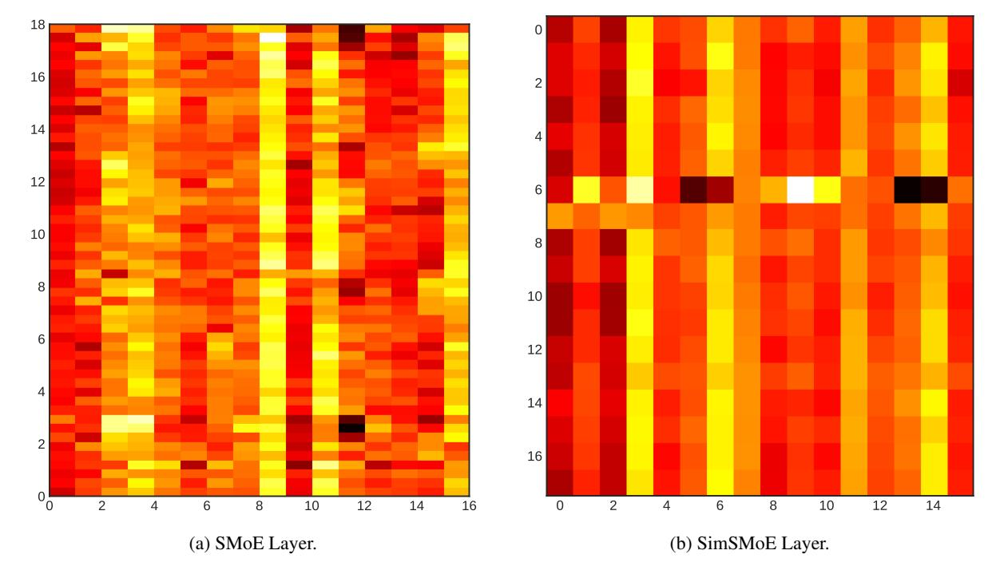

# Supplementary Material for "SimSMoE: Solving Representational Collapse via Similarity Measure"

This document is structured as follows: Appendix B provides detail materials for SimSMoE algorithm, ablation studies results, and representation collapse analysis. Appendix C offers a detailed settings for our experiments in Section 4.

## <span id="page-12-7"></span>**B** Additional Materials

#### **B.1** SimSMoE Algorithm details

The training procedure for similarity-based SMoE can be succinctly outlined in four steps. First, compute the shared tokens per expert pair through router G(x), updating the total input tokens for each expert accordingly to verify the frequency condition. Next, assess the similarity among chosen

experts. If this similarity surpasses the predefined threshold, proceed to update the total loss. Finally, refine the overall loss using the same optimization approach employed in traditional SMoE training.

```
Algorithm 1: Pseudo-code to train SimSMoE.
```

```
1 Algorithm SimSMoE Training(\{t, y_t\}_{i=1}^N)
          Require: SMoE; \mathcal{L}_B (Balancing
                           Loss); \mathcal{L}_S (Similarity Loss);
                           tr (# tokens per expert);
                           Router R; Expert_i;
                            Expert_i; f^*; T^*; \lambda; \beta
          Result: \mathcal{L} (Final Loss)
          for i \leftarrow 1 to N do
2
                 Receive a token t
3
                 f_t \leftarrow tr(t)
 4
                 if f_t \geq f^* then
 5
                       \hat{y}_i \leftarrow Expert_i(t)
 6
                       \hat{y}_i \leftarrow Expert_i(t)
 7
                       T_t \leftarrow \mathcal{L}_S(\hat{y}_i, \hat{y}_i)
 Q
                       \mathcal{L}_B \leftarrow \lambda \mathcal{L}_B(R)
 9
                       if T_t \geq T^* then
10
                              \hat{y} \leftarrow SMoE(t)
11
                              \mathcal{L}_S \leftarrow \beta T_t
12
                              \mathcal{L} \leftarrow \mathcal{L}_{token}(\hat{y}, y) + \mathcal{L}_B + \mathcal{L}_S
13
                       else
14
                              \hat{y}_t \leftarrow SMoE(t)
15
                             \mathcal{L} \leftarrow \mathcal{L}_{token}(\hat{y}, y) + \mathcal{L}_{B}
```

#### <span id="page-12-6"></span>**B.2** Ablation Studies results

## **B.3** Representation Collapse Analysis

#### <span id="page-12-8"></span>C Experiments implementation details

This section provides detailed parameters of our experiments in Section 4.

#### **C.1** General Settings

The experiments are based on the publicly available CompeteSMoE implementation(Pham et al., 2024)<sup>1</sup>. However, the pre-training was conducted on a single A100 GPU, so results might differ when using parallel training on multiple GPUs.

### **C.2** Pre-training Experiments

Table 7 provides the detailed configurations for pre-training Brainformer (Zhou et al., 2024),

<span id="page-12-9"></span><sup>1</sup>https://github.com/giangdip2410/CompeteSMoE

<span id="page-13-1"></span>

Figure 5: Exploration of the impact of similarity learning on diversity model representation. Figure (a) shows the heatmap of differences between the hidden representations of two experts for the SMoE layer. Figure (b) shows the heatmap of differences between the hidden representations of two experts for the SimSMoE layer.

<span id="page-13-0"></span>Table 6: Pretraining tiny Brainformer on enwik8 across different hyperparameter settings

(a) Comparison of frequency of the collapse issue checking for SimSMoE.

(b) Effects of Similarity threshold during pretraining.

| $f^*$ | BPC  |   | $T^*$ | BPC  |
|-------|------|---|-------|------|
| 1     | 1.56 |   | 0.1   | 1.54 |
| 4     | 1.58 |   | 0.3   | 1.55 |
| 8     | 1.55 |   | 0.3   | 1.54 |
| 16    | 1.54 |   | 0.7   | 1.55 |
| SMoE  | 1.69 |   | 0.9   | 1.55 |
|       |      | - | SMoE  | 1.69 |

(c) Pretraining tiny Brainformer on enwik8 across different hyperparameter settings.

| β     | BPC  |
|-------|------|
| 0.005 | 1.55 |
| 0.01  | 1.54 |
| 0.05  | 1.56 |
| 0.1   | 1.54 |
| 0.2   | 1.57 |
| SMoE  | 1.69 |

GLaM (Du et al., 2022), and Mistral (Jiang et al., 2024) on Enwik8, Text8 and Wikitext-103.

<span id="page-13-2"></span>

| Enwik8 512 48 Ac       |            |     |
|------------------------|------------|-----|
| Eliwiko 312 40 AC      | dam 4.5e-4 | 50k |
| Text8 512 48 Ac        | dam 4.5e-4 | 50k |
| Wikitext-103 512 22 Ac | dam 4.5e-4 | 50k |

Table 7: Hyperparameter settings for pre-training experiments on Enwik8, Text8 and Wikitext-130.

#### **C.3** fine-tuning Experiments

For fine-tuning experiments, we employ the identical model architecture as in pre-training. Table 8 presents the detailed configurations utilized for fine-tuning experiments on SST-2, SST-5, IMDB, and BANKING77 datasets.

<span id="page-13-3"></span>

| Dataset   | Input length | Batch size | Optimizer | Lr   | # Epochs |
|-----------|--------------|------------|-----------|------|----------|
| SST-2     | 512          | 16         | Adam      | 1e-4 | 5        |
| SST-5     | 512          | 16         | Adam      | 1e-4 | 5        |
| IMDB      | 512          | 4          | Adam      | 1e-4 | 5        |
| BANKING77 | 512          | 16         | Adam      | 1e-4 | 50       |

Table 8: Detail settings for fine-tuning experiments on the evaluation datasets.