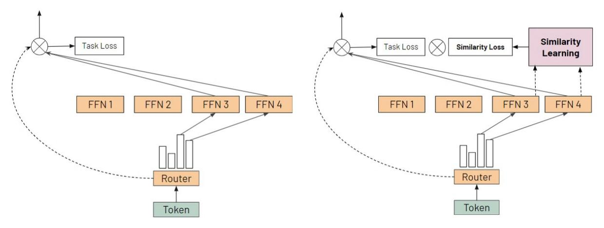
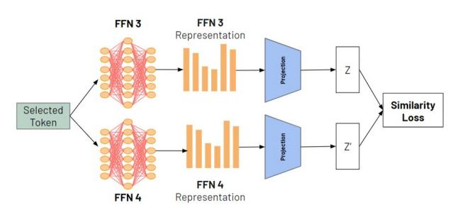
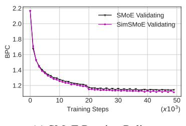

# 3.2 Similarity of Neural Network Representations

Inspired by the Similarity Index (Kornblith et al., 2019a), the Similarity Learning module addresses the representation collapse problems from two perspectives. First, the module directly measures a similarity score among experts and helps to identify which experts fail in diversity representation. Then, the Similarity Learning reduces the collapse issue by optimizing the Similarity Loss. Second, the Similarity Learning focuses on solving the collapse at the hidden representations of experts. This allows the method to leverage the advantages of routing techniques such as SMoE with the Balancing Loss (Fedus et al., 2022); X-MoE(Chi et al., 2022) StableMoE (Dai et al., 2022). We propose using similarity index based on centered kernel alignment (CKA) (Kornblith et al., 2019a) reliably identifies correspondences between representations in neural networks and an MLP with one hidden layer as a projection head (Figure 2) that maps representations to the space where the similarity loss is applied. Empirically, when scaling the model to larger hidden dimensions, we observe that the projection space can be increased, but one of the good choices is around N, with N is number of experts. Kornblith et al. (2019) (Kornblith et al., 2019a) introduces two versions of CKA: Linear CKA (LCKA) which focuses on linear kernel:  $K_{lin} = (x_i \cdot x_j)_{i,j}$ ; and RBF CKA (RCKA) which applies Gaussian RBF ker-

ckA (RCKA) which applies Gaussian RBF kernel: 
$$K_{G(\sigma)} = \left(e^{\frac{-\left|x_i - x_j\right|^2}{2\sigma^2}}\right)_{i,j}$$
. LCKA and RCKA give similar results in practice (Korphlith et al.

give similar results in practice (Kornblith et al., 2019a). For RCKA, selecting bandwidth  $\sigma$  determines the extent to which the similarity of small distances is emphasized over large distances. When training the Similarity Learning Layer as Figure 2, we empirically observe that a larger  $\sigma$  performs more stably, so we recommend choosing  $\sigma$  in the range of [0.8, 0.9].

(a) Sparse Mixture-of-Experts (SMoE) Architecture

(b) SimSMoE Architecture (Ours)

Figure 1: Illustration of the proposed SimSMoE architecture and a SMoE architecture. (a) A SMoE architecture selectively activates experts based on dot-product token-expert routing scores, directing the selected token to the chosen experts. (b) A SimSMoE architecture mitigates the issue of representation collapse by reducing the similarity among the selected experts.

Figure 2: A Similarity Learning Layer (ours) to minimize the similarity among experts.

$$CKA(K, L) = \frac{tr(KHLH)}{\sqrt{tr(KHKH)tr(LHLH)}}$$
(3)

where  $|||_F$  is the Frobenius norm and tr is the trace function. For RBF CKA, K and L are kernel matrices constructed by evaluating the RBF kernel, and H is the centering matrix  $H_n = I_n - \frac{1}{n} \mathbf{1} \mathbf{1}^T$ .

## 3.3 Training Objective

The training objective is jointly minimizing the loss of the target task, an auxiliary balancing loss (Fedus et al., 2022; Chi et al., 2022) ( $\mathcal{L}^{\text{balancing}}$ ) and a similarity loss ( $\mathcal{L}^{\text{similarity}}$ ). Given  $K_i$ ,  $L_j$  as the hidden representations of the i-th expert and the j-th

expert respectively, the similarity loss is calculated based on the equation (3) as follows:

$$\mathcal{L}^{\text{similarity}} = CKA(K_i, L_j)$$

The overall training objective is to minimize:

$$\mathcal{L} = \mathcal{L}_{task} + \alpha \cdot \mathcal{L}^{balancing} + \beta \cdot \mathcal{L}^{similarity}$$

where  $\alpha$ ,  $\beta$  are coefficients for the balancing loss and the similarity loss respectively. The term  $\mathcal{L}_{task}$  is defined by the specific task that Large Language Models (LLMs) are learning. For instance, we employ the masked language modeling loss for pre-training and fine-tuning on downstream tasks.

## 4 Experiment

We evaluate SimSMoE on both the mask language modeling task and downstream tasks and compare the performance of the algorithm to other state-of-the-art routing methods for SMoE training. We also present a detailed analysis of the impact of our method in addressing the representation collapse.

## 4.1 Experimental Settings

**NLP tasks.** We investigate two common tasks in pre-training and fine-tuning of LLMs. Firstly, we perform character-level language modeling on the enwik8 (Mahoney, 2011) or text8 datasets (Mahoney, 2011), which are commonly used to evaluate a model's pre-training capabilities. As is common practice, we follow the default training, validation, and testing splits. Secondly, we fine-tune

| Archit      | ecture     | Enwik8 (BPC) | Text8 (BPC) | WikiText-103 (PPL) |
|-------------|------------|--------------|-------------|--------------------|
|             | # Params   |              | 135M        |                    |
|             | SimSmoE    | 1.08         | 1.20        | 31.77              |
| Brainformer | SMoE       | 1.11         | 1.21        | 32.75              |
|             | XMoE       | 1.10         | 1.24        | 32.69              |
|             | Stable MoE | 1.10         | 1.23        | 32.10              |
|             | # Params   |              | 28M         |                    |
|             | SimSmoE    | 1.13         | 1.24        | 37.30              |
| GLaM        | SMoE       | 1.14         | 1.26        | 37.39              |
|             | XMoE       | 1.16         | 1.27        | 37.62              |
|             | Stable MoE | 1.16         | 1.25        | 37.67              |
|             | # Params   |              | 63M         |                    |
|             | SimSmoE    | 1.11         | 1.21        | 32.51              |
| Mistral     | SMoE       | 1.12         | 1.23        | 33.23              |
|             | XMoE       | 1.13         | 1.24        | 32.83              |
|             | Stable MoE | 1.13         | 1.23        | 33.78              |

Table 1: Bits-per-character (BPC) on the enwik8 and text8 test sets, and perplexity on the WikiText-103 test set. Lower values are better, with the best results highlighted in bold.

the models on downstream applications to investigate their capability to adapt to different domains. For this purpose, we consider pre-trained large models on enwik8 and text8; then fine-tuning the method on downstream tasks. We select common NLP tasks to evaluate pre-trained models, including the SST-2 (Socher et al., 2013), SST-5 (Socher et al., 2013), IMDB (Maas et al., 2011), and BANK-ING77 (Casanueva et al., 2020) datasets.

Architecture. We contemplate three advanced SMoE architectures: (i) the Brainformer (Zhou et al., 2024); (ii) GLaM (Du et al., 2022); (iii) and Mistral (Jiang et al., 2024), all of which are decoder-only architectures. Training massive Large Language Models (LLMs) is impractical without substantial industrial resources due to limitations in computational resources. Consequently, we study four model configurations: (i) tiny: with two Brainformer layers and 3.9M parameters; (ii) small: with ten GLaM layers and 28M parameters; and (iii) medium: with seven Mistral layers and 63M parameters; (iv) large: with ten Brainformer layers and 135M parameters. Rather than striving for state-of-the-art results, we assess the scalability and effectiveness of our algorithm by evaluating multi-scaled models across various datasets. After that, we run vast investigations using the tiny model to comprehend the behaviors of the algorithm and its robustness to different design choices.

**Baselines.** In order to showcase the effectiveness of our method, we establish baselines using the cutting-edge routing methods, including

SMoE with the balancing loss (Fedus et al., 2022), StableMoE (Dai et al., 2022), XMoE (Chi et al., 2022). Moreover, these baselines incorporate advanced SMoE architectures such as GLaM (Du et al., 2022), Brainformer (Zhou et al., 2024), Mis**tral** (Jiang et al., 2024). GLaM(Du et al., 2022) interleaves dense transformer blocks with sparse ones, scaling the capacity of LLMs while significantly reducing training costs compared to dense variants. Brainformer (Zhou et al., 2024), an improved version of GLaM, further enhances performance by reducing the frequency of attention and modifying layer widths and types, making LLMs faster and more efficient than GLaM. Lastly, Mistral (Jiang et al., 2024) has been successful to scale up LLMs to 34B parameters that outperform the previous state-of-the-art LLMs in reasoning, mathematics, and code generation tasks. SMoE uses a trainable MLP routing mechanism with a balancing loss (Fedus et al., 2022), which encourages a balanced load across experts. StableMoE (Dai et al., 2022) introduces a two-phase training approach, initially focusing solely on training the router and subsequently training the experts with the router fixed, while **XMoE** (Chi et al., 2022) features a deep router that includes a down-projection and normalization layer along with a gating network with learnable temperatures.

**Pre-training and fine-tuning.** SimSMoE fully utilizes all the advantages of routing algorithms, so most of its experimental settings are the same as the baselines for a fair comparison. For the language modeling experiments, we optimize the LLMs pretraining for 50,000 steps using an Adam (Kingma and Ba, 2017) optimizer with a linear learning rate schedule. The checkpoint with the lowest validation loss is used to report the final performance on the test set. For routing mechanisms, we apply the default hyper-parameter configurations for both the baselines and SimSMoE. On the top of that, there are two main hyper-parameters only for SimSMoE: the frequency for checking the collapse issue: fand the threshold for identifying the collapse issue: T. Next, we cross-validate f with respect to the optimal T found. We use the pretrained checkpoint of Mistral models on enwik8 for each fine-tuning dataset, and exclude the last layer. Lastly, we employ a randomly initialized fully connected layer as the classifier and fine-tune all methods for a few epochs using the same learning rate.

#### 4.2 Language Modeling Evaluation

**Pre-training Language Models.** In contrast to the baselines, SimSMoE incorporates the Similarity Learning Layer to mitigate representation collapse. As a result, SimSMoE includes an additional 0.08M to 0.16M parameters compared to the baselines. Table 1 presents the evaluation metrics of SimSMoE versus state-of-the-art strategies. Additionally, we also report the evolution of the performance on the validation set of the SMoE models with various routing policies in Figure 3. We initially note that among all routing methods, SimSMoE consistently outperforms the baselines across all datasets for the three decoder-only architectures. Moreover, advanced strategies such as XMoE (Chi et al., 2022) or StableMoE (Dai et al., 2022) generally surpass the vanilla SMoE method. Nevertheless, the enhancements achieved by these strategies are often inconsistent or marginal. In contrast, SimSMoE consistently outperforms other competitors on all benchmarks (note that the BPC metric is log-scaled), architectures, and offers a faster convergent rate (Figure 3). This outcome underscores SimSMoE's proficiency for learning an effective routing policy to facilitate the masked language modeling task.

Large Scale Pre-training. To demonstrate the effectiveness of our method for scaling up language models, we conducted experiments on the Enwik8 dataset using larger variants of Brainformer with 64 experts and 1.031 B parameters. Each experiment was repeated three times with different random seeds, and we report the average results along with the standard deviation in Table 2. SimSMoE consistently outperforms other baselines on Enwik8 at a large scale in both average performance and stability, demonstrating that our method is not only effective for large-scale language models but also more reliable compared to the baselines. Beside that, we observe that the performance gap between SimSMoE and the baseline grows as the model size increases, particularly for K = 1, 2, 4. However, for larger K (K > 4), this gap narrows because our method primarily targets collapse problems, which become less critical at higher K values. Despite this, using a K large is not practical, as it introduces computational inefficiencies and reduces the advantages of the Sparse Mixture of Experts approach due to longer inference times. These findings align with our analysis and confirm that our method remains effective and efficient, even for

large-scale models with over 1 billion parameters.

| Architecture | Dataset      | # Params | # Experts | K      | SMoE                                     | StableMoE                                                                            | SimSMoE                                  |
|--------------|--------------|----------|-----------|--------|------------------------------------------|--------------------------------------------------------------------------------------|------------------------------------------|
| Brainformer  | Enwik8 (BPC) | 1.031 B  | 64        | 2 4 | $1.10_{\pm 0.004}$ $1.09_{\pm 0.005}$ | $1.14_{\pm 0.012}$ $1.10_{\pm 0.008}$ $1.10_{\pm 0.006}$ $1.11_{\pm 0.004}$ | $1.08_{\pm 0.002}$ $1.08_{\pm 0.002}$ |

Table 2: Bits-per-character (BPC) results on the Enwik8 test set for pre-training the Brainformer model with over one billion parameters. B represents billion ( $10^9$ ).

#### 4.3 Fine-tuning Evaluation

| Method    |      | SST- | 2      |      | SST- | 5      |      | IMDI | В      | BA   | NKIN | G77    |
|-----------|------|------|--------|------|------|--------|------|------|--------|------|------|--------|
|           | SimS | MoE  |        | SimS | MoE  |        | SimS | MoE  |        | SimS | MoE  |        |
| Algorithm | No   | Yes  | vs. No | No   | Yes  | vs. No | No   | Yes  | vs. No | No   | Yes  | vs. No |
| SMoE      | 81.5 | 82.8 | +1.3   | 36.9 | 37.8 | +0.9   | 85.2 | 85.7 | +0.5   | 74.6 | 79.4 | +4.8   |
| XMoE      | 82.2 | 82.5 | +0.3   | 34.5 | 37.4 | +2.9   | 84.3 | 84.6 | +0.3   | 78.6 | 79.5 | +0.9   |
| StableMoE | 81.0 | 82.1 | +1.1   | 36.4 | 36.7 | +0.3   | 85.0 | 85.3 | +0.3   | 74.1 | 77.0 | +2.9   |

Table 3: Accuracy of the model after fine-tuned on various datasets. Higher is better, best and comparing results are in bold.

Fine-tuning from Pre-training weights. Table 3 reports the accuracy of the models fine-tuned on the test sets of various datasets. Overall, we observe that SimSMoE demonstrates strong transfer learning capabilities by achieving the highest accuracy on all datasets. Notably, on the more challenging datasets of SST-5 and BANKING77, which have fewer training samples or more classes, we observe larger performance gains from SimSMoE versus the remaining baselines (over 3% improvements compared to the base methods). This result shows that SimSMoE can boost model performance through solving the collapse issue, which is not only good for pre-training but also exhibits strong transfer capabilities to various downstream tasks.

Fine-tuning for Classification Tasks. We also evaluate our method using pretrained language models to assess its effectiveness. Following the experimental setup by MEO (He et al., 2023), we fine-tune BERT-family models (Devlin et al., 2019) using Sparse Mixture of Experts. The fine-tuning results on the GLUE benchmarks (Wang et al., 2018a) are recorded in Table 4. The results demonstrate that our method outperforms both SMoE and MEO on the GLUE benchmark, indicating that SimSMoE is not only effective for pre-training tasks but also performs well on existing pretrained models, such as those in the BERT family.

**Fine-tuning for Other NLP Tasks.** SimSMoE delivers strong performance across a range of NLP tasks, including *question answering*, *text summa-rization*, and *language modeling*. Detailed benchmark results are provided in Table 5.

(a) SMoE Routing Policy

(b) XMoE Routing Policy

(c) StableMoE Routing Policy

Figure 3: Bit-per-Character (BPC) on validation dataset during the training phase reported for Mistral (Jiang et al., 2024) across the three routing mechanisms. (a) SMoE with the Balancing Loss. (b) XMoE. (c) StableMoE

| Model                 |      |       |      | BERT-Base-Cased |      |      |      |      |      |
|-----------------------|------|-------|------|-----------------|------|------|------|------|------|
| Dataset               | CoLA | SST-2 | MRPC | STS-B           | QQP  | MNLI | QNLI | RTE  | .avg |
| SimSMoE               | 53.0 | 92.1  | 75.7 | 86.6            | 90.2 | 84.0 | 90.7 | 59.6 | 79.0 |
| SMoE                  | 47.1 | 92.2  | 74.5 | 86.6            | 90.2 | 83.5 | 90.1 | 58.5 | 77.8 |
| MEO (He et al., 2023) | 49.1 | 92.3  | 76.2 | 86.3            | 89.8 | 83.9 | 90.5 | 59.2 | 78.4 |

Table 4: Fine-tuning BERT model on the GLUE benchmark. Higher is better, best results are in bold.

| Model | Dataset    | Task               | SMoE | MEO  | SimSMoE | Metric |
|-------|------------|--------------------|------|------|---------|--------|
| BART  | XSum       | Summarization      | 22.4 | 22.2 | 22.6    | R2     |
| T5    | SQuAD      | Question Answering | 82.1 | 82.0 | 82.8    | EM     |
| GPT2  | Wikitext-2 | Language Model     | 21.1 | 20.9 | 20.6    | PPL    |

Table 5: Fine-tuning results across three different architectures including BART, T5, and GPT-2. XSum, SQuAD, and WikiText-2 are evaluated using ROUGE-2 (R2), Exact Match (EM), and Perplexity (PPL), respectively. The best results are highlighted in bold.

We employ BART-Large (Lewis et al., 2019) on XSum (Narayan et al., 2018), T5-Base (Raffel et al., 2023) on SQuAD (Rajpurkar et al., 2016), and GPT-2-Small (Radford et al., 2019) on WikiText-2 (Merity et al., 2016) for evaluation. The results show that our approach outperforms baseline models across multiple NLP tasks, highlighting SimSMoE's effectiveness in both pre-training and fine-tuning the SMoE architecture.

#### 4.4 Ablation Studies

We explore the robustness of SimSMoE under various hyper-parameter settings, conducting all experiments with the tiny Brainformer architecture (Zhou et al., 2024).

**SimSMoE Frequency.** Since checking the collapse issue for all expert pairs is very costly, as discussed in Section 3.1, it is necessary to control computational resources by  $f^*$ , which determines the frequency of collapse issue identification. To demonstrate the effectiveness of our algorithm, we analyze the relationship between  $f^*$  and SMoE model performance as the checking frequency increases. All experiments are pretrained under the same settings and evaluated on the enwik8 dataset

for a fair comparison. The results reported in Table 6a confirm that SimSMoE is effective, consistent with the assumption, as the threshold  $f^*$  increases.

Quality Control. In practice,  $T^*$  is a hyperparameter that controls the quality of SimSMoE by determining the level of similarity that can be considered a collapse issue. The value of  $T^*$  ranges from 0 to 1. A low  $T^*$  means more experts pairs are considered collapsed, while a high  $T^*$  means fewer experts are treated as collapsed. Empirically, we find that setting  $T^*$  within the interval [0.3, 0.7] is effective, with a good initial value being 0.5. Table 6b shows the pretraining performances of various threshold  $T^*$  on enwik8 dataset.

Coefficients of the Similarity Loss. Coefficient  $\beta$  determines the weight of the Similarity Loss contribution to the total SMoE Loss. A high value of  $\beta$  implies that the model focuses on addressing the collapse, while a low value of  $\beta$  indicates the model prioritizes the task loss. Table 6c presents the results of the tiny Brainformer across various  $\beta$  values.

