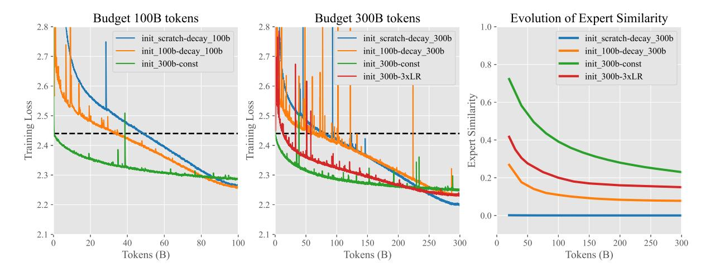

# 3 Upcycling vs. From Scratch

We initiate our discussion by exploring the core issue of upcycling versus training from scratch, a critical consideration in the realm of MoE training. We present our initial experimental findings, comparing the advantages and disadvantages of upcycling from dense model checkpoints versus training a MoE model of equivalent size from scratch.

#### 3.1 Costs and Budgets

There are two distinct scenarios:

- Sunk Cost: The resources already spent on training the dense model are considered a sunk cost. These are not included in the cost calculations for subsequent upcycled MoE training. This scenario typically applies when utilizing pre-trained dense models, such as those available from open-source platforms.
- Cumulative Cost: The resources used to train the dense model are included in the total training cost for the upcycled MoE. This occurs when resources are deliberately allocated to first train a dense model, which is then used as a starting point for upcycling.

Our discussion will primarily focus on the first scenario, as it will later become clear that allocating resources to train a dense model solely for the purpose of MoE initialization is generally suboptimal.

A priori, the decision to upcycle versus train from scratch should consider the performance of the available dense model and the MoE training budget. On the one hand, if the budget is insufficient to train an MoE from scratch to match or exceed the performance of the dense model, training from scratch is trivially not a sensible option. On the other hand, with ample resources (e.g., significantly more than what was used to train the dense model), training an MoE from scratch might yield better outcomes as it avoids the limitations of starting with a group of identical experts, which can hinder diversification.

#### 3.2 Experiment Results

In our experiments, we first train a 0.3B dense model for 300B tokens with peak learning rate 3e-3 gradually decaying to 3e-4, obtaining a number of intermediate checkpoints. We focus on upcycling the checkpoints that have undergone 100B and 300B tokens of training, which we denote by "checkpoint-100B" and "checkpoint-300B" respectively. We then train several MoE models having the same architecture of 8 experts, but with different weight initialization scheme (from-scratch/checkpoint-100B/checkpoint-300B) and peak learning rate. We conduct this training under two different training budgets: 100 billion and 300 billion tokens.

For the experiments under a budget of 100B tokens, we compare the following:

- init\_scratch-decay\_100b: From scratch with a peak learning rate of 3e-3 (same as the dense model).
- init\_100b-decay\_100b: Upcycling from the 100B checkpoint with a peak learning rate of 1.8e-3.
- init\_300b-const: Upcycling from the 300B checkpoint with a constant learning rate of 3e-4.

For the larger 300B tokens budget, we retrain all models with an extended learning rate decay period of 300B tokens. We also train an additional MoE initialized from checkpiont-300B, but with an increased peak learning rate of 1.2e-3. We denote this model by init\_300b-3xLR. Throughout our experiments, we maintain the same minimum learning rate 3e-4 and decay the learning rate gradually with cosine schedule.

All results are reported in Fig. [1.](#page-3-0) The plot on the left panel indicates that with a moderate budget of 100B tokens, the model trained from scratch achieved similar performance to the model upcycled from checkpoint-100B. Despite starting from a much higher initial loss, both models eventually caught up to and surpassed the performance of the model upcycled

Figure 1: Training dynamics under different conditions and budgets. Left: Loss curves for MoE training initialized by upcycling and from scratch with 100B token budget. Middle: Similar comparison for a 300B token budget. Right: Evolution of average expert similarity during MoE training with a 300B token budget. The dashed line marks the final loss of a 0.3B dense model at the end of 300B tokens.

from checkpoint-300B. We attribute the poorer performance of the latter to its overly small learning rate of 3e-4. The plot in the middle reveals that with a larger budget of 300B tokens, the model trained from scratch outperforms all of its upcycled counterparts. Among the upcycled models, the one trained with the smallest learning rate again delivers the poorest result, underscoring the critical role of learning rate schedules in training MoE models. The plot on the right shows the decreasing trend of the average expert similarity during training for the upcycled MoEs, revealing that the process of training an upcycled MoE involves the diversification of experts. Notably, the model with the highest expert similarity exhibits the weakest performance, reinforcing the idea that expert similarity can serve as an effective monitoring metric during MoE training when models are initialized through upcycling. In contrast, throughout the training, the expert similarity for the from-scratch MoE remains at zero, suggesting that a non-uniform expert initialization encourages diversification.

#### 3.3 Rules of Thumb for Upcycling

Let us denote by C the cost of training an 0.3B dense model for 300B tokens. Then, for a corresponding MoE moddel, the training costs for 100B and 300B tokens are roughly  $\frac{2}{3}C$  and 2C respectively1. Our experiment results state

that in our setting with a moderate training budget of  $\frac{2}{3}C$ , an MoE trained from scratch is able to achieve similar performance to an upcycled one, initialized from dense checkpoints that has undergone pre-training of budget C. If, however, the training budget for MoE is 2C, twice of the training budget of the dense checkpoint, then an MoE trained from scratch performs significantly better than its upcycled counterpart.

Let us denote by  $C_{\rm dense}$  the cost to train the dense model from which one can choose to upcycle from for the MoE training, and by  $C_{\rm MoE}$  the training budget for the MoE model itselt. Our findings suggests the following rule of thumb on whether or not to adopt upcycling when upcycling is possible is given as follows:

- If  $C_{\text{MoE}} \ll C_{\text{dense}}$ , then one should prefer upcycling over training from scratch to maximally exploit the sunk cost invested in the dense model.
- If  $C_{\text{MoE}} \geq 2C_{\text{dense}}$ , then one should stick to the conventional method of training from scratch over upcycling, as the benefit of upcycling from a pre-trained checkpoint cannot compensate for the difficulty of expert diversification due to the uniformity of initialized

times the number of activation parameters compared to the dense model. If we also take into account of the communication overhead associated with expert parallelism, training the MoE model requires roughly twice the GPU hours compared to its dense counterpart for the same number of tokens.

&lt;sup>1This estimation is based on our use of top-2 routing in the MoE model, which results in approximately 1.7

experts.

- If one does not have a pre-trained dense checkpoint to upcycle from, then this corresponds to the case CMoE ≫ Cdense = 0. As a consequence, one should always train the MoE from scratch.
- When training an upcycled MoE, one should carefully tune the learning rate schedule. Different learning rate schedule may yield different

