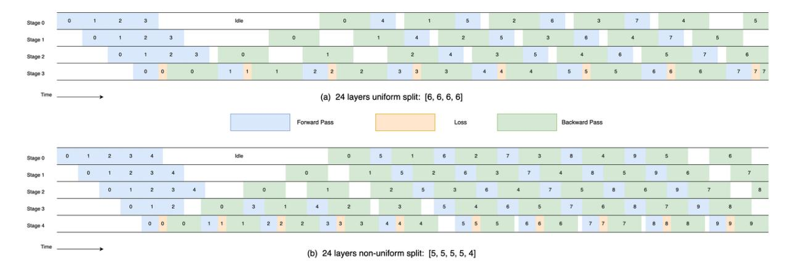

# B Infrastructure

The Skywork-MoE model leverages our internally developed training framework, Skywork-Megatron, which is built on the Megatron-LM [\(Shoeybi et al.,](#page-9-18) [2020;](#page-9-18) [Narayanan et al.,](#page-9-19) [2021\)](#page-9-19) 23.06 branch. Within this framework, we have implemented a custom MoE architecture that includes gating layer, expert layer, and a tailored distributed parallel strategy.

#### B.1 Expert Data Parallel (EDP)

Figure 5: Illustration of Expert Data Parallism (EDP). In EDP, the attention part runs as Tensor Parallelism, while the FFN part runs as Expert Parallelism.

We introduces a unique parallelization strategy named Expert Data Parallelism (EDP). Existing parallelism strategies for MoE training in Megatron-LM Core 0.6.0 include Expert Parallelism (EP) and Expert Tensor Parallelism (ETP).

- EP is characterized by SizeEP = SizeDP ∗ SizeT P . As EP does not support further split of single expert, there is also a constraint that SizeEP cannot exceed the total number of experts. Consequently, with EP the number of GPUs that can be used to train the MoE is bounded by a multiple of the number of experts.
- ETP is characterized by SizeEP = SizeDP . As ETP allows splitting one expert onto multiple GPUs (SizeT P ), it supports larger cluster size than that of EP. The downside is that ETP has a larger communication overhead fom AlltoAll operation between experts, which my increases rapidly with SizeT P .

Our EDP is defined by SizeEP = SizeT P . This approach is particularly effective for models with a moderate number of experts (e.g., no greater than 64), optimizing the AllToAll communication during the routing of tokens by the gating layer. In the EDP configuration (see Figure [5](#page-10-1) for an illustration), the same data traverses both the TP Group in the attention layer and the EP Group in the expert layer. The device mesh configuration for Attention and Expert weights is represented as [SizeP P , SizeDP , SizeT P ] and [SizeP P , SizeDP , SizeEP ], respectively.

#### B.2 Unbalanced Pipeline Parallellism

The Skywork-MoE model employs a custom approach to Pipeline Parallelism (PP) and gradient recomputation to achieve better load balancing across both GPU computation and memory usage in various pipeline stages. Standard pipeline parallel implementations often suffer from computational bottlenecks, particularly in the last stage due to the loss calculation. In Figure [6](#page-11-0) we present an example of a model with 24 layers. In this example, adjusting the segmentation of transformer layers from a uniform [6, 6, 6, 6] to [5, 5, 5, 5, 4] reduces pipeline bubble time by up to 10%, enhancing overall computational efficiency. Similarly, gradient recomputation (via checkpointing) is adapted differently across the stages. With large differences in buffer sizes across the stages, configuring varied recomputation layer numbers for each stage helps in balancing memory utilization and computational overhead effectively.

Figure 6: Comparison of bubble time between uniform and non-uniform split pipeline parallelism (PP) in a 24-layer transformer network. (a) Uniformly split into four PP stages, each containing six layers, resulting in significant bubble formation due to the computational demands of loss calculation. (b) Non-uniformly split into five PP stages configured as [5, 5, 5, 5, 4], with the final stage containing one fewer layer, achieving better load balance across stages.

#### B.3 Training Efficiency

The training of the Skywork-MoE model is conducted on a cluster comprising 192 NVIDIA-HGX-A800 nodes, totaling 1536 A800-80G SXM GPUs. Each node is connected through a high-speed 400 GB/s NVLink for intra-node and an 800 Gb/s RoCE network for inter-node communications. The model utilizes 12-way pipeline parallelism, 4-way tensor-expert parallelism (via EDP), and 32-way data parallelism with ZeRO-1 optimization [\(Rajbhandari](#page-9-20) [et al.,](#page-9-20) [2020\)](#page-9-20). To further enhance training performance, we have implemented features such as communication reduction related to expert parallelism, kernel fusion, and overlapping communication with computation.

Ultimately, the training of Skywork-MoE achieves 38% Model Floating-point Utilization (MFU) on the cluster and a throughput of 690 tokens per GPU per second.

