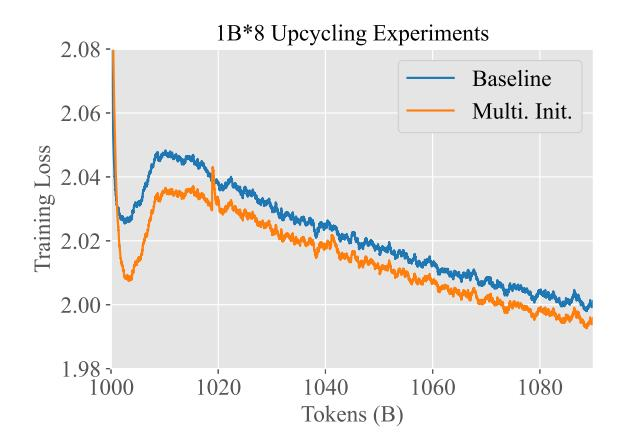

# C Negative Results

#### C.1 Scaling Expert Learning Rate

In MoE training with top-k routing, each input token is assigned to k experts. If the expert loads are roughly balanced, then in a forward pass each expert is expected to receive a proportion of k/n of all input tokens. This means that the effective training batch size for the MoE layers is merely k/n of the nominal training batch size. As smaller effective batch size leads to more noised gradient estimate, one may hypothesize that to compensate this it is

preferrable to scale the learning rate of the MoE layer by a factor of either k/n (linear scaling) or p k/n (squre root scaling).

In order to test the validity of such treatment, we have experimented with a small MoE model featuring 32 experts and a total of 1.8 billion parameters, utilizing top-2 routing with 150 million activated parameters. Under this setting, the effective batch size for the MoE layers is 16 times smaller than the nominal batch size. With the square root scaling, the learning rate for the MoE layer should be scaled by 1/ √ 16 = 0.25.

We have experimented with three different learning rate setting:

- Baseline: a global peak learning rate of 6e-3 for all component of the network;
- Expert lr ×0.25: the peak learning rate is set to be 1.5e-3 for MoE layers and 6e-3 for non-MoE layers;
- Baseline lr ×0.25: a global peak learning rate of 1.5e-3 for all component of the network.

All models were first trained from scratch for 300 billion tokens, and learning rate linearly decreasing to 10% of its peak value. We then continued the training for another 10B tokens, during which the learning rate is swiftly decayed from the its final value in the previous stage to zero.

The experiment result is depicted in Fig. [7.](#page-12-0) We see that at the end of the first stage of

Figure 7: Comparison of Expert vs. Global Learning Rate Scaling. This graph illustrates the noticeable differences in training loss at 300 billion tokens, attributable to variations in their terminal learning rates. However, by 310 billion tokens, when the learning rate reaches zero, the training curves of all three models converge, demonstrating similar performance outcomes.

training, the baseline models with and without global learning rate scaling exhibits the best and poorest performance respectively, and the model with expert learning rate scaling is somewhere in-between. We attribute this performance gap to the *difference* of their respective final learning rate. This can be evidenced by the fact that with merely 10B additional training, where the learning rates for all models had declined to zero, only minor differences in training loss remained, with the baseline model marginally outperforming the others.

Despite theoretical justifications for adjusting the learning rate for MoE layers, our findings suggest that such modifications may be unnecessary. We note that in our configuration of 32 experts the parameters within the MoE layers constitute approximately 97% of the total model parameters, where the latter figure mainly depends on the number of experts and is agnostic to the model scale. Consequently, adjusting the learning rate specifically for the MoE layers effectively equates to a global scaling of the learning rate across the entire network. This overlap in parameter distribution implies that targeted adjustments to the MoE laver's learning rate might not yield distinct outcomes from global adjustments.

Figure 8: Comparison of training loss for MoE models: conventional upcycling (baseline) versus specialization training (Multi. Init.). Both models underwent training over 100 billion tokens.

