# 2.3 Challenges of Automatic Parallelization for MoE Models

The aforementioned issues are even more challenging with MoE models. Unlike typical dense models, the dynamic nature of the MoE training workload makes them more complicated and invalidates existing automatic parallelization approaches. We use an example of MoE training in Figure 3 to explain the challenges.

<span id="page-4-0"></span>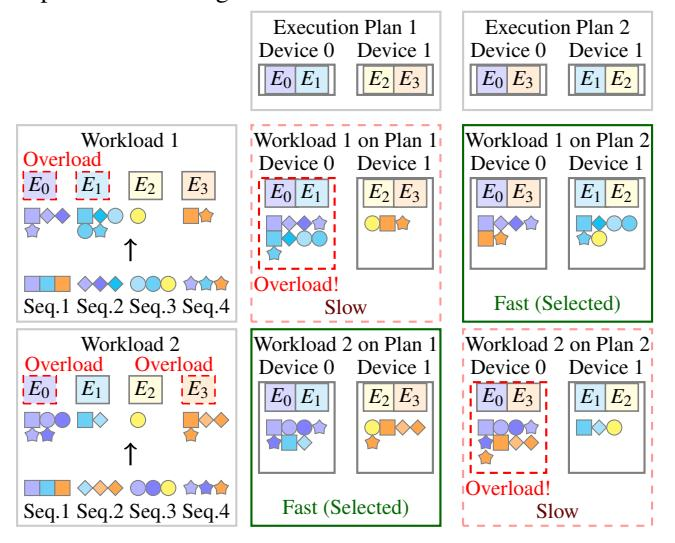

Figure 3: Example MoE Training Workloads and Related Parallel Execution Plans.

**Larger Space of Hybrid Parallelism.** The dynamic nature of MoE leads to heterogeneous workloads on different expert sub-networks, resulting in a larger space of hybrid parallelism

for MoE models than that for dense models. For a 4-experts MoE layer, two possible execution plans are shown at the top of Figure 3. In the conventional view, these two plans are identical, as both devices contain two experts, so their memory consumption and computation costs are identical. However, the dynamic workload of MoE training can lead to computational bottlenecks occurring on different experts during the training process, resulting in performance differences between the two example execution plans. For example, execution plan 1 suffers from a load-imbalance problem over training workload 1, while execution plan 2 does not.

State-of-the-art MoE training systems [9,11,17,23,27,29] fail to support execution plan 2, because none of them study the order to place expert sub-networks on multiple devices. State-of-the-art auto-parallelization systems [36,41] also ignore execution plan 2, as both execution plans are treated as the same in their algorithms. To avoid missing efficient execution plans, exploring the space of hybrid parallelism with an awareness of the imbalanced dynamic workload of MoE models is necessary.

Workload-Aware Performance Modeling. Conventional performance modeling approaches only use model structure and hardware information to estimate the performance and lack consideration of the workload. However, the dynamic nature of MoE causes a strong relationship between everchanging training workloads and efficiency, invalidating conventional performance modeling approaches of DNN operators. Looking back to the example in Figure 3, the efficiency of execution plans is different under two training workloads. Execution plan 1 becomes better in workload 2, though it is slower in workload 1. There is a strong connection between the efficiency of an execution plan and the training workload, being a unique feature of MoE models.

Current auto-parallelization algorithms [36,41] search for an efficient execution plan ahead of training, lacking consideration of the dynamic workload. A dynamic workload-aware performance modeling approach is demanded to provide accurate estimation for the MoE training scenario.

Adaptive Automatic Parallelization. For data-insensitive dense models, parallelization is performed once before training to generate an optimal execution plan. However, since no single execution plan can fit all workloads in MoE training, using a fixed execution plan cannot be efficient throughout the MoE training process. Adaptive automatic parallelization is demanded, which employs runtime execution plans searching and switching to maintain high efficiency through the training process. Ideally, the searching and switching procedure is so efficient that a training system can change the execution plan at every iteration to achieve ultimately high performance.

However, it is hard to achieve the ideal case due to the following issues. First, state-of-the-art systems use time-consuming algorithms such as integer linear programming for an optimal execution plan, which cannot fit the time limit. Second, switching between different execution plans can be

expensive because of the high overhead of parameters exchange through inter-device links.

In existing distributed training systems [\[4,](#page-13-4) [23,](#page-14-9) [24,](#page-14-4) [26,](#page-14-12) [41\]](#page-15-4), they select an execution plan before training without the ability of runtime execution plan adaption. Besides, the searching overhead of current auto-parallelization algorithms [\[36,](#page-15-2) [41\]](#page-15-4) is too high to be used at runtime. Light-weight methods to generate and switch between execution plans according to the dynamic workload are appreciated for an MoE training system.

## <span id="page-5-0"></span>3 Overview

We propose SMARTMOE, an automatic parallel training system for sparsely activated models. Previous automatic parallelization systems only search for the optimal execution plans before training, while SMARTMOE uses a two-stage approach. Beyond prior works that generate optimal execution plans based on *model* architecture and *hardware* specification, we take the workload into account for data-sensitive models. We introduce an enlarged space for hybrid parallelism in [§4.](#page-5-1) It introduces more opportunities for better training efficiency. With this enlarged space, SMARTMOE supports efficient execution plans for data-sensitive models. Moreover, to achieve efficient workload-aware parallelization, we split the process of automatic parallelization into two stages, performed offline and online, respectively. Figure [4](#page-5-2) presents an overview of our two-stage algorithm.

<span id="page-5-2"></span>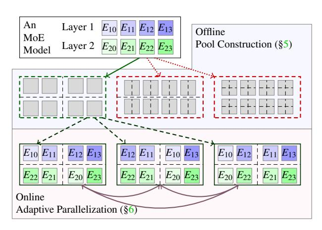

Figure 4: Overview of Two-Stage Auto-Parallelization.

Offline Pool Construction ([§5\)](#page-6-0). The imbalanced workload introduces potentially faster candidate execution plans. Among them, some pairs of execution plans are identified to be much more expensive to switch between than others and infeasible to be performed online. Therefore, SMARTMOE clusters a group of execution plans as a pool, among which the switching cost is moderate. SMARTMOE constructs a promising pool ahead of training, while keeping the ability of online adaption within the constructed pool.

An optimal pool has to be aware of the workload. We design a data-sensitive performance model to help construct good pools among numerous candidates, utilizing model specifications to estimate the workload without using statistics of actual workload. As the time limit is relatively relaxed before training, we exploit searching algorithms of conventional methods with our performance model to construct the pool. Online Adaptive Parallelization ([§6\)](#page-7-0). A pool commonly contains an exponential number of execution plans to be selected, but online decisions should be made in milliseconds. We develop light-weight algorithms to meet the time limit. The algorithms can be intensively performed to ensure the execution plan fits the current workload and quickly find faster ones from the pool if available.

Online adaptive execution plan switching can only be practical considering the overhead itself. We find it a trade-off between the high efficiency of an execution plan and the latency to switch to it. We utilize temporal locality in the everchanging workload of MoE model training to adjust parallel strategy at the proper time and achieve overall performance improvement.

## <span id="page-5-1"></span>4 Enlarged Space for Hybrid Parallelism

In most of the previous MoE model training systems, only expert parallelism is used for MoE models. A representative system of this class is FasterMoE [\[9\]](#page-13-12), which focuses on optimizing expert parallelism. Fewer previous works support hybrid parallelism for MoE models. A notable system of this class is BaGuaLu [\[23\]](#page-14-9), which combines expert and data parallelism to train MoE models on a full-scale supercomputer. Different from previous works, SMARTMOE supports hybrid parallelism for MoE models comprehensively.

SMARTMOE supports an arbitrary combination of data and tensor, pipeline and expert parallelism, beside a barely studied aspect of parallel strategies, namely expert placement. With the help of this enlarged space for hybrid parallelism, SMARTMOE could cover more efficient parallel execution plans than previous works.

Table 1: Configuration of Expert Slot.

<span id="page-5-3"></span>

| Parallel Strategy | Capacity | # Slots | # Layers |
|-------------------|----------|---------|----------|
| Expert            | 1        | E/N     | L        |
| Expert+Data       | 1        | D×E/N   | L        |
| Expert+Tensor     | 1/T      | T ×E/N  | L        |
| Expert+Pipeline   | 1        | E/(N/P) | L/P      |

SMARTMOE supports an arbitrary combination of existing parallelism using the concept of expert slot. An expert slot is a basic unit to store parameters of an expert sub-network on workers. To specify a parallel strategy for an MoE layer, the configuration of expert slot for every worker should be determined. Formally, we use three attributes to represent a configuration of expert slot:

- The capacity of each slot. It should be a fraction between 0 and 1, as each slot can store the partial or whole of an expert sub-network.
- The number of slots for each worker. It should be positive, as each worker contains one or more slots.
- The number of MoE layers for each worker. It should be a positive integer, depending on the model structure.

These attributes are powerful to represent classic parallel strategies and their combinations. Suppose a model contains L MoE layers and E experts in each layer. The training is done on a N workers cluster. D, T, P represent ways of data, tensor, and pipeline parallelism respectively. We showcase how to set attributes for different parallel strategies in Table 1. We also provide a concrete example in Figure 5, where (L, E, N) = (2, 4, 4). In Figure 5(c), the setting is (D, T, P) = (2, 1, 1)/(1, 2, 1)/(1, 1, 2), respectively. It is worth noting that only combinations of at most two parallel strategies are shown in the above examples. SMARTMOE can instantiate their arbitrary combinations, as they can be represented as specific configurations of the expert slot.

<span id="page-6-1"></span>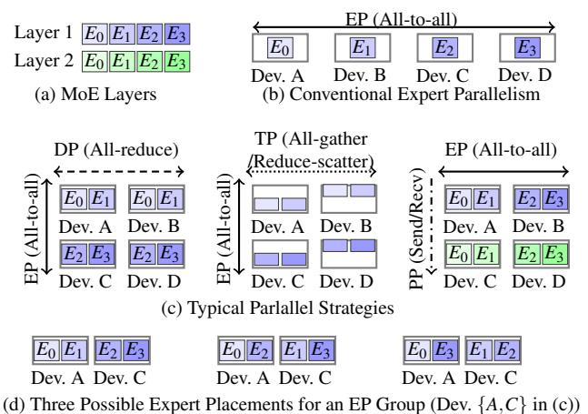

Figure 5: Hybrid Parallelism for MoE Models.

SMARTMOE explores a new parallel strategy, **expert placement**. The expert placement plan is an essential but understudied aspect of MoE model training. An expert placement plan refers to a mapping from expert sub-networks to expert slots, as shown in Figure 5(d). When the number of slots on each workers is more than one, an expert placement plan could influence performance because of the imbalanced workload. Recall the example in Figure 3. Two execution plans only differ in expert placement, but their efficiency significantly varies due to the imbalanced workloads. To the best of our knowledge, previous MoE training systems do not study the difference among different expert placements, i.e., expert sub-networks are stored in multiple slots in serial order.

As Figure 5 suggests, besides supporting combinations of existing parallelism (Figure 5(b,c)), SMARTMOE can explore

various expert placement plans (Figure 5(d)) for better performance. In contrast, existing MoE training systems only work on limited cases of our space. For example, FasterMoE [9] focuses on runtime optimization of expert parallelism (Figure 5(b)). BaGuaLu [23] and DeepSpeed-MoE [29] adopt specific hybrid parallel strategies in Figure 5(c).

#### <span id="page-6-0"></span>5 Offline Pool Construction

#### 5.1 Design Principle of a Pool

A pool is a sub-space of hybrid parallelism that contains multiple execution plans with some parallel strategies fixed and leaving the others variable. The pool remains unchanged throughout the process of distributed training. For example, a pool can be a condition that over multiple nodes with multiple GPUs, pipeline parallelism shall be used across nodes, which is fixed. And any parallelism, such as data or model parallelism, can be used among GPUs within a node. SMARTMOE constructs a good pool before training and switches execution plans at runtime within this constructed pool.

The critical challenge of defining the scope of pools is dividing parallel strategies into two categories: fixed and variable. The fixed parallel strategies have inherent latency of execution plans, which are almost unaffected by dynamic workload. In contrast, runtime switching on the variable parallel strategies is necessary to fit the current workload. In addition, the overhead of runtime switching should be balanced with the performance gain.

In SMARTMOE, we define a pool as a group of execution plans where expert placement is the only variable parallel strategy. Expert placement, i.e., mapping from experts to devices, is found to be non-trivial due to the heterogeneous workload on experts. We identify that hybrid parallel strategies for typical dense models steadily impact performance. In contrast, expert placement could influence performance significantly when the workload changes dynamically. So, in the offline pool construction stage, SMARTMOE searches for an excellent combination of typical parallel strategies, while the expert placement plan is variable to be switched online.

This definition of the pool has two main advantages. First, the space of candidate execution plans has enough flexibility for online adaption. The number of possible expert placement plans is increased exponentially when there are more expert slots for each worker. It is promising to find a suitable execution plan according to the current imbalanced workload (Detailed in §6.1). Second, these candidate execution plans are mutual-convertible with minor overhead, avoiding introducing much runtime overhead. As they have the same configuration of expert slots, there is no need for memory allocation or release when switching. The switching overhead is only caused by parameter exchange between workers, and it is possible to maintain a moderate communication overhead (Detailed in §6.2).

## 5.2 Workload-Aware Performance Modeling

In the offline stage, SMARTMOE constructs a good pool before training. A critical step is using a performance model to estimate the efficiency of different pools. However, designing an accurate performance model offline is challenging because the performance of an execution plan is strongly related to the dynamic training workload, which cannot be obtained before training.

We introduce a method to estimate the training workload to address this challenge. Specifically, it estimates the distribution of expert selection, i.e., the outputs of gating networks, before training. So, it realizes workload-aware performance modeling of MoE layers without actual statistics of the training workload. With its help, we can accurately estimate the computation and communication costs of candidate pools before training. Finally, we apply the data-sensitive performance model over the candidate pools and enumerate the search space before initiating distributed training.

Semantics of the gating network guides the workload estimation. Based on the specific algorithm of any given gating network, the maximum amount of workload for any expert can be calculated without actually training the model. This upper bound of workload is commonly close to the actual workload and is the bottleneck of the training process. Therefore, using the maximum possible amount of workload, we can accurately predict the performance of a pool.

We take the most common *Choose Top-K along Experts Axis* gating approach as our instance, and our modeling method is applicable to many others [\[5\]](#page-13-13). The key idea is to understand the design of gating networks for accurate estimation of computation and communication costs. We classify state-of-the-art MoE gating networks into two classes and explain our estimation approach for them respectively.

<span id="page-7-2"></span>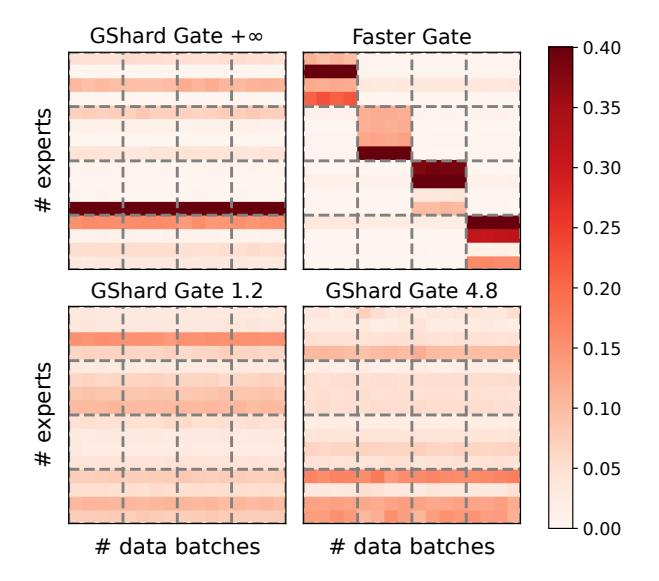

Figure 6: Expert Selections under Different Gating Networks.

One is load-balanced gating networks, which ensures a balanced workload on experts. GShard [\[15\]](#page-13-9) gate, a commonly used gating method, represents this class. The critical design of the GShard gate is the *capacity factor*, which limits the proportion of training samples assigned to remote experts (i.e., experts placed in different devices with input samples). We visualize expert selections of GShard gate from a real training process in Figure [6.](#page-7-2) The capacity factor is set to 1.2, 4.8, and +∞ (i.e., no capacity limit). Controlled by different capacity factors, the proportion of training samples assigned to the overloaded experts varies. Despite the variation, there is a definite load upper bound of the most overloaded expert, being the bottleneck of the whole layer. Therefore, we use that upper bound to estimate the performance of execution plans.

Another is topology-aware gating networks, which limit the size of cross-nodes communication in the all-to-all dispatching stage. Two state-of-the-art MoE models [\[7,](#page-13-14) [9\]](#page-13-12) use topology-aware gates. In Figure [6,](#page-7-2) *Faster Gate* proposed by FasterMoE [\[9\]](#page-13-12) is visualized. The example cluster has 16 devices on four nodes with a fat-tree network topology. To avoid suffering low bandwidth across nodes, it prefers to assign training samples to experts within the same node, as can be seen in the figure that most expert selection is in 4×4 blocks on the diagonal. We can estimate expert selection considering its hierarchical gating algorithm. As it also uses hardware specifications available to us, we follow its algorithm to compute the maximum possible communication volume and computation workload for each device and adopt these data for our performance prediction.

Generally, although the actual expert selection is unreachable, hyper-parameters of these gating networks can be used to depict the distribution of expert selection. The computation overhead of the most overloaded expert can be estimated according to the capacity factor, and the communication overhead of device pairs can be estimated according to constraints provided by topology-aware gating networks. After obtaining the distribution of expert selection, we adopt an existing performance model [\[9\]](#page-13-12) to estimate the performance of execution plans. It is worth noting that the original model has to take the current workload information captured at runtime as its input. However, in SMARTMOE, we apply it to the estimated workload. With the help of our estimating method and the performance model, we apply exhaustively offline searching for a pool with the best-estimated performance.

## <span id="page-7-0"></span>6 Online Adaptive Parallelization

## <span id="page-7-1"></span>6.1 Light-Weight Searching

Adaptive parallelization is required for the MoE model to keep it on an optimal execution plan considering its current workload. The challenge of runtime adjustment is a much stricter time limit of searching overhead, as a single iteration of an MoE layer typically takes only tens of milliseconds. Existing works fail to meet the time requirement of MoE models because they commonly apply time-consuming algorithms such as integer linear programming (ILP). In practice, the overhead of these methods is orders of magnitude greater than the latency of a single iteration. They are infeasible for MoE models because they shall be intensively performed at runtime to ensure the execution plan fits the current workload.

Defining a pool as only expert placement plans can be adjusted at runtime is a good equilibrium point: workload-guided expert placement plans effectively improve training efficiency, while switching between expert placement plans does not introduce much communication overhead. Based on the pool constructed offline, we make minor adjustments to fit the current workload. To keep moderate overhead, we design light-weight searching algorithms to transfer within the pool among execution plans. We invent a greedy algorithm to replace time-consuming methods such as ILP, which is intensively performed to ensure the execution plan fits the current workload.

Motivated by our observation in Figure 3, it is critical to generate a dedicated expert placement plan which fits the current workload. We formalize the expert placement problem as follows. Supposed that there are E experts and N devices,  $C_i$  training samples are assigned to expert i by the gating network. We need to decide the placement of each expert, where the placement of expert i is denoted as  $P_i(i \subseteq \{0,1,\ldots,N-1\})$ . The optimization goal is to minimize eq. (1), where  $\frac{C_i}{\|P_i\|}$  denotes the number of training samples processed by each replicate of expert i, and overall training latency is determined by the most overloaded device j.

<span id="page-8-0"></span>
$$\max_{0 \le j < N} \left\{ \sum_{0 \le i < E, j \in P_i} \frac{C_i}{\|P_i\|} \right\} \tag{1}$$

#### <span id="page-8-1"></span>Algorithm 1 Greedy Expert Placement

```
1: function EXPERTPLACEMENTGREEDY(E, N, C[E])
         samples[0...N] \leftarrow 0
 2:
                                      > current samples per device
 3:
         experts[0...N] \leftarrow 0
                                        > current experts per device
 4:
         P[0...E] \leftarrow \emptyset
                                               > placement of experts
         for i, C_i \in \text{DescendingSort}(C) do
 5:
              T_{min} \leftarrow \infty
 6:
              for all j do

 7:
                   if experts[j] < \frac{E}{N} and samples[j] < T_{min} then
 8:
                       T_{min} \leftarrow samples[j]
 9.
10:
              P[i] \leftarrow P[i] \cup p
11:
              samples[p] \leftarrow tokens[p] + C_i
12:
              experts[p] \leftarrow experts[p] + 1
13:
         return P[0...E]
14:
```

We propose a light-weight greedy approach in Algorithm 1. An intuitive idea is to avoid placing overloaded experts on the

same device. Therefore, Algorithm 1 decides each expert's placement in the order of amounts of computation on experts. To avoid increasing memory overhead on certain devices, the number of experts placed in one device is limited to  $\frac{E}{N}$ . This algorithm's computational complexity is O(NE), which is light enough for runtime searching.

We also propose a more accurate but costly dynamic programming approach. The state of dynamic programming is defined as F(i,S), in which i denotes the number of devices that are fully used, S is a subset of N experts to denote which experts have been placed. And F represents the minimal size of the most overloaded device in the first i devices. Equation (2) shows the transfer function between states, which enumerates experts placed on device i for a minimum cost. In this dynamic programming approach, the number of states is  $O(N \times 2^E)$ , and  $O(2^E)$  states are enumerated in one transfer, resulting in total computation complexity  $O(N \times 4^E)$ . This approach is guaranteed to find an optimal solution.

<span id="page-8-2"></span>
$$F(i,S) = \min_{S_0} \{ \max\{F(i-1,S_0), \sum_{e \in S-S_0} C_e\} \}$$
 (2)

To leverage the advantages of the two algorithms above, we design Algorithm 2 to combine them. The problem of placing E experts into N devices is divided into two steps: in the first step, E experts are placed into M virtual devices using the greedy algorithm; in the second step, M virtual devices are placed into N devices using the dynamic programming algorithm. The computation complexity of this hybrid algorithm is  $O(ME + N \times 4^M)$ . The number of virtual devices M is a tunable parameter, which controls the overhead of the searching algorithm. For example, modern clusters usually have tree topology: there are multiple devices within a compute node, and multiple nodes are working together. In this setting, the M can be set as the number of devices within a node, in which the greedy algorithm is used across nodes, and the dynamic programming algorithm is used within a node.

#### <span id="page-8-3"></span>Algorithm 2 Hybrid Approach of Expert Placement

```
1: function EXPERTPLACEMENTHYBRID(E, N, C[E])
        M \leftarrow DEVICES\_PER\_NODE  \triangleright tunable parameter
        P_0[E] \leftarrow ExpertPlacementGreedy(E, M, C[E])
3:
4:
        P[0...E] \leftarrow \emptyset
        for i \leftarrow 0, \dots, M do

   within a virtual device
             S \leftarrow \{e \mid i \in P_0[e]\}
6:
             P_S \leftarrow P(F(M,S)) \triangleright \text{Get placement of DP state } S
7:
             P \leftarrow P \cup P_S
8:
        return P[0...E]
9:
```

By properly tuning *M* according to hardware configuration and searching time limit, these algorithms can work together with minimum overhead and maximum effect.

## <span id="page-9-1"></span>6.2 Efficient Adaptive Training

The goal of the online stage is to obtain performance gain by applying an execution plan that fits the current workload while keeping moderate switching overhead between execution plans. A few configurations of SMARTMOE are important to ensure performance gain. We currently tune them manually by heuristics, as discussed below.

Threshold of Switching Overhead. Switching from the current expert placement plan to a newly generated one introduces non-negligible all-to-all communication overhead. However, in practice, some newly generated expert placement plans only make slight advancements over the current one while introducing much communication overhead. To address this problem, we set a tunable threshold to filter out new expert placement plans with minor improvement in eq. [\(1\)](#page-8-0). In addition, if two new plans have the same latency in eq. [\(1\)](#page-8-0), SMARTMOE chooses the one similar to the current plan to minimize the switching overhead.

Frequency of Online Searching. Although online searching fits the expert placement plan with the current workload, searching and switching costs extra time. One extreme case is to perform searching at every iteration, which can always fit the current workload with the best execution plan but introduces too much overhead. However, if the search interval is too large, the training throughput usually decreases as the workload changes. Fortunately, as a neural network, parameters of the gating network change slightly in adjacent iterations, which leads to a gradual change in the distribution of expert selections. Thanks to this temporal locality, we can conduct runtime searching every several iterations. Figure [12](#page-11-0) reveals the trade-off between searching frequency and training performance in real model training. We currently select an appropriate frequency by experimentation.

Frequency of History Collecting. Our online searching algorithm depends on the history of expert selection. To obtain this data, SMARTMOE needs to dump the output of the gating network and synchronize among workers. These operations could be time-consuming if performed too frequently. In practice, we find an effective strategy is only collecting the history of expert selection at a few iterations immediately before the iteration of online adaption. This strategy also utilizes the temporal locality of the expert selection, and prevents collecting useless stale history.

## <span id="page-9-0"></span>7 Evaluation

## 7.1 Experimental Setup

Clusters. We evaluate SMARTMOE on three representative clusters, as shown in Table [2,](#page-9-2) which differ in accelerators, network topology, network bandwidth, and scale. Evaluation on these clusters demonstrates that optimization of SMARTMOE works on different hardware environments.

Table 2: Hardware Platforms for Evaluation.

<span id="page-9-2"></span>

| Name   | GPUs Per Node       | Max GPUs | Infiniband Bandwidth |
|--------|---------------------|----------|----------------------|
| blinky | 8× NVIDIA V100 PCIe | 32       | 50Gb/s               |
| pinky  | 4× NVIDIA V100 SXM  | 64       | 100Gb/s              |
| inky   | 8× NVIDIA A100 SXM  | 32       | 200Gb/s              |

Models. The models used for evaluation are shown in Table [3.](#page-9-3) We choose models from two popular deep learning tasks for evaluation: one is GPT-MoE for natural language processing, and the other is Swin-MoE for computer vision. We use typical batch sizes for each of them. Model parameters are increased along with the number of GPUs. One of the most popular gating methods proposed by GShard [\[15\]](#page-13-9) is used. GShard gate has a tunable parameter named *capacity factor*, which controls the degree of load imbalance problem (Smaller capacity factor results in a more balanced workload). This optimization is from the model design side to improve MoE model training performance. We apply the GShard gate with different capacity factors to evaluate our system-side optimization.

Table 3: Models Used for Evaluation.

<span id="page-9-3"></span>

| Model    | Task | Batch Size | # params (billion) | Capacity Factor |
|----------|------|------------|--------------------|-----------------|
| GPT-MoE  | NLP  | 256/512    | 4.5/7.3/9.9/14.0   | 1.2/2.4/4.8/+∞  |
| Swin-MoE | CV   | 4096       | 0.54/1.0           |                 |

Baselines. We compare SmartMoE with four strong training systems. DeepSpeed-MoE [\[29\]](#page-14-11) is an MoE training system with both system-side and model design-side optimization. It is implemented on DeepSpeed [\[31\]](#page-15-10) and Megatron-LM [\[35\]](#page-15-1). For fairness of comparison, we only turn on the system-side optimization in the following experiments. Tutel [\[11\]](#page-13-10) targets the scalability problem of MoE training, which achieves promising performance on large-scale MoE training. And Tutel designs Swin-MoE models by extending Swin-Transformer [\[20,](#page-14-13) [21\]](#page-14-14) with the MoE technique. FasterMoE [\[9\]](#page-13-12), the latest version of FastMoE [\[8\]](#page-13-11), is one of the early efforts of data-sensitive optimization for MoE training. It proposes runtime smart scheduling and expert shadowing. For fairness of comparison, we manually tune hyper-parameters of Faster-MoE to achieve good performance. Alpa [\[41\]](#page-15-4) is a state-ofthe-art general-purpose auto-parallelization training system, which hierarchically generates inter- and intra-operator parallel execution plans. It should be noticed that we do not directly compare our system with Alpa. Alpa is implemented on JAX, while the other systems we used are implemented on PyTorch. For fairness of comparison, we use parallelism recommended in the Alpa paper on our system to simulate its performance. Evaluation Metrics. For end-to-end evaluation, we measure the training latency including forward, backward, gradient synchronization, and optimization stages in both MoE and dense layers in the real model training process. Instead of using randomly generated input samples, we apply real datasets for training to ensure that the dynamic workload in MoE lay-

<span id="page-10-0"></span>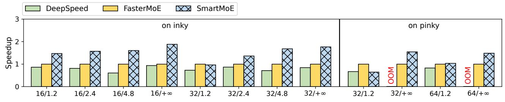

Figure 7: End-to-End Speedup of GPT-MoE Models.

ers represents real situations. For micro-benchmarks, training latency only includes the forward and backward stages in MoE layers. We use a comprehensive expert selection dataset, which is collected in real model training processes, including different model structures and gating methods.

## 7.2 End-to-End Speedup

We evaluate the end-to-end performance of two types of models on three different clusters. Evaluations are done in a form of weak scaling, where model sizes are increased along with the number of GPUs. And different capacity factors are applied at each scale. X/Y means evaluation on X devices with capacity factor Y. "OOM" means out-of-memory. The performance of FasterMoE is used as a baseline.

Figure 7 shows the end-to-end speedup of GPT-MoE models. SMARTMOE achieves on average  $1.53\times$  speedup on *inky* cluster, and achieves on average  $1.17\times$  speedup on *pinky* cluster. Comparing *inky* cluster and *pinky* cluster, SMARTMOE achieves higher speedup on *inky*, where SMARTMOE achieves a maximum speedup of  $1.88\times$ . This can be explained by two reasons. First, the bandwidth gap between intra-node and inter-nodes links is greater, making hybrid parallelism more efficient. Second, *inky* has more GPUs in a node, increasing possible intra-node parallel strategies. Figure 8 shows the speedup of Swin-MoE models. SMARTMOE achieves on average  $1.14\times$  speedup on *blinky* cluster.

Comparing different GShard capacity factors, SMARTMOE achieves a more significant speedup when the capacity factor is higher. This reveals the tight relationship between model design and system-side optimization. Both of them improve training performance by alleviating the load-imbalance problem in MoE layers, so there are fewer optimization opportunities as the gate is set up with stricter load-balancing limits. In this case, SMARTMOE brings improvement because it constructs a better pool. A good pool replaces the originally expensive all-to-all of expert parallelism by communication among fewer workers in hybrid parallelism. Systems with only runtime optimization (e.g. FasterMoE) could reduce the computation overhead by balancing workload, but they fail to reduce the communication overhead, as detailed in §7.5.

<span id="page-10-1"></span>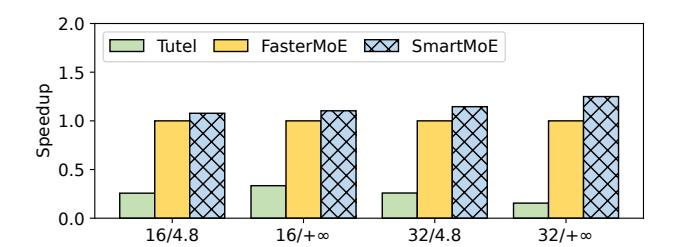

Figure 8: End-to-End Speedup of Swin-MoE Models.

#### 7.3 Offline Parallelization Ablation Study

We study the effectiveness of our offline parallelization algorithm. In order to verify that SMARTMOE can find a good pool, we compare performance of different autoparallelization systems in Figure 9. X/Y means evaluation on X devices with capacity factor Y. The performance of FasterMoE is used as a baseline. To compare with the datainsensitive auto-parallelization approach, we use execution plans recommended by Alpa, in which expert parallelism is used within a node, and pipeline parallelism is used across nodes. To fairly compare the effect of offline parallelization, online optimizations of all systems are disabled. SMARTMOE uses a random execution plan generated by the offline datasensitive auto-parallelization approach. Both data-sensitive and insensitive approaches generate more efficient execution plans compared with pure expert parallelism, attributing to the high performance of hybrid parallelism. Meanwhile, the data-sensitive approach of SMARTMOE achieves 2.67× speedup, while the data-insensitive approach only achieves  $2.36 \times$  speedup.

<span id="page-10-2"></span>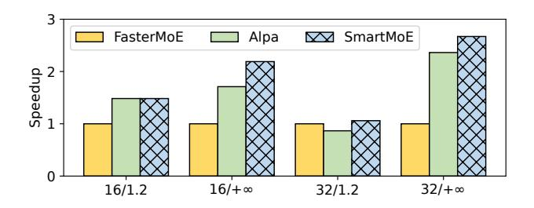

Figure 9: Performance of Offline Parallelization.

Figure 10 shows the accuracy of our data-sensitive performance model. X - Y means evaluation on X devices with local batch size Y. We use MoE layers with expert selection recorded in a real training process to verify the accuracy of SMARTMOE performance model. Different scales and batch sizes are used. For all configurations, it achieves  $R^2 > 0.5$ . Results show that the execution time of an MoE layer varies under different training data. However, the data-insensitive performance model of MoE operators only gives a constant estimation of execution time for each scale and batch size, as shown by vertical lines, inaccurate for most cases. In contrast, our data-sensitive performance model predicts execution time based on current training data. Results show that its accuracy is higher when workers are in the same node, because an unstable cross-node network prevents us from precisely modeling cross-node all-to-all communication latency.

<span id="page-11-2"></span>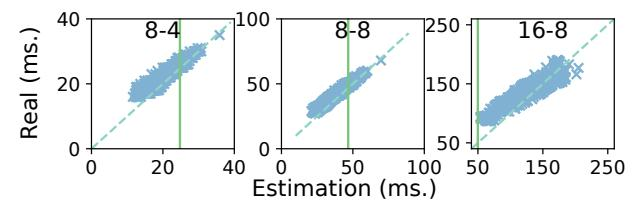

Figure 10: Accuracy of Performance Modeling.

### 7.4 Online Parallelization Ablation Study

Now we evaluate performance improvement from the adaptive automatic parallelization approach in SMARTMOE. A 16-layer MoE model is trained on 64 V100 GPUs of *pinky*. We set the execution plan adjustment frequency to once every 10 iterations. Figure 11 shows the speedup of all 16 MoE layers. SMARTMOE achieves on average  $1.16\times$  speedup per layer, and at most  $1.43\times$  speedup in layer 2. Performance opportunities differ among layers because they are trained to have different internal features. The overhead of execution plan adjustment is insignificant, because training with dynamic execution plans beats the static execution plan at every layer.

<span id="page-11-3"></span>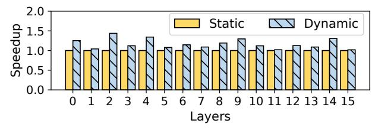

Figure 11: Speedup of Online Parallelization.

In another view, Figure 12 shows the latency of an MoE layer from iteration 1 to 1500. The performance of using either static or dynamic execution plans with different frequencies of adjustment is shown by curves. *dyn.X* denotes switching execution plans every *X* iteration. Before the first time of switching, the execution plan used is the same as the

origin, which does not fit the workload dynamically, resulting in inefficient training. After switching execution plans, it immediately becomes efficient, because SMARTMOE uses recent history of expert selections to guide switching. As training progresses, the distribution of expert selection gradually changes. We can find that for frequencies of 250 and 500 iterations, after switching, performance degrades as time increases. This suggests that the frequency of the execution plan adjustment should be high enough for the varying workload. But we also find that the switching overhead could hurt overall performance when adjustment frequency is too high. Moreover, it is interesting that the actual execution plan adjustment tends to be less frequent as the training progresses. For example, in Figure 12, the performance of different switching frequencies becomes more close after iteration 1000. We speculate the reason for this phenomenon is that the distribution of the expert selection becomes more stable after thousands of iterations. In conclusion, we think how to set a proper frequency of dynamic parallelization is still an open problem.

<span id="page-11-0"></span>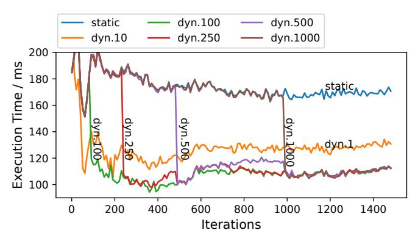

Figure 12: Performance of different adjusting frequencies.

#### <span id="page-11-1"></span>7.5 Fine-Grained Performance Breakdown

We present a fine-grained performance breakdown in Figure 13. FasterMoE is the baseline implementation of MoE model training, which uses pure expert parallelism with simple runtime load-balancing strategies. Alpa represents state-of-the-art training systems with only offline parallelization. SMARTMOE represents MoE model training with both offline and online parallelization. Baseline systems and SMARTMOE are used to train two MoE models, which are only different in the capacity factor of the gate. The overhead of communication and computation for one iteration is measured separately.

As models with smaller capacity factor tend to have a more balanced workload, the execution time of three systems for the case capacity = 1.2 is shorter than its counterpart,  $capacity = +\infty$ . Because FasterMoE only supports pure expert parallelism, while Alpa and SMARTMOE support hybrid parallelism, both communication and computation overhead are reduced by the latter. In the case, capacity = 1.2, the speedup of communication is more significant, because com-

<span id="page-12-2"></span>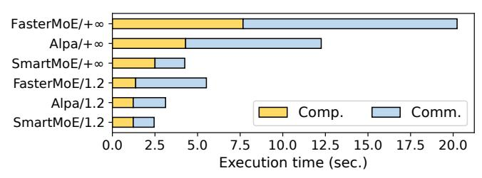

Figure 13: Fine-Grained Performance Breakdown.

putation is forced to be more balanced with the restricted expert selection. SMARTMOE outperforms Alpa because of workload-awareness.

## 7.6 Overhead Analysis

The overhead of SMARTMOE parallelization approaches is insignificant, compared with the end-to-end training time. Table [4](#page-12-3) shows an execution time breakdown of a model which has 16 experts and is trained on a 16 V100 GPUs cluster.

Table 4: Execution Time Breakdown.

<span id="page-12-3"></span>

| Searching | Switching | Original | Forward and Backward<br>Optimized | Alpa's Searching |
|-----------|-----------|----------|-----------------------------------|------------------|
| 0.05ms    | 20ms      | 75ms     | 67ms                              | 825s             |

Searching algorithms cost less than 1ms, because there are only 16 experts. We test the searching algorithms for 1024 experts further, the cost of a single searching process is still less than 50ms. Switching costs 20ms in this example, because the size of expert sub-networks is non-negligible. For a single forward and backward step, the overhead of switching could influence training performance. However, the switching of execution plans brings on average 10% performance gain, which is 8*ms* in this example. After 3 steps, the end-to-end latency of adaptive parallelization is lower than the original one. Typically, tens of forward and backward steps are performed in one iteration, so the switching cost is acceptable for endto-end training. We also evaluate the overhead of Alpa [\[41\]](#page-15-4) for this example, which takes 825 seconds to generate an execution plan. The searching overhead of Alpa is orders of magnitude greater than our approaches.

## <span id="page-12-0"></span>8 Related Work

MoE training systems. Early efforts implement expert parallelism to enable MoE model training in the existing frameworks, including GSPMD [\[38\]](#page-15-3) for TensorFlow and Fairseq [\[16\]](#page-14-7), FastMoE [\[8\]](#page-13-11) for PyTorch. More recent literature has proposed some MoE-specific optimization techniques from different perspectives. To optimize all-to-all communication in MoE training, DeepSpeed-MoE [\[29\]](#page-14-11) proposes a hierarchical all-to-all algorithm to reduce latency. Lita [\[17\]](#page-14-8) systematically analyzes all-to-all overhead in MoE training

and designs a new communication scheduling scheme. For improving hardware utilization, Tutel [\[11\]](#page-13-10) delivers adaptive parallelism and pipelining, and scales MoE training to thousands of GPUs. FasterMoE [\[9\]](#page-13-12) provides a comprehensive performance analysis of MoE training and designs multiple techniques to alleviate load-imbalance problems.

Efforts above focus on the optimization of expert parallelism, which are complementary with SMARTMOE. To enable hybrid parallelism, Tutel [\[11\]](#page-13-10) combines expert, data, and tensor model parallelism to scale up MoE training. BaGuaLu [\[23\]](#page-14-9) combines expert and data parallelism to train an MoE model on a full-scale supercomputer. SMARTMOE implements more complete parallelism for MoE models, which brings more performance opportunities.

Automatic parallelization training systems. Previous works target different parallel strategies. Tofu [\[36\]](#page-15-2) generates tensor model parallel execution plans by a novel DP algorithm. PipeDream [\[24\]](#page-14-4) and DAPPLE [\[4\]](#page-13-4) propose pipeline parallelism planners for efficient pipeline partitioning and scheduling. Alpa [\[41\]](#page-15-4) generates more sophisticated execution plans, considering both inter-operator (i.e., pipeline) and intra-operator (i.e., data and tensor) parallelism.

These efforts are mainly designed for models with dense architecture. SMARTMOE analyzes unique challenges of automatic parallelization for models with sparse architecture, and designs specific techniques to address them.

## <span id="page-12-1"></span>9 Conclusion

We propose SMARTMOE, an automatic parallelization system for distributed training of sparsely activated models. We identify the key challenge of applying automatic parallelization for sparsely activated MoE models as their dynamic nature or being data-sensitive. To address this challenge, we propose a two-stage solution. The combination space of hybrid parallelism, which enables more potential for optimization, is decomposed by pools. To construct an optimal static pool before training, we design a workload-aware performance model to predict the training performance with estimations of gating networks. At runtime, we invent light-weight searching algorithms to change execution plans with minimum overhead. Compared with selected baselines, SMARTMOE achieves up to 1.88× speedup in end-to-end MoE model training.

## 10 Acknowledgments

We sincerely thank our shepherd Thaleia Dimitra Doudali and the anonymous reviewers for their valuable feedback on this paper. We also thank Yuyang Jin, Kezhao Huang and Zhenbo Sun for their valuable suggestions. This work is supported by National Key R&D Program of China under Grant 2022ZD0115304 and NSFC for Distinguished Young Scholar (62225206). Jidong Zhai is the corresponding author of this paper (zhaijidong@tsinghua.edu.cn).

## References

- <span id="page-13-0"></span>[1] Tom B. Brown, Benjamin Mann, Nick Ryder, Melanie Subbiah, Jared Kaplan, Prafulla Dhariwal, Arvind Neelakantan, Pranav Shyam, Girish Sastry, Amanda Askell, Sandhini Agarwal, Ariel Herbert-Voss, Gretchen Krueger, Tom Henighan, Rewon Child, Aditya Ramesh, Daniel M. Ziegler, Jeffrey Wu, Clemens Winter, Christopher Hesse, Mark Chen, Eric Sigler, Mateusz Litwin, Scott Gray, Benjamin Chess, Jack Clark, Christopher Berner, Sam McCandlish, Alec Radford, Ilya Sutskever, and Dario Amodei. Language models are few-shot learners. In *Advances in Neural Information Processing Systems 33: Annual Conference on Neural Information Processing Systems 2020, NeurIPS 2020, December 6- 12, 2020, virtual*, 2020.
- <span id="page-13-1"></span>[2] Jacob Devlin, Ming-Wei Chang, Kenton Lee, and Kristina Toutanova. BERT: pre-training of deep bidirectional transformers for language understanding. In *Proceedings of the 2019 Conference of the North American Chapter of the Association for Computational Linguistics: Human Language Technologies, NAACL-HLT 2019, Minneapolis, MN, USA, June 2-7, 2019, Volume 1 (Long and Short Papers)*, pages 4171–4186. Association for Computational Linguistics, 2019.
- <span id="page-13-7"></span>[3] Nan Du, Yanping Huang, Andrew M. Dai, Simon Tong, Dmitry Lepikhin, Yuanzhong Xu, Maxim Krikun, Yanqi Zhou, Adams Wei Yu, Orhan Firat, Barret Zoph, Liam Fedus, Maarten P. Bosma, Zongwei Zhou, Tao Wang, Yu Emma Wang, Kellie Webster, Marie Pellat, Kevin Robinson, Kathleen S. Meier-Hellstern, Toju Duke, Lucas Dixon, Kun Zhang, Quoc V. Le, Yonghui Wu, Zhifeng Chen, and Claire Cui. Glam: Efficient scaling of language models with mixture-of-experts. In *International Conference on Machine Learning, ICML 2022, 17-23 July 2022, Baltimore, Maryland, USA*, volume 162 of *Proceedings of Machine Learning Research*, pages 5547–5569. PMLR, 2022.
- <span id="page-13-4"></span>[4] Shiqing Fan, Yi Rong, Chen Meng, Zongyan Cao, Siyu Wang, Zhen Zheng, Chuan Wu, Guoping Long, Jun Yang, Lixue Xia, Lansong Diao, Xiaoyong Liu, and Wei Lin. DAPPLE: a pipelined data parallel approach for training large models. In *PPoPP '21: 26th ACM SIG-PLAN Symposium on Principles and Practice of Parallel Programming, Virtual Event, Republic of Korea, February 27- March 3, 2021*, pages 431–445. ACM, 2021.
- <span id="page-13-13"></span>[5] William Fedus, Jeff Dean, and Barret Zoph. A review of sparse expert models in deep learning. *CoRR*, abs/2209.01667, 2022.
- <span id="page-13-8"></span>[6] William Fedus, Barret Zoph, and Noam Shazeer. Switch transformers: Scaling to trillion parameter models with

- simple and efficient sparsity. *CoRR*, abs/2101.03961, 2021.
- <span id="page-13-14"></span>[7] Chaoyang He, Shuai Zheng, Aston Zhang, George Karypis, Trishul Chilimbi, Mahdi Soltanolkotabi, and Salman Avestimehr. SMILE: scaling mixture-of-experts with efficient bi-level routing. *CoRR*, abs/2212.05191, 2022.
- <span id="page-13-11"></span>[8] Jiaao He, Jiezhong Qiu, Aohan Zeng, Zhilin Yang, Jidong Zhai, and Jie Tang. Fastmoe: A fast mixture-ofexpert training system. *CoRR*, abs/2103.13262, 2021.
- <span id="page-13-12"></span>[9] Jiaao He, Jidong Zhai, Tiago Antunes, Haojie Wang, Fuwen Luo, Shangfeng Shi, and Qin Li. Fastermoe: modeling and optimizing training of large-scale dynamic pre-trained models. In *PPoPP '22: 27th ACM SIGPLAN Symposium on Principles and Practice of Parallel Programming, Seoul, Republic of Korea, April 2 - 6, 2022*, pages 120–134. ACM, 2022.
- <span id="page-13-5"></span>[10] Yanping Huang, Youlong Cheng, Ankur Bapna, Orhan Firat, Dehao Chen, Mia Xu Chen, HyoukJoong Lee, Jiquan Ngiam, Quoc V. Le, Yonghui Wu, and Zhifeng Chen. Gpipe: Efficient training of giant neural networks using pipeline parallelism. In *Advances in Neural Information Processing Systems 32: Annual Conference on Neural Information Processing Systems 2019, NeurIPS 2019, December 8-14, 2019, Vancouver, BC, Canada*, pages 103–112, 2019.
- <span id="page-13-10"></span>[11] Changho Hwang, Wei Cui, Yifan Xiong, Ziyue Yang, Ze Liu, Han Hu, Zilong Wang, Rafael Salas, Jithin Jose, Prabhat Ram, Joe Chau, Peng Cheng, Fan Yang, Mao Yang, and Yongqiang Xiong. Tutel: Adaptive mixtureof-experts at scale. *CoRR*, abs/2206.03382, 2022.
- <span id="page-13-6"></span>[12] Robert A. Jacobs, Michael I. Jordan, Steven J. Nowlan, and Geoffrey E. Hinton. Adaptive mixtures of local experts. *Neural Comput.*, 3(1):79–87, 1991.
- <span id="page-13-2"></span>[13] Jared Kaplan, Sam McCandlish, Tom Henighan, Tom B. Brown, Benjamin Chess, Rewon Child, Scott Gray, Alec Radford, Jeffrey Wu, and Dario Amodei. Scaling laws for neural language models. *CoRR*, abs/2001.08361, 2020.
- <span id="page-13-3"></span>[14] Alex Krizhevsky. One weird trick for parallelizing convolutional neural networks. *CoRR*, abs/1404.5997, 2014.
- <span id="page-13-9"></span>[15] Dmitry Lepikhin, HyoukJoong Lee, Yuanzhong Xu, Dehao Chen, Orhan Firat, Yanping Huang, Maxim Krikun, Noam Shazeer, and Zhifeng Chen. Gshard: Scaling giant models with conditional computation and automatic sharding. In *9th International Conference on Learning Representations, ICLR 2021, Virtual Event, Austria, May 3-7, 2021*. OpenReview.net, 2021.

- <span id="page-14-7"></span>[16] Mike Lewis, Shruti Bhosale, Tim Dettmers, Naman Goyal, and Luke Zettlemoyer. BASE layers: Simplifying training of large, sparse models. In *Proceedings of the 38th International Conference on Machine Learning, ICML 2021, 18-24 July 2021, Virtual Event*, volume 139 of *Proceedings of Machine Learning Research*, pages 6265–6274. PMLR, 2021.
- <span id="page-14-8"></span>[17] Jiamin Li, Yimin Jiang, Yibo Zhu, Cong Wang, and Hong Xu. Lita: Accelerating distributed training of sparsely activated models. *CoRR*, abs/2210.17223, 2022.
- <span id="page-14-1"></span>[18] Shen Li, Yanli Zhao, Rohan Varma, Omkar Salpekar, Pieter Noordhuis, Teng Li, Adam Paszke, Jeff Smith, Brian Vaughan, Pritam Damania, and Soumith Chintala. Pytorch distributed: Experiences on accelerating data parallel training. *Proc. VLDB Endow.*, 13(12):3005– 3018, 2020.
- <span id="page-14-3"></span>[19] Shigang Li and Torsten Hoefler. Chimera: efficiently training large-scale neural networks with bidirectional pipelines. In *International Conference for High Performance Computing, Networking, Storage and Analysis, SC 2021, St. Louis, Missouri, USA, November 14-19, 2021*, page 27. ACM, 2021.
- <span id="page-14-13"></span>[20] Ze Liu, Han Hu, Yutong Lin, Zhuliang Yao, Zhenda Xie, Yixuan Wei, Jia Ning, Yue Cao, Zheng Zhang, Li Dong, Furu Wei, and Baining Guo. Swin transformer V2: scaling up capacity and resolution. In *IEEE/CVF Conference on Computer Vision and Pattern Recognition, CVPR 2022, New Orleans, LA, USA, June 18-24, 2022*, pages 11999–12009. IEEE, 2022.
- <span id="page-14-14"></span>[21] Ze Liu, Yutong Lin, Yue Cao, Han Hu, Yixuan Wei, Zheng Zhang, Stephen Lin, and Baining Guo. Swin transformer: Hierarchical vision transformer using shifted windows. In *2021 IEEE/CVF International Conference on Computer Vision, ICCV 2021, Montreal, QC, Canada, October 10-17, 2021*, pages 9992–10002. IEEE, 2021.
- <span id="page-14-6"></span>[22] Jiaqi Ma, Zhe Zhao, Xinyang Yi, Jilin Chen, Lichan Hong, and Ed H. Chi. Modeling task relationships in multi-task learning with multi-gate mixture-of-experts. In *Proceedings of the 24th ACM SIGKDD International Conference on Knowledge Discovery & Data Mining, KDD 2018, London, UK, August 19-23, 2018*, pages 1930–1939. ACM, 2018.
- <span id="page-14-9"></span>[23] Zixuan Ma, Jiaao He, Jiezhong Qiu, Huanqi Cao, Yuanwei Wang, Zhenbo Sun, Liyan Zheng, Haojie Wang, Shizhi Tang, Tianyu Zheng, Junyang Lin, Guanyu Feng, Zeqiang Huang, Jie Gao, Aohan Zeng, Jianwei Zhang, Runxin Zhong, Tianhui Shi, Sha Liu, Weimin Zheng,

- Jie Tang, Hongxia Yang, Xin Liu, Jidong Zhai, and Wenguang Chen. Bagualu: targeting brain scale pretrained models with over 37 million cores. In *PPoPP '22: 27th ACM SIGPLAN Symposium on Principles and Practice of Parallel Programming, Seoul, Republic of Korea, April 2 - 6, 2022*, pages 192–204. ACM, 2022.
- <span id="page-14-4"></span>[24] Deepak Narayanan, Aaron Harlap, Amar Phanishayee, Vivek Seshadri, Nikhil R. Devanur, Gregory R. Ganger, Phillip B. Gibbons, and Matei Zaharia. Pipedream: generalized pipeline parallelism for DNN training. In *Proceedings of the 27th ACM Symposium on Operating Systems Principles, SOSP 2019, Huntsville, ON, Canada, October 27-30, 2019*, pages 1–15. ACM, 2019.
- <span id="page-14-5"></span>[25] Deepak Narayanan, Amar Phanishayee, Kaiyu Shi, Xie Chen, and Matei Zaharia. Memory-efficient pipelineparallel DNN training. In *Proceedings of the 38th International Conference on Machine Learning, ICML 2021, 18-24 July 2021, Virtual Event*, volume 139 of *Proceedings of Machine Learning Research*, pages 7937–7947. PMLR, 2021.
- <span id="page-14-12"></span>[26] Deepak Narayanan, Mohammad Shoeybi, Jared Casper, Patrick LeGresley, Mostofa Patwary, Vijay Korthikanti, Dmitri Vainbrand, Prethvi Kashinkunti, Julie Bernauer, Bryan Catanzaro, Amar Phanishayee, and Matei Zaharia. Efficient large-scale language model training on GPU clusters using megatron-lm. In *International Conference for High Performance Computing, Networking, Storage and Analysis, SC 2021, St. Louis, Missouri, USA, November 14-19, 2021*, page 58. ACM, 2021.
- <span id="page-14-10"></span>[27] Xiaonan Nie, Pinxue Zhao, Xupeng Miao, Tong Zhao, and Bin Cui. Hetumoe: An efficient trillion-scale mixture-of-expert distributed training system. *CoRR*, abs/2203.14685, 2022.
- <span id="page-14-0"></span>[28] Colin Raffel, Noam Shazeer, Adam Roberts, Katherine Lee, Sharan Narang, Michael Matena, Yanqi Zhou, Wei Li, and Peter J. Liu. Exploring the limits of transfer learning with a unified text-to-text transformer. *J. Mach. Learn. Res.*, 21:140:1–140:67, 2020.
- <span id="page-14-11"></span>[29] Samyam Rajbhandari, Conglong Li, Zhewei Yao, Minjia Zhang, Reza Yazdani Aminabadi, Ammar Ahmad Awan, Jeff Rasley, and Yuxiong He. Deepspeed-moe: Advancing mixture-of-experts inference and training to power next-generation AI scale. In *International Conference on Machine Learning, ICML 2022, 17-23 July 2022, Baltimore, Maryland, USA*, volume 162 of *Proceedings of Machine Learning Research*, pages 18332–18346. PMLR, 2022.
- <span id="page-14-2"></span>[30] Samyam Rajbhandari, Jeff Rasley, Olatunji Ruwase, and Yuxiong He. Zero: memory optimizations toward training trillion parameter models. In *Proceedings of the In-*

- *ternational Conference for High Performance Computing, Networking, Storage and Analysis, SC 2020, Virtual Event / Atlanta, Georgia, USA, November 9-19, 2020*, page 20. IEEE/ACM, 2020.
- <span id="page-15-10"></span>[31] Jeff Rasley, Samyam Rajbhandari, Olatunji Ruwase, and Yuxiong He. Deepspeed: System optimizations enable training deep learning models with over 100 billion parameters. In *KDD '20: The 26th ACM SIGKDD Conference on Knowledge Discovery and Data Mining, Virtual Event, CA, USA, August 23-27, 2020*, pages 3505–3506. ACM, 2020.
- <span id="page-15-6"></span>[32] Carlos Riquelme, Joan Puigcerver, Basil Mustafa, Maxim Neumann, Rodolphe Jenatton, André Susano Pinto, Daniel Keysers, and Neil Houlsby. Scaling vision with sparse mixture of experts. In *Advances in Neural Information Processing Systems 34: Annual Conference on Neural Information Processing Systems 2021, NeurIPS 2021, December 6-14, 2021, virtual*, pages 8583–8595, 2021.
- <span id="page-15-0"></span>[33] Alexander Sergeev and Mike Del Balso. Horovod: fast and easy distributed deep learning in tensorflow. *CoRR*, abs/1802.05799, 2018.
- <span id="page-15-5"></span>[34] Noam Shazeer, Azalia Mirhoseini, Krzysztof Maziarz, Andy Davis, Quoc V. Le, Geoffrey E. Hinton, and Jeff Dean. Outrageously large neural networks: The sparselygated mixture-of-experts layer. In *5th International Conference on Learning Representations, ICLR 2017, Toulon, France, April 24-26, 2017, Conference Track Proceedings*. OpenReview.net, 2017.
- <span id="page-15-1"></span>[35] Mohammad Shoeybi, Mostofa Patwary, Raul Puri, Patrick LeGresley, Jared Casper, and Bryan Catanzaro. Megatron-lm: Training multi-billion parameter language models using model parallelism. *CoRR*, abs/1909.08053, 2019.
- <span id="page-15-2"></span>[36] Minjie Wang, Chien-Chin Huang, and Jinyang Li. Supporting very large models using automatic dataflow graph partitioning. In *Proceedings of the Fourteenth EuroSys Conference 2019, Dresden, Germany, March 25-28, 2019*, pages 26:1–26:17. ACM, 2019.
- <span id="page-15-9"></span>[37] Yuanzhong Xu, HyoukJoong Lee, Dehao Chen, Hongjun Choi, Blake A. Hechtman, and Shibo Wang. Automatic cross-replica sharding of weight update in data-parallel training. *CoRR*, abs/2004.13336, 2020.
- <span id="page-15-3"></span>[38] Yuanzhong Xu, HyoukJoong Lee, Dehao Chen, Blake A. Hechtman, Yanping Huang, Rahul Joshi, Maxim Krikun, Dmitry Lepikhin, Andy Ly, Marcello Maggioni, Ruoming Pang, Noam Shazeer, Shibo Wang, Tao Wang, Yonghui Wu, and Zhifeng Chen. GSPMD: general and scalable parallelization for ML computation graphs. *CoRR*, abs/2105.04663, 2021.

- <span id="page-15-7"></span>[39] Zhao You, Shulin Feng, Dan Su, and Dong Yu. Speechmoe: Scaling to large acoustic models with dynamic routing mixture of experts. In *Interspeech 2021, 22nd Annual Conference of the International Speech Communication Association, Brno, Czechia, 30 August - 3 September 2021*, pages 2077–2081. ISCA, 2021.
- <span id="page-15-8"></span>[40] Zhao You, Shulin Feng, Dan Su, and Dong Yu. 3m: Multi-loss, multi-path and multi-level neural networks for speech recognition. *CoRR*, abs/2204.03178, 2022.
- <span id="page-15-4"></span>[41] Lianmin Zheng, Zhuohan Li, Hao Zhang, Yonghao Zhuang, Zhifeng Chen, Yanping Huang, Yida Wang, Yuanzhong Xu, Danyang Zhuo, Eric P. Xing, Joseph E. Gonzalez, and Ion Stoica. Alpa: Automating inter- and intra-operator parallelism for distributed deep learning. In *16th USENIX Symposium on Operating Systems Design and Implementation, OSDI 2022, Carlsbad, CA, USA, July 11-13, 2022*, pages 559–578. USENIX Association, 2022.