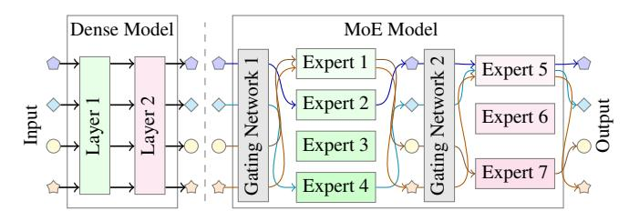
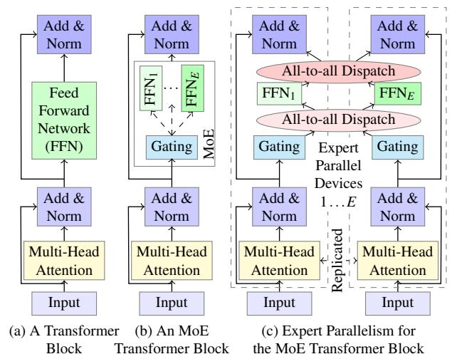

# **SmartMoE: Efficiently Training Sparsely-Activated Models through Combining Offline and Online Parallelization**

**Mingshu Zhai, Jiaao He, Zixuan Ma, Zan Zong, Runqing Zhang, and Jidong Zhai,** *Tsinghua University*

https://www.usenix.org/conference/atc23/presentation/zhai

## **This paper is included in the Proceedings of the 2023 USENIX Annual Technical Conference.**

**July 10–12, 2023 • Boston, MA, USA**

978-1-939133-35-9

**Open access to the Proceedings of the 2023 USENIX Annual Technical Conference is sponsored by**

## SMARTMOE: Efficiently Training Sparsely-Activated Models through Combining Offline and Online Parallelization

Mingshu Zhai⋄ Jiaao He Zixuan Ma Zan Zong Runqing Zhang Jidong Zhai

*Tsinghua University*

## Abstract

Deep neural networks are growing large for stronger model ability, consuming enormous computation resources to train them. Sparsely activated models have been increasingly proposed and deployed to reduce training costs while enlarging model size. Unfortunately, previous auto-parallelization approaches designed for dense neural networks can hardly be applied to these sparse models, as sparse models are datasensitive and barely considered by prior works.

To address these challenges, we propose SMARTMOE to perform distributed training for sparsely activated models automatically. We find optimization opportunities in an enlarged space of hybrid parallelism, considering the workload of data-sensitive models. The space is decomposed into static pools offline, and choices to pick within a pool online. To construct an optimal pool ahead of training, we introduce a data-sensitive predicting method for performance modeling. Dynamic runtime selection of optimal parallel strategy is enabled by our efficient searching algorithm. We evaluate SMARTMOE on three platforms with up to 64 GPUs. It achieves up to 1.88× speedup in end-to-end training over the state-of-the-art MoE model training system FasterMoE.

## 1 Introduction

In recent years, a promising direction for deep neural network (DNN) design has been to increase model size. For example, pre-trained large models have shown extraordinary capabilities in natural language processing (NLP) tasks [\[1,](#page-13-0) [2,](#page-13-1) [13,](#page-13-2) [28\]](#page-14-0).

As model size increases, training efficiency becomes increasingly important. From the system side, various parallel strategies (e.g., data [\[14,](#page-13-3)[18,](#page-14-1)[30,](#page-14-2)[33\]](#page-15-0), pipeline [\[4,](#page-13-4)[10,](#page-13-5)[19,](#page-14-3)[24,](#page-14-4)[25\]](#page-14-5), and tensor [\[35,](#page-15-1) [36,](#page-15-2) [38\]](#page-15-3) parallelism) have been proposed to enable scalable distributed training. Furthermore, to hide underlying complex system details from researchers to allow them to focus on model design, automatic parallelization training systems [\[4,](#page-13-4) [24,](#page-14-4) [36,](#page-15-2) [41\]](#page-15-4) have been proposed to automatically decide among various combinations of different parallel strategies to improve training efficacy. From the model design side, sparse architectures have been proposed to break the coherent relationship between model size and computation cost in DNN models with dense architectures. One of the most popular sparse models currently is Mixture-of-Experts (MoE) [\[12\]](#page-13-6), which has significantly scaled up DNN models in many deep learning tasks, including natural language processing [\[3,](#page-13-7) [6,](#page-13-8) [15,](#page-13-9) [34\]](#page-15-5), computer vision [\[11,](#page-13-10) [32\]](#page-15-6), speech recognition [\[39,](#page-15-7) [40\]](#page-15-8), and recommendation [\[22\]](#page-14-6).

However, few efforts have been put into combining these two optimization directions. Existing training systems [\[8,](#page-13-11) [16,](#page-14-7) [38\]](#page-15-3) typically adopt a specific expert parallelism to support distributed training of MoE models. Although expert parallelism mitigates the problem of high memory consumption of MoE models, training efficiency is affected. Several previous studies [\[9,](#page-13-12) [11,](#page-13-10) [17,](#page-14-8) [23,](#page-14-9) [27,](#page-14-10) [29\]](#page-14-11) try to reduce the overhead of expert parallelism or combine expert parallelism with other parallel strategies, but all require special system expertise. Meanwhile, existing automatic parallelization training systems mainly target conventional DNN models with dense architectures. To improve both the user experience and the training efficiency of MoE models, it is indispensable to design an automatic parallelization training system for MoE models.

Figure 1: Dense Model Compared with MoE Model.

Figure [1](#page-1-0) compares typical dense models with MoE models. In a dense model, the inputs are regarded as identical data to be processed by some layers. In an MoE model, the layers are replaced by multiple *expert sub-networks*. For each input, a special *gating network* is used to match it with the most

⋄Tsinghua University, BNRist

suitable expert, and it is only processed by the selected expert. This leads to the dynamic and imbalanced property of MoE models, as the experts have different workloads. Some experts have to process more inputs than others, and this imbalanced situation is ever-changing across layers and iterations.

We identify the critical challenge of applying automatic parallelization techniques to MoE models due to the dynamic and imbalanced property, or being data-sensitive. While the training cost is fixed in dense models over any input, MoE models behave differently over different data, layers, and training steps. Because the gating network dynamically matches training inputs with experts, the workload of experts may vary a lot, resulting in varying costs for computation and communication. Unfortunately, current automatic parallelization approaches fail to efficiently deal with data-sensitive training of MoE models due to the following two limitations.

Limited Optimization Space. Being data-sensitive makes previous approaches of parallelism combinations perform differently and introduces more space and opportunities for optimizations. Compared to dense models, heterogeneous workloads on different expert sub-networks in MoE training lead to a much larger combination space of parallelism. We find that with the workload variance in mind, there are more opportunities of optimizing training performance. However, existing works [\[36,](#page-15-2) [41\]](#page-15-4) assume that the workloads on subnetworks are homogeneous, and exclude many potentially faster candidates from their space for hybrid parallelism.

Large Searching Overhead. For data-sensitive models, the optimal execution plan changes frequently. However, for previous data-insensitive systems, the workload is static and can be determined by the model structure before training. Therefore, they adopt time-consuming algorithms, e.g., dynamic programming [\[24,](#page-14-4) [36\]](#page-15-2) or integer linear programming (ILP) [\[41\]](#page-15-4), to search for optimal execution plans. These algorithms commonly take minutes or even hours, only feasible to be performed offline. However, optimal execution plans for the dynamic workload should be identified between iterations that commonly take less than one second.

To address these challenges, we propose SMARTMOE, an automatic parallelization training system for sparsely activated models. We explore the space of hybrid parallelism with awareness of heterogeneous workloads, where more potentially faster candidate parallel strategies are included. To sustain high efficiency during the dynamic and imbalanced MoE training process, we propose a two-stage solution for parallelization. Based on a static pool that consists of mutual-convertible parallel strategies constructed offline, fast dynamic adaption is performed within the constructed pool at runtime to select the strategy that fits the current workload.

In the offline stage, we create a pool of strategies that guarantees good inherent performance and low switching overhead at runtime. Also, we design a workload-aware performance model to estimate the performance of the data-sensitive models without actually training them so that an optimal pool can

be constructed ahead of training.

In the online stage, we develop light-weight algorithms to find the optimal parallel strategy for the current workload within the selected pool. The algorithms are performed periodically at runtime to determine whether we should employ a new parallel strategy, considering factors including switching cost and searching overhead.

We evaluate SMARTMOE on three different clusters with up to 64 GPUs. Results show that SMARTMOE achieves up to 1.88× speedup in end-to-end training compared with the state-of-the-art MoE model training system FasterMoE [\[9\]](#page-13-12).

In summary, we make the following contributions:

- We enlarge the combination space of hybrid parallelism for data-sensitive models, enabling more potential to optimize training performance.
- We propose a two-stage adaptive auto-parallelization approach that performs hierarchical optimizations both offline and online.
- We introduce the awareness of workload to performance modeling, enabling performance prediction of training the data-sensitive models.
- We develop fast algorithms that can find optimal parallel strategies within a pool at runtime.
- We implement these techniques into an end-to-end MoE training system, SMARTMOE, and achieve up to 1.88× speedup over FasterMoE [\[9\]](#page-13-12).

The rest of this paper is organized as follows. [§2](#page-2-0) introduces background and our motivation. [§3](#page-5-0) presents an overview of SMARTMOE. [§4](#page-5-1) introduces an enlarged space of hybrid parallelism for MoE model training. [§5](#page-6-0) discusses the scope of pool among the space of data-sensitive hybrid parallelism, and demonstrates our estimation-based approach of performance modeling. [§6](#page-7-0) illustrates our adaptive automatic parallelization methods. [§7](#page-9-0) evaluates SMARTMOE. More related works are described in [§8,](#page-12-0) and [§9](#page-12-1) concludes this paper.

## 2 Background and Motivation

## 2.1 MoE Model and Expert Parallelism

The Mixture-of-Experts (MoE) was proposed decades ago [\[12\]](#page-13-6) and applied to DNN models in recent years. It has been proven to be helpful in improving model accuracy in many deep learning tasks, including nature language processing [\[15\]](#page-13-9), computer vision [\[11\]](#page-13-10), speech recognition [\[39,](#page-15-7) [40\]](#page-15-8) and recommendation [\[22\]](#page-14-6). In this paper, we focus on sparselygated MoE [\[34\]](#page-15-5) models, the most widely used MoE technique, with instant demand for efficient distributed training.

The MoE technique is currently the most feasible way to enable the parameter size of a model and its computational cost to be scaled independently. A model can increase the number

Figure 2: An Example of MoE Model and Expert Parallelism.

of parameters by applying MoE, while keeping the floating-point operations (FLOPs) of one training iteration almost identical. For example, Figure 2 shows the model structure of the transformer model extended by MoE. A feed-forward network (FFN) is regarded as an expert, and the model contains multiple experts which are sparsely activated. A trainable gating network is added to dynamically match training samples with suitable experts. As each training sample is sent to a certain expert, which equals the original FFN in size, FLOPs required to train over the sample remains similar. Meanwhile, numerous experts can be employed in one MoE layer, greatly increasing the number of parameters.

Distributed training becomes a must to train MoE models, as the model is so large that it cannot be held in the memory of any single device. To support the distributed training, GShard [15] designs a specific method of parallelism for MoE models, namely **Expert Parallelism** (**EP**). In fact, it is a combination of Data Parallelism and Tensor Model Parallelism specialized for the MoE scenario. As shown in Figure 2(c), the model is split up across the dimension of the experts' indices, and the input and output features are split along sample dimension. All-to-all communication is performed to dispatch the input samples to the desired expert models and put the output back to its original location, e.g. re-arranging words into sentences in language models.

Dynamic routing is the most unique feature of the MoE training workload. A trainable gating module dynamically assigns tokens to different experts in every iteration for every MoE layer, according to the input data. Therefore, the training workload varies at different layers and iterations. This dynamic nature of the MoE models makes it much different from a traditional neural network in distributed training.

#### 2.2 Hybrid and Automatic Parallelization

Listed below are three common ways of parallelism to train typical dense deep neural networks. **Data Parallelism (DP).** Each worker stores a complete copy of parameters, and the training samples assigned to each worker are different. Forward and backward computation are completed independently on each worker. Gradients on different workers are aggregated before being used in the optimization of the model. DP incurs significant memory and communication overhead as the model gets larger, because all the parameters are replicated and synchronized in every iteration. Some approaches [30, 37] reduce the memory footprint by splitting up the replicas, but the communication overhead is inevitable.

**Pipeline Model Parallelism (PP).** The model is divided into multiple stages with sequential data dependency. Each worker stores the parameters of its corresponding stage. The first worker reads batches of the training data, and workers with adjacent stages exchange intermediate results for forward or gradients for backward computation. To be efficient, PP has to have evenly distributed stages and bubble-free schedule, intensively studied by prior works [4, 10, 24, 25].

**Tensor Model Parallelism (TP).** Single operators of a model are partitioned across multiple workers. Each worker stores a part of the parameters of the operators and conducts part of its computation, e.g. a tile of a matrix. TP of different operators needs to be designed specifically by experts, and the partitioning method is critical to distributed training performance. Megatron [35] provides the best practice of TP on transformer models. Other works [36, 38] explores unified representation of TP and automatic generation of the most efficient partition.

To improve distributed training performance, **Hybrid Parallelism** is introduced, which combines a few of the above parallel strategies to better fit specific models and particular training hardware. We call an instance of hybrid parallelism a **parallel execution plan**. Given a model and a hardware specification, there can be multiple parallel execution plans, since multiple parallel strategies are available. For example, Megatron-v2 [26] achieves high-performance distributed training by expert-designed hybrid parallel execution plans, but only for transformer-based models.

Moreover, **automatic parallelization** is desired to make high-performance hybrid parallelism available to model developers with less expertise in distributed systems, Alpa [41] categorizes parallelism into inter-layer (PP) and intra-layer (DP and MP) levels, and automatically generates hybrid parallel execution plans by hierarchically optimizing over both levels. However, it is very time-consuming for current approaches to generate an optimal parallel execution plan, due to the lack of performance models and their excessive searching algorithms. Minutes, or even hours, are taken to generate an execution plan that may only cost milliseconds or seconds for an iteration.

In the end, we summarize three key challenges for any automatic parallelization training system.

**Space of Hybrid Parallelism.** Hybrid parallelism means combining multiple different parallel strategies into one ex-

ecution plan. Specifically, the hybrid of any two different strategies may involve complicated adaption, and introduce variance in performance. The more parallel strategies a system can handle, the more opportunities exist to find a faster execution plan.

**Performance Modeling.** Performance modeling helps explore a huge hybrid parallelism space efficiently, as it is infeasible to measure the cost of every possible execution plan without actually running it.

Besides, beyond being accurate as a basic requirement, a good performance model shall be giving extra information, or guidance, that can provide better understanding of the performance, and indicate the direction of generating a better execution plan.

**Searching Algorithm.** The huge space of hybrid parallelism shall be explored adequately to find an optimal or near-optimal execution plan. However, for large-scale model training, it is even unacceptable to enumerate every possible candidate. The algorithm's efficiency in finding a near-optimal execution plan is appreciated, primarily when performed frequently over different configurations.

