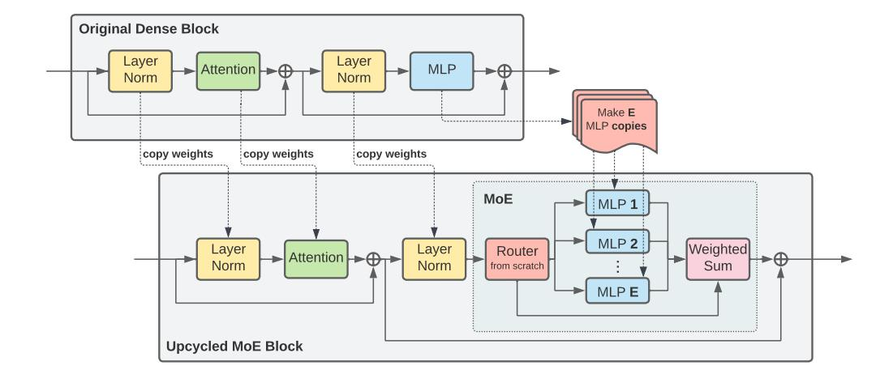

# 2 BACKGROUND

In this section we recap of the main components used in sparse upcycling: Transformer-based language and vision models, and sparsely activated Mixture-of-Experts (MoEs).

#### 2.1 Sparsely activated Mixture-of-Experts (MoE)

Dense models apply all parameters to every input. Accordingly, growing the model capacity results in increased computational cost. Sparse models attempt to alleviate this fundamental issue by only activating a subset of parameters for each input. Sparsely activated Mixture-of-Experts (MoE) models are an accelerator friendly family of sparse models that allow training of models with up to trillions of parameters (Shazeer et al., 2017; Fedus et al., 2022).

MoE models typically alternate standard dense Transformer blocks with MoE blocks. In particular, we usually replace the MLPs in a Transformer block with a number of "experts" (typically themselves MLPs) with different learnable parameters and a router—a small neural network—that decides which expert is applied to each individual token. A number of routing algorithms have been developed, for example Top-K (Shazeer et al., 2017), BASE and Sinkhorn-BASE layers (Lewis et al., 2021; Clark et al., 2022), Hash layers (Roller et al., 2021), and Expert Choice routing (Zhou et al., 2022).

We generally focus on Expert Choice routing, which works as follows. Let E denote the total number of experts in a MoE layer, and n the total number of tokens. The router outputs a matrix  $\mathbf{R} \in \mathbb{R}^{n \times E}$  with the routing probabilities, where row  $r_i \in \mathbb{R}^E$  corresponds to the i-th token and is a distribution over E experts  $(r_{ij} \geq 0 \text{ and } \sum_j r_{ij} = 1)$ . Then, every expert e independently chooses the E tokens with highest probabilities for e (i.e., we perform top-E per column) and processes them. We parameterize E as E as E and E as a capacity factor that we control to choose more or fewer tokens per expert. When E and expert processes exactly E tokens; note that some tokens may be processed by several experts, while others by none. This allows for a model parameter count increase with minimal FLOPs overhead. Letting E 1 usually leads to higher performance at a higher compute cost.

&lt;sup>2The FLOPs overhead comes from the (relatively modest) router computation of **R**.

Figure 1: The upcycling initialization process. All parameters, and optionally their optimizer state, are copied from the original checkpoint, except those corresponding to the MoE router, which does not exist in the original architecture. In particular, the experts in the new MoE layer are identical copies of the original MLP layer that is replaced.

