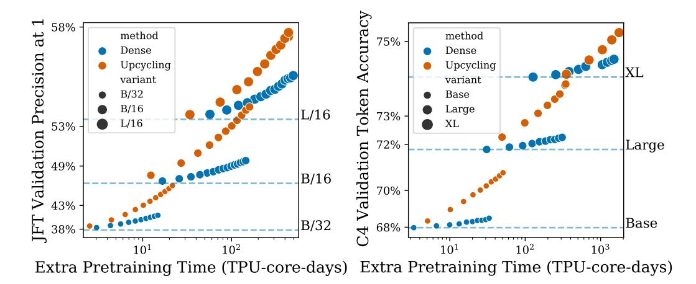

# 4 EXPERIMENTS

In this section, we present the main experimental results of the paper. We also share the takeaways of a number of ablations aimed at identifying the key aspects of our algorithm; full results are included in Appendix [B.](#page-16-0) Most of the results are presented as quality vs. cost plots, where we use the upstream or downstream performance to measure quality, and training time in terms of TPU-core-days (as prominent cost metrics [\(Dehghani et al., 2021\)](#page-9-4)) or training steps (when the cost per step is the same for all the compared models) to measure computation cost.

3 For Expert Choice routing, more capacity means that each expert can choose more tokens. For standard Top-K routing, more capacity means that each token is more likely to fit into the buffer of its desired expert.

Figure 2: Pretraining performance achieved by the dense continuation and upcycling methods, for different Transformer variants. The left plot shows the performance on the vision task and the right one on the text task. The x-axis shows the extra pretraining time (TPU-core-days), with respect to the total time needed to train the original dense checkpoints, for each size. The horizontal lines indicate the quality (y-axis) of the original dense checkpoints.

