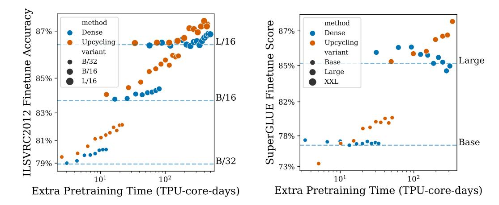

# 4.1 EXPERIMENTAL SETUP

All upcycled experiments begin from a pretrained dense model checkpoint. Because all of our starting dense checkpoints are trained with an inverse square root learning rate schedule, training can be continued without discontinuities in the learning rate schedule. We upcycle models and continue training, showing performance for varying amounts of continued training. As a baseline, we also continue the training of the original dense model ("dense continuation").

**Vision experiments.** MoE Vision Transformers ("V-MoE") models are trained broadly following the protocol of Riquelme et al. (2021). Upstream pretraining is done on JFT300M (Sun et al., 2017), with validation metrics computed on a held-out set of 894,574 examples. Few-shot transfer follows Dosovitskiy et al. (2021), whereby a least-squares regressor predicts one-hot classes given frozen image representations. We further validate our results on ImageNet using 10-shot – i.e. 10 training examples per class. We do this for 5 different training sets, and report average accuracy across them. For full finetuning, we replace the pretraining head with a randomly initialized head, and finetune the entire network. See Appendix A.2.2 for further details.

Language experiments. Our language experiments follow the setup of Raffel et al. (2020): we pretrain using the span corruption task on the English C4 dataset (Raffel et al., 2020) and finetune on a proportional mix of all SuperGLUE (Wang et al., 2019) tasks simultaneously. We include specific training details in Appendix A.2, but highlight one important aspect here: For Base model sizes, for which we perform the majority of our ablations, we pretrain the dense baseline starting checkpoint ourselves. To highlight the versatility of our upcycling algorithm, for Large and XL models, we instead begin all experiments from official T5 1.1 checkpoints (Narang et al., 2021; Roberts et al., 2022).

#### 4.2 EXPERIMENTAL RESULTS

#### 4.2.1 Core results

Figure 2 shows a detailed comparison of upstream metrics of upcycled models and dense continuation models at various model sizes both for vision (left panel) and language (right panel). For any given model size and task, we observe that the dense and upcycled models perform close to each other when we apply a very limited extra training budget – indeed, close to their discontinuous horizontal line representing the original checkpoint's performance. Once we apply a non-trivial amount of extra compute, a clear pattern emerges showing the strong gains delivered by the upcycled architecture.

Figure 3: Full finetuning performance achieved by the dense continuation and upcycling methods. The left plot shows the performance on ImageNet and the right one on SuperGLUE tasks. The x-axis shows the extra pretraining time (TPU-core-days), with respect to the total time needed to train the original dense checkpoints, for each size. The horizontal lines indicate the quality (y-axis) of the original dense checkpoints.

Figure 4: Pretraining performance achieved by the upcycling method and a MoE model trained from scratch, for B/16 (left plot, vision task) and Base (right plot, text task). The x-axis shows the extra pretraining time (TPU-core-days), with respect to the total time needed to train the original dense checkpoints. The MoE model trained from scratch only catches up to the language upcycled model after about 120% of the original dense checkpoint computation budget (second last orange and green dots from the right).

Figure 3 shows the performance after finetuning the models trained in Figure 2. For vision (left panel), the upstream performance gains generally transfer fairly cleanly downstream. For language (right panel), there is more variance in the performance after finetuning. Nevertheless, the trend clearly favors the upcycled language models.

Figure 4 compares sparse upcycling with sparse models trained from scratch. As training from scratch does not reuse the computation cost already sunk into the dense checkpoint, it takes longer, on a extra train time basis, to catch up with the upcycled models. The language MoE model trained from scratch requires about 120% of the original dense checkpoint's computation budget to catch up to the upcycled model. The relatively faster quality gains, on a per step basis, of the MoE models trained from scratch can be attributed to the relatively larger learning rate and that the experts are able to independently develop and diversify from the beginning. Figure 4 suggests that, given a very large computation budget (> 100% of the initial dense model's computation budget), the MoE-from-

Figure 5: Pretraining performance achieved by sparse upcycling and dense upcycling from a T5 Base checkpoint (text task). The x-axes show the extra pretraining time (TPU-core-days) and extra pretraining (Peta)FLOPs, with respect to the the original dense checkpoints. Following recommendations in (Rae et al., 2021), we only increase the number of layers when warm starting ("depth tiling") to roughly match the runtime of the sparse model.

scratch model will eventually catch the upcycled model. For such large computation regimes, it may be preferable to train MoE models from scratch. For constrained or limited compute budgets (<100% of the initial computation budget), sparse upcycling is a more efficient use of resources.

Finally, Figure 5 compares sparse upcycling with warm starting ("dense upcycling"). We warm start larger models from the dense Base checkpoint by replicating new layers ("depth tiling") in the same tiling patterns as in (Rae et al., 2021). The densely upcycled models quickly see gains over the original dense checkpoint, but underperform the sparse model. We did not attempt to increase the model hidden dimensions ("width tiling"), which (Rae et al., 2021) found to be less effective.

