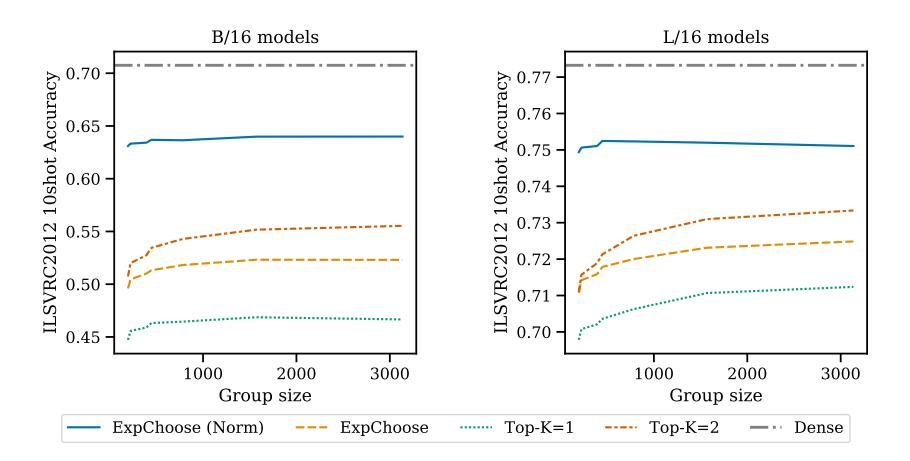

# B.8 CLOSER LOOK AT DESIGN CHOICES IMMEDIATELY FOLLOWING UPCYCLING

Once a model is upcycled, there is a drop in performance due to the sudden deviation from the dense model's learned function, even with MoE experts reusing the dense MLP weights. Routing design decisions can make a significant difference in ameliorating this drop.

Section B.2 ablates the long-term upcycled model performance as a function of the capacity factor C. Figure 15 shows the immediate effect of modifying C on the upcycled model. Increasing C reduces the likelihood that tokens are dropped; when routing weights are normalized to sum to 1 (see Section B.7), the upcycled model is exactly equivalent to the dense model for those tokens selected by at least one expert. Note the set of tokens not selected by any expert decreases in size as we increase C.

Note that although different routing mechanisms significantly impact the starting point for upcycling, the subsequent training can smooth over many differences. For example, at the start Top-K routing is clearly worse than Expert Choice with weight normalization, but Table 2 shows that a model upcycled with Top-K routing eventually catches up.

Figure 16 shows the effect of the group size parameter. Routing, and in particular the top-k operations, are performed in groups. Using smaller group sizes will speed up routing, but will lead to higher variance in expert assignment across groups. For smaller groups, we may expect more tokens to be dropped (not selected by any expert).

How many MoE layers we upcycle, and where we place those layers, also affects the initial performance drop. Figure 17 shows the effect of this in the initial drop for Expert Choice routing, using normalized combined weights (Section B.7) Upcycling the bottom layers causes a larger initial performance drop. Upcycling the last layers consecutive layers or interleaving them —as in every other layer—yields the smallest initial performance drop.

Finally, we analyze how the number of experts per MoE layer affects the initial upcycling. Figure 18 suggests that routing to more experts leads to a heavier drop. Figure 12 shows that upcycled models can recover from this eventually though, and sometimes even achieve higher performance.

## B.9 THINGS THAT DID NOT WORK

We list several unsuccessful attempts, beyond the preceding ablations, to improve the performance of the upcycling. Adding (truncated) Gaussian noise to router weights, expert weights or both, in an effort to diversify the router or expert weights, did not help. Modifiying the learning rate of experts, routers or both, to account for the fact that the addition of sparsity may demand different learning rate from the rest of the model, generally hurt performance; increasing the learning rates sometimes rendered the models more unstable. We attempted to add a fixed temperature term to the softmax of

Figure 16: Increasing group size does not significantly affect performance using Expert Choice routing, but improves initial performance for Top-K routing.

Figure 17: Effect of position and number of MoE layers on the initial performance after upcycling (i.e. at the very first new step). Note that L/16 models have more MLP layers..

Figure 18: Effect of the number of experts per MoE layer on the initial drop of ImageNet 10-shot performance (i.e. at step 1), for B/16 and L/16 upcycled models with 6 MoE layers and C=1. The initial performance is lower when using more experts.

router to encourage more random or less random routing. We also varied the initialization scheme for the router, included the router z-loss [\(Zoph et al., 2022\)](#page-13-2). Unfortunately, none of these attempts led to any significant performance improvement.

|                           |                     |                                  | (                                                                 | he 0, t are y co rre sp                        | d t he in it ia o t on        | l de he kp int ns e c c o                   | ). s                                |                                                            |  |
|---------------------------|---------------------|----------------------------------|-------------------------------------------------------------------|---------------------------------------------------------------------|-------------------------------------------------|---------------------------------------------------------------------|----------------------------------------|------------------------------------------------------------|--|
| M ho d et        | Va ian t r | J F T- 3 0 0 M | I L S V R C 2 1 2 0 1 0s ho t | I L S V 2 F R C 2 0 1 ine tun e | Ex tra T P Uv 3- da y s | Re lat ive Ex tra T P Uv 3- da y s | Ex tra Ex F L O Ps a | Re lat ive Ex tra Ex F L O Ps a |  |
| De ns e             | / 3 2 B    | 3 8 7. 7                | 6 1. 9 2                                                 | 8. 9 1 7                                                   | 0. 0 0                                    | 0. 0 0                                                        | 0. 0 0                           | 0. 0 0                                               |  |
| De ns e             | L / 3 2    | 6 4 4. 9                | 7 0. 9 7                                                 | 8 3. 0 8                                                   | 0. 0 0                                    | 0. 0 0                                                        | 0. 0 0                           | 0. 0 0                                               |  |
| De ns e             | B / 1 6    | 4 6. 6 7                | 7 2. 1 9                                                 | 8 3. 7 7                                                   | 0. 0 0                                    | 0. 0 0                                                        | 0. 0 0                           | 0. 0 0                                               |  |
| De ns e             | / 1 6 L    | 5 3. 5 4                | 8. 6 3 7                                                 | 8 6. 5 0                                                   | 0. 0 0                                    | 0. 0 0                                                        | 0. 0 0                           | 0. 0 0                                               |  |
| M E o               | B / 3 2    | 2 0. 2 4                | 3 9. 8 2                                                 | 5 6 6. 9                                                   | 1. 9 1                                    | 1 4. 6 0                                                   | 4. 0 2                           | 1 4. 6 4                                          |  |
| Up l ing cy c | B / 3 2    | 3 8. 7 3                | 6 3. 0 1                                                 | 7 9. 5 8                                                   | 2. 5 3                                    | 1 9. 3 1                                                   | 5. 3 2                           | 1 9. 3 6                                          |  |
| M E o               | L / 3 2    | 6 2 3. 7                | 6 4 4. 3                                                 | 6 9. 1 1                                                   | 5. 7 0                                    | 1 4. 1 1                                                   | 1 3. 7 9                      | 6 1 4. 3                                          |  |
| Up l ing cy c | L / 3 2    | 4 5. 3 3                | 7 1. 2 8                                                 | 8 3. 3 5                                                   | 5. 7 8                                    | 1 4. 3 1                                                   | 1 3. 1 5                      | 1 3. 6 9                                          |  |
| M E o               | / 3 2 B    | 3 8. 7 7                | 6 3. 2 4                                                 | 8. 8 0 7                                                   | 9. 5 7                                    | 3. 0 1 7                                                   | 2 0. 1 2                      | 3. 1 9 7                                          |  |
| l ing Up cy c | 6 B / 1    | 4 7. 8 1                | 7 3. 1 9                                                 | 8 4. 1 3                                                   | 6 1 2. 3                               | 5 1 3. 4                                                   | 2 8. 3 1                      | 6 1 2. 8                                          |  |
| Up l ing cy c | B / 3 2    | 4 6. 3 4                | 6 9. 9 8                                                 | 8 2. 1 8                                                   | 2 1. 6 0                               | 1 6 4. 8 8                                              | 4 5. 4 3                      | 1 6 5. 3 0                                     |  |
| l ing Up cy c | / 1 6 L    | 5 3. 8 9                | 8. 8 7 7                                                 | 8 6. 5 6                                                   | 3 3. 9 9                               | 1 0. 8 7                                                   | 8 1. 3 6                      | 1 0. 4 0                                          |  |
| Up l ing cy c | L / 3 2    | 5 1. 1 9                | 7 4. 4 3                                                 | 8 4. 6 6                                                   | 4 9. 9 5                               | 1 2 3. 5 8                                              | 1 1 3. 6 3                 | 1 1 8. 2 9                                     |  |
| De ns e             | B / 1 6    | 4 8. 1 2                | 7 3. 2 8                                                 | 8 4. 2 3                                                   | 5 3. 1 9                               | 5 8. 2 6                                                   | 1 3 0. 0 4                 | 5 8. 2 6                                          |  |
| M E o               | 6 B / 1    | 5 0. 2 4                | 6 7 4. 9                                                 | 5 8 4. 7                                                   | 5 7 3. 8                               | 5 8 0. 9                                                   | 6 1 8. 4 9                 | 5. 7 4 9                                          |  |
| Up l ing cy c | B / 1 6    | 5 2. 5 9                | 7 6. 4 8                                                 | 8 5. 6 7                                                   | 8 5. 9 4                               | 9 4. 1 3                                                   | 1 9 6. 8 0                 | 8 8. 1 7                                          |  |
| l ing Up cy c | / 1 6 B    | 5 4. 4 2                | 3 9 7 7.                                                 | 8 6. 0 3                                                   | 1 5 9. 5 2                          | 1 4. 3 7 7                                              | 3 6 5. 2 8                 | 1 6 3. 6 6                                     |  |
| De ns e             | L / 1 6    | 5 4. 9 1                | 7 9. 1 7                                                 | 8 6. 6 8                                                   | 1 8 2. 1 6                          | 5 8. 2 6                                                   | 5 5. 5 4 8                 | 5 8. 2 6                                          |  |
| Up l ing cy c | L / 1 6    | 5 6. 7 1                | 7 9. 7 0                                                 | 8 7. 1 0                                                   | 2 3 6. 2 7                          | 7 5. 5 7                                                   | 5 6 5. 5 8                 | 7 2. 2 9                                          |  |
| De ns e             | / 1 6 L    | 5 5. 6 5                | 9. 4 6 7                                                 | 8 6. 4 8                                                   | 3 3 8. 4 9                          | 1 0 8. 2 6                                              | 8 4 0 5 7.                 | 1 0 8. 2 6                                     |  |
| Up l ing cy c | L / 1 6    | 5 7. 8 4                | 8 0. 0 1                                                 | 8 7. 1 7                                                   | 4 3 8. 5 5                          | 1 4 0. 2 7                                              | 1 0 4 9. 7 9            | 1 3 4. 1 8                                     |  |
| De ns e             | L / 1 6    | 5 6. 1 9                | 7 9. 6 3                                                 | 8 6. 8 9                                                   | 4 9 4. 8 1                          | 1 5 8. 2 6                                              | 1 2 3 8. 2 4            | 1 5 8. 2 6                                     |  |

| s w                   | p               |           | sp        | ing                            | kp        | w                            | he 0, he t se are | y co   | rre sp on | d t he o t | in it ia l de ns | he kp e c c o        | int ). s                                       | h in bs a o        | lut d r lat ive ( % ) e a n e |
|-----------------------|-----------------|-----------|-----------|--------------------------------|-----------|------------------------------|----------------------------------|-----------|-----------------|------------------|---------------------------------|----------------------------------|------------------------------------------------------|--------------------------------|----------------------------------------------------------|
| Me tho d        | Va ria nt | C4        | Bo olQ | CB                             | CO PA  | ( M ult iRC         | Re Co RD                   | RT E   | W iC         | W SC          | Su GL UE Sco per re | Ex tra TP 4-d Uv ays | lati Re Ex tra TP ve 4-d Uv ays | Ex tra Ex aFL OP s | lati Re Ex tra Ex ve aFL OP s       |
| De nse             | Ba se        | 67 .97 | 82 .48 | 94 .64 / 9 3.6 9   | 70 .00 | 38 .30 / 7 6.5 2 | 77 .26 / 7 8.2 4     | 82 .31 | 69 .59       | 83 .65        | 77 .17                       | 0. 00                         | 0. 00                                             | 0. 00                       | 0. 00                                                 |
| De nse             | La rge       | 71 .80 | 87 .95 | 96 .43 / 9 5.0 3   | 87 .00 | 54 .35 / 8 4.3 5 | 84 .84 / 8 5.7 8     | 92 .06 | 75 .55       | 87 .50        | 85 .06                       | 0. 00                         | 0. 00                                             | 0. 00                       | 0. 00                                                 |
| De nse             | X L          | .15 74 | —         | —                              | —         | —                            | —                                | —         | —               | —                | —                               | 0. 00                         | 0. 00                                             | 0. 00                       | 0. 00                                                 |
| De nse             | Ba se        | 68 .20 | 81 .77 | 92 .86 / 9 1.7 9   | 70 .00 | 37 .88 / 7 6.0 4 | 77 .25 / 7 8.1 5     | 82 .67 | 67 .55       | 81 .73        | 76 .34                       | 13 .33                        | 40 .00                                            | 55 .15                      | 40 .00                                                |
| De nse             | Ba se        | 68 .33 | 83 .00 | 94 .64 / 9 3.6 1   | 72 .00 | 38 .93 / 7 6.8 2 | 77 .46 / 7 8.4 9     | 84 .84 | 67 .71       | 78 .85        | 77 .05                       | 19 .99                        | 60 .00                                            | 82 .73                      | 60 .00                                                |
| lin Up cyc g | Ba se        | 69 .78 | 82 .91 | 98 .21 / 9 8.6 8   | 74 .00 | 38 .09 / 7 7.2 0 | 80 .90 / 8 1.9 5     | 82 .67 | 69 .28       | 87 .50        | 79 .23                       | 20 .31                        | 60 .98                                            | 82 .14                      | 59 .57                                                |
| Mo E               | Ba se        | 69 .52 | 79 .66 | 91 .07 / 8 9.0 8   | 63 .00 | 30 .12 / 7 3.4 4 | 76 .36 / 7 7.4 8     | 79 .78 | 69 .75       | 84 .62        | 74 .45                       | 20 .33                        | 61 .01                                            | 82 .14                      | 59 .57                                                |
| Up lin cyc g | Ba se        | 70 .22 | 84 .04 | 10 0.0 0 / 100 .00 | 76 .00 | 40 .08 / 7 8.2 0 | 82 .06 / 8 3.0 5     | 83 .39 | 68 .03       | 84 .62        | 79 .72                       | 30 .47                        | 91 .47                                            | 12 3.2 1                 | 89 .36                                                |
| Mo E               | Ba se        | 70 .12 | 80 .34 | 96 .43 / 9 7.3 8   | 72 .00 | 30 .33 / 7 3.8 7 | .43 / 7 8.6 6 77     | 80 .51 | 70 .06       | 84 .62        | 76 .82                       | 30 .49                        | 91 .52                                            | 12 3.2 1                 | 89 .36                                                |
| De nse             | Ba se        | 68 .53 | .63 82 | 96 .43 / 9 3.2 1   | 70 .00 | 38 .30 / 7 7.2 7 | .55 6 77 / 7 8.4     | 83 .03 | 69 .91       | .69 82        | .36 77                       | 33 .32                        | 10 0.0 0                                       | 13 7.8 8                 | 10 0.0 0                                           |
| Up lin cyc g | Ba se        | 70 .83 | 84 .31 | 98 .21 / 9 8.6 8   | 79 .00 | 39 .77 / 7 7.8 4 | 83 .02 / 8 4.1 5     | 83 .39 | 69 .59       | 81 .73        | 79 .86                       | 50 .79                        | 15 2.4 5                                       | 20 5.3 5                 | 14 8.9 4                                           |
| De nse             | La rge       | 72 .03 | 88 .81 | 96 .43 / 9 4.3 0   | 89 .00 | 56 .87 / 8 5.4 9 | 87 .65 / 8 8.4 4     | 90 .97 | 73 .20       | 90 .38        | 85 .87                       | 12 3.5 4                   | 40 .00                                            | 63 7.7 2                 | 40 .00                                                |
| De nse             | La rge       | 72 .12 | 88 .81 | 96 .43 / 9 4.3 0   | 88 .00 | 56 .56 / 8 5.5 4 | 87 .78 / 8 8.5 4     | 90 .25 | 73 .35       | 90 .38        | 85 .67                       | 18 5.4 2                   | 60 .03                                            | 95 6.5 8                 | 60 .00                                                |
| lin Up cyc g | La rge       | 73 .34 | .62 88 | 96 5.0 .43 / 9 4   | 90 .00 | 55 5.2 .93 / 8 2 | .65 87 / 8 8.8 0     | .61 90 | .26 72       | 92 .31        | 86 .04                       | 19 7.3 8                   | 63 .91                                            | 76 .51 10                | 67 .52                                                |
| Up lin cyc g | La rge       | 73 .68 | 88 .90 | 10 0.0 0 / 100 .00 | 90 .00 | 55 .40 / 8 5.0 4 | 88 .58 / 8 9.6 2     | 92 .78 | 72 .57       | 90 .38        | 86 .74                       | 28 7.4 8                   | 93 .08                                            | 16 14. 73                | 10 1.2 8                                           |
| De nse             | La rge       | 72 .26 | 88 .38 | 96 .43 / 9 4.3 0   | 87 .00 | 57 .08 / 8 5.4 3 | 87 .83 / 8 8.5 7     | 91 .34 | 72 .57       | 87 .50        | 85 .20                       | 30 9.0 4                   | 10 0.0 6                                       | 15 94 .30                | 10 0.0 0                                           |
| De nse             | X L          | 74 .34 | —         | —                              | —         | —                            | —                                | —         | —               | —                | —                               | 50 8.7 3                   | 40 .00                                            | 23 69 .07                | 40 .00                                                |
|                       | X L          | 74 .46 | —         | —                              | —         | —                            | —                                | —         | —               | —                | —                               | 50 10 .73                  | 82 .62                                            | 34 01 .70                | 57 .44                                                |
| De nse             | X L          | 75 .03 | —         | —                              | —         | —                            | —                                | —         | —               | —                | —                               | 14 05 .57                  | 11 0.5 2                                       | 49 85. 16                | 84 .17                                                |