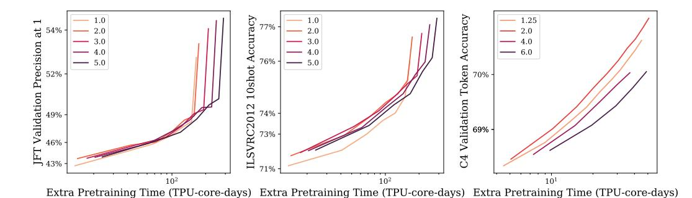
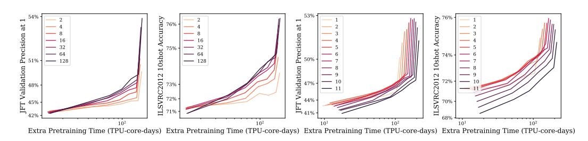

# B.2 ROUTER CAPACITY FACTOR

Sparsifying the dense model increases the model capacity (number of parameters). However, if the capacity factor C=1, then the FLOPS is very similar to the original, dense model (modulo the small routing costs). We can increase the per-token compute by increasing C. Figure 9 investigates this, and shows our results for vision (left and center panels) and language (right panel).

For vision, we see that extreme values (C=1 and C=5) underperform intermediate values (C=2 and C=3) that offer better trade-offs. For language, the trend is even stronger: A capacity factor of C=2 stands out as the best option on a per compute basis.

#### B.3 Number of experts

Adding more experts increases the number of model parameters and, up to a point, the quality of the model. Given that the number of tokens each expert processes is inversely proportional to the number of experts (see Section 2.1), adding more experts usually only leads to very modest computational (and wall time) overheads. However, for a very large number of experts, the upcycled model may experience a larger initial quality drop relative to the baseline dense model.

Figure 9: Pretraining performance achieved by upcycling using different capacity factors, for a B/16 (left and center panels, vision tasks) and a Base T5 model (right plot, text task). The x-axis shows the extra pretraining time (TPU-core-days), with respect to the total time needed to train the original dense checkpoint. Although using a bigger capacity factors can result in an absolute better performance when runtime is disregarded (e.g. see the vision results), for a given fixed compute budget, it is usually better to use a capacity factor of around 2.0.

Figure 10: Pretraining performance achieved by the upcycling method on the vision tasks, using different number of experts per MoE layer (two left plots, with a total number of 6 MoE layers), and a different number of MoE layers (two right plots, with a total number of 32 experts; all MoE layers are placed at the top Transformer blocks). The x-axis shows the extra pretraining time (TPU-core-days), with respect to the total time needed to train the original dense checkpoint.

Figure 10 (two left panels) shows the results of a vision experiment with 6 MoE layers with a number of experts ranging from 2 to 128. For a fixed amount of compute (value in the x-axis), we see that more experts is generally better for this B/16 model. Figure 11 shows the final metric values both for upstream (JFT precision at 1) and downstream (ImageNet 10-shot) with respect to the number of experts. We see steady improvements upstream, and –at some point– diminishing returns downstream.

