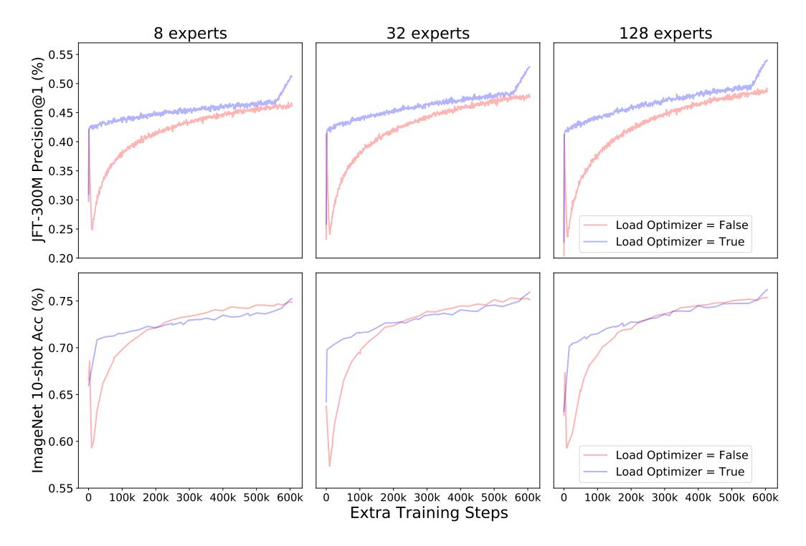
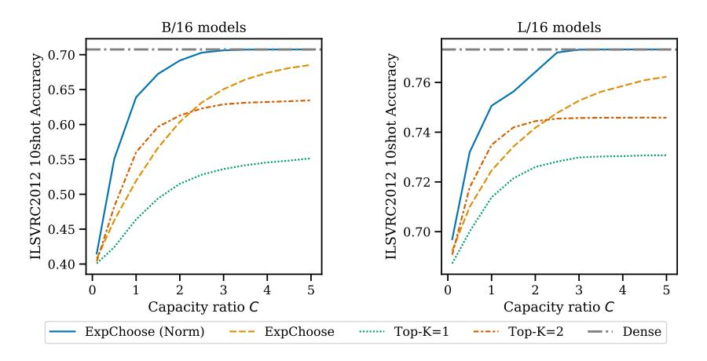

# B.4 Number of MoE layers

Another key decision is how many layers to sparsify. More layers leads to higher model capacity, while –especially for higher C– it introduces significant extra wall time overhead. We ablate this for vision models, as shown in Figure 10 (two right panels). For a B/16 model with 12 blocks, we train upcycled versions with an increasing number of MoE layers; MoE layers are consecutive and start from the last layer. For example, the model labeled as '5' corresponds to a model where the last 5 MLP layers are sparsified, and so on. Thus, model '1' only has one MoE layer (the last one) and it is the computationally cheapest in terms of wall time. We do not include a model where all layers are sparsified (would correspond to '12') as we found that sparsifying the very first block tends to be problematic.

We see in Figure 10 (two right panels) that more MoE layers is not always better even on a per step basis; see Figure 12 for both upstream and downstream metrics. Looking at a fixed value of the x-axis in Figure 10 (right panels), we conclude that something between Last-5 and Last-6 (40-50% of layers sparsified) offers the most attractive trade-off in this case.

Figure 11: Final upstream and downstream performance for upcycled B/16 vision models with different number of experts per MoE layer. The number of MoE layers is fixed at 6. The upcycled model is trained for an additional 7 epochs (from 14 to 21) relative to the original dense model. The dashed horizontal lines show the performance of the dense model when trained for an additional 7 epochs.

Figure 12: Performance as a function of the number of MoE layers for upcycled B/16 models (C=1) trained for 7 additional epochs on JFT, starting from a dense checkpoint originally trained for 14 epochs. MoE layers are consecutively placed starting from the last block. We train models ranging from 1 MoE layer (Last-1) to 11 MoE layers (Last-11) – i.e. all but the very first. The dashed horizontal lines show the performance of the dense model when trained for an additional 7 epochs.

#### **B.5** EXPERT INITIALIZATION

The standard upcycling recipe copies and replicates the dense MLP to each expert. As the router directs different tokens to each expert, the experts will start to diverge from one another, and their initial MLP weights. Figure 13 explores whether loading the MLPs is indeed a good idea, or whether the model would be better off learning the experts from scratch (random initialization). We train for 7 extra epochs (dense was trained for 14 epochs, and we keep training up to a total of 21). Note that the computational cost of both approaches is identical.

It takes a long time for the model with randomly initialized experts to recover and catch up with the algorithm that upcycles the expert weights from the dense MLP layers, regardless of the number of experts. We also tried an intermediate approach (not shown), where we only upcycle a subset of experts and initialize the rest of scratch, but that also underperformed upcycling all of the experts.

Figure 13: Performance comparison between upcycling experts ("Load Experts = True") and randomly initializing the experts ("Load Experts = False"). We include upstream (top row) and downstream (bottom row) performance metrics, and also ablate the number of experts per MoE layer (over the columns).

#### B.6 RESUMING THE OPTIMIZER STATE

When upcycling a model, we can resume the optimizer state from the original dense checkpoint together with the model parameters. Figure 14 shows that reusing the optimizer state gives a performance boost for vision models, independent of the number of experts.6 We did not, however, see any improvement from reusing the dense model optimizer state in our language experiments, so we only reuse the optimizer state for vision models.

#### B.7 COMBINE WEIGHT NORMALIZATION AFTER ROUTING

A simple trick that we found useful for the upcycling of vision models was to normalize the combine weights after routing. The weights of each token are normalized so that the sum is 1. This follows that intuition that each token was previously only processed by a single "expert" MLP in the dense model. In the event that a token is not routed at all, the combine weights remain 0.

We illustrate this normalization trick with two simple examples.

**Several experts selected.** Suppose a token x is selected by three different experts  $e_1, e_2$  and  $e_3$  with routing weights  $w_1 = 0.3, w_2 = 0.2$ , and  $w_3 = 0.1$  respectively (adding up to 0.6).

The normalized weights are:

$$\bar{w}_1 = \frac{0.3}{0.6} = 0.5, \qquad \bar{w}_2 = \frac{0.2}{0.6} = 0.3333... \qquad \bar{w}_3 = \frac{0.1}{0.6} = 0.1666...$$

The final output x' is:

$$x' = \bar{w}_1 \cdot e_1(x) + \bar{w}_2 \cdot e_2(x) + \bar{w}_3 \cdot e_3(x).$$

&lt;sup>6For some parameter, such as the router weights, we do not have any original optimizer state that we can reuse.

Figure 14: Performance comparison between reusing ("Load Optimizer = True") and not reusing ("Load Optimizer = False") the optimizer state. We include upstream (top row) and downstream (bottom row) performance metrics, and also ablate the number of experts per MoE layer (over the columns).

Table 3: Training from scratch on V-MoE-B/32 vision models with Expert Choice routing. Comparison with and without weight renormalization after routing.

| Capacity      | Renormalization | Val Prec@1 | ImageNet 10shot |
|---------------|-----------------|------------|-----------------|
| C = 1 $C = 1$ | No              | 48.71      | 69.68           |
|               | Yes             | 48.23      | 70.19           |
| C = 2 $C = 2$ | No              | 50.02      | 71.26           |
|               | Yes             | 49.75      | 71.55           |

Only one expert selected. In this case, regardless of the selected weight  $w_1$ , the output routing weight will be  $\bar{w}_1 = 1.0$  after normalizing it:

$$x' = \bar{w}_1 \cdot e_1(x) = 1.0 \cdot e_1(x).$$

While this approach can be in principle a bit problematic (those tokens only selected by one expert have vanishing routing gradients), Table 3 shows that, even if we are training vision models from scratch, applying weight normalization does not hurt performance (while it indeed helps for upcycling).

However, router weight normalization was not helpful for language models. Upstream accuracy after 1M steps was comparable: 70.8% (no normalization) vs 70.7% (normalization), but downstream average scores on SuperGLUE lagged: 79.3% (no normalization) vs 78.8% (normalization). A similar quality degradation were observed in MoE language models trained from scratch. One hypothesis for this different behavior is that the vision models use Expert Choice routing everywhere, but the language models use Expert Choice in the encoder and Top-K routing in the decoder.

Figure 15: The effect of capacity size ratio on the initial performance of B/16 (left) and L/16 (right) models after upcycling (i.e. at the very first new step); when routing weights are normalized (Section B.7), and capacity is large, the upcycled model retains the dense model's function.

