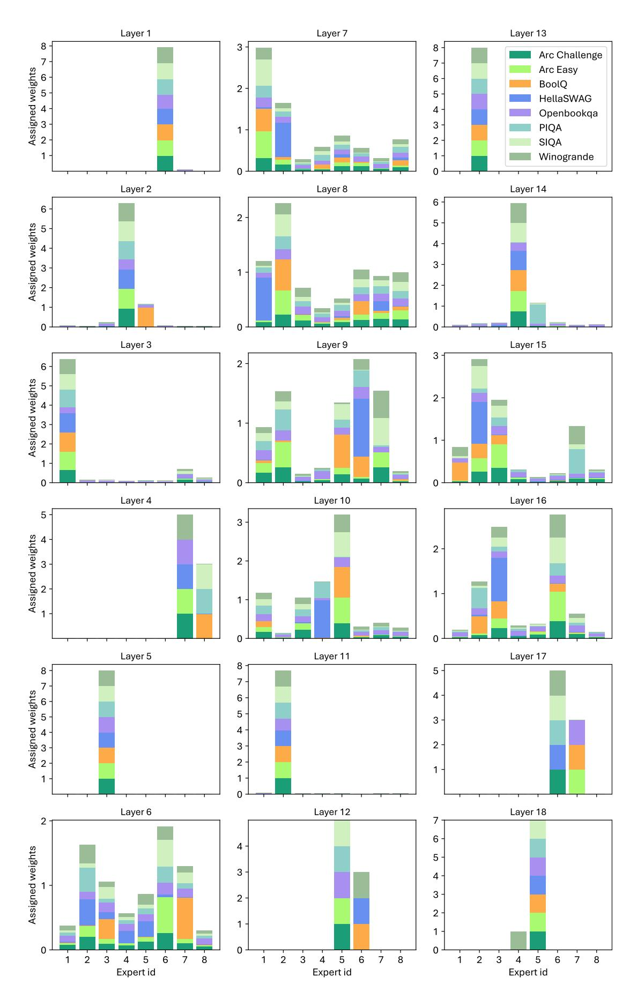
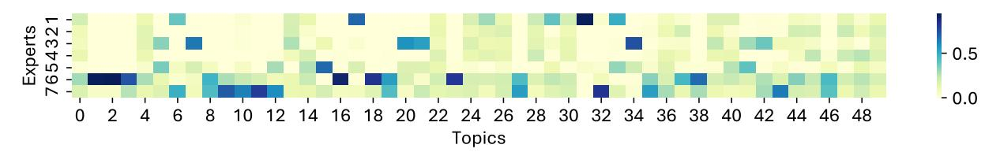

# D Sensitivity Analysis

In this section, we explore the sensitivity of our model's performance to the number of activated experts  $(n_l)$  per layer. Understanding this relationship is essential for balancing model efficiency and performance. We conducted experiments varying  $n_l$  from 1 to 8, using the pre-trained Gemma model as

the baseline. Table 7 shows the results across three datasets: BoolQ, HellaSWAG, and OpenBookQA.

The analysis reveals that even with only 2 activated experts per layer, the model achieves performance nearly equivalent to that of 8 experts, with a minimal drop in accuracy (from 62.26% to 62.20% on BoolQ). This indicates that activating fewer experts can maintain strong performance while improving computational efficiency. Additionally, performance across tasks remains stable as  $n_l$  increases, suggesting that beyond a certain threshold, activating additional experts has diminishing returns.

Figure 5: Specialization analysis of the Gemma model, displaying assignment weights for each expert across all layers for 8 tasks.

Figure 6: Weight assigned to the backbone across layers and across different pre-trained models, showing variance over 8 datasets. Within the same fine-tuned model, dependency on backbones varies by dataset.

Figure 7: Routing weights assigned to 7 experts for instances with varying topics.

Table 6: Performance change (%) when deactivating experts for all but one layer. Extreme case: Using a single layer of experts within the Mixture of LoRA outperforms all layers of that.

| Dataset       | Activated Layer |          |          |  |  |
|---------------|-----------------|----------|----------|--|--|
| Dataset       | Layer 1         | Layer 16 | Layer 32 |  |  |
| BoolQ         | -16.03%         | 0.43%    | -2.69%   |  |  |
| PIQA          | -8.43%          | -5.33%   | -11.59%  |  |  |
| SIQA          | -8.09%          | -11.92%  | -22.67%  |  |  |
| HellaSWAG     | -16.66%         | -6.33%   | -20.00%  |  |  |
| Winogrande    | -17.52%         | -13.57%  | -17.60%  |  |  |
| Arc Easy      | -3.62%          | -8.63%   | -16.08%  |  |  |
| Arc Challenge | -5.20%          | -13.99%  | -17.57%  |  |  |
| Openbookqa    | -7.00%          | -15.80%  | -29.00%  |  |  |

Our findings underscore the power of sparse activation, which enables the model to use resources more efficiently by activating only the necessary experts per layer.

#### E Ablation Studies

In this section, we assess the impact of key components of SMOA, specifically the cross-layer shared

Table 7: SMoA with different  $n_l$ .

| $n_l$ | BoolQ | HellaSWAG | OpenBookQA |
|-------|-------|-----------|------------|
| 1     | 61.16 | 25.04     | 29.00      |
| 2     | 62.20 | 25.24     | 29.00      |
| 3     | 62.17 | 25.20     | 29.00      |
| 4     | 62.20 | 25.30     | 29.00      |
| 5     | 62.08 | 25.08     | 29.00      |
| 6     | 62.20 | 25.34     | 29.00      |
| 7     | 62.24 | 25.32     | 29.00      |
| 8     | 62.26 | 25.34     | 29.00      |

expert pool and the proposed expert-redundancy regularization.

First, we demonstrate that the cross-layer shared adapter pool significantly reduces the number of activated experts, which enhances model efficiency without sacrificing performance, as discussed in Section 6.3. This pooling mechanism optimizes expert utilization by allowing experts to be shared across layers, reducing redundancy and ensuring that only the most relevant experts are utilized.

Second, we evaluate the effectiveness of the expert-redundancy regularization on model perfor-

Table 8: Comparison of SMOA with and without regularization.

|                           | BoolQ | PIQA  | Social IQA | HellaSWAG | Winogrande | ARC-E | ARC-C | OpenBookQA | Avg.  |
|---------------------------|-------|-------|------------|-----------|------------|-------|-------|------------|-------|
| SMoA (w/o regularization) | 62.16 | 51.22 | 38.49      | 25.08     | 51.96      | 32.52 | 27.21 | 29.00      | 39.69 |
| SMoA                      | 62.26 | 51.25 | 38.69      | 25.34     | 52.88      | 32.70 | 27.82 | 29.00      | 39.99 |

Table 9: Training efficiency comparison of SMoA and baseline methods on Phi-22.7B. SMoA achieves higher accuracy with minimal computational overhead.

| Model              | Wall Clock Time per Training Batch (s) | Total Parameters | Trainable Params (Percentage of Trainable Params) | Avg. Acc (%) |
|--------------------|-------------------------------------------|------------------|------------------------------------------------------|--------------|
| Base Model (Phi-2) | -                                         | 2,779,683,840    | -                                                    | 51.51        |
| LoRA               | 12.13                                     | 2,783,616,000    | 3,932,160 (0.14%)                                    | 72.67        |
| Mixture of LoRA    | 42.08                                     | 2,813,108,064    | 33,424,128 (1.19%)                                   | 74.15        |
| MultiLoRA          | 31.85                                     | 2,811,141,888    | 31,458,048 (1.12%)                                   | 70.05        |
| SMoA               | 38.54                                     | 2,813,189,984    | 33,506,048 (1.19%)                                   | 75.61        |

mance. The regularization encourages more distinct expert specialization, improving the model's overall task handling capability. Table 8 presents the performance comparison between SMoA with and without regularization. The regularized version consistently outperforms the unregularized one across all datasets, leading to an overall improvement in the average performance.

### F Training Efficiency Analysis

To further validate the practical applicability of SMoA, we compare its computational cost and parameter efficiency against baseline methods in Table 9. The additional cost of SMoA in terms of trainable parameters is minimal—just 0.00289% of the total parameters. The wall clock time per training batch (38.54s) is faster than Mixture of LoRA (42.08s) and comparable to MultiLoRA (31.85s), demonstrating its efficiency in training despite introducing dynamic routing. These results demonstrate that SMoA balances efficiency and performance effectively, achieving higher average accuracy (75.61%) than baselines like Mixture of LoRA and MultiLoRA, while introducing only minimal computational overhead. This justifies the method's practical applicability despite concerns about time complexity.