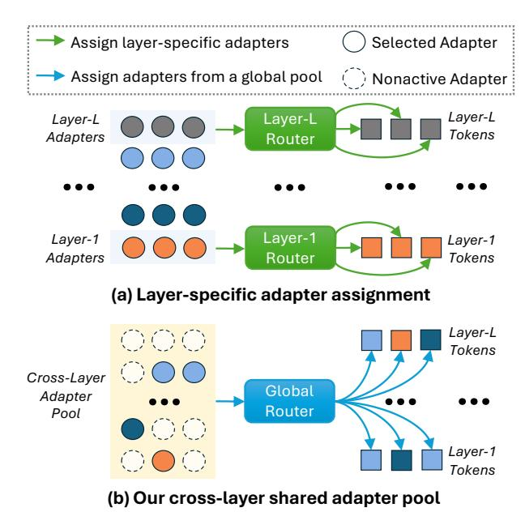
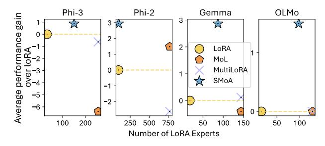

# Tianyi Zhou

Department of Computer Science University of Maryland, College Park tianyi@umd.edu

## Abstract

As large language models (LLMs) scale, improving their efficiency and adaptability across tasks becomes increasingly critical. The Mixture-of-Adapter (MoA) framework offers a promising solution by training a small pool of lightweight adapters at each layer and selecting the most suitable ones for each input, merging their outputs with the original layer's. However, existing MoA approaches do not allow sharing adapters across different layers, leading to unnecessary redundancy and poor generalization of trained adapters. To tackle these challenges, we propose "Sparser MoA (SMOA)", which trains a unified adapter pool shared across layers, introducing a much sparser routing choice of experts per layer. Enforcing such sparsity improves the Cross-Layer Generalization (CLAG) capability and specialization of each adapter, thereby enhancing SMOA's adaptation to different tasks. Extensive experiments across multiple base LLMs show SMOA reduces active adapters by over 85% while significantly boosting task accuracy, paving the way for developing more efficient, generalizable, and modular LLMs.

## 1 Introduction

Mixture-of-Experts (MoE) [\(Jacobs et al.,](#page-9-0) [1991\)](#page-9-0) has achieved remarkable success when applied to the recent large language models (LLMs). Its inference cost can remain constant even with increased experts (model capacity). With diverse expertise developed by different experts, MoE LLMs exhibit advantages on adaptation to downstream tasks, by dynamically routing each input to the expert(s) of the best match. During the training of MoE, the dynamic routing mechanism encourages expert specialization for different tasks [\(Shazeer et al.,](#page-9-1) [2017;](#page-9-1) [Fedus et al.,](#page-8-0) [2022\)](#page-8-0) and facilitates knowledge sharing among similar tasks [\(Ma et al.,](#page-9-2) [2018;](#page-9-2) [Li et al.,](#page-9-3) [2023\)](#page-9-3). However, training MoE is expensive in computation and the amount of training data.

In contrast, Parameter-Efficient Fine-Tuning (PEFT) [\(Ding et al.,](#page-8-1) [2023\)](#page-8-1) only requires to train a few parameters such as a soft prompt, prefix, or adapter [\(Hu et al.,](#page-8-2) [2021\)](#page-8-2) for each expert with the backbone LLM frozen. This motivates the Mixtureof-Adapters (MoA) [\(Zadouri et al.,](#page-9-4) [2023;](#page-9-4) [Dou et al.,](#page-8-3) [2023;](#page-8-3) [Wang et al.,](#page-9-5) [2023\)](#page-9-5). Since adapters are much smaller and more efficient to train than the full model, they are better suited for rapid and efficient adaptation to new tasks [\(Liu et al.,](#page-9-6) [2022\)](#page-9-6). Since the backbone LLM captures most of the shared knowledge, the adapters can focus on the specialized skills or knowledge. Hence, MoA's architecture not only enables efficient training of experts but also promotes their specialization.

In this paper, we study to improve the generalization and expert diversity of MoA. Existing MoA approaches restrict experts to specific layers [\(Wang](#page-9-5) [et al.,](#page-9-5) [2023\)](#page-9-5), resulting in redundancy and poor generalization. Our empirical analysis in Section [3](#page-2-0) reveals significant redundancy of adapters in each layer and across multiple layers, in which many adapters are interchangeable and fail to develop distinct expertise. We also observe backbone-expert redundancy: masking out all experts in a layer does not cause significant performance drop, indicating the redundancy of learned adapters to the backbone LLM. Furthermore, our analysis highlights redundancy across layers. Masking multiple layers of experts simultaneously only causes minor performance drops, indicating that experts trained for different layers do not develop sufficiently diverse expertise. On certain datasets, using a single layer of experts outperforms utilizing all experts, revealing the underutilization of experts in existing MoA methods. In other words, the trained MoA fails to fully exploit MoA's model capacity and potential of adaptation to diverse tasks.

Motivated by the analysis, we propose "Sparser MoA (SMOA)", which improves upon existing MoA methods in two principal ways as shown in

Figure 1: Comparison of (a) existing MoA vs. (b) our SMoA. (a) adopts a pool of adapters and a router for each layer so the experts cannot be shared across layers. (b) uses a global router to dynamically select and activate only a subset of experts from a shared adapter pool, enabling multiple layers to share experts.

Figure 2: Average performance gains over LoRA (y-axis) and the number of activated experts (x-axis), for four MoA methods applied to four base LLMs. SMoA achieves greater gains with fewer experts activated.

Figure 1. Firstly, to enhance the generalization capability of experts and reduce their redundancy, we introduce a **pool of adapters shared across layers**. This allows MoA to select and merge adapters across different layers dynamically, and each adapter is trained on tokens from different layers, thereby encouraging knowledge sharing and transfer. We propose a global router to select a few experts from the pool for each layer and merge them to process input tokens. This reduces the number of active experts and improves Cross-Layer Generalization (CLAG).

Secondly, to mitigate the redundancy of experts w.r.t. the backbone LLM, we incorporate each layer of the backbone LLM as an additional expert and

apply a regularization term to increase its merging weight. This encourages the adapter experts to learn skills complementary to the backbone expert and focus on more specialized tasks. It also improves the diversity of the adapter pool by preventing them from learning sharable knowledge of the backbone.

We further develop a curriculum learning strategy that guides the expert learning from specialization to generalization. In particular, we start by training adapters specific to each layer and then gradually allow them to be shared across neighboring layers. This improves cross-layer generalization while avoiding cross-layer redundancy.

In experiments, we train SMOA on multi-task data with limited data per task. We evaluate its in-distribution (ID) on training tasks and out-of-distribution (OOD) performance on unseen tasks, which is critical for assessing SMOA's adaptation capability. As shown in Figure 2, SMOA outperforms existing MoA methods in both ID and OOD scenarios with fewer experts activated per instance. Specifically, SMOA consistently improves accuracy (up to 2.94%) across various tasks and base LLMs. SMOA dramatically reduces activated experts per instance—to as low as 12.73%—thereby improving the memory efficiency without compromising performance.

#### 2 Related Work

#### 2.1 Parameter-Efficient Fine-Tuning (PEFT)

PEFT optimizes pretrained language models for specific tasks with minimal computational overhead. Adapter-based methods (Houlsby et al., 2019) insert task-specific adapters between model layers to capture task nuances while preserving pretrained parameters. Low-Rank Adaptation (LoRA) (Hu et al., 2021) reduces finetuning complexity by approximating adaptation parameters with low-rank matrices, maintaining performance. Prefix Tuning (Li and Liang, 2021) enriches PLM input with task-specific prefixes, guiding finetuning efficiently. Prompt-based tuning (Lester et al., 2021) provides task-specific prompts during finetuning, facilitating effective adaptation with minimal parameter updates.

**Low-Rank Adaptation** (LoRA) fine-tunes a target module's parameters  $\mathbf{V} \in \mathbb{R}^{d \times k}$  efficiently for specific tasks, using low-rank matrices  $\mathbf{A} \in \mathbb{R}^{r \times k}$  and  $\mathbf{B} \in \mathbb{R}^{d \times r}$ , with  $r \ll \min(d, k)$ . The adapted

module's forward computation is

$$\mathbf{y}' = \mathbf{y} + \Delta \mathbf{y} = \mathbf{V}\mathbf{x} + \mathbf{B}\mathbf{A}\mathbf{x},\tag{1}$$

where x is the input and y and y' are the original and adapted outputs.

#### 2.2 Mixture of Adapters

Mixture of LoRA (MoL) adopts a consistent framework for integrating N LoRA experts into each layer of pre-trained models. Central to this framework is the token-level assignment, facilitated by a router module that distributes gating weights to various experts based on the input token representations (Zadouri et al., 2023; Dou et al., 2023; Gao et al., 2024). Alternatively, some approaches have opted for assigning the same set of weights learned for all samples (Wang et al., 2023). Mathematically, this process can be represented as:

$$\Delta \mathbf{y} = \sum_{n=1}^{N} \mathbf{u}_n \mathbf{B}_n \mathbf{A}_n \mathbf{x}, \qquad (2)$$

where  $\mathbf{B}_n$  and  $\mathbf{A}_n$  represent transformations of expert-n and  $\mathbf{u}_n$  is its routing weight.

#### 2.3 Mixture of Experts (MoE) in LLM

The MoE paradigm, originally introduced to optimize expert specialization in under-parameterized models by Jacobs et al. (1991), has recently gained traction for its efficacy in scaling model expressiveness efficiently (Fedus et al., 2022; Shazeer et al., 2017). While previous studies primarily focused on pre-training stages, our paper uniquely investigates finetuning, a critical yet under-explored aspect. Despite the performance potential of MoE models, computational efficiency and expert specialization remain challenging. Techniques such as optimal assignment schemes aim to mitigate these hurdles by balancing compute loads and streamlining training procedures (Lewis et al., 2021). Moreover, little prior work has explored the interactions between different layers in MoE models (Li et al., 2024).

#### 3 Analysis of Redundancy in MoA

Existing MoA approaches do not allow adapters to be shared across different layers, which may lead to redundancy of learned experts. To empirically verify this intuition, we conduct a series of experiments on a trained Mixture of LoRA (MoL) model (implementation details in Appendix A), where we selectively mask out a portion of experts and

Table 1: Changes in accuracy (%) when randomly masking out experts in a fine-tuned Mixture of LoRA at varying ratios ("100%" equals to **backbone only**). The mean and variance are reported across 8 commonsense Within-Layer Redundancy: nearly QA datasets. zero performance drop when experts in the same layer are masked out. **Backbone-Expert Redundancy:** negligible impact even with all adapters masked **Redundancy Across Layers:** Nearly zero performance drops when masking experts in a subset of layers. **Underutilization of Experts:** Significant degradation is observed only when all experts over all layers are masked out. The complete results of masking experts in each of the 32 layers are reported in Table 5.

| Masked    | Masking Ratio       |                     |                      |                     |                         |  |  |  |  |  |
|-----------|---------------------|---------------------|----------------------|---------------------|-------------------------|--|--|--|--|--|
| Layer(s)  | 20%                 | 40%                 | 60%                  | 80%                 | 100%                    |  |  |  |  |  |
| 1         | $0.00\%_{\pm0.13}$  | $0.03\%_{\pm0.11}$  | $0.00\%_{\pm 0.07}$  | $0.01\%_{\pm 0.09}$ | -0.14% ±0.40 |  |  |  |  |  |
| 16        | $0.01\%_{\pm 0.07}$ | $0.03\%_{\pm0.08}$  | $0.00\%_{\pm0.07}$   | $0.00\%_{\pm0.08}$  | $-0.11\%_{\pm 0.37}$    |  |  |  |  |  |
| 32        | $0.00\%_{\pm 0.02}$ | $0.00\%_{\pm0.02}$  | $0.00\%_{\pm0.00}$   | $0.00\%_{\pm0.03}$  | $-0.03\%_{\pm0.19}$     |  |  |  |  |  |
| {1,16,32} | $0.00\%_{\pm0.08}$  | $0.02\%_{\pm 0.09}$ | $0.00\%_{\pm0.08}$   | $0.02\%_{\pm 0.04}$ | $-0.09\%_{\pm 0.69}$    |  |  |  |  |  |
| All       | $0.04\%_{\pm0.08}$  | $0.05\%_{\pm0.14}$  | $-0.02\%_{\pm 0.11}$ | $0.04\%_{\pm0.12}$  | $-22.43\%_{\pm 9.52}$   |  |  |  |  |  |

examine whether the performance will suffer a noticeable degradation. The result can indicate redundancy among experts within each layer or across different layers.

Our findings reveal that **redundancy exists not only within the same layer (among experts & between the backbone and experts) but also across layers**, which might undermine the development of diverse expertise on experts in MoA. Moreover, the experts across multiple layers still fail to develop distinct functionalities, which does not fully exploit the potential of the MoA architecture.

- (a) Redundancy among Experts within the Same Layer. We observe significant redundancy among experts within the same layer. As shown in Table 1, masking up to 80% of the experts in any given layer results in minimal performance changes. This indicates that the experts within each layer are largely interchangeable, with overlapping functionalities, failing to develop specialized roles.
- (b) Redundancy between Experts and the Pretrained Backbone. Beyond the redundancy among experts themselves, we also find redundancy between the experts and the pre-trained backbone network. Even when all experts in a layer are masked, as depicted in Table 1, the performance impact remains negligible. This suggests that the pre-trained backbone can compensate for the absence of experts, highlighting a lack of unique contributions from the experts.
- (c) Redundancy across Layers. The redundancy extends beyond individual layers, as illustrated in

Table 1. Even when multiple layers of experts are masked simultaneously, the performance drop is not substantial. This finding implies that the knowledge encoded in experts across different layers is not sufficiently diverse to leverage their multilayer structure effectively. As Table 6 illustrates, in extreme cases, utilizing a single layer of experts within the MoL outperforms the use of experts across all layers on some datasets.

(d) Underutilization of Experts. The MoA framework applies LoRA as experts in MoE and enables models to dynamically adapt to diverse tasks. However, our findings indicate that the current MoA implementation falls short of this goal. Despite the theoretical promise of MoE to introduce task-specific diversity, masking up to 80% experts across all layers leads to only marginal changes in performance (Table 1), indicating underutilization of these additional experts. Substantial performance degradation only occurs when all experts are masked, leaving the backbone to function alone. This highlights a fundamental limitation of MoA: a small random subset of adapters and the backbone LLM suffice to preserve the performance. Hence, it fails to fully exploit the capacity of all the adapters.

#### 4 Sparser Mixture-of-Adapters (SMoA)

In MoA, the routing of experts to tokens determines the data each expert is trained on and thus is critical to the generalization capability of adapters. As highlighted in Section 3, constraining experts to specific layers often results in redundancy and weakens generalization. Unlike previous works, we propose SMOA, which adopts a global pool of adapters shared across layers (Section 4.1) and a global router to select a sparse subset of adapters for each layer's inputs (Section 4.2). This architecture helps reduce the redundancy of adapters across layers and improves their generalization with the sparse expert assignment.

#### 4.1 Cross-Layer Shared Pool of Adapters

MoA applies one or a few adapters to a layer or module of a pretrained model, such as an attention module or a feedforward layer. In our framework, these adapters possess diverse expertise and can be deployed flexibly across various layers and modules. However, as highlighted in Section 3, existing MoA approaches confine experts to specific layers, leading to redundant adapters across layers and poor generalization.

To overcome these limitations, we introduce a global pool of N adapters  $\theta_{1:N}$  shared across all the L layers. This global pool promotes knowledge transfer across layers and allows each layer to select diverse experts tailored to the layer's inputs from a large pool. Encouraging the adapter sharing reduces the redundancy of MoA and enhances its generalization capability during training.

#### 4.2 Global Router for Sparse Expert Selection

Given the cross-layer adapter pool, we introduce a global router that dynamically routes each input token or instance in every layer to a small subset of adapters in the pool. By enforcing the sparsity of expert selection, we can encourage the cross-layer generalization capability of adapters during training. For simplicity, our elaboration on routing strategy will mainly focus on a single layer or module. It can be directly extended to different layers. Specifically, given a global pool of N adapters, for an input sequence of s tokens  $\mathbf{x} = [\mathbf{x}_1, \dots, \mathbf{x}_s] \in \mathbb{R}^{s \times d}$  (where each token has a d-dimensional embedding), the following procedure aims to select a subset of adapters from the global pool.

**Token-to-Expert Routing Score.** To effectively map input instances to the right experts, we introduce an embedding representation for each expert. Each expert is associated with an embedding vector  $\mathbf{e}_n \in \mathbb{R}^d$ , refined during training to highlight its areas of specialization. By representing both the experts and the input in the same embedding space, we measure their similarity to determine the best expert for a given input.

The routing score of each token  $\mathbf{x}_i$  for expert-n is computed as the inner product  $\langle \mathbf{x}_i, \mathbf{e}_n \rangle$  which measures how well each expert matches the token. These scores are then converted into probabilities using softmax, i.e.,

$$\mathbf{w}_{n,i} = \frac{\exp\left\langle \mathbf{x}_i, \mathbf{e}_n \right\rangle}{\sum_{i=1}^{N} \exp\left\langle \mathbf{x}_i, \mathbf{e}_i \right\rangle},\tag{3}$$

**Sparse Selection of Experts.** We implement a majority voting mechanism to select a subset of adapters for each layer, under a constraint of the maximum number of selected adapters. Instead of selecting experts for each token, all tokens contribute to the voting process, resulting in a more robust and consistent ranking of experts for the entire input sequence **x**.

We define  $A_l$  as the set of  $n_l$  experts selected for layer l. The majority voting problem of expert

selection can be formulated as

$$\max_{A_{l} \subseteq [N], |A_{l}| \le n_{l}} \frac{1}{s} \sum_{n \in A_{l}} \sum_{i=1}^{s} \mathbf{w}_{n,i}, \ \forall \ l \in [L], \quad (4)$$

which can be solved by ranking all the N adapters with  $\sum_{i=1}^{s} \mathbf{w}_{n,i}$  and selecting the top- $n_l$  adapters. **Reweighting Selected Experts.** Given the experts in the activated expert set  $A_l$  for each layer l, we apply Eq. (3) to the  $n_l$  selected adapters instead of the N adapters to obtain  $\hat{\mathbf{w}}_{n,i}$ . The final routing weight  $\mathbf{u}_n$  of each selected adapter  $n \in A_l$  is

$$\mathbf{u}_n = \frac{1}{s} \sum_{n \in A_l} \hat{\mathbf{w}}_{n,i},\tag{5}$$

where  $\sum_{n \in A_l} \mathbf{u}_n = 1$  and we apply the above procedure to every layer.

