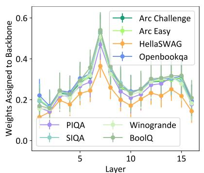
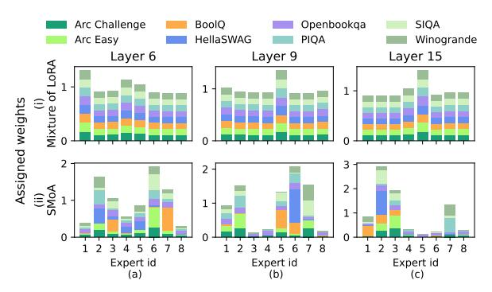

# 5.3 A Specialization-to-Generalization Curriculum

We propose a curriculum learning strategy to guide the training of SMoA towards achieving better specialization-generalization trade-off. Specifically, we start by assigning each adapter to a specific layer so it can focus on acquiring deep, specialized knowledge suited to the layer's unique demands. Once adapters have developed their specialized capabilities, we gradually transition toward enhancing their generalization ability across different layers. This is done by allowing layer-n's adapters to be selected by neighboring layers  $l \in [n-\Delta l, n+\Delta l]$ , where  $\Delta l$  is a hyperparameter.

This progressive curriculum from per-layer specialization to cross-layer generalization guides each adapter to develop a balanced skill set–first honing their strengths in specific layers and then expanding their adaptability as they learn from diverse contexts across multiple layers. By training on tokens from multiple layers, the adapters evolve into versatile components capable of capturing a wide range of knowledge, significantly boosting the

model's overall generalization ability to handle unseen tasks and complex scenarios more effectively.

#### 6 Experiments

Models. We focus on finetuning compact language models, specifically Phi-3 (Abdin et al., 2024), Phi-2 (Gunasekar et al., 2023), Gemma (Team et al., 2024), and OLMo (Groeneveld et al., 2024)—to explore the effectiveness of MoA on models that are not inherently robust, as applying MoA to already robust models provides limited insights into its true impact.

Datasets. We evaluate our approach in a multitask learning setting with limited and few-shot examples, covering both in-distribution (ID) and out-of-distribution (OOD) scenarios. By leveraging shared knowledge across tasks, we address the challenges of limited data. For ID evaluation, we use the Commonsense Finetuning Dataset (Hu et al., 2023), which integrates data from multiple sources, including BoolO (Clark et al., 2019), PIQA (Bisk et al., 2020), SIQA (Sap et al., 2019), HellaSwag (Zellers et al., 2019), WinoGrande (Sakaguchi et al., 2021), ARC-e, ARC-c (Clark et al., 2018), and OBQA. Fine-tuning is conducted on 15,000 samples, with evaluations on standard test sets. For OOD evaluation, we assess generalization on the MMLU benchmark after fine-tuning on the CrossFit dataset (Ye et al., 2021), which includes few-shot samples from 160 diverse tasks. This setup rigorously tests our method's ability to generalize to unseen tasks.

Baselines. We use LoRA as a baseline to highlight the advantages of employing MoA. We also compare against Mixture of LoRA (MoL) (Zadouri et al., 2023; Dou et al., 2023). Although these methods exhibit minor differences in auxiliary losses, they follow the same framework introduced in Section 2. Additionally, we compare with MultiLoRA (Wang et al., 2023), which uses fixed weights to merge LoRA experts at each layer.

#### 6.1 Main Results

Our results, summarized in Table 2, clearly show that SMOA consistently outperforms existing methods across all commonsense datasets. Fine-tuning the pre-trained Phi-2 model, SMOA achieves an accuracy of 75.61%, marking a notable average improvement of 2.94% over its closest competitor. In contrast, methods such as MoL and MultiLoRA show inconsistent performance and frequently fail

Table 2: In-distribution (ID) accuracy (%) on eight commonsense datasets.

|                       | BoolQ | PIQA  | Social IQA | Hella- SWAG | Wino- grande | ARC- E | ARC- C | OBQA  | Avg.                  |
|-----------------------|-------|-------|---------------|----------------|-----------------|-----------|-----------|-------|-----------------------|
| Phi-3 3.8B | 62.57 | 84.44 | 70.27         | 74.17          | 68.90           | 92.17     | 82.76     | 74.60 | 76.24                 |
| LoRA                  | 68.93 | 83.03 | 78.05         | 74.55          | 79.79           | 94.36     | 86.95     | 85.20 | 81.36 (+5.12)         |
| MoL                   | 60.89 | 83.51 | 69.09         | 74.32          | 66.61           | 91.67     | 80.38     | 73.40 | 74.98 (- 1.26)        |
| MultiLoRA             | 69.02 | 84.00 | 77.53         | 74.08          | 79.08           | 94.36     | 84.73     | 83.00 | 80.73 (- 0.63)        |
| SMoA                  | 69.79 | 85.15 | 78.35         | 74.93          | 80.58           | 94.70     | 87.37     | 87.00 | 82.23 (+5.99)         |
| Phi-2 2.7B | 59.79 | 59.58 | 41.45         | 32.50          | 53.59           | 69.53     | 53.67     | 42.00 | 51.51                 |
| LoRA                  | 62.20 | 79.87 | 72.82         | 52.33          | 69.69           | 89.65     | 76.19     | 78.60 | 72.67 (+21.16)        |
| MoL                   | 63.46 | 80.79 | 75.18         | 54.60          | 72.38           | 90.61     | 76.79     | 79.40 | 74.15 (+22.64)        |
| MultiLoRA             | 62.35 | 77.75 | 71.03         | 50.00          | 63.61           | 87.67     | 74.15     | 73.80 | 70.05 (+18.54)        |
| SMoA                  | 66.21 | 81.01 | 75.49         | 57.27          | 75.30           | 90.87     | 77.13     | 81.60 | <b>75.61</b> (+24.10) |
| $Gemma_{2B}$          | 60.95 | 49.51 | 33.06         | 25.04          | 49.96           | 25.08     | 22.70     | 28.20 | 36.81                 |
| LoRA                  | 62.17 | 50.05 | 33.73         | 25.14          | 49.57           | 25.67     | 22.87     | 27.80 | 37.13 (+0.32)         |
| MoL                   | 61.47 | 49.51 | 32.91         | 25.04          | 49.57           | 25.17     | 22.70     | 27.40 | 36.72 (- 0.09)        |
| MultiLoRA             | 62.17 | 49.46 | 33.57         | 25.04          | 49.96           | 26.26     | 23.89     | 27.60 | 37.24 (+0.11)         |
| SMoA                  | 62.26 | 51.25 | 38.69         | 25.34          | 52.88           | 32.70     | 27.82     | 29.00 | 39.99 (+3.18)         |
| $OLMo_{1B}$           | 62.17 | 49.51 | 32.91         | 25.04          | 49.57           | 25.08     | 22.70     | 27.60 | 36.82                 |
| LoRA                  | 62.17 | 49.51 | 32.91         | 25.05          | 49.57           | 25.08     | 22.70     | 27.60 | 36.82 (+0.00)         |
| MoL                   | 62.17 | 49.51 | 32.91         | 25.05          | 49.57           | 25.08     | 22.70     | 27.60 | 36.82 (+0.00)         |
| MultiLoRA             | 62.17 | 49.51 | 32.91         | 25.05          | 49.57           | 25.08     | 22.70     | 27.60 | 36.82 (+0.00)         |
| SMoA                  | 62.17 | 51.74 | 33.78         | 25.50          | 51.22           | 26.30     | 26.45     | 29.40 | 38.32 (+1.50)         |

Figure 3: Weights of backbone experts across layers and tasks, achieved by SMOA applied to OLMo (base LLM). Backbone experts in the mid-layers achieve larger weights, indicating the importance of regularization (Section 5.1) in training complementary and diverse adapters. Figure 6 shows consistent patterns observed on other pre-trained models.

to surpass the baseline LoRA, reflecting inefficient utilization of the MoA framework. These results underscore SMoA's effectiveness in delivering specialized, task-specific improvements.

Table 3 shows OOD generalization results on the MMLU benchmark after fine-tuning on CrossFit. SMOA attains an average accuracy of 56.19% on MMLU with Phi-2, surpassing the best baseline by 1.88%. This shows SMOA's superior ability to generalize to unseen tasks.

Table 3: Out-of-distribution (OOD) accuracy (%) on unseen tasks from STEM, Humanities, Social Sciences, and other categories of MMLU.

|                       | STEM  | Human- ities | Social Sciences | Other | Avg. Acc |
|-----------------------|-------|-----------------|--------------------|-------|-------------|
| Phi-2 2.7B | 46.59 | 59.85           | 68.78              | 54.05 | 54.31       |
| LoRA                  | 46.37 | 59.89           | 69.59              | 55.60 | 54.71       |
| Mixture of LoRA       | 47.26 | 60.49           | 71.58              | 55.87 | 55.17       |
| MultiLoRA             | 45.96 | 60.50           | 71.47              | 56.81 | 55.19       |
| MoAIR                 | 48.28 | 62.93           | 72.17              | 57.05 | 56.19       |
| Gemma 2B   | 32.03 | 37.68           | 32.52              | 34.65 | 33.18       |
| LoRA                  | 30.62 | 31.43           | 29.07              | 33.37 | 30.60       |
| Mixture of LoRA       | 30.62 | 31.43           | 29.07              | 33.37 | 32.00       |
| MultiLoRA             | 28.16 | 31.77           | 29.97              | 32.93 | 30.21       |
| MoAIR                 | 31.72 | 38.30           | 32.99              | 36.79 | 34.23       |

**Training Efficiency** SMoA achieves higher accuracy than baseline methods while maintaining competitive training efficiency. As shown in Appendix E (Table 9), SMoA's wall-clock time per batch (38.54s) is faster than Mixture of LoRA

Figure 4: Routing weights of MoA experts across three layers of Gemma with MoA fine-tuned by (1) Mixture of LoRA and (2) SMoA. Experts in (1) lack diversity as reflected by the nearly even routing weights across tasks. Experts in (2) show diverse coverage of tasks. The sparsely activated experts (lower overall weights) are due to the backbone LLM's complementarity. This highlights an efficient allocation of specialized experts.

(42.08s) and only marginally slower than Multi-LoRA (31.85s), despite introducing dynamic cross-layer routing. The minimal increase in trainable parameters (0.00289% of total parameters) further demonstrates its practicality.

#### **6.2** SMOA Encourages Expert Specialization

Our findings on redundancy reflect a common challenge in MoE models: achieving true expert specialization. While MoE models are designed to leverage specialized knowledge from individual experts, redundant expert allocation often undermines

this goal, reducing efficiency. Prior studies, such as Jiang et al. (2024), have shown that MoE models frequently struggle to achieve meaningful specialization, with experts failing to prioritize specific tasks effectively.

Our analysis of the MoL framework also supports these findings. As shown in Figure 4 (i), the routing weights are nearly uniformly distributed across tasks, indicating that experts fail to develop task-specific specialization and instead acquire generalized knowledge. This limits the effectiveness of the experts, contributing to redundancy and inefficiency within the MoL framework.

In contrast, SMOA addresses this issue by encouraging the backbone to handle shared knowledge, allowing newcomer experts to focus on specialized, task-specific residuals. Figure 4 (ii) reveals that, under SMOA, the distribution of expert weights shows distinct task preferences, demonstrating clear task-wise specialization. This highlights SMOA's ability to effectively train specialized experts. While some experts are sparsely activated or unused, this reflects SMOA's adaptive design, which dynamically selects experts based on task demand, reducing unnecessary activation and ensuring resources are allocated where they are needed most.

To gain deeper insights into expert-redundancy regularization, we analyze the relative fitness of the backbone versus newcomer experts,  $\frac{1}{s}\sum_{i=1}^{s}\mathbf{v}_{l,i}$ , at each layer, as illustrated in Figure 3. The results reveal several key insights:

Dependency on the backbone varies by layer and dataset. As depicted in Figure 3, there is a noticeable increase in dependency on the backbone in the middle layers post-fine-tuning, compared to the front and back layers. This pattern is also observed in other fine-tuned models (Figure 6), indicating that the importance of adapters varies across layers, while SMOA adjusts their contributions automatically. While this trend is consistent across datasets, the degree of dependency on the backbone at specific layers differs by dataset. This variation demonstrates SMOA's ability to effectively adjust expert contributions for different datasets (tasks), highlighting its adaptive capacity and flexibility.

**Dependency on backbone promotes expert specialization.** Our task-wise specialization analysis across all layers (Figure 5) reveals *greater expert specialization in the middle layers*, which aligns with the increased backbone dependency observed in Figure 6. This indicates a synergistic

relationship: as reliance on the backbone increases, experts are better able to focus on task-specific refinements. This supports SMoA's design principle of leveraging the backbone to promote expert specialization, ultimately improving task performance and efficiency.

