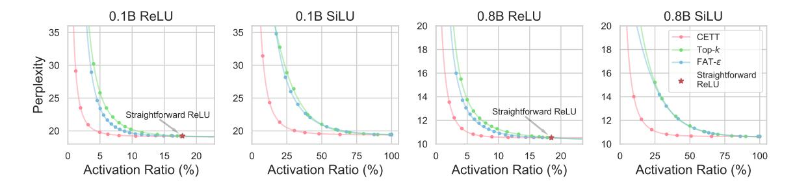
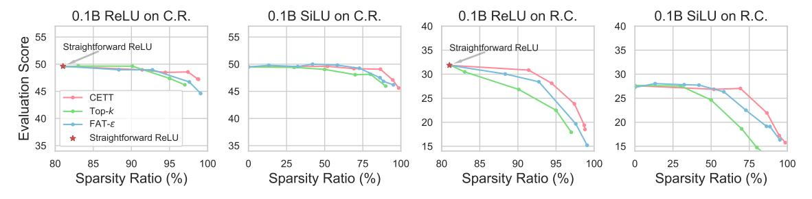

# 2. Preliminaries and Related Works

#### 2.1. Preliminaries of Activation Sparsity

Activation sparsity is a prevalent property existing in neural networks with activation layers, indicating the existence of considerable neurons, that correspond to zero or low activation values, having a limited impact on final network outputs given specific inputs. Mainstream LLMs present remarkable activation sparsity [\(Li et al.,](#page-10-0) [2022;](#page-10-0) [Zhang et al.,](#page-11-5) [2022;](#page-11-5) [Song et al.,](#page-10-3) [2025;](#page-10-3) [2024\)](#page-11-6).

Activation sparsity can help improve LLMs in many aspects, such as efficiency and interpretability. Recent works manage to exploit activation sparsity for inference acceleration, mainly by saving the computation related to weaklycontributed parameters [\(Liu et al.,](#page-10-1) [2023;](#page-10-1) [Song et al.,](#page-11-0) [2023;](#page-11-0) [Xue et al.,](#page-11-2) [2024\)](#page-11-2). [Zhang et al.](#page-11-1) [\(2024b\)](#page-11-1) utilize the existence of activation sparsity throughout the majority of the LLM pretraining process to accelerate pre-training. Besides acceleration, activation sparsity also helps improve interpretability, which is important for reliable and well-performing LLMs. Explanation of the sparse neuron activation patterns has

long been a mainstream paradigm of interpreting LLM behaviors (Sajjad et al., 2022; Bills et al., 2023; Gao et al., 2024; Lieberum et al., 2024).

Notably, mixture-of-experts (MoE) is a popular paradigm of activation sparsity, enforcing each token to activate a limited number of experts. As such constraints can sacrifice flexibility and performance (see Appendix B), we focus on activation sparsity in vanilla Transformers in this work.

Besides, activation sparsity also has fundamental differences from weight pruning, which realizes acceleration by removing certain parts of LLM parameters regardless of inputs. By contrast, activation sparsity adaptively determines important neurons for different inputs with no parameter permanently removed, causing considerably less performance degradation (see Appendix C).

#### 2.2. Metrics of Activation Sparsity

Building a satisfactory metric for measuring sparsity is a nontrivial work. For the convenience of demonstrations, we formally introduce the following notations for the computation process of FFNs (also see Figure 1). With a hidden dimension  $d_h$  and an intermediate dimension  $d_f$ , a gated FFN (the FFN paradigm in mainstream LLMs (Dauphin et al., 2017; Shazeer, 2020)) works as follows:

$$\mathbf{s} = \sigma(\mathbf{W}^{gate}\mathbf{x}), \quad \text{FFN}(\mathbf{x}) = \mathbf{W}^{out}[\mathbf{s} \odot (\mathbf{W}^{in}\mathbf{x})], \quad (1)$$

where  $\mathbf{x} \in \mathbb{R}^{d_h}$ ,  $\mathbf{s} \in \mathbb{R}^{d_f}$ ,  $\sigma$ , and  $\odot$  denote the input hidden states, the activation values, the activation function, and the element-wise multiplication, respectively.  $\mathbf{W}^{gate}$ ,  $\mathbf{W}^{in} \in \mathbb{R}^{d_f \times d_h}$  and  $\mathbf{W}^{out} \in \mathbb{R}^{d_h \times d_f}$  are learnable parameters. Next, we decompose the parameters of FFN along the dimension of  $d_f$  into  $d_f$  neurons. The output of the i-th neuron  $n_i$  is calculated by

$$s_{i} = \sigma(\mathbf{W}_{i,:}^{gate}\mathbf{x}), \quad n_{i} = \mathbf{W}_{:,i}^{out}[s_{i} \odot (\mathbf{W}_{i,:}^{in}\mathbf{x})],$$

$$\text{FFN}(\mathbf{x}) = \sum_{i=1}^{d_{f}} n_{i},$$
(2)

where  $\mathbf{W}_{i,:}^{gate}$ ,  $\mathbf{W}_{i,:}^{in}$ ,  $\mathbf{W}_{:,i}^{out}$  are the *i*-th row of  $\mathbf{W}^{in}$ , the *i*-th row of  $\mathbf{W}^{gate}$ , and the *i*-th column of  $\mathbf{W}^{out}$ , respectively. The FFN outputs equals the sum of all neuron outputs.

Activation sparsity is measured by the ratio of weakly-contributed neurons, namely  $|\mathcal{D}|/d_f$ , where  $\mathcal{D}$  is the index set of weakly-contributed neurons. Different metrics mainly differ in determining whether a specific neuron contributes weakly. A straightforward metric, naturally adopted in ReLU-activated models, regards neurons with zero activation values as weakly-contributed, namely  $\mathcal{D} = \{i|s_i = 0\}$ . To find non-zero weakly contributed activations, Kurtz et al. (2020) and Mirzadeh et al. (2023) introduce a positive threshold or bias, i.e.,  $\mathcal{D} = \{i|s_i < \epsilon\}$ ,  $\epsilon > 0$ .

The major drawback of this straightforward definition is the lack of generalizability. Concretely, it is unsuitable for activation functions with considerable non-negligible negative outputs, such as SiLU (Elfwing et al., 2018). In these cases, the straightforward metric can lose considerable negative neuron outputs and harm performance. A quick fix is to use the absolute value,  $\mathcal{D} = \{i||s_i| < \epsilon\}$ , but a global threshold across layers is hard to determine. Zhang et al. (2024a) adaptively searches the layer-wise thresholds by introducing the cumulative errors of tail truncation (CETT). Defined as the  $L_2$  norm relative error caused by skipping weakly-contributed neurons, CETT is computed as:

CETT = 
$$\frac{\|\sum_{i \in \mathcal{D}} n_i\|_2}{\|\text{FFN}(\mathbf{x})\|_2}, \quad \mathcal{D} = \{i | \|n_i\|_2 < \epsilon\}, \quad (3)$$

where  $\|\cdot\|_2$  is the  $L_2$  norm operator. As CETT increases monotonically with  $\epsilon$ , for each layer, we can use binary search to find the threshold  $\epsilon$  to meet the CETT value.

In addition to the above sparsity metrics, we also note some special practices. For instance, CATS (Lee et al., 2024) finds layer-wise adaptive thresholds but targets the same expected sparsity ratio at each layer. This is equivalent to the Top-k setting in Section 4.1. TEAL (Liu et al., 2024a) addresses a more general paradigm named input sparsity. This is largely different from output sparsity, which is the paradigm handled in this work and mainly induced by activation functions. We leave the quantitative studies on input sparsity for future work.

In this work, we experimentally demonstrate that CETT, when tuned to just make the validation PPL increase by 1%, is a metric with great generalizability and the least performance degradation, even at a high sparsity ratio.

#### 2.3. Influential Factors of Activation Sparsity

Despite the importance of activation sparsity, few works conduct comprehensive and quantitative studies on how it is affected by the model architecture and training process. Speculating that activation sparsity comes from the training dynamic in the optimization process, Li et al. (2022) finds an increasing trend of sparsity with larger scale, depth, and width in T5 series (Raffel et al., 2020). Zhang et al. (2024a) dives into this problem from the aspect of activation functions. Song et al. (2025) discovers that LLMs tend to be sparser on more formatted datasets such as codes and multiple choices. Other works have discussed the scaling properties of parameter-sparse models (Frantar et al., 2023), fine-grained MoE models (Krajewski et al., 2024), and sparse autoencoders (Gao et al., 2024). To the best of our knowledge, we present the first comprehensive quantitative study on the accurate measurement, influential factors, and training practice of activation sparsity for LLMs.

Figure 2: The PPL-activation ratio (i.e., 1 - sparsity ratio) Pareto curve using different methods to recognize weakly-contributed neurons. "Straightforward ReLU" is only applicable to ReLU-activated models using the zero threshold.

Figure 3: The Pareto curves between downstream task performance and activation sparsity using different methods to recognize weakly-contributed neurons. C.R. refers to *commonsense reasoning* and R.C. refers to *reading comprehension*.

