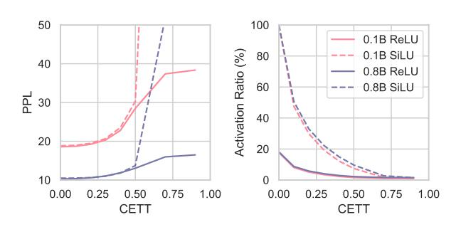

# 3.4 SiLU-Activated Models ReLU-Activated Models ReLU-Activated Models 3.2 3.0 0.2 0.4 0.6 0.8 1.0 1.2 Number of Parameters (B)

Figure 14: The limits of the training loss with the amount of pre-training data approaches infinity.

#### <span id="page-13-0"></span>E. Sparsity Stabilizing Strategy

We find that the stochastic factors in gradient descent during pre-training have a significant impact on the metric of activation sparsity. Especially, during the early training stage, the model is far from convergence with considerable sparsity fluctuations, and the magnitude-based sparsity metric can become unstable and cause problems to curve fitting.

To eliminate the influence of these unstable factors to facilitate a smoother sparsity metric, we first drop the sparsity points during the warmup stage for curve fitting. Moreover, we mainly apply the CETT-PPL-p% on the last several checkpoints (specifically, the last five pre-trained checkpoints) as a whole, binary-searching the hyper-parameter value that controls the average PPL of these checkpoints to just increase by p%. Then this hyper-parameter is applied to all the checkpoints of this pre-training process to measure the sparsity ratio.

#### <span id="page-13-1"></span>F. Binary Search Algorithm for CETT

<span id="page-13-4"></span>

Figure 15: Experiments show that both PPL and the activation ratio change monotonously with CETT, the key hyper-parameter of CETT-PPL-p%. This provides rationality for using a binary search to determine the CETT hyper-parameter.

Given a list of checkpoints, a validation dataset, and a hyper-

parameter p%, we employ Algorithm 1 to find the CETT hyper-parameter that just makes the average PPL of these checkpoints on the validation dataset rise by exactly p%, compared to the dense setting with all the neurons activated. The rationality of using binary search is substantiated by the monotonous relationship between PPL and CETT, as shown in Figure 15. Note that this algorithm can be applied to either a single checkpoint or multiple checkpoints, as adopted in the strategy described in Appendix E.

<span id="page-13-3"></span>Algorithm 1 Find the CETT hyper-parameter for CETT-PPL-p% sparsity

```
PPL-p\% sparsity

Input: The input list of checkpoints CkptList.

Input: The validation dataset VS.
```

**Input:** The error tolerance eps for binary search.

**Input:** The PPL increase tolerance p%.

**Output:** The hyper-parameter CETT that just makes the average PPL of CkptList on VS rise by p%.

```
l \leftarrow 0, \ r \leftarrow 1
while r - l > eps do
  mid \leftarrow (l+r)/2
   PPLRatioList \leftarrow [\ ]
  for Ckpt \in CkptList do
     loss_{dense} \leftarrow L_{dense}(Ckpt, VS)
     loss_{sparse} \leftarrow L_{sparse}(Ckpt, VS, cett = mid)
     PPLRatio \leftarrow \exp(loss_{sparse} - loss_{dense})
     PPLRatioList.append(PPLRatio)
  end for
   MeanPPLRatio \leftarrow Mean(PPLRatioList)
  if MeanPPLRatio < 1 + p\% then
     l \leftarrow mid
  else
     r \leftarrow mid
   end if
end while
CETT \leftarrow (l+r)/2
return CETT
```

<span id="page-14-3"></span>Table 2: Coefficients of activation-data (logspace) power-laws obtained from curve fitting. The curves of ReLU-activated and SiLU-activated models follow Eq. (4) and Eq. (5) respectively.

|      |      | α                      | b                       | c                      | $A_0$                  |
|------|------|------------------------|-------------------------|------------------------|------------------------|
|      | 0.1B | $1.01 \times 10^{-01}$ | $-1.51 \times 10^{-02}$ | $3.20 \times 10^{+00}$ | $6.14 \times 10^{-02}$ |
|      | 0.2B | $4.49 \times 10^{-01}$ | $-3.05 \times 10^{+00}$ | $2.86 \times 10^{-01}$ | $6.74 \times 10^{-02}$ |
| ReLU | 0.4B | $6.83 \times 10^{-01}$ | $-3.46 \times 10^{+00}$ | $7.90 \times 10^{-02}$ | $6.90 \times 10^{-02}$ |
|      | 0.8B | $1.01 \times 10^{+00}$ | $-3.49 \times 10^{+00}$ | $7.97 \times 10^{-03}$ | $7.21 \times 10^{-02}$ |
|      | 1.2B | $1.33 \times 10^{+00}$ | $-3.89 \times 10^{+00}$ | $9.03 \times 10^{-04}$ | $7.82 \times 10^{-02}$ |
|      | 2.4B | $1.53 \times 10^{+00}$ | $-3.46 \times 10^{+00}$ | $1.56 \times 10^{-04}$ | $6.48 \times 10^{-02}$ |
|      | 0.1B | $4.79 \times 10^{-01}$ | -                       | $1.02 \times 10^{-01}$ | $4.09 \times 10^{-01}$ |
|      | 0.2B | $8.44 \times 10^{-01}$ | -                       | $2.08 \times 10^{-01}$ | $3.90 \times 10^{-01}$ |
| SiLU | 0.4B | $1.03 \times 10^{+00}$ | -                       | $4.20 \times 10^{-01}$ | $3.85 \times 10^{-01}$ |
|      | 0.8B | $9.95 \times 10^{-01}$ | -                       | $5.62 \times 10^{-01}$ | $3.83 \times 10^{-01}$ |
|      | 1.2B | $9.67 \times 10^{-01}$ | -                       | $5.38 \times 10^{-01}$ | $3.82 \times 10^{-01}$ |

Table 3: Hyper-parameters across various parameter scales.

<span id="page-14-4"></span>

| Parameter Scale                       | 0.1B                                                                                       | 0.2B | 0.4B | 0.8B | 1.2B | 2.4B |
|---------------------------------------|--------------------------------------------------------------------------------------------|------|------|------|------|------|
| # non-embedding parameters batch size | $\begin{array}{ c c c } \hline 1.08 \times 10^8 \\ 3.27 \times 10^5 \\ \hline \end{array}$ |      |      |      |      |      |

#### <span id="page-14-2"></span>G. Fitting Algorithm and Results

We employ the Levenberg-Marquardt method (Marquardt, 1963) to fit the activation-data curves. To improve the stability of curve fitting, we divide the number of tokens passed (i.e., the amount of pre-training data) by  $10^9$  to normalize its magnitude. All the results we obtained from fitting Eq. (4) (for ReLU-activated models) and Eq. (5) (for SiLU-activated models) are shown in Table 2.

#### <span id="page-14-0"></span>H. Datasets and Benchmarks

**Training data** The pre-training data is a mixture of various corpus, including a cleaned version of Common-Crawl, Dolma (Soldaini et al., 2024), C4 (Raffel et al., 2020), Pile (Gao et al., 2020), the Stack (Kocetkov et al., 2022), StarCoder (Li et al., 2023), and other collected raw corpus. In contrast, the decay data contains additional instruction-tuning data, such as UltraChat (Ding et al., 2023), SlimOrca (Colombo et al., 2024), OssInstruct (Wei et al., 2024), EvolInstruct (Xu et al., 2023), and other collected datasets.

**Validation data** To measure the CETT-PPL-p% sparsity more precisely, we introduce a tiny validation dataset, which shares the same distribution as the pre-training data. We conduct deduplication to eliminate any intersections between validation and pre-training data.

Evaluation benchmarks To evaluate the task-specific performance of models, we introduce the following two groups of benchmarks: (1) *Commonsense reasoning*: We compute the average 0-shot accuracies on PIQA (Bisk et al., 2020), SIQA (Sap et al., 2019), HellaSwag (Zellers et al., 2019), WinoGrande (Sakaguchi et al., 2020), and COPA (Roemmele et al., 2011). (2) *Reading comprehension*: We report the average 0-shot accuracies on BoolQ (Clark et al., 2019), LAMBADA (Paperno et al., 2016), and TyDi QA (Clark et al., 2020).

We also evaluate our model on more complex tasks but fail to obtain performance above the random level. These include: the average pass@1 scores on HumanEval (0-shot) (Chen et al., 2021) and MBPP (3-shot) (Austin et al., 2021), the average accuracies on GSM8K (8-shot) (Cobbe et al., 2021), MMLU (5-shot) (Hendrycks et al., 2020), Big Bench Hard (BBH) (3-shot) (Suzgun et al., 2022), and AGI-Eval (0-shot) (Zhong et al., 2023).

