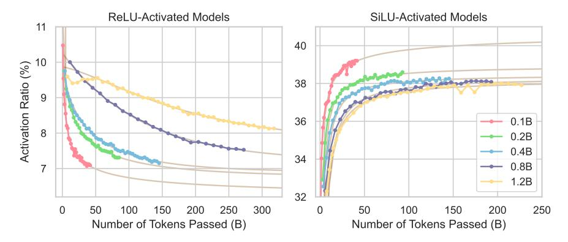

# 4. How can activation sparsity be measured more accurately?

#### 4.1. Recognition of Weakly-Contributed Neurons

As stated above, the crucial part of a metric for activation sparsity is the accurate recognition of weakly-contributed neurons. In this section, we compare the following four methods to determine weakly-contributed neurons in FFNs (Refer to Eq. (2) for the definition of neurons):

- (1) **Straightforward ReLU** is the most simple but commonly used setting, which uses a zero threshold and is only applicable to ReLU:  $\mathcal{D} = \{i | s_i = 0\}$ .
- (2) **Top-**k, widely adopted in the MoE architectures (Fedus et al., 2022), enforces each layer to consistently maintain k activated neurons, whose absolute activation values rank in the top-k ones among all the neurons of that layer. Obviously, we have  $|\mathcal{D}| = d_f k$ , and the Top-k sparsity method holds a constant sparsity ratio across all layers.
- (3) **FAT**- $\epsilon$  (Kurtz et al., 2020) (FAT denotes forced activation threshold) similarly introduces a global hyper-parameter  $\epsilon$  as the threshold shared by all layers, namely  $\mathcal{D} = \{i | |s_i| < \epsilon\}$ . Note that this is slightly different from the original

Table 1: The average evaluation scores (%) on two task groups. The second column represents settings with different PPL increase tolerances p%, with "Dense" indicating the most accurate case where p=0. The marker " $\Delta$ " means the score difference to the corresponding dense setting.

|      |                       | 0.1B |      | 0.2  | 0.2B |      | 0.4B |      | 0.8B |      | 1.2B |       |
|------|-----------------------|------|------|------|------|------|------|------|------|------|------|-------|
|      |                       | ReLU | SiLU | ReLU | SiLU | ReLU | SiLU | ReLU | SiLU | ReLU | SiLU | Avg.  |
|      | Dense                 | 49.6 | 49.5 | 52.0 | 52.2 | 54.7 | 55.8 | 56.8 | 57.6 | 60.0 | 59.6 | 54.78 |
| C D  | $\Delta$ CETT-PPL-1%  | -0.5 | +0.4 | -0.3 | +0.2 | -0.1 | 0    | -0.9 | 0    | -0.4 | 0    | -0.16 |
| C.R. | $\Delta$ CETT-PPL-5%  | -0.4 | -0.5 | -0.3 | -0.2 | -0.4 | -0.7 | -0.5 | -0.5 | -0.7 | -0.8 | -0.50 |
|      | $\Delta$ CETT-PPL-10% | -0.2 | -0.8 | -0.4 | -0.3 | +0.2 | -0.6 | -0.2 | -1.2 | -0.7 | -0.3 | -0.45 |
|      | Dense                 | 28.2 | 27.7 | 40.7 | 40.2 | 44.0 | 41.8 | 44.8 | 43.3 | 53.2 | 54.8 | 41.87 |
| R.C. | $\Delta$ CETT-PPL-1%  | +0.2 | +0.3 | -1.0 | -0.6 | -1.1 | -0.9 | -1.6 | +1.0 | +0.1 | +0.6 | -0.30 |
|      | $\Delta$ CETT-PPL-5%  | -1.3 | -1.2 | -2.1 | -3.4 | -3.2 | -3.6 | -2.6 | -2.6 | +0.1 | -2.2 | -2.21 |
|      | $\Delta$ CETT-PPL-10% | -2.0 | -2.9 | -2.1 | -5.8 | -4.1 | -6.5 | -4.5 | -4.5 | -0.3 | -3.7 | -3.64 |

Figure 4: The trend of activation ratios of models with different parameter numbers and activation functions during the pre-training stage. The fitted curves are plotted in brown.

FATReLU by Kurtz et al. (2020) as we compute the absolute values of activation values to accommodate SiLU.

(4) **CETT** (Zhang et al., 2024a), as introduced in Section 2.2, requires each layer to share the same  $L_2$  norm relative error after weakly-contributed neurons are skipped in calculation, while the layer-wise activation thresholds are adaptively searched accordingly.

As demonstrated by Figure 2 and Figure 3, **CETT obtains the best trade-off between sparsity and performance**. Under the same target sparsity ratio, CETT can always achieve the lowest PPL, and a comparable or higher evaluation score on downstream tasks. These indicate the highest accuracy of CETT in recognizing weakly-contributed neurons.

#### 4.2. Introduction of PPL Increase Tolerance

Despite the advantages of CETT, it remains a problem how to choose the best hyper-parameter, namely the shared  $L_2$  norm relative error. Therefore, we introduce CETT-PPL-p%, which denotes the sparsity ratio measured by CETT when the PPL on validation data rises by p% compared with the dense setting (i.e., with all neurons activated). Given a PPL increase tolerance of p%, we can conduct a binary search to

find the hyper-parameter that just meets the tolerance. The search algorithm is described in Appendix F.

To find a proper p% tolerance, we inspect its impact on downstream task performance. As shown in Table 1, with PPL increasing (intrinsically promoting greater sparsity), the reading comprehension performance is considerably impaired, corresponding to the trade-off between sparsity and performance. Notably, in both task groups, the average performance of "CETT-PPL-1%" is comparable to that of the theoretically most accurate "Dense" setting. Therefore, we assume CETT-PPL-1% sparsity as a reliable performance-friendly metric and employ it to compute sparsity in the following discussions.

