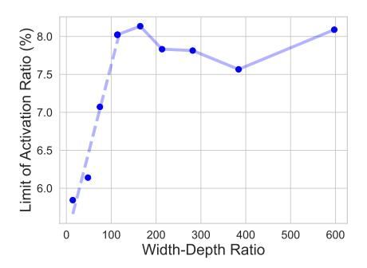
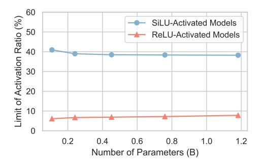
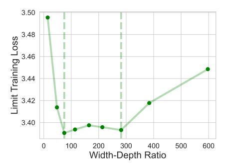
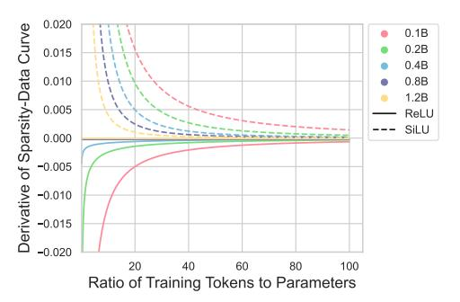
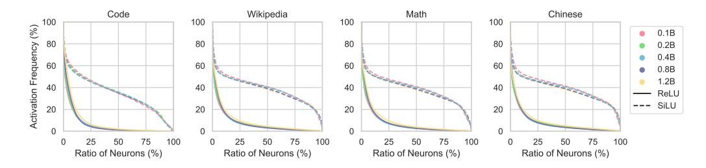
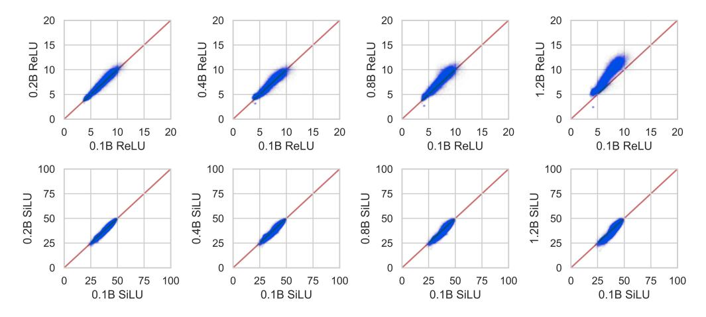

# 5. How is activation sparsity affected by the model architecture and training process?

#### 5.1. Amount of Pre-Training Data and Choice of Activation Functions

To obtain the scaling relationship between the activation sparsity and the amount of pre-training data, we pre-train models with different parameter numbers and two activation functions (i.e., ReLU and SiLU), respectively, and then

Figure 5: Limits of activation ratios on 0.1B ReLU models.

Figure 7: The limits of activation ratios on models with different scales and activation functions.

evaluate the sparsity level of their checkpoints using CETT-PPL-1%. After careful attempts, we find that the curve of activation ratios to the amount of pre-training data is easier to fit than that of sparsity ratios. Therefore, we will frequently use activation ratios instead of sparsity ratios in the following sections, whose trend is plotted in Figure 4.

For ReLU models, we observe a logspace power-law relationship between the activation ratio  $A_{ReLU}(D)$  and the amount of pre-training data D, expressed as follows:

$$A_{ReLU}(D) = \exp(-cD^{\alpha} + b) + A_0, \tag{4}$$

where  $A_0 > 0$  is the limit of activation ratio with infinite training data and  $c, \alpha > 0$ . This is a convergent decreasing function, indicating that more training data can potentially make ReLU models more sparsely-activated.

By contrast, the activation ratio  $A_{SiLU}(D)$  of SiLU models exhibit a vanilla power-law relationship:

$$A_{SiLU}(D) = -\frac{c}{D^{\alpha}} + A_0, \tag{5}$$

where similarly,  $A_0 > 0$  is the limit of activation ratio and  $c, \alpha > 0$ . Note that this is a convergent increasing function, and thus **more training data will impair the activation sparsity of SiLU models**. See Appendix G for the algorithm of curve fitting and the results (i.e., coefficients).

As for the selection of activation functions, by comparing the sparsity dynamics, we can conclude that the activation

Figure 6: Limit training loss on 0.1B ReLU models.

Figure 8: The derivative trends of the sparsity-data curve with the increase of data-scale ratio.

sparsity achieved by ReLU is significantly greater than that of SiLU. Besides, the task-specific performance in Table 1 and the trend of training loss in Appendix D reveal the comparable performance between ReLU and SiLU activations. Based on the above observations, **ReLU** is more competent as the activation function than SiLU due to three advantages: an increasing trend of sparsity, significantly higher sparsity ratio, and comparable performance.

#### 5.2. Width-Depth Ratio

The width-depth ratio, defined as the ratio of the hidden dimension to the layer number, reflects the shape of a Transformer and is a key architectural property that potentially influences activation sparsity. To inspect its influence on the activation sparsity, we conduct experiments on the 0.1B ReLU-activated model and select 9 different width-depth ratios. The limits of the activation ratio and the training loss are plotted in Figure 5 and Figure 6, respectively.

As demonstrated by Figure 5, under a bottleneck point (about 114 for 0.1B), the activation ratio linearly increases with the width-depth ratio. After this bottleneck, the activation ratio fluctuates around 8%. From the sparsity aspect, a smaller width-depth ratio is more helpful. However, Figure 6 demonstrates that an extremely small width-depth ratio causes significant performance degradation. This is attributed to the training instability of deep

Figure 9: The distribution of the neuron activation frequencies on four datasets within models of distinct scales.

Figure 10: The activation ratio (%) distributions of 71,549 tokens sampled from the vocabulary. We conduct a pair-wise comparison of the average activation ratio of each token within models of different scales. The red line is the y = x curve.

Transformers [\(Petty et al.,](#page-10-9) [2023;](#page-10-9) [Wu & Tang,](#page-11-9) [2024\)](#page-11-9). Therefore, the best width-depth ratio should fall on the smallest point of the interval that ensures stable training and the best performance (e.g., from 74 to 282 for 0.1B).

#### 5.3. Parameter Scale

To obtain comprehensive scaling properties of activation sparsity with the increase of scales (i.e., the number of nonembedding parameters), we obtain the limit of activation ratio on the above pre-trained models with 5 distinct scales but similar width-depth ratios. From the results plotted in Figure [7,](#page-5-1) we can reach the first observation that under similar width-depth ratios, the limit of activation ratio, as the amount of pre-training data approaches infinity, is weakly related to the parameter scale. For SiLU settings, the activation ratio decreases slightly by 2.7 points from 0.1B to 1.2B. By contrast, for ReLU settings, the activation ratio marginally increases by 1.7 points from 0.1B to 1.2B.

To reflect the evolving dynamics of sparsity, we compute the derivatives of the sparsity-data curve as fitted in Section [5.1](#page-4-2) and plot the trend of derivatives with the increase of datascale ratio[2](#page-6-1) . The results in Figure [8](#page-5-1) clearly demonstrate that

smaller models tend to converge faster than larger models to the limit, as the absolute values of their derivatives are much larger. We try to explain the above observations.

Observation: Neurons within models of different scales present similar activation patterns. To support this point, we conduct two experiments from the aspect of *dataset-wise* and *token-wise* activation patterns respectively.

To inspect the dataset-wise activation distribution, we consider four subsets of the pre-training data and compute the distribution of activation frequencies (i.e., the times that a neuron is activated divided by the total number of tokens) among the neurons within models of different scales. As demonstrated by Figure [9,](#page-6-2) for all datasets, the distribution patterns of neuron activation frequencies are similar across different scales. While this observation holds on average, special cases exist in certain layers (see Appendix [J\)](#page-15-1).

For the token-wise activation, we sample 71,549 tokens from the vocabulary and count their activation ratios on a sufficiently large amount of data. Next, we compare the activation ratios of each token among models of different scales in a pair-wise manner. Figure [10](#page-6-3) clearly shows that

works have demonstrated the roughly proportional relationship between the optimal amount of pre-training data and the parameter scale [\(Hoffmann et al.,](#page-9-10) [2022;](#page-9-10) [Besiroglu et al.,](#page-8-1) [2024\)](#page-8-1).

2The data-scale ratio means the ratio of the number of training tokens to the parameter scale. We choose this variable as previous

most tokens maintain a close activation ratio across models of various scales.

The above two experiments both support the insensitivity of the activation pattern to the parameter scale. This can potentially provide one explanation for why the activation sparsity is quite weakly correlated with the model sizes.

Assumption: Neurons within models of different scales present similar specialization. The neurons in FFNs tend to specialize into certain functions during the training progress (Li et al., 2022; Zhang et al., 2023). However, few works have studied how such specialization differs in models of distinct scales. As stated above, both the datasetwise and token-wise activation patterns are insensitive to the parameter scale. In other words, the numerical distribution of neurons activated for a certain function (e.g., a specific category of datasets or syntactic elements) is similar. Therefore, it is reasonable to assume that the specialization of neurons is also scale-insensitive.

**Deduction:** Smaller models converge faster to the limit of activation ratio mainly due to their small amount of neurons. To simplify this problem, we model the specialization of neurons as a grouping process, where each neuron can be placed into zero or more groups (considering the potential existence of dead neurons and versatile neurons). Suppose the  $d_f$  neurons should specialize into G groups, each of them having  $t_1, t_2, ..., t_G$  neurons respectively. Based on the assumption of similar activation patterns and neuron specialization, the ratio of neurons placed in each group (i.e.,  $0 < t_i/d_f \le 1, \ i = 1, 2, ..., G$ ) should be shared across different parameter scales. We can obtain the number of all the possible grouping results  $T(d_f)$  easily,

$$T(d_f) = \prod_{i=1}^{G} C_{d_f}^{t_i} = \prod_{i=1}^{G} \frac{d_f!}{t_i!(d_f - t_i)!},$$
 (6)

where  $C_{d_f}^{t_i}$  is the combinatorial number, the number of possibilities to select  $t_i$  neurons from  $d_f$  ones. Obviously,  $T(d_f)$  grows in a factorial speed with  $d_f$ , much faster than the linear function. For larger models, the number of neuron specialization possibilities is significantly greater, and thus more training expenses are required to form stable neuron specialization and approach the limit of activation ratio.

