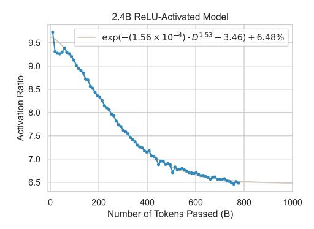

# 6. How can we build a more sparsely activated and efficient LLM?

Based on the above findings, we finally come to the approach to building an LLM with greater activation sparsity: Use ReLU as the activation function with a larger amount of pre-training data, and a small width-depth ratio within the interval ensuring the training stability.

Figure 11: The activation-data trend of the 2.4B ReLU model, with the fitted logspace power-law presented.

To validate the reliability and generalizability of our findings, we train a 2.4B model based on the above experience. Equipped with ReLU activation, near 800B training data, and a width-depth ratio close to the above models (also small enough and close to the smallest point of the training stability interval), this model achieves a low limit activation ratio of 6.48%, quite close to those values of models from 0.1B to 1.2B. Moreover, its activation-data trend can also be well fitted with a decreasing logspace power-law, as shown in Figure 11. These are all consistent with previous findings.

Moreover, to demonstrate the practical acceleration value, we compare the decoding speed of the 2.4B model with PowerInfer (Song et al., 2023) and "llama.cpp" (Gerganov, 2023), respectively. While PowerInfer utilizes sparsity to save computation, "llama.cpp" only conducts dense FFN computation. Consequently, the former achieves  $4.1\times$  speedup compared with the latter, revealing the potential of activation sparsity for efficient LLMs. Refer to Appendix L for experiment details.

#### 7. Discussion

In this section, we mainly discuss other potential values of this work, especially in terms of **monitoring the model dynamics from new aspects**.

**Training-time predictable sparsity** Our work enables the prediction of sparsity during the training stage. By fitting the power-law or logspace power-law between activation sparsity and the amount of pre-training data, model developers can either predict the theoretical upper/lower bound sparsity of a model to evaluate its potential (e.g., in inference acceleration), or estimate the number of tokens required to achieve a desired sparsity ratio.

Lens for the convergence of neuron specialization Generally, the loss curve is an important signal of the training state (e.g., at which point the model converges). However, if we compare the loss curve in Figure 13 and the sparsity

(activation ratio) curve in Figure [4,](#page-4-0) we will find that the convergence speed of activation sparsity is much slower than loss, indicating the ongoing of neuron specialization even when the loss changes little. Despite the wide recognition of the neuron specialization phenomenon [\(Li et al.,](#page-10-0) [2022;](#page-10-0) [Zhang et al.,](#page-11-3) [2023\)](#page-11-3), it is unclear when such specialization converges and how to inspect this progress. Besides, the loss curve is often not a good inspector for convergence, especially for LLMs with trillion-level pre-training data. We believe that the trend of activation sparsity can provide a new lens for inspecting the progress of neuron specialization and training convergence.

