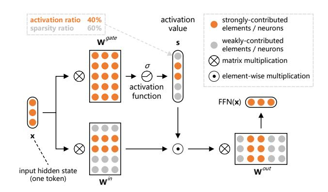

# Abstract

Activation sparsity denotes the existence of substantial weakly-contributed neurons within feedforward networks of large language models (LLMs), providing wide potential benefits such as computation acceleration. However, existing works lack thorough quantitative studies on this useful property, in terms of both its measurement and influential factors. In this paper, we address three underexplored research questions: (1) How can activation sparsity be measured more accurately? (2) How is activation sparsity affected by the model architecture and training process? (3) How can we build a more sparsely activated and efficient LLM? Specifically, we develop a generalizable and performance-friendly metric, named CETT-PPL-1%, to measure activation sparsity. Based on CETT-PPL-1%, we quantitatively study the influence of various factors and observe several important phenomena, such as the convergent power-law relationship between sparsity and training data amount, the higher competence of ReLU activation than mainstream SiLU activation, the potential sparsity merit of a small width-depth ratio, and the scale insensitivity of activation sparsity. Finally, we provide implications for building sparse and effective LLMs, and demonstrate the reliability of our findings by training a 2.4B model with a sparsity ratio of 93.52%, showing 4.1× speedup compared with its dense version. The codes and checkpoints are available at [https:](https://github.com/thunlp/SparsingLaw/) [//github.com/thunlp/SparsingLaw/](https://github.com/thunlp/SparsingLaw/).

*Proceedings of the* 42 nd *International Conference on Machine Learning*, Vancouver, Canada. PMLR 267, 2025. Copyright 2025 by the author(s).

Figure 1: A typical case of activation sparsity (with a sparsity ratio of 60%) in a gated feed-forward network of LLMs.

