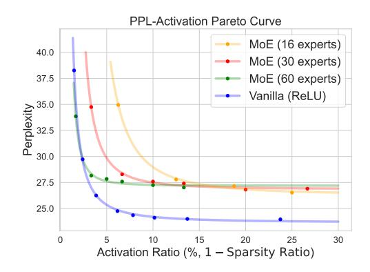
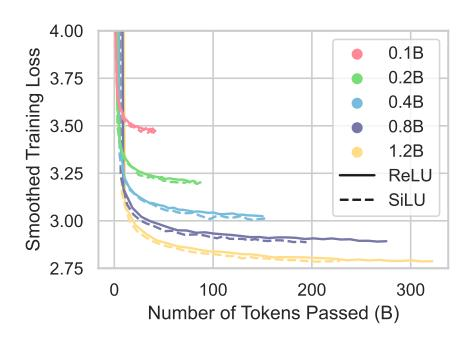

# References

- Austin, J., Odena, A., Nye, M., Bosma, M., Michalewski, H., Dohan, D., Jiang, E., Cai, C., Terry, M., Le, Q., et al. Program synthesis with large language models. *arXiv preprint arXiv:2108.07732*, 2021. URL [https:](https://arxiv.org/pdf/2108.07732.pdf) [//arxiv.org/pdf/2108.07732.pdf](https://arxiv.org/pdf/2108.07732.pdf).
- Besiroglu, T., Erdil, E., Barnett, M., and You, J. Chinchilla scaling: A replication attempt. *arXiv preprint arXiv:2404.10102*, 2024. URL [https://arxiv.](https://arxiv.org/pdf/2404.10102)

- [org/pdf/2404.10102](https://arxiv.org/pdf/2404.10102).
- Bills, S., Cammarata, N., Mossing, D., Tillman, H., Gao, L., Goh, G., Sutskever, I., Leike, J., Wu, J., and Saunders, W. Language models can explain neurons in language models. *URL https://openaipublic. blob. core. windows. net/neuron-explainer/paper/index. html.(Date accessed: 14.05. 2023)*, 2, 2023.
- Bisk, Y., Zellers, R., Gao, J., Choi, Y., et al. PIQA: Reasoning about physical commonsense in natural language. In *Proceedings of the AAAI conference on artificial intelligence*, volume 34, pp. 7432–7439, 2020. URL [https://ojs.aaai.org/index.](https://ojs.aaai.org/index.php/AAAI/article/view/6239/6095) [php/AAAI/article/view/6239/6095](https://ojs.aaai.org/index.php/AAAI/article/view/6239/6095).
- Brown, T., Mann, B., Ryder, N., Subbiah, M., Kaplan, J. D., Dhariwal, P., Neelakantan, A., Shyam, P., Sastry, G., Askell, A., et al. Language models are few-shot learners. *Advances in neural information processing systems*, 33:1877–1901, 2020. URL [https://proceedings.neurips.](https://proceedings.neurips.cc/paper_files/paper/2020/file/1457c0d6bfcb4967418bfb8ac142f64a-Paper.pdf) [cc/paper\\_files/paper/2020/file/](https://proceedings.neurips.cc/paper_files/paper/2020/file/1457c0d6bfcb4967418bfb8ac142f64a-Paper.pdf) [1457c0d6bfcb4967418bfb8ac142f64a-Paper](https://proceedings.neurips.cc/paper_files/paper/2020/file/1457c0d6bfcb4967418bfb8ac142f64a-Paper.pdf). [pdf](https://proceedings.neurips.cc/paper_files/paper/2020/file/1457c0d6bfcb4967418bfb8ac142f64a-Paper.pdf).
- Chen, M., Tworek, J., Jun, H., Yuan, Q., Pinto, H. P. d. O., Kaplan, J., Edwards, H., Burda, Y., Joseph, N., Brockman, G., et al. Evaluating large language models trained on code. *arXiv preprint arXiv:2107.03374*, 2021. URL <https://arxiv.org/pdf/2107.03374.pdf>.
- Clark, C., Lee, K., Chang, M.-W., Kwiatkowski, T., Collins, M., and Toutanova, K. BoolQ: Exploring the surprising difficulty of natural yes/no questions. In *Proceedings of the 2019 Conference of the North American Chapter of the Association for Computational Linguistics: Human Language Technologies, Volume 1 (Long and Short Papers)*, pp. 2924–2936, 2019. URL [https:](https://aclanthology.org/N19-1300.pdf) [//aclanthology.org/N19-1300.pdf](https://aclanthology.org/N19-1300.pdf).
- Clark, J. H., Choi, E., Collins, M., Garrette, D., Kwiatkowski, T., Nikolaev, V., and Palomaki, J. TyDi QA: A benchmark for information-seeking question answering in typologically diverse languages. *Transactions of the Association for Computational Linguistics*, 8:454–470, 2020. URL [https://aclanthology.org/2020.](https://aclanthology.org/2020.tacl-1.30.pdf) [tacl-1.30.pdf](https://aclanthology.org/2020.tacl-1.30.pdf).
- Cobbe, K., Kosaraju, V., Bavarian, M., Chen, M., Jun, H., Kaiser, L., Plappert, M., Tworek, J., Hilton, J., Nakano, R., et al. Training verifiers to solve math word problems. *arXiv preprint arXiv:2110.14168*, 2021. URL [https:](https://arxiv.org/pdf/2110.14168.pdf) [//arxiv.org/pdf/2110.14168.pdf](https://arxiv.org/pdf/2110.14168.pdf).
- Colombo, P., Pires, T. P., Boudiaf, M., Culver, D., Melo, R., Corro, C., Martins, A. F., Esposito, F., Raposo, V. L., Morgado, S., et al. SaulLM-7B: A pioneering large language

- model for law. *arXiv preprint arXiv:2403.03883*, 2024. URL <https://arxiv.org/pdf/2403.03883>.
- Dauphin, Y. N., Fan, A., Auli, M., and Grangier, D. Language modeling with gated convolutional networks. In *International Conference on Machine Learning*, pp. 933–941. PMLR, 2017. URL [https://proceedings.mlr.press/v70/](https://proceedings.mlr.press/v70/dauphin17a/dauphin17a.pdf) [dauphin17a/dauphin17a.pdf](https://proceedings.mlr.press/v70/dauphin17a/dauphin17a.pdf).
- Ding, N., Chen, Y., Xu, B., Qin, Y., Zheng, Z., Hu, S., Liu, Z., Sun, M., and Zhou, B. Enhancing chat language models by scaling high-quality instructional conversations. *arXiv preprint arXiv:2305.14233*, 2023. URL <https://arxiv.org/pdf/2305.14233.pdf>.
- Dubey, A., Jauhri, A., Pandey, A., Kadian, A., Al-Dahle, A., Letman, A., Mathur, A., Schelten, A., Yang, A., Fan, A., et al. The Llama 3 herd of models. *arXiv preprint arXiv:2407.21783*, 2024. URL [https://](https://arxiv.org/pdf/2407.21783) [arxiv.org/pdf/2407.21783](https://arxiv.org/pdf/2407.21783).
- Elfwing, S., Uchibe, E., and Doya, K. Sigmoid-weighted linear units for neural network function approximation in reinforcement learning. *Neural networks*, 107:3–11, 2018. URL [https://www.sciencedirect.com/](https://www.sciencedirect.com/science/article/pii/S0893608017302976) [science/article/pii/S0893608017302976](https://www.sciencedirect.com/science/article/pii/S0893608017302976).
- Fedus, W., Zoph, B., and Shazeer, N. Switch Transformers: Scaling to trillion parameter models with simple and efficient sparsity. *Journal of Machine Learning Research*, 23 (120):1–39, 2022. URL [https://www.jmlr.org/](https://www.jmlr.org/papers/volume23/21-0998/21-0998.pdf) [papers/volume23/21-0998/21-0998.pdf](https://www.jmlr.org/papers/volume23/21-0998/21-0998.pdf).
- Frantar, E. and Alistarh, D. SparseGPT: Massive language models can be accurately pruned in oneshot. In *International Conference on Machine Learning*, pp. 10323–10337. PMLR, 2023. URL [https://proceedings.mlr.press/v202/](https://proceedings.mlr.press/v202/frantar23a/frantar23a.pdf) [frantar23a/frantar23a.pdf](https://proceedings.mlr.press/v202/frantar23a/frantar23a.pdf).
- Frantar, E., Ruiz, C. R., Houlsby, N., Alistarh, D., and Evci, U. Scaling laws for sparsely-connected foundation models. In *The Twelfth International Conference on Learning Representations*, 2023. URL [https:](https://openreview.net/pdf?id=i9K2ZWkYIP) [//openreview.net/pdf?id=i9K2ZWkYIP](https://openreview.net/pdf?id=i9K2ZWkYIP).
- Gao, L., Biderman, S., Black, S., Golding, L., Hoppe, T., Foster, C., Phang, J., He, H., Thite, A., Nabeshima, N., et al. The Pile: An 800GB dataset of diverse text for language modeling. *arXiv preprint arXiv:2101.00027*, 2020. URL [https://arxiv.](https://arxiv.org/pdf/2101.00027.pdf) [org/pdf/2101.00027.pdf](https://arxiv.org/pdf/2101.00027.pdf).
- Gao, L., la Tour, T. D., Tillman, H., Goh, G., Troll, R., Radford, A., Sutskever, I., Leike, J., and Wu, J. Scaling and evaluating sparse autoencoders. *arXiv preprint*

- *arXiv:2406.04093*, 2024. URL [https://arxiv.](https://arxiv.org/pdf/2406.04093) [org/pdf/2406.04093](https://arxiv.org/pdf/2406.04093).
- Gerganov, G. llama.cpp. [https://github.com/](https://github.com/ggerganov/llama.cpp) [ggerganov/llama.cpp](https://github.com/ggerganov/llama.cpp), 2023.
- Hendrycks, D., Burns, C., Basart, S., Zou, A., Mazeika, M., Song, D., and Steinhardt, J. Measuring massive multitask language understanding. *arXiv preprint arXiv:2009.03300*, 2020. URL [https://arxiv.](https://arxiv.org/pdf/2009.03300.pdf) [org/pdf/2009.03300.pdf](https://arxiv.org/pdf/2009.03300.pdf).
- Hoffmann, J., Borgeaud, S., Mensch, A., Buchatskaya, E., Cai, T., Rutherford, E., de Las Casas, D., Hendricks, L. A., Welbl, J., Clark, A., et al. Training computeoptimal large language models. In *Proceedings of the 36th International Conference on Neural Information Processing Systems*, pp. 30016–30030, 2022. URL <https://arxiv.org/pdf/2203.15556>.
- Hu, S., Tu, Y., Han, X., He, C., Cui, G., Long, X., Zheng, Z., Fang, Y., Huang, Y., Zhao, W., et al. MiniCPM: Unveiling the potential of small language models with scalable training strategies. *arXiv preprint arXiv:2404.06395*, 2024.
- Huang, Q., An, Z., Zhuang, N., Tao, M., Zhang, C., Jin, Y., Xu, K., Chen, L., Huang, S., and Feng, Y. Harder tasks need more experts: Dynamic routing in MoE models. *arXiv preprint arXiv:2403.07652*, 2024. URL [https:](https://arxiv.org/pdf/2403.07652) [//arxiv.org/pdf/2403.07652](https://arxiv.org/pdf/2403.07652).
- Kocetkov, D., Li, R., Jia, L., Mou, C., Jernite, Y., Mitchell, M., Ferrandis, C. M., Hughes, S., Wolf, T., Bahdanau, D., et al. The Stack: 3 TB of permissively licensed source code. *Transactions on Machine Learning Research*, 2022. URL [https://openreview.net/](https://openreview.net/pdf?id=pxpbTdUEpD) [pdf?id=pxpbTdUEpD](https://openreview.net/pdf?id=pxpbTdUEpD).
- Krajewski, J., Ludziejewski, J., Adamczewski, K., Pioro, ´ M., Krutul, M., Antoniak, S., Ciebiera, K., Krol, K., ´ Odrzygo´zd´ z, T., Sankowski, P., et al. Scaling laws ´ for fine-grained mixture of experts. *arXiv preprint arXiv:2402.07871*, 2024. URL [https://arxiv.](https://arxiv.org/pdf/2402.07871) [org/pdf/2402.07871](https://arxiv.org/pdf/2402.07871).
- Kurtz, M., Kopinsky, J., Gelashvili, R., Matveev, A., Carr, J., Goin, M., Leiserson, W., Moore, S., Shavit, N., and Alistarh, D. Inducing and exploiting activation sparsity for fast inference on deep neural networks. In *International Conference on Machine Learning*, pp. 5533–5543. PMLR, 2020. URL [https://proceedings.mlr.](https://proceedings.mlr.press/v119/kurtz20a/kurtz20a.pdf) [press/v119/kurtz20a/kurtz20a.pdf](https://proceedings.mlr.press/v119/kurtz20a/kurtz20a.pdf).
- Lee, J.-Y., Lee, D., Zhang, G., Tiwari, M., and Mirhoseini, A. CATS: Contextually-aware thresholding for sparsity in large language models. *CoRR*, 2024. URL [http:](http://arxiv.org/pdf/2404.08763) [//arxiv.org/pdf/2404.08763](http://arxiv.org/pdf/2404.08763).

- Li, R., Allal, L. B., Zi, Y., Muennighoff, N., Kocetkov, D., Mou, C., Marone, M., Akiki, C., Li, J., Chim, J., et al. StarCoder: may the source be with you! *arXiv preprint arXiv:2305.06161*, 2023. URL [https:](https://arxiv.org/pdf/2305.06161.pdf) [//arxiv.org/pdf/2305.06161.pdf](https://arxiv.org/pdf/2305.06161.pdf).
- Li, Z., You, C., Bhojanapalli, S., Li, D., Rawat, A. S., Reddi, S. J., Ye, K., Chern, F., Yu, F., Guo, R., et al. The lazy neuron phenomenon: On emergence of activation sparsity in Transformers. In *The Eleventh International Conference on Learning Representations*, 2022. URL [https:](https://openreview.net/pdf?id=TJ2nxciYCk-) [//openreview.net/pdf?id=TJ2nxciYCk-](https://openreview.net/pdf?id=TJ2nxciYCk-).
- Lieberum, T., Rajamanoharan, S., Conmy, A., Smith, L., Sonnerat, N., Varma, V., Kramar, J., Dragan, A., Shah, ´ R., and Nanda, N. Gemma Scope: Open sparse autoencoders everywhere all at once on Gemma 2. *arXiv preprint arXiv:2408.05147*, 2024. URL [https://](https://arxiv.org/pdf/2408.05147) [arxiv.org/pdf/2408.05147](https://arxiv.org/pdf/2408.05147).
- Liu, J., Ponnusamy, P., Cai, T., Guo, H., Kim, Y., and Athiwaratkun, B. Training-free activation sparsity in large language models. *arXiv preprint arXiv:2408.14690*, 2024a. URL <https://arxiv.org/pdf/2408.14690>.
- Liu, L., Kim, Y. J., Wang, S., Liang, C., Shen, Y., Cheng, H., Liu, X., Tanaka, M., Wu, X., Hu, W., Chaudhary, V., Lin, Z., Zhang, C., Xue, J., Awadalla, H., Gao, J., and Chen, W. GRIN: GRadient-INformed MoE, 2024b. URL <https://arxiv.org/abs/2409.12136>.
- Liu, Z., Wang, J., Dao, T., Zhou, T., Yuan, B., Song, Z., Shrivastava, A., Zhang, C., Tian, Y., Re, C., et al. Deja Vu: Contextual sparsity for efficient LLMs at inference time. In *International Conference on Machine Learning*, pp. 22137–22176. PMLR, 2023. URL [https://proceedings.mlr.press/](https://proceedings.mlr.press/v202/liu23am/liu23am.pdf) [v202/liu23am/liu23am.pdf](https://proceedings.mlr.press/v202/liu23am/liu23am.pdf).
- Marquardt, D. W. An algorithm for least-squares estimation of nonlinear parameters. *Journal of the society for Industrial and Applied Mathematics*, 11(2):431–441, 1963.
- Mirzadeh, I., Alizadeh, K., Mehta, S., Del Mundo, C. C., Tuzel, O., Samei, G., Rastegari, M., and Farajtabar, M. ReLU strikes back: Exploiting activation sparsity in large language models. *arXiv preprint arXiv:2310.04564*, 2023. URL [https://arxiv.](https://arxiv.org/pdf/2310.04564.pdf) [org/pdf/2310.04564.pdf](https://arxiv.org/pdf/2310.04564.pdf).
- Paperno, D., Kruszewski, G., Lazaridou, A., Pham, N.-Q., Bernardi, R., Pezzelle, S., Baroni, M., Boleda, G., and Fernandez, R. The LAMBADA dataset: Word prediction ´ requiring a broad discourse context. In *Proceedings of the 54th Annual Meeting of the Association for Computational Linguistics (Volume 1: Long Papers)*, pp. 1525– 1534, 2016. URL [https://aclanthology.org/](https://aclanthology.org/P16-1144.pdf) [P16-1144.pdf](https://aclanthology.org/P16-1144.pdf).

- Petty, J., van Steenkiste, S., Dasgupta, I., Sha, F., Garrette, D., and Linzen, T. The impact of depth and width on transformer language model generalization. *arXiv preprint arXiv:2310.19956*, 2023. URL [https:](https://arxiv.org/pdf/2310.19956) [//arxiv.org/pdf/2310.19956](https://arxiv.org/pdf/2310.19956).
- Raffel, C., Shazeer, N., Roberts, A., Lee, K., Narang, S., Matena, M., Zhou, Y., Li, W., and Liu, P. J. Exploring the limits of transfer learning with a unified text-to-text Transformer. *Journal of machine learning research*, 21 (140):1–67, 2020. URL [https://www.jmlr.org/](https://www.jmlr.org/papers/volume21/20-074/20-074.pdf) [papers/volume21/20-074/20-074.pdf](https://www.jmlr.org/papers/volume21/20-074/20-074.pdf).
- Roemmele, M., Bejan, C. A., and Gordon, A. S. Choice of plausible alternatives: An evaluation of commonsense causal reasoning. In *2011 AAAI Spring Symposium Series*, 2011. URL [https://cdn.aaai.org/ocs/2418/](https://cdn.aaai.org/ocs/2418/2418-10878-1-PB.pdf) [2418-10878-1-PB.pdf](https://cdn.aaai.org/ocs/2418/2418-10878-1-PB.pdf).
- Sajjad, H., Durrani, N., and Dalvi, F. Neuron-level interpretation of deep NLP models: A survey. *Transactions of the Association for Computational Linguistics*, 10:1285– 1303, 2022. URL [https://direct.mit.edu/](https://direct.mit.edu/tacl/article-pdf/doi/10.1162/tacl_a_00519/2060745/tacl_a_00519.pdf) [tacl/article-pdf/doi/10.1162/tacl\\_a\\_](https://direct.mit.edu/tacl/article-pdf/doi/10.1162/tacl_a_00519/2060745/tacl_a_00519.pdf) [00519/2060745/tacl\\_a\\_00519.pdf](https://direct.mit.edu/tacl/article-pdf/doi/10.1162/tacl_a_00519/2060745/tacl_a_00519.pdf).
- Sakaguchi, K., Le Bras, R., Bhagavatula, C., and Choi, Y. WinoGrande: An adversarial winograd schema challenge at scale. In *Proceedings of the AAAI Conference on Artificial Intelligence*, volume 34, pp. 8732–8740, 2020. URL [https://cdn.aaai.org/ojs/6399/](https://cdn.aaai.org/ojs/6399/6399-13-9624-1-10-20200517.pdf) [6399-13-9624-1-10-20200517.pdf](https://cdn.aaai.org/ojs/6399/6399-13-9624-1-10-20200517.pdf).
- Sap, M., Rashkin, H., Chen, D., Le Bras, R., and Choi, Y. SocialIQA: Commonsense reasoning about social interactions. In *Proceedings of the 2019 Conference on Empirical Methods in Natural Language Processing and the 9th International Joint Conference on Natural Language Processing (EMNLP-IJCNLP)*, pp. 4463– 4473, 2019. URL [https://aclanthology.org/](https://aclanthology.org/D19-1454.pdf) [D19-1454.pdf](https://aclanthology.org/D19-1454.pdf).
- Shazeer, N. GLU variants improve Transformer. *arXiv preprint arXiv:2002.05202*, 2020. URL [https://](https://arxiv.org/pdf/2002.05202.pdf) [arxiv.org/pdf/2002.05202.pdf](https://arxiv.org/pdf/2002.05202.pdf).
- Soldaini, L., Kinney, R., Bhagia, A., Schwenk, D., Atkinson, D., Authur, R., Bogin, B., Chandu, K., Dumas, J., Elazar, Y., et al. Dolma: An open corpus of three trillion tokens for language model pretraining research. *arXiv preprint arXiv:2402.00159*, 2024. URL [https:](https://arxiv.org/pdf/2402.00159) [//arxiv.org/pdf/2402.00159](https://arxiv.org/pdf/2402.00159).
- Song, C., Han, X., Zhang, Z., Hu, S., Shi, X., Li, K., Chen, C., Liu, Z., Li, G., Yang, T., and Sun, M. ProSparse: Introducing and enhancing intrinsic activation sparsity within large language models. In

- *Proceedings of the 31st International Conference on Computational Linguistics*, pp. 2626–2644, January 2025. URL [https://aclanthology.org/2025.](https://aclanthology.org/2025.coling-main.180.pdf) [coling-main.180.pdf](https://aclanthology.org/2025.coling-main.180.pdf).
- Song, Y., Mi, Z., Xie, H., and Chen, H. PowerInfer: Fast large language model serving with a consumer-grade GPU. *arXiv preprint arXiv:2312.12456*, 2023. URL <https://arxiv.org/pdf/2312.12456.pdf>.
- Song, Y., Xie, H., Zhang, Z., Wen, B., Ma, L., Mi, Z., and Chen, H. Turbo Sparse: Achieving LLM SOTA performance with minimal activated parameters. *arXiv preprint arXiv:2406.05955*, 2024. URL [https://](https://arxiv.org/pdf/2406.05955) [arxiv.org/pdf/2406.05955](https://arxiv.org/pdf/2406.05955).
- Suzgun, M., Scales, N., Scharli, N., Gehrmann, S., Tay, ¨ Y., Chung, H. W., Chowdhery, A., Le, Q. V., Chi, E. H., Zhou, D., et al. Challenging big-bench tasks and whether chain-of-thought can solve them. *arXiv preprint arXiv:2210.09261*, 2022. URL [https://](https://arxiv.org/pdf/2210.09261.pdf) [arxiv.org/pdf/2210.09261.pdf](https://arxiv.org/pdf/2210.09261.pdf).
- Touvron, H., Lavril, T., Izacard, G., Martinet, X., Lachaux, M.-A., Lacroix, T., Roziere, B., Goyal, N., Ham- ` bro, E., Azhar, F., et al. LLaMA: Open and efficient foundation language models. *arXiv preprint arXiv:2302.13971*, 2023. URL [https://arxiv.](https://arxiv.org/pdf/2302.13971.pdf) [org/pdf/2302.13971.pdf](https://arxiv.org/pdf/2302.13971.pdf).
- Wei, Y., Wang, Z., Liu, J., Ding, Y., and Zhang, L. Magicoder: Empowering code generation with OSS-Instruct. In *Forty-first International Conference on Machine Learning*, 2024. URL [https://arxiv.org/pdf/2312.](https://arxiv.org/pdf/2312.02120) [02120](https://arxiv.org/pdf/2312.02120).
- Wu, C. and Tang, R. Performance law of large language models. *arXiv preprint arXiv:2408.09895*, 2024. URL <https://arxiv.org/pdf/2408.09895>.
- Xia, M., Gao, T., Zeng, Z., and Chen, D. Sheared LLaMA: Accelerating language model pre-training via structured pruning. *arXiv preprint arXiv:2310.06694*, 2023. URL <https://arxiv.org/pdf/2310.06694.pdf>.
- Xu, C., Sun, Q., Zheng, K., Geng, X., Zhao, P., Feng, J., Tao, C., and Jiang, D. WizardLM: Empowering large language models to follow complex instructions. *arXiv preprint arXiv:2304.12244*, 2023. URL [https:](https://arxiv.org/pdf/2304.12244) [//arxiv.org/pdf/2304.12244](https://arxiv.org/pdf/2304.12244).
- Xue, Z., Song, Y., Mi, Z., Chen, L., Xia, Y., and Chen, H. PowerInfer-2: Fast large language model inference on a smartphone. *arXiv preprint arXiv:2406.06282*, 2024. URL <https://arxiv.org/pdf/2406.06282>.

- Yang, G., Hu, E. J., Babuschkin, I., Sidor, S., Liu, X., Farhi, D., Ryder, N., Pachocki, J., Chen, W., and Gao, J. Tensor programs V: Tuning large neural networks via zero-shot hyperparameter transfer. *arXiv preprint arXiv:2203.03466*, 2022. URL [https://arxiv.](https://arxiv.org/pdf/2203.03466) [org/pdf/2203.03466](https://arxiv.org/pdf/2203.03466).
- Zellers, R., Holtzman, A., Bisk, Y., Farhadi, A., and Choi, Y. HellaSwag: Can a machine really finish your sentence? In *Proceedings of the 57th Annual Meeting of the Association for Computational Linguistics*, pp. 4791– 4800, 2019. URL [https://aclanthology.org/](https://aclanthology.org/P19-1472.pdf) [P19-1472.pdf](https://aclanthology.org/P19-1472.pdf).
- Zhang, Z., Lin, Y., Liu, Z., Li, P., Sun, M., and Zhou, J. MoEfication: Transformer feed-forward layers are mixtures of experts. In *Findings of the Association for Computational Linguistics: ACL 2022*, pp. 877–890, 2022. URL [https://aclanthology.org/2022.](https://aclanthology.org/2022.findings-acl.71.pdf) [findings-acl.71.pdf](https://aclanthology.org/2022.findings-acl.71.pdf).
- Zhang, Z., Zeng, Z., Lin, Y., Xiao, C., Wang, X., Han, X., Liu, Z., Xie, R., Sun, M., and Zhou, J. Emergent modularity in pre-trained Transformers. In *Findings of the Association for Computational Linguistics: ACL 2023*, pp. 4066–4083, 2023. URL [https://aclanthology.](https://aclanthology.org/2023.findings-acl.250.pdf) [org/2023.findings-acl.250.pdf](https://aclanthology.org/2023.findings-acl.250.pdf).
- Zhang, Z., Song, Y., Yu, G., Han, X., Lin, Y., Xiao, C., Song, C., Liu, Z., Mi, Z., and Sun, M. ReLU2 wins: Discovering efficient activation functions for sparse LLMs. *arXiv preprint arXiv:2402.03804*, 2024a. URL [https://](https://arxiv.org/pdf/2402.03804.pdf) [arxiv.org/pdf/2402.03804.pdf](https://arxiv.org/pdf/2402.03804.pdf).
- Zhang, Z., Xiao, C., Qin, Q., Lin, Y., Zeng, Z., Han, X., Liu, Z., Xie, R., Sun, M., and Zhou, J. Exploring the benefit of activation sparsity in pre-training. In *Fortyfirst International Conference on Machine Learning*, 2024b. URL [https://openreview.net/pdf?](https://openreview.net/pdf?id=KfXXPCcobh) [id=KfXXPCcobh](https://openreview.net/pdf?id=KfXXPCcobh).
- Zhong, W., Cui, R., Guo, Y., Liang, Y., Lu, S., Wang, Y., Saied, A., Chen, W., and Duan, N. AGIEval: A human-centric benchmark for evaluating foundation models. *arXiv preprint arXiv:2304.06364*, 2023. URL <https://arxiv.org/pdf/2304.06364.pdf>.
- Zoph, B., Bello, I., Kumar, S., Du, N., Huang, Y., Dean, J., Shazeer, N., and Fedus, W. ST-MoE: Designing stable and transferable sparse expert models. *arXiv preprint arXiv:2202.08906*, 2022. URL [https://](https://arxiv.org/pdf/2202.08906) [arxiv.org/pdf/2202.08906](https://arxiv.org/pdf/2202.08906).

#### A. Limitations

One drawback of our study is the absence of computation (e.g., FLOPS) in some analyses, especially the experiments for width-depth ratios. In Section 5.2, we find a smaller width-depth ratio potentially produces a sparser model. However, with the substantial increase in the number of layers, the training efficiency is significantly decreased, as we have observed in the training process. Therefore, in addition to performance, the computation costs of a model also deserve consideration. Similarly, considering the values of activation sparsity in acceleration, it may be interesting to involve the inference computation as a variable in our study.

Another limitation of our CETT-PPL-p% metric (as well as all the sparsity metrics relying on a validation dataset) is the sensitivity to different data distributions. Intuitively, the same model can have different sparsity ratios on distinct datasets or tasks. The correlation between sparsity and influential factors (e.g., the form of power laws) can also have dataset-unique characteristics. A piece of evidence already presented in our paper is in Table 1, where the performance on commonsense reasoning tasks is insensitive to p%, largely different from the results on reading comprehension tasks. Moreover, the data mixing policies for pre-training can also have a considerable impact on the activation sparsity, which we leave for future work.

#### **B.** Activation Sparsity and Mixture-of-Experts

Mixture-of-experts (MoE) is a mainstream method to achieve high activation sparsity by introducing constraints at the model architecture level. Typically, MoE uses a tokenlevel top-k parameter selection router to assign a fixed sparsity ratio for each token at each layer (Fedus et al., 2022; Zoph et al., 2022). However, these constraints often sacrifice model flexibility and performance. Recent works reveal the potential performance degradation caused by such inflexible sparsity assignment (Huang et al., 2024; Liu et al., 2024b). Moreover, to inspect the impact of such constraints, we plot the PPL-activation (PPL denotes perplexity) Pareto curve of MoE in Figure 12 and compare it with a vanilla decoder-only Transformer (Touvron et al., 2023) of the same parameter scale and amount of pre-training data3. MoE has a significantly worse performance-sparsity trade-off. Moreover, the best sparsity ratio is also hard to predefine, since a too-high or too-low sparsity ratio may lead to more severe performance degradation or substantial unnecessary computation, respectively.

Therefore, to avoid negative impacts on flexibility and performance, in this work, we focus on the intrinsic activa-

Figure 12: The PPL-activation Pareto curve of the 0.1B MoE with different expert numbers versus the 0.1B vanilla decoder-only Transformer.

tion sparsity within vanilla decoder-only Transformer-based LLMs in this paper, such as GPT (Brown et al., 2020) and LLaMA (Touvron et al., 2023).

#### C. Activation Sparsity and Weight Pruning

Weight pruning, also a popular paradigm for inference acceleration, accelerates LLMs by removing certain elements from the model parameters (e.g., neurons, weights, or structured blocks). Nevertheless, the sparsity introduced by weight pruning is fundamentally different from activation sparsity, as the pruning sparsity is completely static, namely independent of inputs. Specifically, weight pruning always drops the same part of parameters regardless of inputs. Consequently, enforcing high such static sparsity can easily cause considerable performance degradation (Frantar & Alistarh, 2023; Xia et al., 2023).

By contrast, activation sparsity dynamically determines weakly-contributed neurons given specific input tokens, which potentially sacrifices less LLM capacity and performance. For example, ReLU-activated models, with considerably higher activation sparsity, have comparable performance to mainstream SiLU-activated ones. Moreover, weight pruning and activation sparsity can also be combined to further promote LLM efficiency.

#### **D.** Training Loss Dynamics

To present the comprehensive training dynamics, we plot the trend of loss with the increase of training data in Figure 13. As can be clearly observed, larger models have smaller training loss. Besides, we also plot the limit values of the training loss with infinite training tokens, shown in Figure 14. As demonstrated in the above two figures, SiLU and ReLU models are well comparable from the loss aspect.

&lt;sup>3MoE models of different sparsity are obtained by tuning the number of activated experts, while for the vanilla setting, we adjust the CETT hyper-parameter proposed by Zhang et al. (2024a).

Figure 13: The trend of pre-training loss for models with different scales and activations.

