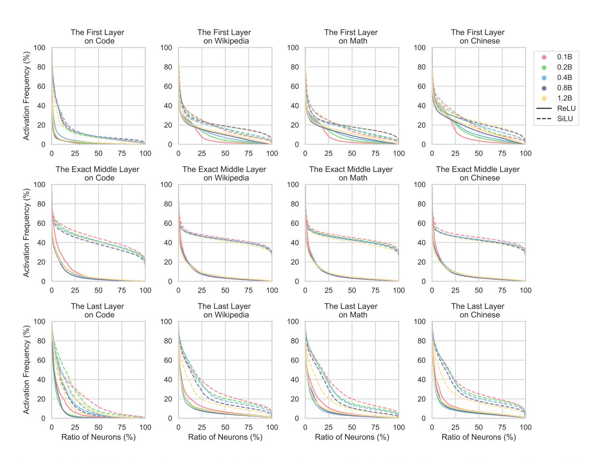

# L. Details of Acceleration Experiments

To demonstrate the practical inference acceleration values of activation sparsity, we run experiments with the 2.4B ReLUactivated model on two different acceleration frameworks: PowerInfer [\(Song et al.,](#page-11-0) [2023\)](#page-11-0) and "llama.cpp" [\(Gerganov,](#page-9-11) [2023\)](#page-9-11). Specifically, PowerInfer, tailored for activation sparsity, involves an offline profiler and online activation predictors to forecast the activation pattern of each neuron. Therefore, PowerInfer can wisely allocate hardware resources

according to the activation frequencies of different neurons and save redundant computation and time wasted on weakly-contributed neurons. By contrast, "llama.cpp" does not utilize activation sparsity for acceleration, computing the FFNs in a dense manner.

Both frameworks are compiled with CUDA enabled and run on the same machine with 104 CPUs and 1 NVIDIA A800 GPU. Although "llama.cpp" does not support ReLU and thus cannot correctly conduct inference with our 2.4B model, this does not impact the acceleration experiment as the FLOPS remain the same as a SiLU-activated model. We use 100 test prompts sampled from C4[4](#page-15-3) , and each prompt is composed of 5 prefix tokens.

Consequently, we found that PowerInfer can perform decoding at an average speed of 41.79 tokens per second, while "llama.cpp" can only reach 10.23 tokens per second. The 4.1× speedup of PowerInfer provides strong evidence of the acceleration potential offered by activation sparsity.

4[https://huggingface.co/datasets/allenai/](https://huggingface.co/datasets/allenai/c4) [c4](https://huggingface.co/datasets/allenai/c4)

Figure 16: The distributions of average activation frequencies across three individual layers at different positions within models of distinct scales, including four datasets from the pre-training data.

Table 4: Evaluation scores (%) on *commonsense reasoning* benchmarks.

|      |      |              | PIQA | SIQA | HellaSwag | WinoGrande | COPA | Avg. |
|------|------|--------------|------|------|-----------|------------|------|------|
|      |      |              | acc  | acc  | acc       | acc        | acc  |      |
|      |      | Dense        | 62.8 | 37.8 | 30.5      | 53.0       | 64.0 | 49.6 |
|      |      | CETT-PPL-1%  | 62.7 | 37.4 | 30.5      | 52.6       | 62.0 | 49.1 |
|      | ReLU | CETT-PPL-5%  | 63.1 | 37.6 | 30.3      | 51.1       | 64.0 | 49.2 |
| 0.1B |      | CETT-PPL-10% | 63.0 | 38.0 | 30.5      | 51.5       | 64.0 | 49.4 |
|      |      | Dense        | 64.3 | 37.6 | 30.9      | 52.8       | 62.0 | 49.5 |
|      | SiLU | CETT-PPL-1%  | 64.3 | 37.5 | 30.7      | 53.0       | 64.0 | 49.9 |
|      |      | CETT-PPL-5%  | 63.5 | 38.4 | 30.5      | 51.5       | 61.0 | 49.0 |
|      |      | CETT-PPL-10% | 63.8 | 38.1 | 30.4      | 51.3       | 60.0 | 48.7 |
|      |      | Dense        | 66.3 | 38.3 | 37.1      | 53.1       | 65.0 | 52.0 |
|      | ReLU | CETT-PPL-1%  | 66.3 | 38.1 | 37.2      | 52.7       | 64.0 | 51.7 |
|      |      | CETT-PPL-5%  | 66.2 | 38.1 | 37.1      | 52.2       | 65.0 | 51.7 |
| 0.2B |      | CETT-PPL-10% | 66.0 | 37.9 | 37.0      | 51.9       | 65.0 | 51.6 |
|      | SiLU | Dense        | 67.6 | 39.0 | 37.8      | 51.8       | 65.0 | 52.2 |
|      |      | CETT-PPL-1%  | 68.2 | 39.2 | 37.7      | 52.0       | 65.0 | 52.4 |
|      |      | CETT-PPL-5%  | 67.4 | 38.2 | 37.7      | 51.8       | 65.0 | 52.0 |
|      |      | CETT-PPL-10% | 66.8 | 38.8 | 37.9      | 52.1       | 64.0 | 51.9 |
|      | ReLU | Dense        | 68.8 | 39.9 | 42.7      | 51.9       | 70.0 | 54.7 |
|      |      | CETT-PPL-1%  | 68.8 | 39.7 | 42.9      | 51.8       | 70.0 | 54.6 |
|      |      | CETT-PPL-5%  | 68.3 | 39.9 | 42.7      | 52.5       | 68.0 | 54.3 |
| 0.4B |      | CETT-PPL-10% | 68.1 | 40.4 | 42.6      | 53.2       | 70.0 | 54.9 |
|      |      | Dense        | 69.0 | 39.6 | 44.5      | 51.9       | 74.0 | 55.8 |
|      | SiLU | CETT-PPL-1%  | 68.7 | 39.4 | 44.6      | 52.2       | 74.0 | 55.8 |
|      |      | CETT-PPL-5%  | 68.9 | 39.4 | 44.6      | 51.5       | 71.0 | 55.1 |
|      |      | CETT-PPL-10% | 68.7 | 39.3 | 44.9      | 51.0       | 72.0 | 55.2 |
|      |      | Dense        | 70.1 | 41.8 | 50.4      | 53.6       | 68.0 | 56.8 |
|      | ReLU | CETT-PPL-1%  | 69.8 | 41.8 | 50.2      | 52.8       | 65.0 | 55.9 |
|      |      | CETT-PPL-5%  | 69.9 | 41.8 | 49.7      | 52.3       | 68.0 | 56.3 |
| 0.8B |      | CETT-PPL-10% | 69.6 | 41.8 | 50.0      | 51.8       | 65.0 | 55.6 |
|      |      | Dense        | 70.4 | 40.9 | 50.6      | 54.0       | 72.0 | 57.6 |
|      | SiLU | CETT-PPL-1%  | 70.3 | 41.4 | 50.6      | 53.9       | 72.0 | 57.6 |
|      |      | CETT-PPL-5%  | 69.9 | 41.3 | 51.0      | 54.1       | 69.0 | 57.1 |
|      |      | CETT-PPL-10% | 69.5 | 40.7 | 50.6      | 53.2       | 68.0 | 56.4 |
|      |      | Dense        | 71.6 | 44.1 | 57.7      | 56.4       | 70.0 | 60.0 |
|      | ReLU | CETT-PPL-1%  | 71.1 | 44.7 | 58.0      | 55.3       | 69.0 | 59.6 |
|      |      | CETT-PPL-5%  | 70.8 | 43.9 | 57.8      | 54.9       | 69.0 | 59.3 |
| 1.2B |      | CETT-PPL-10% | 70.2 | 43.6 | 57.1      | 53.7       | 72.0 | 59.3 |
|      |      | Dense        | 71.8 | 41.2 | 57.8      | 56.1       | 71.0 | 59.6 |
|      | SiLU | CETT-PPL-1%  | 71.8 | 40.9 | 57.8      | 57.3       | 70.0 | 59.6 |
|      |      | CETT-PPL-5%  | 71.8 | 41.3 | 57.9      | 55.9       | 67.0 | 58.8 |
|      |      | CETT-PPL-10% | 71.6 | 41.3 | 58.1      | 55.5       | 70.0 | 59.3 |

Table 5: Evaluation scores (%) on *reading comprehension* benchmarks.

|      |      |              | BoolQ | LAMBADA | TyDiQA | TyDiQA | Avg. |
|------|------|--------------|-------|---------|--------|--------|------|
|      |      |              | acc   | acc     | F1     | acc    |      |
|      |      | Dense        | 60.8  | 30.1    | 17.9   | 4.1    | 28.2 |
|      |      | CETT-PPL-1%  | 60.6  | 28.5    | 19.9   | 4.5    | 28.4 |
|      | ReLU | CETT-PPL-5%  | 60.6  | 25.6    | 17.9   | 3.4    | 26.9 |
| 0.1B |      | CETT-PPL-10% | 60.1  | 24.6    | 16.4   | 3.9    | 26.2 |
|      |      | Dense        | 56.5  | 31.4    | 18.5   | 4.5    | 27.7 |
|      |      | CETT-PPL-1%  | 56.2  | 31.1    | 19.1   | 5.5    | 28.0 |
|      | SiLU | CETT-PPL-5%  | 53.6  | 28.9    | 18.0   | 5.5    | 26.5 |
|      |      | CETT-PPL-10% | 51.9  | 25.7    | 16.6   | 5.0    | 24.8 |
|      |      | Dense        | 56.3  | 38.4    | 38.0   | 30.0   | 40.7 |
|      | ReLU | CETT-PPL-1%  | 56.2  | 35.8    | 36.8   | 30.0   | 39.7 |
|      |      | CETT-PPL-5%  | 56.4  | 33.0    | 36.3   | 28.6   | 38.6 |
| 0.2B |      | CETT-PPL-10% | 55.9  | 30.8    | 37.4   | 30.2   | 38.6 |
|      |      | Dense        | 57.5  | 38.7    | 36.3   | 28.2   | 40.2 |
|      | SiLU | CETT-PPL-1%  | 57.5  | 38.3    | 35.3   | 27.5   | 39.6 |
|      |      | CETT-PPL-5%  | 55.2  | 36.0    | 31.6   | 24.3   | 36.8 |
|      |      | CETT-PPL-10% | 54.5  | 34.0    | 28.1   | 20.9   | 34.4 |
|      | ReLU | Dense        | 61.7  | 42.9    | 43.6   | 28.0   | 44.0 |
|      |      | CETT-PPL-1%  | 61.6  | 41.3    | 42.1   | 26.6   | 42.9 |
|      |      | CETT-PPL-5%  | 60.8  | 39.1    | 39.9   | 23.4   | 40.8 |
| 0.4B |      | CETT-PPL-10% | 60.2  | 37.8    | 39.2   | 22.5   | 39.9 |
|      |      | Dense        | 57.6  | 43.0    | 41.1   | 25.4   | 41.8 |
|      | SiLU | CETT-PPL-1%  | 56.6  | 43.1    | 40.5   | 23.4   | 40.9 |
|      |      | CETT-PPL-5%  | 55.2  | 39.2    | 38.1   | 20.4   | 38.2 |
|      |      | CETT-PPL-10% | 52.7  | 35.9    | 35.0   | 17.7   | 35.3 |
|      |      | Dense        | 62.1  | 47.3    | 42.6   | 27.3   | 44.8 |
|      | ReLU | CETT-PPL-1%  | 61.7  | 45.7    | 41.0   | 24.6   | 43.2 |
|      |      | CETT-PPL-5%  | 60.9  | 43.8    | 40.0   | 24.1   | 42.2 |
| 0.8B |      | CETT-PPL-10% | 59.8  | 42.5    | 37.8   | 21.1   | 40.3 |
|      |      | Dense        | 63.1  | 46.9    | 41.0   | 22.1   | 43.3 |
|      | SiLU | CETT-PPL-1%  | 63.1  | 46.0    | 43.3   | 24.8   | 44.3 |
|      |      | CETT-PPL-5%  | 62.5  | 44.7    | 37.5   | 18.2   | 40.7 |
|      |      | CETT-PPL-10% | 62.7  | 43.0    | 34.6   | 15.0   | 38.8 |
|      |      | Dense        | 63.3  | 52.5    | 54.3   | 42.5   | 53.2 |
|      | ReLU | CETT-PPL-1%  | 63.4  | 52.2    | 55.0   | 42.7   | 53.3 |
|      |      | CETT-PPL-5%  | 62.1  | 49.5    | 56.3   | 45.2   | 53.3 |
| 1.2B |      | CETT-PPL-10% | 62.6  | 47.7    | 56.8   | 44.5   | 52.9 |
|      |      | Dense        | 63.2  | 53.4    | 55.2   | 47.3   | 54.8 |
|      | SiLU | CETT-PPL-1%  | 63.7  | 54.2    | 56.1   | 47.5   | 55.4 |
|      |      | CETT-PPL-5%  | 62.2  | 51.2    | 53.1   | 43.9   | 52.6 |
|      |      | CETT-PPL-10% | 60.2  | 47.5    | 53.1   | 43.4   | 51.1 |

Table 6: Evaluation scores (%) on other more complex benchmarks.

|      |      |              | AGIEval | HumanEval | MBPP   | GSM8K | MMLU | BBH  | Avg. |
|------|------|--------------|---------|-----------|--------|-------|------|------|------|
|      |      |              | acc     | pass@1    | pass@1 | acc   | acc  | acc  |      |
|      |      | Dense        | 23.4    | 0.6       | 0.3    | 1.8   | 26.3 | 29.3 | 13.6 |
|      |      | CETT-PPL-1%  | 23.3    | 0.6       | 0.3    | 1.7   | 26.5 | 29.5 | 13.7 |
|      | ReLU | CETT-PPL-5%  | 23.5    | 0.6       | 0.1    | 1.9   | 26.3 | 28.7 | 13.5 |
| 0.1B |      | CETT-PPL-10% | 23.4    | 0.0       | 0.2    | 1.4   | 26.4 | 29.7 | 13.5 |
|      |      | Dense        | 23.6    | 0.6       | 0.8    | 1.6   | 26.1 | 29.2 | 13.7 |
|      | SiLU | CETT-PPL-1%  | 23.5    | 0.6       | 0.4    | 2.1   | 25.6 | 28.5 | 13.4 |
|      |      | CETT-PPL-5%  | 23.6    | 0.6       | 0.3    | 1.4   | 25.8 | 30.6 | 13.7 |
|      |      | CETT-PPL-10% | 23.0    | 1.2       | 0.4    | 1.4   | 25.8 | 29.0 | 13.5 |
|      |      | Dense        | 23.2    | 2.4       | 1.5    | 1.6   | 27.2 | 28.8 | 14.1 |
|      | ReLU | CETT-PPL-1%  | 22.8    | 2.4       | 1.2    | 2.1   | 26.9 | 30.3 | 14.3 |
|      |      | CETT-PPL-5%  | 22.7    | 2.4       | 1.0    | 1.6   | 27.1 | 29.7 | 14.1 |
| 0.2B |      | CETT-PPL-10% | 23.0    | 2.4       | 1.2    | 2.1   | 26.4 | 30.1 | 14.2 |
|      | SiLU | Dense        | 24.2    | 4.3       | 1.0    | 2.2   | 25.7 | 29.6 | 14.5 |
|      |      | CETT-PPL-1%  | 24.2    | 4.3       | 1.8    | 2.0   | 25.2 | 29.1 | 14.4 |
|      |      | CETT-PPL-5%  | 23.9    | 5.5       | 1.6    | 1.4   | 25.0 | 29.0 | 14.4 |
|      |      | CETT-PPL-10% | 23.2    | 3.0       | 0.5    | 2.4   | 24.2 | 28.4 | 13.6 |
|      |      | Dense        | 24.6    | 6.7       | 2.3    | 2.1   | 26.1 | 30.3 | 15.3 |
|      | ReLU | CETT-PPL-1%  | 24.3    | 7.9       | 3.1    | 1.9   | 26.2 | 30.1 | 15.6 |
|      |      | CETT-PPL-5%  | 24.6    | 7.9       | 2.9    | 2.2   | 26.6 | 30.2 | 15.7 |
| 0.4B |      | CETT-PPL-10% | 25.0    | 7.3       | 2.7    | 2.4   | 26.5 | 29.8 | 15.6 |
|      |      | Dense        | 24.4    | 5.5       | 3.2    | 2.6   | 24.9 | 30.6 | 15.2 |
|      | SiLU | CETT-PPL-1%  | 24.6    | 5.5       | 3.7    | 3.3   | 25.8 | 29.4 | 15.4 |
|      |      | CETT-PPL-5%  | 24.5    | 6.1       | 2.9    | 3.8   | 25.3 | 29.6 | 15.4 |
|      |      | CETT-PPL-10% | 24.2    | 4.9       | 2.3    | 2.7   | 24.6 | 30.1 | 14.8 |
|      |      | Dense        | 25.4    | 9.2       | 5.3    | 4.2   | 26.3 | 30.1 | 16.7 |
|      | ReLU | CETT-PPL-1%  | 25.7    | 9.2       | 5.8    | 4.5   | 26.3 | 30.0 | 16.9 |
|      |      | CETT-PPL-5%  | 25.3    | 8.5       | 5.4    | 4.5   | 26.5 | 29.8 | 16.7 |
| 0.8B |      | CETT-PPL-10% | 25.8    | 8.5       | 5.0    | 4.0   | 26.4 | 29.2 | 16.5 |
|      |      | Dense        | 25.4    | 9.2       | 4.7    | 4.1   | 24.7 | 28.9 | 16.1 |
|      | SiLU | CETT-PPL-1%  | 25.1    | 7.9       | 4.6    | 4.0   | 24.8 | 29.7 | 16.0 |
|      |      | CETT-PPL-5%  | 25.1    | 7.3       | 3.8    | 3.6   | 24.5 | 29.4 | 15.6 |
|      |      | CETT-PPL-10% | 24.8    | 7.3       | 3.9    | 3.0   | 24.2 | 28.8 | 15.3 |
|      |      | Dense        | 26.6    | 7.3       | 6.2    | 6.4   | 33.4 | 29.9 | 18.3 |
|      | ReLU | CETT-PPL-1%  | 26.5    | 9.8       | 7.8    | 7.7   | 33.9 | 30.3 | 19.3 |
|      |      | CETT-PPL-5%  | 25.8    | 7.9       | 7.4    | 6.3   | 34.3 | 30.2 | 18.6 |
| 1.2B |      | CETT-PPL-10% | 25.9    | 7.3       | 6.6    | 5.9   | 34.0 | 30.6 | 18.4 |
|      |      | Dense        | 26.2    | 9.8       | 9.0    | 5.2   | 32.6 | 30.9 | 18.9 |
|      | SiLU | CETT-PPL-1%  | 27.0    | 11.0      | 8.9    | 5.8   | 32.2 | 30.4 | 19.2 |
|      |      | CETT-PPL-5%  | 25.7    | 7.9       | 8.5    | 5.1   | 31.0 | 30.0 | 18.0 |
|      |      | CETT-PPL-10% | 25.6    | 9.2       | 6.9    | 4.0   | 30.7 | 30.1 | 17.8 |