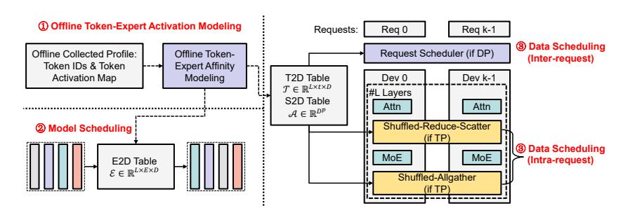

# 2 BACKGROUND

Mixture-of-Experts The Mixture-of-Experts (MoE) architecture is a conditional computation paradigm designed to scale model capacity without a proportional increase in computational cost [1]. Unlike dense models, where all parameters are activated for every input, an MoE model consists of a multitude of expert sub-networks (typically Feed-Forward Networks, FFNs) and a gating network (or router). For each input token, the gating network predicts a sparse combination of experts (e.g., the top-k experts) to which the token is dispatched. Only the selected experts are activated for computation. The most common gating function is the Top-K Gating, which selects the k experts with the highest scores. This design enables models to possess a vast number of parameters (e.g., trillions) while keeping the FLOPs per token roughly constant, as only a small, fixed number of experts (e.g., k = 2) are active per token. This has made MoE the de facto standard for building state-of-the-art large language models, such as the DeepSeek series [DeepSeek-AI](#page-10-3) [\(2024a;](#page-10-3)[b;](#page-10-1) [2025\)](#page-10-2), the GPT-OSS series [OpenAI et al.](#page-11-1) [\(2025\)](#page-11-1), and the Qwen series [Qwen-Team](#page-12-2) [\(2024\)](#page-12-2); [Yang et al.](#page-12-0) [\(2025\)](#page-12-0).

MoE Training Systems. There has been extensive research on optimizing systems of MoE training systems, including FastMoE [He et al.](#page-10-4) [\(2021\)](#page-10-4), FasterMoE [He et al.](#page-10-5) [\(2022\)](#page-10-5), TA-MoE [Chen et al.](#page-10-6) [\(2022\)](#page-10-6), SmartMoE [Zhai et al.](#page-13-1) [\(2023\)](#page-13-1), and FlexMoE [Nie et al.](#page-11-3) [\(2023\)](#page-11-3). However such optimizations can not directly translate to inference scenarios as inference is workload-sensitive and strongly emphasizes latency over throughput.

MoE Inference Systems. Integrated serving engines such as DeepSpeed-MII [Holmes et al.](#page-10-7) [\(2024\)](#page-10-7), TensorRT-LLM [NVIDIA,](#page-11-4) vLLM [Kwon et al.](#page-11-2) [\(2023\)](#page-11-2), and SGLang [Zheng et al.](#page-13-0) [\(2024\)](#page-13-0) have holistic optimization for LLM inference that spans serving schedulers (e.g., continuous batching), dedicated high-performance kernels, efficient parallelization, quantization, and elaborate compiler passes for graph-level optimizations. Built upon these general holistic optimizations for LLM inference, DeepSpeed-MoE [Rajbhandari et al.](#page-12-3) [\(2022\)](#page-12-3); [Singh et al.](#page-12-4) [\(2023\)](#page-12-4) and Tutel [Hwang et al.](#page-10-8) [\(2022\)](#page-10-8) specifically optimize MoE models' computation and communication. Following the design paradigm of DeepSpeed-MoE, popular industry and open-sourced inference engines like vLLM and SGLang also adopted expert parallelism deployment. Sem-MoE specializes in optimizing MoE parallelization (particularly EP) and inherits holistic optimizations from prior work.

MoE Load-balancing and Experts Re-grouping. Lina [Li et al.](#page-11-5) [\(2023\)](#page-11-5) probes the variation of expert hotness and allots non-uniform expert replicas to achieve load-balanced expert computation. Similar studies [Huang et al.](#page-10-9) [\(2023\)](#page-10-9) exist to pursue expert load balancing and mitigate other sources of MoE computing inefficiencies. EPS-MoE [Qian et al.](#page-11-6) [\(2025\)](#page-11-6) optimizes the computation of MoE FeedForward Network (FFN) modules by dynamically selecting the best backend implementation of GroupGemm and DenseGemm. DeepSeek also adopts EPLB (expert-parallelism load balancing)

in its real-world deployment [DeepSeek-AI](#page-10-1) [\(2024b\)](#page-10-1). ExFlow [Yao et al.](#page-13-2) [\(2024\)](#page-13-2) exploits the affinity between experts across adjacent layers to reduce remote routing and collocate closely related experts. Exflow only considers the model scheduling for MoE models, and requires a heavy allgather before the execution of each model layer, which significantly incurs memory pressure and extra communication overhead. MoETuner [Go & Mahajan](#page-10-10) [\(2025\)](#page-10-10) optimizes the MoE model serving by finding an optimal expert placement strategy to minimize inter-device communication.

MoE Offloading and Prefetching. Existing prediction-based work on MoE inference primarily focuses on prefetching offloaded experts and strategically saving GPU memories [Yi et al.](#page-13-3) [\(2023\)](#page-13-3); [Xue et al.](#page-12-5) [\(2024\)](#page-12-5); [Zhong et al.](#page-13-4) [\(2024\)](#page-13-4), though offloading can extend inference latency and is rarely used in latency-critical serving scenarios. In contrast, Sem-MoE focuses on the speculative reduction of communication overheads and exposes no risks to compromise latency. The work also constructs probabilistic models to predict the token-expert routing paths, while Sem-MoE's features modelling more comprehensive MoE information, i.e., intra-layer and inter-layer expert affinity and tokenexpert affinity, compared to prior work. Pre-gated MoE [Hwang et al.](#page-10-11) [\(2024\)](#page-10-11) modifies the MoE model architecture to predict the experts to route at the next layer. Sem-MoE requires no modification to MoE architecture.

Figure 2: The workflow of semantic parallelism in Sem-MoE.

