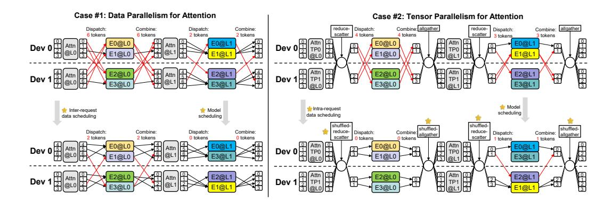

# 3.1 SEMANTIC PARALLELISM: OVERVIEW

Figure [2](#page-3-0) illustrates the overall workflow of *semantic parallelism* in Sem-MoE. Solid and dashed lines in the figure represent online and offline operations, respectively. The process begins with collecting token activation profiles, which include token identifiers and token-expert activation frequencies (Step ⃝1 in Figure [2\)](#page-3-0). Based on these profiles, Sem-MoE probabilistically model the token-expert routing likelihood and formulates a balanced token-expert co-clustering problem to generate scheduling hints. These hints are materialized as lightweight lookup tables: a token-to-expert-group table T [2](#page-3-1) , an expert-group-sequence-to-expert-group table A, and an expert grouping table E.

These scheduling tables drive the subsequent collaborative model-data scheduling. In the model scheduling phase (Step ⃝2 ), Sem-MoE utilizes the expert-to-device table E to reconfigure the placement of experts across all layers. In the data scheduling phase (Step ⃝3 ), different policies are applied depending on the parallelism strategy of the attention layers:

- For attention layers deployed with Data Parallelism (DP), Sem-MoE employs *inter-request* data scheduling. This policy reorders incoming requests according to the token-to-device table T to maximize request-expert-group affinity, thereby reducing the all2all communication overhead across DP domains.
- For attention layers partitioned via Tensor Parallelism (TP), Sem-MoE adopts *intra-request* data scheduling. This technique proactively shuffles tokens during the post-attention reduce-scatter operation, directing them to devices predicted to host their target experts in advance, thus minimizing potential token redistribution in subsequent MoE layers.

2We use expert group and expert cluster interchangeably.

Figure 3: An illustrating example of Sem-MoE. In Case #1 (Attention with DP), Sem-MoE reschedules requests and adjusts expert placement in Layer 1, reducing the number of remotely activated tokens (Remote activated tokens refer to the total number of tokens dispatched to and combined from remote devices) from 16 to 4. In Case #2 (Attention with TP), token rescheduling via shuffled-reduce-scatter and expert repositioning in Layer 1 reduce remote token activations from 12 to 2.

Figure 3 provides a concrete example of Sem-MoE's operation. In the baseline of Case 1 (top row), requests are distributed across DP ranks for independent attention computation. After expert assignment, tokens are dispatched to their respective expert devices via all2all operations. With Sem-MoE's inter-request scheduling, requests are intelligently mapped to DP ranks to enhance data locality, reducing all2all volume. This effect is further amplified by complementary model scheduling that optimizes expert placement. In Case 2, which involves TP for attention, tokens require reduction before dispatch and gathering after combination. Sem-MoE's intra-request scheduling predicts expert routes prior to the gating module, allowing tokens to be shuffled and scattered via a customized shuffled-reduce-scatter (SRS) operator. Combined with model scheduling, this approach achieves a higher local activation rate, significantly cutting down all2all traffic.

The inference acceleration achieved by Sem-MoE stems from the increased local activation rate enabled by collaborative model-data scheduling. Let G denote the number of devices, B the global batch size, S the sequence length, and k the number of experts activated per token. The communication volume of an all2all operation is given by  $\frac{\alpha kBS}{G}$ , where  $\alpha$  represents the fraction of non-local activations. By maximizing the local activation rate (i.e., minimizing  $\alpha$ ), Sem-MoE effectively trims communication overhead. The subsequent sections detail the offline modeling and online scheduling algorithms.

#### 3.2 Predicting Expert Routing Path

The routing choice of each MoE layer is given by the gating function:  $G_L(h_{L,j}) = \text{top-k}(\text{softmax}(\mathbf{W}_{L,g}h_{L,j}+\mathbf{b}_{L,g}))$ . Accurate prediction of token-expert routing patterns in advance is fundamental to Sem-MoE's scheduling optimization.

Context-Independent Token Activation Prediction. We observe that despite the theoretical dependence of expert routing on contextual semantics (as expressed by the gating function  $G_L(h_{L,j})$ ), in practice, tokens exhibit strong *context-independent* affinities to specific experts. Table 1 presents three metrics illustrating the activation concentration within DeepSeek-V2-Lite. By profiling the model on the ShareGPT Datasets (2023) dataset, we record the intermediate top-k activation statistics. We then calculate the F1-score for predicting the activated experts in each layer by relying solely on the most frequently activated (hottest) top-k experts. Additionally, we compute the cumulative hotness of these top-k experts alongside the maximum hotness observed among the remaining non-top-k experts. For all evaluated metrics, the P25, P50, and P75 quantiles are reported.

For any specific token, the distribution of expert activation across diverse contexts is remarkably skewed yet stable: a given token consistently routes to a narrow, static subset of *top-k experts*, leaving the majority of experts largely dormant. Throughout all layers of DeepSeek-V2-Lite, the median (p50) cumulative hotness of the top-k experts ranges from 0.833 to 0.976. In contrast, the maximum

| Layer ID | F1-score |       |       | Cum. Hotness (Top-k) |       |       | Max. Hotness (Non-top-k) |       |       |
|----------|----------|-------|-------|----------------------|-------|-------|--------------------------|-------|-------|
|          | p25      | p50   | p75   | p25                  | p50   | p75   | p25                      | p50   | p75   |
| 1        | 1.000    | 1.000 | 1.000 | 0.833                | 1.000 | 1.000 | 0.000                    | 0.042 | 0.071 |
| 6        | 0.833    | 1.000 | 1.000 | 0.767                | 0.917 | 1.000 | 0.000                    | 0.056 | 0.083 |
| 11       | 0.833    | 1.000 | 1.000 | 0.722                | 0.889 | 1.000 | 0.000                    | 0.056 | 0.083 |
| 16       | 0.667    | 0.833 | 1.000 | 0.708                | 0.889 | 1.000 | 0.000                    | 0.053 | 0.083 |
| 21       | 0.667    | 0.833 | 1.000 | 0.667                | 0.833 | 1.000 | 0.000                    | 0.050 | 0.074 |
| 26       | 0.667    | 0.833 | 1.000 | 0.667                | 0.833 | 1.000 | 0.000                    | 0.051 | 0.083 |

Table 1: Empirical study of token activate patterns based on DeepSeek-V2-Lite.

hotness recorded among the cold experts remains negligible—hovering near 0.05 at p50—which highlights a robust and pronounced disparity in activation. Finally, § A.2 in the Appendix expands upon this phenomenon across more scenarios, confirming its broad generalizability.

The above phenomenon enables effective prediction based solely on token identity. Through offline profiling on datasets such as *Sharegpt* using models including DeepSeek-V2-lite and Qwen3-30B-A3B, we construct a **token-to-expert activation table**  $\mathbf{T}^{(L)} \in \mathbb{N}^{t \times N^{(L)}}$  for each MoE layer L, where  $\mathbf{T}^{(L)}_{j,k}$  counts how frequently token  $x_j$  activates expert  $E_k^{(L)}$ . The corresponding routing probability is:  $\Pr(E_k^{(L)}|x_j) = \mathbf{T}^{(L)}_{j,k}/\sum_{k=1}^{N^{(L)}}\mathbf{T}^{(L)}_{j,k}$ . For efficient online inference, these probabilities are tabulated in a **token-to-expert confidence table**  $\mathcal{C}_p \in \mathbb{R}^{t \times N}$ . Out-of-vocabulary tokens are handled via nearest-neighbor matching in the embedding space.

The token-level predictions form the basis for scheduling in both Attention-DP and Attention-TP scenarios. For **Attention-DP**, the affinity of an entire request to an expert group is derived by aggregating the predictions of its constituent tokens, enabling request-level scheduling. For **Attention-TP**, the fine-grained token-level predictions are directly utilized, and are further refined by modeling inter-layer dependencies, as discussed in Section 3.3. This predictive framework provides the essential guidance for Sem-MoE's collaborative scheduling optimization detailed next.

#### 3.3 Model-Data Collaborative Scheduling

We illustrate how such expert-routing forecasting models can guide the co-dispatching of tokens and experts. Sem-MoE formulates the model-data co-scheduling problem as a 0-1 integer programming (ILP) -based co-clustering problem.

From the offline profiling, we obtain the number of deduplicated (un-deduplicated) tokens t (S), the number of experts per layer N, the number of clusters E (also EP degree), the token j frequency  $a_j$ , and the activation probability  $C_{p,jk}$  that token j activates expert k. The decision integer variables are set as the routing  $R_{ij} \in \{0,1\}$  of token j to cluster i, and the placement  $C_{ij} \in \{0,1\}$  of expert j to cluster i.

We aim to minimize an objective function  $\mathcal{L} = \theta \sum_{i=1}^{E} \left| \sum_{j=1}^{t} (\mathbf{R}_{ij} \mathbf{a}_j) - \frac{S}{E} \right| + (1-\theta) \sum_{i_1 \neq i_2} \left( \sum_{j=1}^{t} \sum_{k=1}^{N} (\mathbf{R}_{i_1j} \mathbf{C}_{i_2k} \mathbf{C}_{p,jk} \mathbf{a}_j) \right)$ , where the left part is to ensure that the token frequencies of different clusters as even as possible to promote load balancing among EP ranks, and the right part is to minimize the all2all communication overhead caused by remote activation (i.e., the summation of all the activations of tokens and experts belonging to different clusters), a factor  $\theta \in (0,1)$  controlling the percentage of two sub-objectives. We further require that each token belongs to only one class, each expert belongs to only one class, and the number of experts in each class is equal by adding hard constraints  $\sum_{i=1}^{E} \mathbf{R}_{ij} = 1$ , for  $j = 1 \dots t$ ,  $\sum_{i=1}^{E} \mathbf{C}_{ij} = 1$ , for  $j = 1 \dots N$ , and  $\sum_{j=1}^{N} \mathbf{C}_{ij} = \frac{N}{E}$ ,  $i = 1 \dots t$ .

The above ILP problem is difficult to solve directly using LP solvers, given a large number of intermediate variables introduced in the linearization process. Sem-MoE provides an alternating optimization algorithm. It can quickly obtain a feasible solution while ensuring load balancing. The detailed co-clustering algorithm can be referred to in § B in the Appendix. The solution can then be applied to offline model scheduling and online inter-/intra-request data scheduling.

**Model scheduling.** Before deployment, Sem-MoE adjusts the expert placement layout according to the solved C, placing expert j to device k if  $C_{jk} = 1$ . Accordingly, Sem-MoE shuffles the column of the gate matrix, thereby realizing a transparent expert re-distribution.

Data scheduling: Attention-DP Scenarios. In Attention-DP setups, where requests are processed independently across DP ranks, scheduling operates at the *request granularity*. We use the variable  $S_r \in \llbracket E \rrbracket$  to denote the cluster to which request r needs to be scheduled. Once the scheduling of tokens is determined, the scheduling of the request r can be determined by aggregating the routing result of its tokens,  $S_r = \arg\max_{j \in \llbracket E \rrbracket} \sum_{i \in r} R_{ij}$ . Meanwhile, to achieve runtime load balance, Sem-MoE realizes a workload-aware balanced request scheduling algorithm. For continual E requests, Sem-MoE guarantees these requests are distributed to all E ranks, such that the loads of all ranks would not skew in decoding stage. Detailed algorithm could be referred to in Algorithm 2 in § B. This request-level scheduling minimizes cross-device communication by collocating entire requests with their most likely expert group (i.e., DP rank).

Data Scheduling: Attention-TP Scenarios. In Attention-TP setups, the attention computation itself is distributed, requiring fine-grained, token-level scheduling. Here, we enhance the basic token-expert prediction with inter-layer expert-expert affinity. We observe that expert selections exhibit Markovian dependencies across layers: the experts chosen at layer L depend on selections at previous layers. We model this using an n-gram device transition model:  $\Pr(D_k^{(L)}|D^{(L-1)},\ldots,D^{(L-n)})$  where  $D^{(l)} \in \{1,\ldots,Q\}$ , where  $D^{(l)} \in \{1,\ldots,Q\}$  denotes the device index of the expert selected at layer l. These transitions are stored in an expert-group-sequence-to-expert-group confidence table  $\mathcal{A}_p$  (we use 2-gram in practice). Together with the token routing matrix R, we can achieve more accurate proactive scheduling during the TP communication phase. The detailed algorithm can be found in Algorithm 3.

#### 3.4 IMPLEMENTATION AND SYSTEM OPTIMIZATION

Sem-MoE is implemented as a plug-in module for the SOTA LLM inference engine SGLang. Our system comprises approximately 5,000 lines of Python code, along with several custom Triton OpenAI kernels for high-performance communication operations.

To support affinity-aware scheduling in the Attention-DP scenario, we extend SGLang's request scheduler to incorporate token–expert affinity information derived from our prediction models. This enables the runtime to batch requests with similar expert activation patterns onto the same device, minimizing cross-device communication.

For the Attention-TP scenario, we implement two fused communication primitives: shuffled-reduce-scatter (SRS), and shuffled-allgather (SAG). These kernels integrate speculative token shuffling—based on predicted expert routes—into standard reduce-scatter and allgather collectives. The shuffling logic relies on an optimized argsort kernel, which outperforms the native PyTorch implementation by 25%. The overall overhead of embedding shuffling into the ring-based communication schedule is negligible, measured at approximately 1%. Furthermore, for efficient all2all, Sem-MoE integrates frontier MoE communication libraries DeepEP Zhao et al. (2025).

By combining offline expert reorganization with online token- and request-level scheduling, Sem-MoE achieves significant reductions in all2all communication volume, leading to improved end-to-end inference throughput in both DP and TP configurations.

#### 4 EXPERIMENT

### 4.1 EXPERIMENTAL ENVIRONMENTS

We evaluate Sem-MoE on an 8-GPU server, representing commercial GPU servers unified for both training and inference, which are configured with 96GB-HBM per GPU and fast homogeneous interconnects. GPUs inside a server can communicate with each other at a premium bandwidth (specialized network with over 400GB/s bandwidth). The server is equiped with two 44-core Intel CPUs and 2TB DDR5 memory.

Figure 4: Attention-DP Scenario: Inference throughput under TTFT and E2E latency SLOs.

#### 4.2 Models, Datasets and Workload Traces

**Models.** We choose two types of typical MoE models for evaluation, i.e., Qwen3-30B-A3B with 128 experts per layer and DeepSeek-V2-Lite with 64 routed experts per layer. Both Qwen3-30B-A3B and DeepSeek-V2-Lite are prevailing open-sourced MoE models.

**Datasets.** We use the following three representative datasets *MMLU* Hendrycks et al. (2021b;a), *lmsys-chat-1m* Zheng et al. (2023), *ShareGPT-Vicuna-unfiltered* Datasets (2023). In the experiments, we only focus on the prompt parts of these datasets. These datasets contain data from different domains, representing real-world user request patterns, and can effectively evaluate the affinity of requests and tokens from different domains for experts.

#### 4.3 Baselines and Performance Metrics

We select SGLang and MoETuner as the baselines to compare, representing the SOTA LLM inference engine and SOTA MoE model scheduling technique.

**SGLang**: SGLang Zheng et al. (2024) is a prevailing open-source LLM inference framework, incorporating numerous optimizations, including but not limited to continuous batching, paged attention, flash attention, radix-attention, advanced quantization, etc. SGLang declares optimizations for MoE models with high-performance, fused triton kernels OpenAI, supporting DP and TP for attention layers and EP for MoE layers. SGLang is the SOTA open-sourced LLM inference engine, which we set as a strong baseline to compare.

**MoETuner:** MoETuner Go & Mahajan (2025) is an optimization framework that enhances MoE model serving performance by finding an optimal expert placement strategy. It addresses critical bottlenecks in expert parallelism, namely imbalanced token processing loads across GPUs and skewed inter-GPU communication, which lead to significant tail latency. The core of MoETuner is an Integer Linear Programming (ILP) formulation that leverages predictable token routing dependencies across layers. It jointly optimizes expert-to-GPU assignments to balance computational workloads and minimize communication costs, thereby reducing end-to-end execution time. We embed MoETuner into SGLang as a comparable baseline.

**Metrics:** To mitigate performance fluctuating, we set the input length and output length fixed. Then we vary the request rate from 10 to 175 req/s, and observe the following metrics. **Throughput** is the number of tokens (tokens/s) that an inference system can process per unit time. **TTFT** (**Time to First Token**) measures the duration between the request's arrival and the first token's generation time. **E2E** (**End-to-End**) **Latency** measures the duration between the request's arrival and the last token's generation time. Following prior work Wu et al. (2024b;a), we set the latency SLO as  $5 \times$  of the latency under the lightest input load (minimal request rate). For each dataset, we use 20% of the data to train the token activation prediction model and generate the expert placement table, and the remaining 80% is used to sample experimental requests.

| Models           | Input Length | p99 TTFT (ms) |          |         | Median E2E Latency (ms) |          |         |
|------------------|--------------|---------------|----------|---------|-------------------------|----------|---------|
| 11100015         | mput Zengui  | SGLang        | MoETuner | Sem-MoE | SGLang                  | MoETuner | Sem-MoE |
| DeepSeek-V2-Lite | 256          | 84.87         | 80.96    | 75.63   | 617.87                  | 604.46   | 603.10  |
|                  | 512          | 98.10         | 92.17    | 88.69   | 609.81                  | 602.02   | 599.89  |
|                  | 1024         | 111.19        | 119.76   | 100.74  | 608.96                  | 606.54   | 604.45  |
| Qwen3-30B-A3B    | 256          | 85.72         | 87.24    | 74.46   | 758.60                  | 763.97   | 750.26  |
|                  | 512          | 104.76        | 101.86   | 83.87   | 766.80                  | 759.41   | 759.16  |
|                  | 1024         | 107.73        | 107.36   | 103.69  | 769.83                  | 764.16   | 762.30  |

Table 2: Attention-TP Scenario: TTFT and E2E latency under different input lengths.

#### 4.4 END-TO-END INFERENCE PERFORMANCE

Figure 4 shows the end-to-end performance evaluation of Sem-MoE and two baselines.

Attention-DP Scenario. For the attention-DP scenario, requests are scheduled to different DP ranks for attention and synchronized at MoE layer. The latency of each layer is determined by the slowest DP(EP) rank. Thus we use token throughput to measure the overall performance in attention-DP. We draw a latency-throughput curve to measure the highest throughput a system can achieve under pre-defined SLOs, shown in Figure 4. Data points near the bottom-right corner are better. For Deepseek-V2-Lite, Sem-MoE achieves throughput improvements of 31% and 221% against SGLang with DeepEP under TTFT and end-to-end latency SLO constraints, and 32% and 278% against MoETuner, respectively. For Qwen3-30B-A3B, Sem-MoE's throughput improvement peaks at 98% and 11% against SGLang under SLO constraints, while also achieving gains of 35% and 32% against MoETuner. As the request rate increases continually, baselines stock a bunch of unprocessed requests, yielding a steeper curve, resulting in the above high throughput improvement (221% and 278%). The results demonstrate that Sem-MoE can obtain certain performance gains by scheduling the requests across different DP ranks and co-placing the experts in appropriate devices.

Attention-TP Scenario. For the attention-TP scenario, there is no scheduler for a single inference instance, as different TP ranks receive the same input. Meanwhile, latency becomes a main concern in TP settings. Therefore, we set the request rate to 1 req/s and vary the input sequence length to observe the TTFT and end-to-end latency directly as shown in Table 2. For Deepseek-V2-Lite, Sem-MoE outperforms the best baseline in TTFT by 12.21%, 10.60%, and 18.89% under input lengths of 256, 512, and 1024. For Qwen3-30B-A3B, the performance optimization ratio is 17.16%, 24.90%, 3.80%. Thanks to the load-balance and inter-layer communication optimizing effect, MoETuner gains performance improvement in some cases, yet may slow down in the other cases. Model-data collaborative scheduling can bring holistic performance boosting in all tested scenarios. The speedup of TTFT also translates to the shrinking of end-to-end inference latency, just as shown in Table 2. We would delve into the execution of MoE layers to analyze the rationale behind the breakdown of the inference speedup.

**Extensive Experiments.** We also conduct performance evaluation using one additional model (Moonlight-16B Liu et al. (2025)), and the results are consistent with the above observations, which are provided in § C.2.

