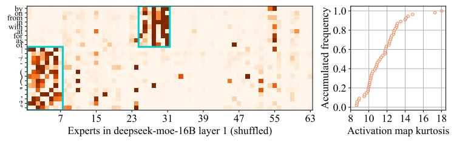
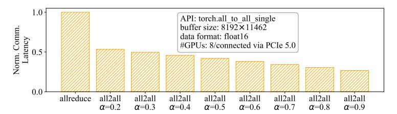

# B ALGORITHM FOR THE MODEL-DATA CO-SCHEDULING SOLVER

Algorithm [1](#page-16-0) describes the model-data co-scheduling alternating optimization algorithm in Sem-MoE. The algorithm achieves optimal performance by alternating between optimizing the scheduling of requests and the placement of experts. Initially, requests are clustered based on their affinity to experts to determine their scheduling (line 44). In each iteration, the algorithm alternates between optimizing expert placement with fixed requests and request scheduling with fixed experts. For optimizing expert placement, experts are first sorted by their hotness in descending order. Given the current request scheduling and expert placement, the affinities between experts and the cluster's experts/requests are computed and aggregated via weights αe and βe, which is adjusted by the cluster's current load to derive a final affinity score (lines 11-13). The expert is assigned to the highest-scoring cluster, with saturated clusters masked (line 14). The algorithm then performs f t steps fine-tuning rounds, randomly selects two clusters and swaps their experts if it improves the affinity score (lines 20-25). Request scheduling optimization is similar to expert placement. The req-req affinity and req-expert affinity for each cluster are calculated, aggregated to obtain an affinity score, and the request is scheduled to the cluster with the highest score (lines 28-42).

By now, the token-device scheduling table T , token-device scheduling confidence table Tp, and expert-device scheduling table E are generated. After the scheduling table E is constructed, the experts at each layer need to be rearranged according to the scheduling table during online inference service deployment. In addition, the Sem-MoE rearranges the gating module by column to implement transparent expert shuffle. The semantics of other layers are not affected. The rearranged experts are highly boxed, so that the token activation at each layer is de-cohesive, and the redundant network communication overhead caused by dispersive activation is reduced.

3Kurtosis is a measure of the tailedness of a distribution. High Kurtosis indicates a token favors several fixed experts during multiple occurrences.

(a) Example of expert activations for requests in different topics (24th layer of Qwen3-30B-A3B profiled using the MMLU dataset), with t-SNE dimensionality reduction.

(b) Example of intra-layer token-expert activation map (1st MoE layer of DeepSeek-V2-Lite profiled using the Sharegpt dataset). Darker color in the map indicates higher activation frequency or stronger correlation.

(c) Example of inter-layer expert-expert correlation map (4th/5th MoE layer of Mixtral-8x7B profiled using the LongBench dataset). Darker color in the map indicates stronger correlation.

(d) Example of perfromance of allreduce and all2all under different local activation ratio ( $\alpha$ ).

Figure 6: Conjugacy illustration and collective communication micro-benchmark.

