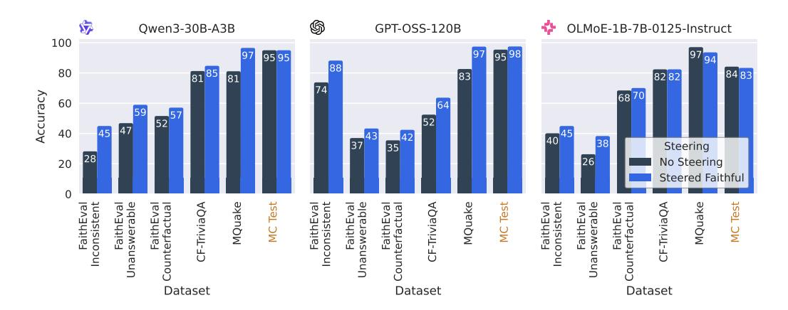

# 4.1 RAG DOCUMENT FAITHFULNESS

Ensuring that an LLM's response remains grounded in the retrieved documents, rather than drifting into unsupported hallucinations, is critical for the reliability of Retrieval-Augmented Generation (RAG) systems [\(Niu et al.,](#page-12-1) [2024;](#page-12-1) [Ming et al.,](#page-12-2) [2025\)](#page-12-2). In this section, we steer the model to be more faithful to the presented document and evaluate the impact.

3The resulting scores si lie in (−∞, 0), and in practice are typically bounded between −15 and 0.

Figure 2: Comparison of steered versus non-steered model performance on faithfulness benchmarks. Accuracy is the proportion of examples in which the response remains faithful to the content of the provided document. The MC Test benchmark serves as a control dataset to ensure that the model's general QA performance remains stable after steering. Modifying expert routing during inference improves performance on faithfulness benchmarks. (More models in Fig. [A.3\)](#page-21-0)

