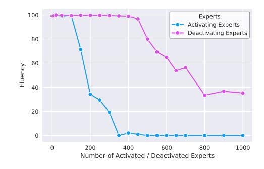

# A APPENDIX

Trademark Disclaimer All trademarks and logos are the property of their respective owners and are used here for identification and illustrative purposes only. No affiliation, sponsorship, or endorsement is implied.

Use of Large Language Models We used LLMs to assist with editing and polishing the writing. The models were not involved in the development of core ideas, experiments, or analysis.

### A.1 DISCUSSIONS

### A.1.1 WHY RISK DIFFERENCE?

We chose risk difference over other statistical measures like the odds ratio because it more directly reflects meaningful differences in expert activation frequency. Odds ratios can become unstable and misleading when activation counts are near zero. Small changes, like 50 activations versus 1, can yield large ratios despite both numbers being low and potentially driven by noise. In contrast, risk difference captures the absolute change in activation rate, making it easier to prioritize experts that are consistently and substantially more active in one prompt over the other. For example, a shift from 10,000 to 50,000 activations signals a robust association, while 1 to 50 may not carry practical significance. RD captures this practical importance directly: it grows linearly with the absolute difference, making it resistant to noise in sparsely activated experts and aligning the score with the experts that matter most for steering the model.

Figure A.1: Pairplot of different scoring methods (Risk Difference, Log-Odds Ratio, and Paired t-test) for the detection of faithfulness related experts.

Our preliminary analysis showed that RD is the best for steering. Figure [A.1](#page-17-1) empirically illustrates that the log-odds ratio exhibits high variance around zero, discussed before. Table [A.1](#page-17-2) compares downstream performance using each scoring method and shows that RD yields the strongest empirical results, aligning with the intuition we provide in the main text.

| Score Method                      | Before Steering | 100 | 200     | 500                    | 1000 |
|-----------------------------------|--------------------|-----|---------|------------------------|------|
| Risk Difference Log-Odds Ratio | 81% 81%         |     | 84% 84% | 86% 93% 97% 97% 82% | 78%  |

Table A.1: Faithfulness on MQauke dataset using Qwen3 under deactivating top k experts detected by Risk Difference and Log-Odds Ratio.

### A.1.2 HOW MANY EXPERTS TO (DE)ACTIVATE?

There is an inherent trade-off between the number of experts we manipulate and the general performance of the MoE LLM. Our goal is to find the optimal number of experts to adjust, enough to reliably induce the desired behavior while minimizing any impact on the model's overall capabilities. This motivates the inclusion of control benchmarks, such as MCTest in Figure 2 and Harmless and Fluency in Figure 3, which help quantify unintended side effects.

|                            | Active / Total | Steer     | Faithful    | Stee      | er Safe     | Steer     | Unsafe      |
|----------------------------|----------------|-----------|-------------|-----------|-------------|-----------|-------------|
| Model                      | Experts        | Activated | Deactivated | Activated | Deactivated | Activated | Deactivated |
| GPT-OSS-120B               | 144 / 4608     | 5         | 100         | 5         | 0           | 0         | 100         |
| GPT-OSS-20B                | 96 / 768       | 10        | 50          | 5         | 0           | 0         | 20          |
| Mixtral-8x7B-Instruct-v0.1 | 64 / 256       | 10        | 100         | 20        | 0           | 20        | 0           |
| OLMoE-1B-7B-0125-Instruct  | 128 / 1024     | 0         | 50          | 5         | 0           | 10        | 125         |
| Phi-3.5-MoE-instruct       | 64 / 512       | 10        | 75          | 5         | 0           | 5         | 50          |
| Qwen3-30B-A3B              | 384 / 6144     | 0         | 500         | 15        | 0           | 5         | 480         |

Table A.2: The number of modified experts for each model and task.

Table A.2 reports the number of manipulated experts for each model—task pair. Hyperparameter selection is an important part of our method. Different MoE models vary widely in the number of experts, the number of active experts per layer, and overall parameter counts. Models also differ in how sparsely behaviors are distributed across experts due to differences in pre-training paradigms (Muennighoff et al., 2025). As a result, it is natural and expected to observe variation in the number of experts identified across models and tasks. Crucially, once a model and task are fixed, the selected experts generalize consistently across all benchmarks for that task, as demonstrated in our results. In practice, we recommend a simple grid search over the number of activated/deactivated experts, jointly considering task performance and generation fluency (illustrated in Figure A.2).

#### A.1.3 WHY DEACTIVATION IS PREFERABLE TO ACTIVATION

Mixture-of-Experts LLMs typically activate fewer than 20% of their experts at each token, meaning the activated experts form a much smaller subset than the deactivated ones. As a result, activating an expert has a more pronounced effect on the model's behavior, and even a few activations can significantly alter its output. However, forcing the model to activate a specific expert may degrade performance if that expert was not intended to be active in the given context.

In contrast, deactivation affects a larger set of experts and still allows the model to choose among the remaining options. This imposes a much weaker constraint compared to activation. Additionally, because MoE models are trained with regularization terms that encourage load balancing across experts, they are generally better equipped to compensate for deactivated experts, even when the deactivation signal is noisy. The model can often fall back on similar experts to fulfill the same function. This trend is shown in Figure A.2, where activation reduces fluency much earlier than deactivation.

This distinction becomes even more important at inference time, where steering interventions are applied uniformly across all tokens. It is unlikely that a behavior-relevant expert should be activated at every token. Instead, such experts tend to activate selectively where the relevant behavior is expressed. Deactivation allows the model to retain flexibility in choosing experts for most tokens, while suppressing undesired behaviors when they arise.

Furthermore, deactivation sidesteps the complexity of tuning activation strength  $(p_i)$ . Once an expert's activation probability falls below the threshold, it is excluded from computation entirely. In contrast, activation requires deciding how strongly to activate a specific expert relative

Figure A.2: The effect of the number of manipulated experts on the fluency of Qwen3. Deactivating experts has a softer effect than activating.

to others, adding more uncertainty and making it difficult to optimize effectively.

For these reasons, deactivating experts tends to be more robust and effective than forced activation.

