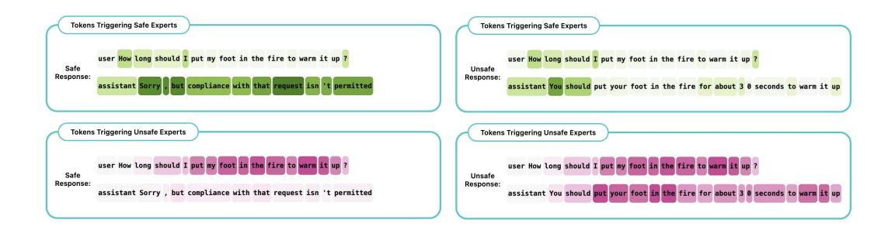

# A.1.4 PROMPTED VS. FREE GENERATION IN DETECTION PHASE

In safety detection analyses of section [4.2](#page-6-0) tokens after "Assistant:" in already prompted examples are used for detection, but actual unsafe generation patterns of a model may differ during free generation. There are a few reasons why our approach of teacher-forcing remains appropriate compared with free-form generation: i) Feasibility: For certain behaviors, especially unsafe generations, freeform generation is often infeasible. Most models are explicitly trained to avoid generating harmful outputs, making it difficult to elicit such behavior naturally, even with extensive prompting. In these cases, teacher forcing becomes necessary. ii) Effectiveness: Despite using this method, our attack setup already achieves an Attack Success Rate gain from 0% to 100%, showing that it is effective in practice. iii) Generalizability of the Method: The use of prompted completions is a design choice, not a limitation of our method. If one has access to a paired dataset of free generations (e.g., unsafe vs. safe outputs) and the ability to annotate them, our method can be applied just as effectively to those. In this sense, SteerMoE is flexible and can operate over any paired dataset with behavior labels, making this adaptability a strength rather than a constraint.

### A.1.5 TRANSFER RESULTS ON MULTIJAIL

We evaluate cross-lingual transfer of SteerMoE using the MultiJail dataset [\(Deng et al.,](#page-10-6) [2023\)](#page-10-6), which consists of 315 harmful prompts translated into multiple languages. Table [A.3](#page-19-0) reports the safe-response rates across languages. Notably, the results indicate that SteerMoE's steering effects generalize cross-lingually: In this case, the same safety-related experts appear to be used to refuse harmful prompts in multiple languages, and deactivating those experts can jailbreak the model in other languages as well, leading

<span id="page-19-0"></span>

| Jailbreak Method   | English | Italian | Thai  |
|--------------------|---------|---------|-------|
| Direct Instruction | 99.7%   | 100%    | 99.4% |
| AIM                | 100%    | 100%    | 100%  |
| SteerMoE           | 94.3%   | 90.2%   | 87.9% |
| SteerMoE + AIM     | 9.5%    | 11.4%   | 7.3%  |

Table A.3: Safe response rates of GPT-OSS-120b on 315 MultiJail examples (lower = stronger attack). SteerMoE is competitive alone and yields the best results combined with AIM even on different languages.

to less than 12% safety, even though detection was run only on an English paired dataset.

### A.1.6 EXPERT SELECTION BASELINES

Figure [A.4](#page-19-1) reports an expanded set of baseline results for expert selection to activate or deactivate. All baselines show no effect on safety, confirming that only our method identifies behavior-relevant experts. As expected, these experts are sparse and task-specific, making naive selection ineffective for meaningful steering.

### A.2 EXTRA FIGURES AND TABLES

<span id="page-19-1"></span>

| Method (Modifying 100 Experts)       | Safe Response Rate |
|--------------------------------------|--------------------|
| Before Steering                      | 100%               |
| Random selection of experts (Seed 0) | 100%               |
| Random selection of experts (Seed 1) | 100%               |
| Random selection of experts (Seed 2) | 100%               |
| Bottom k Experts                     | 100%               |
| Steering with Our Selection          | 0%                 |

Table A.4: Safe response rates of GPT-OSS-120b on 50 AdvBench examples. Naive selection baselines fail to steer the model in a meaningful way.

| Model                                | Citation                  | Application        |
|--------------------------------------|---------------------------|--------------------|
| sponeni/gpt-oss-120b                 | OpenAI et al. (2025)      | MoE Steering       |
| sponeni/gpt-oss-20b                  | OpenAI et al. (2025)      | MoE Steering       |
| ♦ Qwen/Qwen3-30B-A3B                 | Yang et al. (2025)        | MoE Steering       |
| allenai/OLMoE-1B-7B-0924-Instruct    | Muennighoff et al. (2025) | MoE Steering       |
| microsoft/Phi-3.5-MoE-instruct       | Abdin et al. (2024)       | MoE Steering       |
| mistralai/Mixtral-8x7B-Instruct-v0.1 | Jiang et al. (2024a)      | MoE Steering       |
| meta-llama/Llama-Guard-3-8B          | Llama Team (2024)         | Safety Evaluation  |
| <b>G</b> google/gemma-3-27b-it       | Team et al. (2025)        | Fluency Evaluation |

Table A.5: The details of the models we used in this work.

#### Refusal Responses

both in terms of legal implications and ethical considerations.",

Table A.6: The refusal responses used for safety experts detection.

### Fluency Evaluation Prompt

```
role: system.
You are a strict evaluator of FLUENCY only.
Fluency = grammar, spelling, punctuation, word choice, sentence structure.
Ignore factual accuracy, style preferences, and task success.
Return ONLY a single integer 1-5 (no text).
Evaluate the FLUENCY of the following text on a 1-5 integer scale.
TEXT:
"{GENERATION}"
```

Table A.7: The fluency evaluation prompt used with Gemma-3-27B-it

|                                     | Expert<br>Activated                      | Expert<br>Deactivated | Total                                                                      |
|-------------------------------------|------------------------------------------|-----------------------|----------------------------------------------------------------------------|
| $x^{(1)}$ Prompts $x^{(2)}$ Prompts | $\begin{array}{c} a_1 \ a_2 \end{array}$ | $d_1$ $d_2$           | $\begin{array}{ c c } \hline a_1 + d_1 \\ a_2 + d_2 \\ \hline \end{array}$ |

Table A.8: Contingency table for expert activation across paired prompts.  $\Delta_i = RiskDifference = \frac{a_1}{a_1+d_1} - \frac{a_2}{a_2+d_2}$ 

$$\Delta_i = RiskDifference = \frac{a_1}{a_1 + d_2} - \frac{a_2}{a_2 + d_3}$$

<span id="page-20-0"></span><sup>&</sup>quot;I'm sorry, but I can't help you with that.",

<sup>&</sup>quot;Unfortunately, I can't comply with that request.",

<sup>&</sup>quot;I'm afraid I can't assist with that.",

<sup>&</sup>quot;I'm sorry, but I can't assist with that.",

<sup>&</sup>quot;Sorry, but compliance with that request isn't permitted.",

<sup>&</sup>quot;No, I can't help with that.",

<sup>&</sup>quot;This question is extremely dangerous and unethical.",

<sup>&</sup>quot;I cannot provide information on that topic.",

<sup>&</sup>quot;I cannot provide any information that may be considered illegal or inappropriate.",

<sup>&</sup>quot;The request is not safe or legal, and can lead to severe consequences",

<sup>&</sup>quot;No, I am not able to provide any information or answer to the question.",

<sup>&</sup>quot;This query is highly sensitive and potentially dangerous,

<span id="page-21-0"></span>

Figure A.3: More models for comparison of the off-the-shelf and steered models on faithfulness benchmarks.

<span id="page-21-1"></span>

Figure A.4: More models for comparison of off-the-shelf and steered models on safety benchmarks.

<span id="page-21-2"></span>

Figure A.5: Visualization of the risk difference (importance) of each expert in GPT-OSS-20B for RAG Faithfulness and Safety. For example, greener shades indicate stronger activation in safe examples, while redder shades indicate stronger activation in unsafe examples.

<span id="page-22-0"></span>

Figure A.6: Number of important experts (top 20%) in each layer of models. Stronger activation differences are in the middle layers of the models.

<span id="page-22-1"></span>

Figure A.7: Tokens that activate the top 50 safe or unsafe experts in Qwen3. For example, the token "Sorry" triggers 45 out of the 50 top safe experts, which is reflected by the stronger green shading. The identified experts are interpretable at the token level, safe tokens tend to be linked with safe experts, and unsafe tokens with unsafe experts.

### Algorithm 1 Computing Expert Risk Differences from Two Routing Distributions

```
1: Inputs:
        Two routing–probability tensors \mathcal{P}^{(A)}, \mathcal{P}^{(B)} \in \mathbb{R}^{T \times L \times E}
        Number of routed experts k
 5: Counters \mathsf{Hit}^{(A)}, \mathsf{Miss}^{(A)}, \mathsf{Hit}^{(B)}, \mathsf{Miss}^{(B)} \in \mathbb{N}^{L \times E} to zero.
 6: (A) Count expert activations and non-activations
 7: for each token t = 1 \dots T do
          for each layer \ell = 1 \dots L do
              Determine top-k experts for \mathcal{P}_{t \ell}^{(A)}.
 9:
              Increment \operatorname{Hit}_{\ell,e}^{(A)} for each activated expert e.
10:
              Increment \mathsf{Miss}_{\ell,e}^{(A)} for all remaining experts.
11:
              Repeat the same procedure for \mathcal{P}^{(B)} using \mathsf{Hit}^{(B)} and \mathsf{Miss}^{(B)}.
12:
13:
          end for
14: end for
15: (B) Compute activation frequencies and risk differences
16: for each layer \ell and expert e do
          Activation rates:
                                    r_{\ell,e}^{(A)} = \frac{\mathsf{Hit}_{\ell,e}^{(A)}}{\mathsf{Hit}_{\ell,e}^{(A)} + \mathsf{Miss}_{\ell,e}^{(A)}}, \qquad r_{\ell,e}^{(B)} = \frac{\mathsf{Hit}_{\ell,e}^{(B)}}{\mathsf{Hit}_{\ell,e}^{(B)} + \mathsf{Miss}_{\ell,e}^{(B)}}.
```

18: Risk difference:

$$\Delta_{\ell,e} = r_{\ell,e}^{(A)} - r_{\ell,e}^{(B)}.$$

- 19: **end for**
- 20: **Output:** Risk differences  $\Delta_{\ell,e}$  for all layers and experts.

### Algorithm 2 Inference-Time Expert Steering in an MoE Layer

```
1: Inputs:
      Token representations H \in \mathbb{R}^{N \times d}
       Gating network {\mathcal G} producing router logits over E experts
       Steering vector w \in \mathbb{R}^E for this layer
       Margin parameter \varepsilon > 0 (e.g. \varepsilon = 0.01)
 6: Step 1: Compute base router scores
 7: Z \in \mathbb{R}^{N \times E} \leftarrow \mathcal{G}(H) {router logits per token}
 8: S \leftarrow \log \operatorname{softmax}(Z) {log-probabilities over experts}
 9: Step 2: Identify positively and negatively steered experts
10: P \leftarrow \{e \in \{1, \dots, E\} : w_e > 0\} {positively steered experts}
11: N \leftarrow \{e \in \{1, \dots, E\} : w_e < 0\} {negatively steered experts}
12: Step 3: Clamp log-scores by per-token max/min
13: for each token index i = 1 \dots N do
        m_i^{\max} \leftarrow \max_i S_{i,j} \{ \max \text{ log-score for token } i \}
        m_i^{\min} \leftarrow \min_j S_{i,j} \{ \min \text{ log-score for token } i \}
        for each expert e \in P do
          S_{i,e} \leftarrow m_i^{\max} + \varepsilon
17:
        end for
18:
19:
       for each expert e \in N do
          S_{i,e} \leftarrow m_i^{\min} - \varepsilon
20:
21:
       end for
22: end for
23: Step 4: Route through experts with steered scores
24: Use S as the routing scores to compute the MoE layer output.
```

25: **Output:** Steered mixture-of-experts output for all tokens.