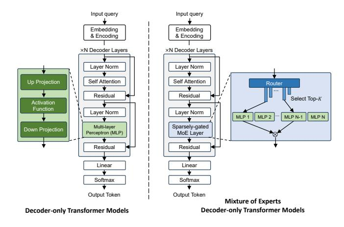

# 1 Introduction

Transformer-based Large Language Models (LLMs) have become central to a wide range of applications, delivering state-of-theart performances across diverse domains [\[26,](#page-13-0) [27,](#page-13-1) [29,](#page-13-2) [34,](#page-14-0) [44,](#page-15-0) [51,](#page-15-1) [64,](#page-15-2) [80,](#page-16-1) [84,](#page-16-2) [86,](#page-16-3) [90\]](#page-16-4). To improve various task performances, LLMs are reaching unprecedented scales, with models such as LLaMA 3.1 (405B) [\[34\]](#page-14-0), DeepSeek-V3 (671B) [\[27\]](#page-13-1), and Kimi-K2 (1T) [\[78\]](#page-16-5) pushing the boundaries of model size and performance. Training and deploying these large models present significant challenges to the underlying infrastructure, particularly in terms of memory capacity and compute capability.

1

Figure 1: Architectures of dense transformer-based LLM (left) and Mixture of Experts (MoE) LLM (right).

Among various efforts to reduce the inference cost, exploiting activation sparsity offers a promising solution by directly reducing the computational and data movement demands. One of the most widely adopted approaches is the Mixture of Experts (MoE) architecture [4, 25, 27, 30, 32, 51, 60, 64, 84], which replaces conventional dense Multi-Layer Perceptron (MLP) blocks with a pool of expert MLPs that are sparsely selected during inference, as illustrated in Figure 1. MoE models utilize a routing mechanism to activate only a small subset of experts per token during inference. Since MLP dominates the overall model size, this selective activation leads to substantial savings in both inference and training costs [54]. As a result, the MoE architecture has become a preferred choice in many state-of-the-art LLMs.

While MoE models reduce practical memory access and computation requirements, they do not address the overall size of the model. The rapid growth in model size necessitates high-bandwidth and high-density memory technologies. Along this line, die-stacked High Bandwidth Memory (HBM) has emerged as the dominant solution in high-performance GPUs such as the NVIDIA A100 and H100 [17, 18], achieving high density per footprint with six stacked DRAM dies and 1024-bit I/O interfaces, delivering up to 800 GB/s of memory bandwidth per stack to the GPU compute die via silicon interposers. Although HBM offers increased bandwidth compared to conventional 2D DRAMs, the bandwidth available through the interposer remains insufficient. This limitation often leads to underutilization of GPU computing resources, particularly for memory-bound operations such as LLM decoding [67]. To mitigate the memory wall between HBM and the GPU, recent approaches have adopted near-memory processing (NMP) for LLM inference [38, 43, 57, 67, 69, 89, 92]. Prior studies [43, 67, 89, 92] have utilized NMP units to compute attention during the decoding stage by placing the computing logic on the HBM base die. However, the NMP on the base die still suffers from limited bandwidth due to vertical data traversal through a constrained number of TSV I/O connections. To mitigate this limitation, prior work has integrated compute units directly into the memory dies to exploit extensive internal memory bandwidth [57, 59, 66, 67, 69, 92], commonly known as processing in memory (PIM). However, compute logic

embedded in DRAM dies suffers from expensive intra-memory data transmission and large performance-area-power (PPA) overhead of implementing logic using the DRAM technology, as DRAM dies are inherently optimized for storage rather than computation [59]. Moreover, integrating logic and memory on the same die introduces additional thermal concerns and manufacturing overheads.

As a strong alternative to HBM, Monolithic 3D-Stackable DRAM, referred to as Mono3D DRAM throughout this paper, has recently emerged as a promising solution for continued DRAM scaling beyond sub-10-nanometer technologies. It offers improved vertical integration through a cost-effective fabrication process that eliminates costly TSV and bonding processes, gaining growing attention in both industry and academia [16, 36, 46, 83]. By fabricating multiple additional DRAM layers sequentially on the same wafer, Mono3D DRAM achieves higher density without a proportional increase in cost per bit, making it an attractive candidate for future high-capacity memory systems. Compared to HBM-based NMP, Mono3D DRAM-based NMP introduces key architectural benefits. Mono3D DRAM offers significantly greater internal bandwidth due to its monolithic construction within DRAM and direct face-to-face hybrid bonding between DRAM and logic dies, leveraging the full chip area. On the other hand, TSVs in HBM require a certain area on both the logic base die and DRAM dies as vertical interconnects. The TSV area cannot be unbounded, thus limiting the HBM internal bandwidth. Moreover, hybrid bonding pitch of 1  $\mu m$  [9] has around 5× finer pitch for vertical interconnects than HBM [88], offering denser internal connectivity. The higher internal bandwidth of Mono3D DRAM can enable stronger NMP capability with the logic-die implementation than prior HBM-based memory-die NMP architectures. In addition, thinner dies and improved vertical thermal conduction enabled by monolithic integration enhance heat dissipation, supporting higher power density and allowing a larger power budget for NMP.

Despite the numerous potential benefits offered by Mono3D DRAM, fully leveraging its advantages presents several critical challenges. Recent studies have demonstrated the feasibility of integrating several hundred vertically stacked layers through sequential layer fabrication [46, 83]. However, such aggressive vertical scaling inherently leads to substantial variability in access latencies across different layers. Adopting a simplistic design based on the worst-case latency significantly undermines the available internal bandwidth. Additionally, the drastically increased density of vertical interconnects, enabled by the fine-pitch monolithic 3D integration, facilitates simultaneous access to large volumes of data. Consequently, a carefully tailored data mapping strategy is essential to effectively harness local Mono3D DRAM bank bandwidth while minimizing inter-bank and inter-channel data access. Furthermore, given the extremely high local DRAM data access bandwidth, the overhead of on-chip communication between processing units can become comparable to the computation latency if data is mapped inefficiently. Therefore, achieving a balanced overlap between computation and communication is crucial for minimizing the overall execution time.

To address the challenges in serving large MoE models, we propose the Stratum system that integrates Mono3D DRAM, NMP, and GPU. This work makes the following key contributions:

- For the first time, we propose a system-hardware co-design solution Stratum for MoE serving that leverages Monolithic 3D-Stackable DRAM. Our approach heterogeneously integrates high-density Mono3D DRAM dies with high-performance logic dies via 3D hybrid bonding, and further integrates this Mono3D DRAM stack with GPUs using a 2.5D silicon interposer. This architecture serves as a high-throughput and cost-effective alternative to conventional GPU-HBM-based MoE serving systems.
- At the hardware level, we introduce an in-memory tiering mechanism that exploits the inherent access latency variations across Mono3D DRAM layers resulting from vertical scaling. Additionally, we propose an NMP processor tailored for hybrid-bonding-based Mono3D DRAM, incorporating optimized data mapping and communication strategies for both expert and attention execution.
- At the system level, we observe the nonuniform activation frequency of experts depending on user request topics. Based on this, we classify experts into hot and cold categories and assign them to fast and slow tiers of Mono3D DRAM, respectively. The proposed topic-aware serving system queues and dispatches requests according to their topics, predicted by our and lightweight topic classifier, while adhering to defined service-level objectives (SLOs).
- Cross-layer evaluations (device, circuit, algorithm, and system) demonstrate that Stratum achieves up to 8.29× better decoding throughput and 7.66× better energy efficiency in practical MoE serving scenarios, compared to state-of-the-art GPU-baselines.

