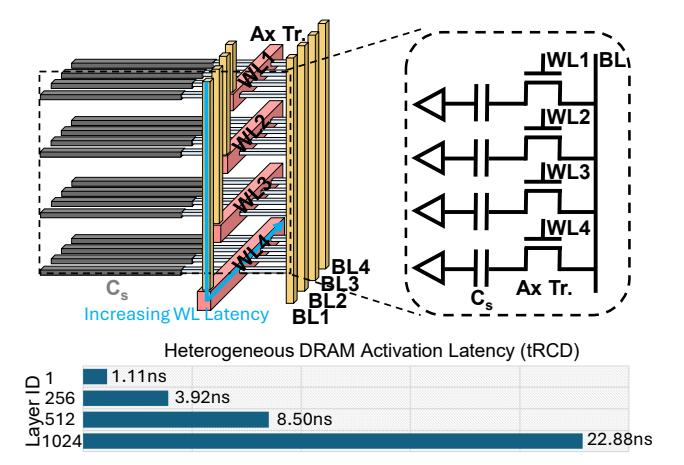
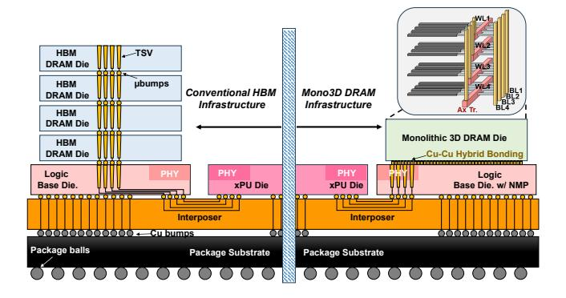
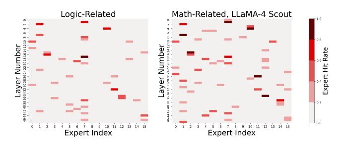
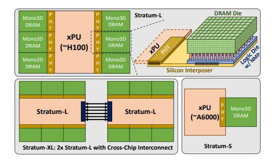
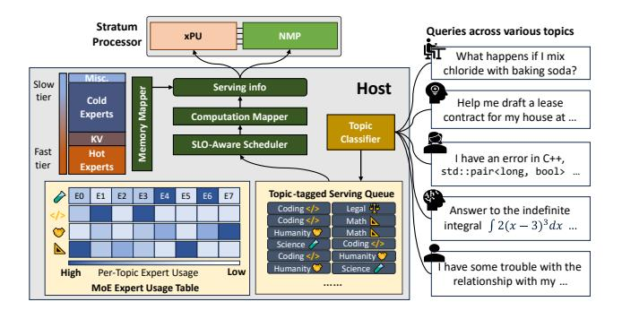
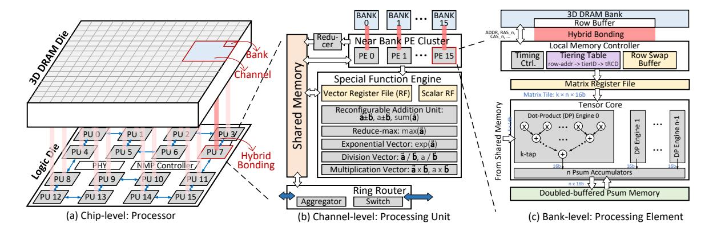

# 2 Background

#### 2.1 Monolithic 3D-Stackable DRAM

Mono3D DRAM is a promising technology for continued DRAM scaling, drawing significant attention from both academia and industry [57, 59, 67, 69, 92]. Compared to conventional 2D DRAM technologies, it offers significantly higher memory density by leveraging vertical scaling—enabled by advanced techniques such as nanosheet field-effect transistors (FETs), which provide tighter gate control and support stacked channel architectures, and fabrication techniques inspired by 3D NAND Flash processes, including layer-by-layer deposition, high-aspect-ratio etching for ultra-thin dielectric isolation, and dense vertical integration [16, 36, 46, 83].

Mono3D DRAM employs monolithic 3D stackable horizontal 1T1C DRAM cells, incorporating wordline (WL) staircases and vertically connected bitlines (BL) to interconnect memory cells across multiple layers, as seen in Figure 2. While HBM incurs high costs due to low manufacturing yield from TSV fabrication and the sophisticated packaging required for die stacking, Mono3D DRAM offers cost advantages through improved scalability by avoiding TSVs and leveraging monolithic 3D integration, which sequentially constructs additional DRAM layers on the same wafer. Mono3D DRAM also achieves thermal benefit using thinner dies and improved vertical thermal conduction enabled by monolithic integration.

On top of its cost and thermal benefits, Mono3D DRAM also delivers enhanced memory bandwidth to the logic layer. It leverages heterogeneous integration [16, 46] and employs Cu–Cu hybrid bonding for high-speed data transfer between memory cells and logic peripherals. Figure 3 compares Mono3D DRAM with HBM on the same 2.5D integration platform. HBM's internal bandwidth is constrained by TSVs, which have a coarse pitch of 10  $\mu$ m [79],

Figure 2: Monolithic 3D-Stackable DRAM with vertically stacked horizontal 1T1C DRAM cells. Bitlines are vertically routed to avoid sense margin variations, and wordlines are routed through staircases. The activation latency varies by layers due to wordline staircases.

resulting in limited bandwidth and significant area overhead that reduces memory density. In contrast, Mono3D DRAM utilizes Cu–Cu hybrid bonding between DRAM and logic base dies with a much finer pitch of 1  $\mu$ m [9], connected via back-end-of-line (BEOL) metal routing, to achieve exceptionally high internal bandwidth.

Despite its higher internal bandwidth, Mono3D DRAM, as shown in Figure 3, still has external bandwidth limitations similar to HBM due to the limited bandwidth of the interposer I/O interface. Additionally, prior work [63] highlights the significant energy consumption incurred during data transfers to the external processor, including routing across the logic base die and through the interposer I/O interface. These inefficiencies underscore the necessity of NMP integration on the logic die alongside Mono3D DRAM to utilize internal bandwidth and improve energy efficiency.

Despite the potential for exceptional memory capacity in Mono3D DRAM, its vertical scalability is limited by substantial variation in access latency across layers. As shown in Figure 2, WLs at the bottom of the staircase structure experience increased parasitic capacitance and resistance, resulting from the linearly extended WL routing. This latency imbalance becomes significant when Mono3D DRAM is scaled to hundreds of layers. Rather than designing around the worst-case access latency, system-level performance can be improved by embracing this latency heterogeneity. This challenge naturally motivates an architectural approach dubbed in-memory tiering, discussed in detail in §3. Note that the scaling trend of Mono3D DRAM aligns with that of 3D NAND Flash, as Mono3D DRAM leverages similar fabrication processes that have already been scaled beyond 400 layers [70]. Furthermore, recent white papers suggest the feasibility of extending this scaling to 500 to even 1000 layers [22, 45]. Given these advancements and the projected trajectory of vertical scaling, we assume up to 1024 wordline (WL) stacks to reflect the near-future feasibility.

Figure 3: HBM versus Mono3D DRAM on 2.5D integration platform with a xPU die. The HBM and Mono3D DRAM are attached to the logic base die through TSVs and Cu-Cu hybrid bonding, respectively.

#### 2.2 Mixture of Expert LLMs

As indicated by LLM scaling laws [52], the accuracy of dense transformer models improves with size, but so do their training and serving costs. Recent MoE models, such as OLMoE [60], Mixtral [51], Deepseek V3 [27], Time MoE [74], DBRX [25], LLaMA-4 [4], and Kimi-K2 [78], offer a compelling alternative by activating only a small subset of experts per token. This sparse activation improves training scalability and enables large parameter counts without proportional increases in pre-training cost [54], while keeping inference costs comparable to smaller dense models [32]. On the other hand, MoE models require a routing mechanism, where a gating network computes expert assignment scores from token representations (FFN input or intermediate activations) using learned router parameters that determine sparse expert selection patterns [32]. Each token is then dispatched to its selected expert(s) for independent processing, and when multiple experts are used per token, their outputs are combined-typically via weighted aggregation using the routing scores—to produce the final output of the layer [27, 32, 51].

The switching nature of MLP modules in MoE models introduces unique hardware deployment challenges. First, MoE models are large, with expert weights dominating the total size, e.g., over 95% of the model in Mixtral 8×7B [51], placing substantial pressure on GPU memory. Second, expert usage varies dynamically for each token and is unknown beforehand, leading to load imbalance when experts are distributed across different computing units [27]. Recent efforts aim to reduce communication overhead by predicting expert usage in advance. ExpertFlow [39] employs a lightweight surrogate model to forecast routing paths, while MoE Infinity [85] uses cross-layer activation profiling to statistically predict expert selection. In hybrid GPU and near-memory processing systems, Duplex [89] dynamically dispatches expert computation to either GPU or NMP units based on the latency models and batch size.

During training, MoE models typically include an expert imbalance loss to prevent starvation, where one or more experts are selected far less frequently, thereby encouraging more uniform expert utilization [32, 51]. However, as training progresses, domain specialization tends to emerge naturally among experts [13, 58, 87]. This specialization becomes increasingly pronounced as the number of experts increases and shared experts are introduced, consolidating

Figure 4: Expert hit profiling from LLaMA-4 Scout (16 Experts).

Figure 5: Example Stratum configurations.

common knowledge and enhancing the domain specificity of the routed experts [4, 24, 27, 60]. Building on this observation, recent work has explored leveraging expert affinity to specific domains to accelerate inference in GPU-only environments [33, 81, 87].

We profile and observe that the expert usage has a distinct relationship with the topic of the query: a particular topic activates certain experts significantly more frequently. An example is shown in Figure 4, where LLaMA-4 Scout exhibits over 90% domain-specific expert affinity on math- and logic-related topics within MMLU subsets. In our serving system, we exploit topic-specific expert affinity by first conducting offline profiling to collect statistics on expert hit rates (i.e., usage probabilities) across various topics. During online serving, a lightweight topic classifier in the scheduler assigns topic labels to all incoming queries in a batch. Based on this classification, the system maps frequently used experts to faster Mono3D DRAM layers to optimize access latency, as discussed in §5.

### 3 Stratum Overview

#### 3.1 System Overview

The Stratum processing system consists of an xPU die and a configurable number of Monolithic 3D-Stackable DRAM chips, interfaced through silicon interposers, with near-memory computing capabilities. We demonstrate three different example configurations (Figure 5) to accommodate models of varying sizes, using different numbers of Mono3D DRAM chips. *Stratum-L* uses an NVIDIA H100 compute die as the xPU die with six Mono3D DRAM chips interconnected through interposers. *Stratum-S* uses a NVIDIA RTX A6000 die as the xPU die with a single Mono3D DRAM chip providing 32GB memory. *Stratum-XL* consists of two *Stratum-L* modules, providing a total of 384 GB of memory for serving larger models. These

Figure 6: Serving system based on Stratum.

configurations suit diverse compute and memory requirements, and can scale up using cross-chip interconnects like NVLink [50].

Each Mono3D DRAM chip consists of a memory die on top and a logic die at the bottom, which are interconnected by Cu-Cu hybrid bonding to provide high internal bandwidth. Additionally, to exploit access latency differences across the vertical layers of Mono3D DRAM, we introduce internal memory tiering within the memory die. The bottom logic die implements a powerful nearmemory processor (NMP) to support LLM inference without always fetching data to the host processor, as detailed in §3.2.

Figure 6 describes the flow of a serving system based on Stratum. In a realistic serving scenario, queries submitted by users are of varying topics. When users send inference requests, the host processor uses a lightweight topic classifier to determine the topic of the query. These requests are then enqueued in the serving queue with a topic tag. Periodically, the scheduler groups inference requests from the serving queue and later dispatches them to the Stratum processing system. To enhance user experience, a key Service-Level Objective (SLO) is Time to First Token (TTFT), which ensures that a request does not wait too long before processing begins. When SLO permits, the scheduler prioritizes batching requests of the same topic to maximize the benefits of expert placements. The memory mapper constructs the aggregated expert hit prediction for the batch by consulting the pre-profiled expert usage table and produces a target placement as a mapping between experts to Mono3D DRAM layers. Expert swaps are executed before every new batch with different topic tags to meet the target layout. Considering the arithmetic intensity of each stage, the Computation Mapper assigns the prefill phase to xPU and the decode phase to the Stratum NMP, following a similar strategy as in [67]. Additionally, the lightweight topic classification is executed by the host processor.

#### 3.2 Stratum Near Memory Processing

Figure 7 illustrates the architecture of Stratum NMP, which organizes processing components across multiple levels of the memory hierarchy—including chip, channel, and bank levels—to exploit the benefits of 3D integration. This architectural decision targets the acceleration of attention and expert computations, which are fundamental bottlenecks in MoE models.

Figure 7(a) illustrates the integration of the logic die processor with the Mono3D DRAM die. The logic die consists of multiple processing units (PUs), each coupled with a dedicated Mono3D DRAM

channel. These PUs interconnect via a bidirectional ring-based onchip network designed to optimize data communication patterns in LLM workloads, such as reduce-scatter and all-gather. Note that the ring network is only utilized in NMP mode. In regular memory operation mode, the logic die NMP remains inactive, ensuring minimal interference with traditional memory access patterns. In NMP mode, the xPU streams inputs (e.g., queries, hidden token vectors, etc.) to reserved rows in Mono3D DRAM banks with a standard DRAM interface. Upon computation completion, the xPU retrieves processed results by accessing the dedicated address space.

Each PU aims to handle data assigned to its respective DRAM channel to avoid cross-channel DRAM access-a critical consideration given the massive volume of vertical routing between Mono3D DRAM and the logic die. Figure 7(b) presents the PU microarchitecture, consisting of a near-bank processing element (PE) cluster, a shared memory, a special function engine, a ring router, and a reducer. The near-bank PE cluster integrates multiple PEs optimized for both GeMM and GeMV operations. The intra-channel reducer implemented with parallel reduction trees aggregates partial sums (psums) across multiple PEs within the channel as required. The ring router incorporates a local switch for efficient data routing during inter-PU communication and an aggregator for in-situ data reduction. Incoming data streams can be immediately accumulated in the router without going through the shared memory. The accumulated results can be stored locally in the PU or forwarded to neighboring PUs as needed. The special function engine performs special operations such as Softmax for attention mechanisms and other common activation functions (e.g., SiLU, GeLU) in expert layers. It includes a vector register file, a scalar register file, and multiple arithmetic units. Operating in a single-instruction-multiple-data (SIMD) manner, the special function engine maximizes data reuse by decomposing complex functions into simple primitives and sourcing and storing operands or intermediate results within the vector and scalar register files.

At the bank level, detailed in Figure 7(c), each PE is designed to execute GeMM and GeMV operations. The bank-level PE consists of a tensor core integrated with specialized memory components: a matrix register file, a psum memory, and a simple local memory controller. The memory controller, directly interfacing with its corresponding DRAM bank, dynamically translates row addresses to specific memory tier identifiers through a programmable tiering table, enabling adaptive DRAM latency control (tRCD) for performance optimization. The row swap buffer stores temporary row data to support tier-to-tier data movement without requiring explicit external data fetching. The tensor core incorporates n parallel k-tap dot-product engines and n local accumulators. The doublebuffered psum memory structure concurrently supports intermediate result accumulation and output transfers. The processed outputs can be delivered to the special function engine for element-wise function evaluation or returned to the channel-level shared memory for subsequent computational steps.

Stratum's architecture, specifically optimized for hybrid bonding-based Mono3D DRAM integration, differs from HBM-centric NMP approaches such as AttAcc [67], Neupims [43], and Duplex [89]. The on-chip ring network is designed to support MoE inference communication patterns (e.g., all-gather, reduce-scatter), eliminating the centralized global buffer and crossbar used in Duplex [89],

Figure 7: Stratum NMP architecture. (a) Overview of the processor at the chip level. Microarchitectures of (b) the processing unit (PU) at the channel level, and (c) the processing element (PE) at the bank level.

which improves scalability and simplifies physical design. Unlike Duplex [89] and AttAcc [67], which rely on dedicated Softmax units, our SIMD-based engine executes general non-linear operators with programming instructions. In addition, the processor is fully implemented on the logic die and hybrid-bonded to the Mono3D DRAM die, avoiding the DRAM fabrication process constraints and TSV bandwidth limitations observed in AttAcc [67] and Neupims [43]. At the circuit level, Stratum introduces Mono3D DRAM-specific primitives—including tiering tables and row swap buffers—to exploit tiered memory latency and accelerate expert migration for MoE model serving.

