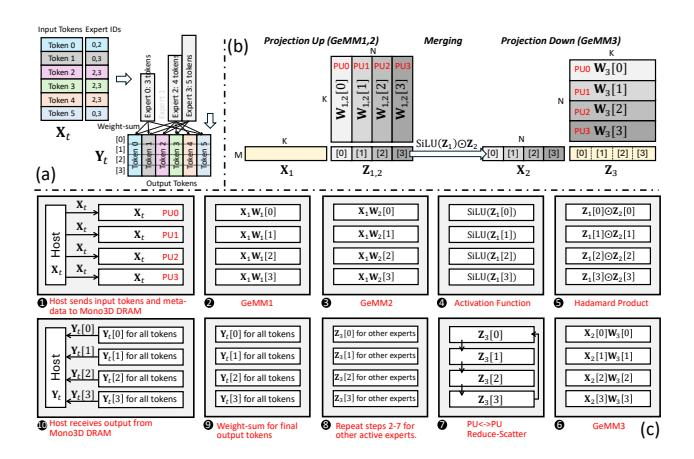
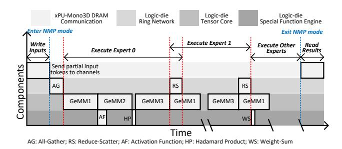
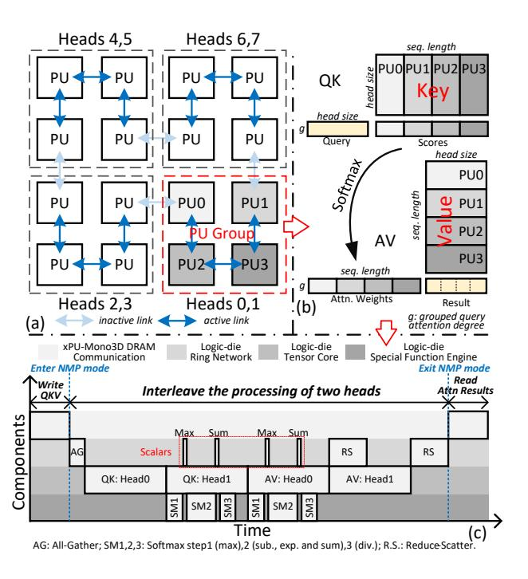

# 4 Stratum Operator Mapping and Execution

#### 4.1 Expert Processing

The execution flow of an MoE layer consists of three main stages: token routing, expert computation, and result aggregation. As illustrated in Figure 8(a), tokens from a batch may be routed to different experts based on routing decisions computed on the xPU. This is feasible due to the negligible computational cost of the routing step, which typically involves a lightweight linear layer (e.g., 4096 input and 8 output dimensions). Subsequently, only the activated experts—i.e., those assigned at least one token—are executed. Finally, the outputs from all experts are merged using a weighted sum to produce the final output tokens. Both the expert computation and result aggregation are executed by Stratum NMP processor.

The computation of a single expert in MoE models typically consists of three cascaded GeMM operations [4, 51], as shown in Figure 8(b). Let M denote the number of tokens routed to one expert in the current batch, K the hidden dimension, and N the intermediate dimension. First, the input hidden matrix  $\mathbf{X}_1$  of size  $M \times K$  is multiplied by two weight matrices of size  $K \times N$  to produce intermediate matrices  $\mathbf{Z}_1$  and  $\mathbf{Z}_2$  (both of size  $M \times N$ ). A non-linear, element-wise activation is applied to  $\mathbf{Z}_1$ , and the result is combined with  $\mathbf{Z}_2$  via a Hadamard product to form  $\mathbf{X}_2$ . Finally,  $\mathbf{X}_2$  is multiplied by a projection-down weight matrix of size  $N \times K$ , producing the output  $\mathbf{Z}_3$  of size  $M \times K$ .

**Partitioning Strategy.** In practice, different experts may receive different numbers of tokens. Furthermore, experts may be mapped to different tiers within the Mono3D DRAM hierarchy, each with

Figure 8: (a) Example of MoE's token-to-expert mapping. (b) The computation stages of an expert with M routed tokens and matrix partition, assuming four PUs for simplicity. (c) The step-by-step execution of the MoE layer in Stratum.

varying memory access latency, further exacerbating load imbalance. Thus, distributing multiple experts across PUs could cause serious workload imbalance issues between PUs. To address this, the execution of multiple chosen experts is scheduled sequentially, e.g., one expert at a time. All PUs collaborate to process one expert at a time using tensor parallelism. This requires each matrix involved in all three GeMM operations to be partitioned into tiles, each assigned to a PU for parallel execution. Figure 8(b) illustrates the matrix partitioning scheme used in Stratum, where only four PUs are assumed for simplicity. Partitioning along different dimensions introduces trade-offs among input duplication, weight duplication, and partial sum aggregation. We avoid splitting along the M dimension to prevent duplication of expert weights, which dominate memory usage. Instead, we split the weight matrix of the GeMM1 and GeMM2 vertically, while horizontally for GeMM3. Such a method eliminates data communication between projection-up and projection-down stages at the cost of duplicating  $X_t$  to multiple PUs initially and then gathering partial results from multiple PUs for  $\mathbb{Z}_3$ . Note that the cost of duplicating  $X_t$  is well amortized, as the input matrix

Figure 9: Optimized timing diagram of the expert processing.

 $X_1$  for all active experts is derived from  $X_t$  (i.e., the collection of tokens in the batch). In addition, the gathering from multiple PUs and reduction for  $Z_3$  can be computed in parallel with the next expert processing, effectively hiding the latency.

**Execution Stages.** Figure 8(c) illustrates the step-by-step execution flow of the MoE layer. The xPU begins by sending the batch of

input tokens, along with the corresponding expert IDs and scaling weights, to the Mono3D DRAM and switches the Mono3D DRAM to NMP mode (step 1). Due to the adopted matrix partitioning strategy, each Mono3D DRAM channel must receive the entire input token matrix. Next, the Stratum NMP processor executes the activated experts sequentially through steps 2-7. In steps 2 and 3, the tensor cores in all PEs execute the two projection-up GeMM operations to compute the intermediate results  $Z_1$  and  $Z_2$ . Steps  $\bullet$ and 5 involve applying the activation function and performing the Hadamard product using the special function engines. Thanks to the matrix splitting strategy, no inter-PU communication is needed for each PU to obtain its required input slice for the third GeMM. The third GeMM is executed in step 6, followed by a reduce-scatter operation to accumulate the final output matrix Z3 across PUs. Steps 2-7 are then repeated for each of the remaining activated experts. In step 9, the special function engines perform a weighted sum across expert outputs to produce the final output tokens, which are written back to the designated DRAM memory space. Finally, in step no, the Mono3D DRAM exits NMP mode, and the xPU retrieves the computed tokens by accessing the designated address space. Execution Optimization. Figure 9 presents an optimized execution pipeline designed to maximize utilization of compute and communication resources. First, to mitigate the latency of xPUto-Mono3D DRAM data transfer, the input token matrix is partitioned into multiple slices, with each slice sent to a distinct Mono3D DRAM channel. This reduces input preparation overhead, and a subsequent all-gather operation, enabled by the high-speed logic die ring network, reconstructs the full input matrix for all PUs. Second, the computation of GeMM2 is overlapped with the activation function evaluation, as there are no data dependencies between them, enabling better pipeline utilization. Third, the reduce-scatter communication associated with GeMM3 is parallelized with the GeMM1 execution of the next expert, thereby hiding communication latency behind computation. Finally, the weighted-sum operation is performed immediately by the special function engines as soon as each expert's output becomes available, minimizing idle cycles and improving overall throughput.

Figure 10: Execution of attention layer. (a) Heads (e.g., eight) assignment across PU groups (e.g., four). Intra-PU group: (b) Attention operator mapping. (c) Concurrent processing of multiple heads (e.g., two).

Within each PU, communication overhead among PEs is negligible due to the high-bandwidth shared memory. As a result, intra-PU matrix partitioning is primarily focused on maximizing tensor core mapping utilization. To this end, the longer dimension of the weight matrix is partitioned, and the resulting sub-tiles are distributed across PEs for parallel processing. Therefore, the projection-up weight slices  $\mathbf{W}_{1,2}[i]$  are typically partitioned horizontally, while the projection-down weight slice  $\mathbf{W}_3[i]$  is partitioned vertically across PEs to optimize compute efficiency.

#### 4.2 Attention Processing

The generation task in Large Language Models (LLMs) is often bottlenecked by data access to the key-value (KV) cache. Stratum addresses this issue efficiently by leveraging the high bandwidth between Mono3D DRAM and the NMP logic on the base die. However, to fully exploit this bandwidth, it is critical to effectively process the data fetched vertically from the DRAM layers on time. Otherwise, the available bandwidth may be underutilized due to computational or communication bottlenecks within the logic die.

Stratum leverages head-level parallelism to efficiently execute attention operations due to the absence of data dependencies across attention heads. Figure 10(a) illustrates the assignment of attention head tasks on the logic die. Multiple attention heads from a group of requests can be assigned across Mono3D DRAM devices. The number of assigned heads can change depending on the network models, such as the common grouped query attention in MoE models [4, 51] and the concurrency of requests under a service latency

requirement. To provide a processing architecture for diverse head-level parallelism, the PUs on the logic die can be flexibly partitioned into multiple PU groups of variable sizes, provided that the PUs within a group are neighbors connected through the on-chip ring topology as shown in Figure 10(a), where PUs connected with arrows indicate the PUS on the ring. This arrangement also allows efficient intra-group communication via high-speed bi-directional links. We assign at least two heads per group to enable interleaved processing across different computation stages for the enhanced throughput and hardware utilization—for example, one head may perform a linear operation while another executes the Softmax.

Figure 10(b) depicts how key and value matrices of a single head are partitioned across PUs within a PU group. Typically, the sequence length dimension (e.g., 512–32k tokens) is significantly larger than the attention head dimension (e.g., 64–128), motivating us to partition along the sequence length dimension. However, the Softmax operation inherently requires global information across all tokens, i.e., the global maximum (i.e., row\_max(Scores)) and the global sum of exponentials (i.e.,  $\sum \exp(Scores - \text{row}_max(Scores))$ ) for normalization [35]. Fortunately, each PU can independently compute local maxima and sums using its dedicated special function engine, requiring only scalar exchanges between PUs to derive global values. To balance the workloads of PUs in the decoding stage, the newly generated key-value pairs are distributed across different PUs within a PU group in a round-robin manner.

Figure 10(c) presents the optimized execution flow of multiple attention heads within a PU group. Initially, the xPU writes computed key-value pairs into the corresponding DRAM channels. Queries (which may be grouped query matrices) are partitioned into slices, each allocated to a distinct DRAM channel within a PU group. Subsequently, all PUs in the group obtain the complete query matrix via a sub-ring all-gather operation, analogous to the MoE layer. When multiple heads are assigned to the same PU group, the Softmax operation can be interleaved with the query × key and attn. × value operators to minimize the overall latency. Note that the Softmax operator is split into three steps with two rounds of inter-PU communications as shown in Figure 10. Finally, the latency of the reduce-scatter of the first head can be hidden in the attn. × value operation of the second head.

In summary, Stratum best utilizes the vertical bandwidth enabled by hybrid bonding through optimized data placement, operator mapping, and scheduling. The system applies tensor parallelism across all PU for expert computation and uses grouped-PU head parallelism for attention. Both strategies direct most memory accesses to local Mono3D DRAM banks through hybrid bonding I/Os. The remaining inter-PU communication, such as all-gather, reduce-scatter, or scalar exchange, is efficiently supported by the on-chip ring network. Additionally, the scheduler overlaps matrix operations (e.g., GeMM and GeMV) with special-function computations (e.g., SiLU and Softmax), coordinating on-chip communication and compute to improve overall parallelism.

#### 4.3 Design with Physical Constraints

The integration of Mono3D DRAM and the logic die processor via hybrid bonding must satisfy both thermal and area constraints. In the NMP mode, the system could be limited by a peak power budget,  $P_{peak}$ , determined by thermal analysis (see §6.2.2), leading to the power constraint as follows:

$$P_{dram} + P_{compute} + P_{misc} \le P_{peak},$$
  
 $P_{dram} = BW_{fast\ tier} \cdot E_b, \quad P_{compute} = N_{mac} \cdot f_{logic} \cdot E_{mac}.$  (1)

Here,  $BW_{fast\_tier}$  is the peak bandwidth of the fastest tier in Mono3D DRAM tier,  $E_b$  represents the energy per bit for the data transfer from the DRAM layer to the logic die via hybrid bonding,  $N_{mac}$  is the total number of multiply-accumulate (MAC) units in tensor cores,  $f_{logic}$  is the logic die operating frequency, and  $E_{mac}$  is the energy per MAC operation. The miscellaneous power,  $P_{misc}$ , includes logic die SRAMs, register files, routers, special function engines, intra-PU reducers, and local memory controllers, varying according to the operator type and dataflow.

While hybrid bonding-based data I/O does not consume an active area in the logic die, TSVs remain necessary for power delivery to both DRAM and logic dies [88]. Consequently, the following area constraint must hold:

$$A_{PD} + N_{mac} \cdot A_{mac} + A_{PHY} + A_{peri} + A_{misc} \le \alpha A_{chip},$$
 (2)

where  $A_{PD}$  is the total TSV for power delivery,  $A_{mac}$  is the area per MAC unit operating at  $f_{logic}$ ,  $A_{PHY}$  represents the area of the physical communication layer of xPU-DRAM interface,  $A_{peri}$  is the area of low-voltage Mono3D DRAM peripherals on the logic die such as D/Q buffer, level shifters and others, and  $A_{misc}$  captures miscellaneous logic area components similar to those outlined for  $P_{misc}$ , and  $\alpha$  is the target utilization. Assuming a single TSV with area  $A_{TSV}$  can deliver  $I_{TSV}$  current, the total TSV area is given by:

$$A_{PD} = \left(\frac{P_{dram\_c}}{V_{dram\_c}} + \frac{P_{dram\_p}}{V_{dram\_p}} + \frac{P_{compute} + P_{misc}}{V_{logic}}\right) \frac{A_{TSV}}{I_{TSV}},$$

$$P_{dram\_c} + P_{dram\_p} = P_{dram}$$
(3)

where  $V_{dram\_c}$ ,  $V_{dram\_p}$ , and  $V_{logic}$  denotes the supply voltage of Mono3D DRAM core, high-voltage peripherals, and low-voltage logic die. Equations (1)(2)(3) will be used to guide the design configuration of the logic die processor (see §6.2.3).

