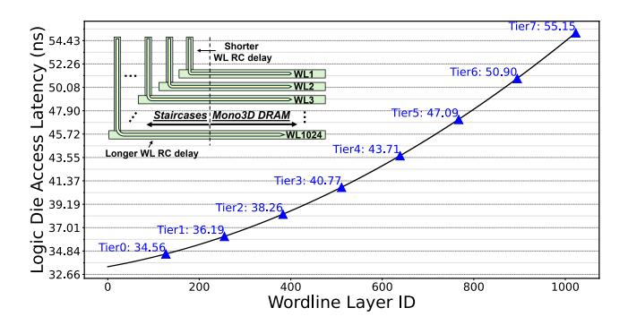
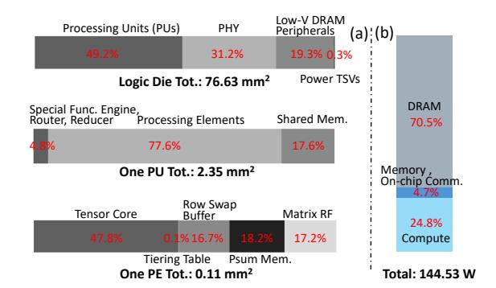
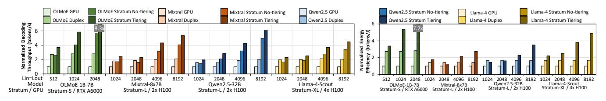
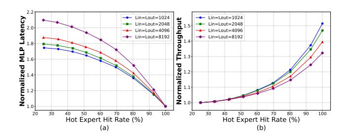
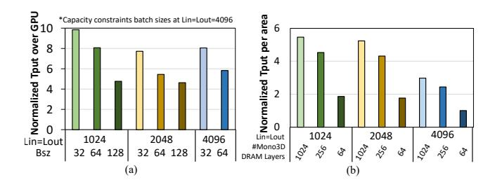

# 6.2 Hardware Evaluation

6.2.1 Tiering in 3D-DRAM. As illustrated in Figure [14,](#page-10-3) Mono3D DRAM exhibits the almost linearly scaled access latency associated with the extending WL staircase structure for accessing various WL layers. As Mono3D DRAM vertically scaled with increasing WL layers, WL parasitics corresponding to the area of the staircase are also scaled, leading to a longer RC delay. Although the critical path for the bottommost WL suffers from long latency, the topmost WL has a shorter access latency, facilitating further optimization at the system level. In this work, we introduce the memory tiering technique for Mono3D DRAM. We define 8 timing tiers in Mono3D DRAM corresponding to different layers as shown in Figure [14.](#page-10-3) The fast tier achieves 1.6× faster access than the slowest tier.

Figure 14: Mono3D DRAM latency across WL layers. The inset illustrates various access latencies according to the increasing WL RC delay when scaling the staircase for increasing WL layers.

6.2.2 Power and area budget. Power. The vertically integrated memory and logic dies require precise thermal modeling to determine the logic die's power budget. We performed thermal simulations using the HotSpot [75, 76] simulator for 3D IC. We consider high-end liquid cooling solutions with vapor chamber heat sinks. The heat sink is characterized by the following parameters: a convection capacitance of 75 J/K, a convection resistance of 0.01 W/K, and a thickness of 1 mm. The material properties include a thermal conductivity of 5000 J/(m·K) and a specific heat capacity of 106 J/(m3·K). The thermal conductivity values are adopted from previous studies on vapor chamber thermal modeling [49, 61]. Additionally, advanced cooling fluids, such as phase change materials, achieve significantly reduced convection resistance of approximately 0.01 W/K [31, 62]. Furthermore, we derived convection capacitance, heat sink thickness, and vapor specific heat parameters, explicitly considering the differences between conventional and vapor chamber heat sinks. Prior research demonstrates that state-of-the-art cooling methods for 3D ICs effectively manage power densities ranging up to 200 W/cm2 [53]. Assuming full utilization of Mono3D DRAM internal bandwidth at 30.34 TB/s, each Mono3D DRAM die consumes approximately 104 W. Given the safe temperature for memory and data [37], we conclude the logic die power caps at around 45W per chip.

Area. The Mono3D DRAM maintains compatibility with the xPU-DRAM interposer interface utilized by HBM3 [68], thereby requiring an HBM3 PHY module. The PHY module's area overhead, computed for 16 physical channels each supporting 64-bit data I/O at 6.4 Gbps, totals 23.94 mm² [15, 77]. The logic die also has low-voltage Mono3D DRAM peripherals such as DQ buffer, level shifter, and address decoder, occupying 14.80 mm². Power delivery to both Mono3D DRAM and the logic dies involves TSVs extending through the logic die from the interposer. Each TSV with an area of 25  $\mu$ m² can deliver up to 36 mA [88]. To accommodate peak power of 104 W for the Mono3D DRAM and 45W for the logic processor, the TSVs introduce an area overhead of 0.21 mm² when considering a 2:1 redundancy scheme. The logic die matches the Mono3D DRAM die area of 121 mm² (i.e., the base die dimensions of HBM3 [68]). Thus, the available area budget for the logic die processor is 82 mm².

**Table 3: Stratum Logic Die Processor Specification** 

| Processing Element (PE)              |                                                                        |                                     |                  |  |  |  |
|--------------------------------------|------------------------------------------------------------------------|-------------------------------------|------------------|--|--|--|
| Tensor Core                          | 16×16MACs                                                              | Tiering Table                       | 16×16b Registers |  |  |  |
| Psum SRAM                            | 64 KB                                                                  | Row Swap Buffer                     | 8KB RF           |  |  |  |
| Processing Unit (PU)                 |                                                                        |                                     |                  |  |  |  |
| #PEs                                 | 16                                                                     | Shared Memory                       | 1.25 MB          |  |  |  |
| Special Func. Engine                 | 256-way SIMD                                                           | Ring Router                         | 128 GB/s/link    |  |  |  |
| Stratum NMP Processor                |                                                                        |                                     |                  |  |  |  |
| Basic                                | 7 nm process; 0.7 V supply; 121 mm 2 die area; FP16 format. |                                     |                  |  |  |  |
| #PUs                                 | 16                                                                     | SRAM Capacity                       | 36 MB            |  |  |  |
| Peak Performance                     | 128 TFLOPS                                                             | Peak Power                          | 43 W             |  |  |  |
| Aggregated On-chip Ring Bandwidth | 2.048 TB/s                                                             | Aggregated Mono3D DRAM Bandwidth | 19.01-34.34 TB/s |  |  |  |

Figure 15: (a) Area breakdown of logic die processor; (b) Power breakdown of Mono3D DRAM-Logic Die at peak performance.

6.2.3 logic die processor. Table 3 summarizes the specifications of the Stratum logic die processor at the PE, PU, and chip hierarchy levels. We calculated the maximum number of MAC units using Equation (1), employing a simulated per-MAC-operation energy of  $E_{mac} = 0.604$  pJ. The processor achieves a peak performance of 128 TFLOPS with 64k MAC units operating at 1 GHz. The PE tensor core is arranged into a 16×16 array, providing a balanced matrix tile size to optimize utilization across diverse GeMM sizes. Additionally, a programmable tiering table stores row addresses of the last Mono3D DRAM layer and the tRCD for each tier. The incoming row addresses are compared with eight stored addresses to expedite tRCD lookup. The communication-computation optimizations adopted enable the on-chip ring to require only 128 GB/s bandwidth per link without performance degradation based on the system-level simulation. Figure 15 presents the area and power breakdown of the Stratum NMP stack. The total area occupied by the active logic is 76.63 mm2, which falls within the 121 mm2 area budget, yielding a utilization of 63%. The area is predominantly consumed by the PEs, which dominate the PU-level area. The tiering table introduces only a minimal overhead of 0.1% of the PE area within each PE. The Stratum NMP stack reaches a peak power of 144.53 W when the fastest Mono3D DRAM tier is accessed concurrently with full tensor core utilization. The total power of the logic die is 42.67 W, including compute, on-chip communication, and logic-die memory access, under the 45W power budget.

#### 6.3 System Evaluation

Figure 16: Evaluation and comparison of system decoding throughput and energy efficiency.

6.3.1 Algorithm Evaluation. Model. Our model is based on DistilBERT [72] with 67M parameters and designed for multi-topic text classification, supporting sequences of up to 1024 tokens. It features a compact architecture with 6 transformer layers and 12 attention heads, with a hidden dimension of 3072.

**Data.** Our model training involves a customized data mix across 6 topics. The datasets include a 2% split of Pile of Law for legal topic [40], 1 out of 3 splits from atlas converse and INCLUDE for humanity topic [5, 71], 5% split of Programming books for CS topic [65], SciQ and ARC-easy for science topic [20, 82], GSM8K and MATH for math topic [21, 42], Atlas reasoning for logic topic [6]. For the above-mentioned 6-topic configuration, the data encompasses approximately 70 million tokens.

Training and Evaluation. To address distribution shifts from standard NLP datasets to diverse real-world prompts, we use a GPT-40-based data synthesis pipeline. We sample 500 prompts from the Chatbot Arena dataset [3] to reflect natural user styles, then use GPT-40 with a fixed system prompt to rewrite 50% of our training data into a QA format. We use a mix of rewritten and original data to train our topic classifier on a single A100 GPU for 3 epochs of 3 hours each. For evaluation, we use the MMLU test sets [41] and hand-curated 180-example subsets of Chatbot arena conversations dataset [3] with the 6 topics. Our trained classifier achieves 94.5% and 85.0% accuracy on MMLU and Chatbot arena test sets, close to the performance of OpenAI O3-mini-high (96.2%, 91.1%). The inference overhead of the model is less than 10ms with ONNX runtime on a regular laptop CPU. We use OpenAI-O3 LLM-asa-judge to classify 33,000 real-world queries from LMArena [12], which shows that our six coarse-grained topics cover 93% of queries, confirming the robustness and generality of TopicBERT's taxonomy.

6.3.2 System Performance. Figure 16 shows the normalized decoding throughput and energy efficiency when serving requests with equal input and output length. For Mono3D DRAM designs, we evaluate no-tiering and tiering approaches. In no-tiering design of Mono3D DRAM, Mono3D DRAM is treated as a single tier, therefore, the logic die is limited to operating under the worst memory access latency of the memory die. In tiering, Mono3D DRAM is divided into 8 tiers with fine-grained memory latency and data mapping optimizations given tiering. Stratum tiering consistently outperforms GPU baselines across all cases, averaging 8.29×, 5.39×, 6.13×, 4.48× better decoding throughput for OLMoE, Mixtral, Qwen2.5, and Llama-4, respectively. Specifically, as decoding length grows, decoding on conventional GPUs with limited memory bandwidth becomes increasingly memory-bound, due to the quadratic complexity of the attention mechanism, explaining the growing gap of Stratum over GPU baselines. Stratum no-tiering as well outperforms

Figure 17: Impact of hot expert hit rates on (a) MLP (MoE layer) latency and (b) overall system throughput for Stratum-L.

Table 4: Overhead of Expert Swap across Mono3D DRAM Tiers

|                      | <b>OLMoE</b> [60] | Mixtral [51]  | <b>Llama-4</b> [4] |
|----------------------|-------------------|---------------|--------------------|
| #Expert swaps/sec    | 5.91              | 2.59          | 4.02               |
| Time Overhead (ms)   | 0.64 (0.37%)      | 0.90 (0.23%)  | 0.45 (0.18%)       |
| Energy Overhead (mJ) | 0.25 (<0.02%)     | 0.35 (<0.03‰) | 0.34 (<0.02‰)      |

GPU due to its higher internal bandwidth compared to HBM, even considering the worst-case latency. The internal memory tiering (§3.2) and MoE-specific data mapping optimizations (§5.2) further improve decoding throughput by averages of 1.45×, 1.39×, 1.32×, 1.34× over *no-tiering* for the 4 models, respectively. Energy-wise, Stratum achieves up to 7.66×, 2.74×, 3.51×, 4.87× better energy efficiency for the same decoding tasks across OLMoE, Mixtral, Qwen2.5, and Llama-4, respectively, due to cheaper memory access. We also extracted data from the previous work Duplex [89] and made conservative scaling to compare with Stratum. Stratum achieves up to 2.9×, 2.5×, 3.0×, 2.2× better throughput and 2.7×, 1.9×, 2.9×, 2.1× energy over Duplex [89] for OLMoE, Mixtral, Qwen2.5, and Llama-4.

6.3.3 Expert Placement Optimizations. Effectiveness. To study the effectiveness of expert placement in the tiered Mono3D DRAM, we scan the hot expert hit rate for Mixtral 8×7B on Stratum-L as shown in Figure 17. The hot expert hit rate is defined as the ratio of aggregated hot expert to total expert accesses at the token level. Across decoding lengths, accurate hot expert usage prediction brings 1.32× to 1.51× better throughput over a uniformly distributed expert usage, or equivalently a naively managed tiered memory. The benefit is more noticeable on smaller decoding lengths, as the MLP dominates the decoding latency more. Using our topic prediction model, we achieve 31.6%, 48.5%, and 68.9% aggregated hot expert hit rates when serving Mixtral, OLMoE, and Llama-4.

Figure 18: Impacts of (a) batch size and (b) Mono3D DRAM layers on system-level metrics, evaluated with Llama-4-Scout on Stratum-XL

**Costs.** The scheduler (§3.1) may trigger expert swaps between batches. To evaluate the worst-case scenario, we consider 1) short sequences,  $L_{in} = L_{out} = 256$  with batch size one, and 2) consecutive batches assigned to different topics. Table 4 reports the time and energy overheads of expert swaps, which remain well below 1% across all benchmarks. This negligible cost stems from two factors: expert swaps occur within the same bank, avoiding cross-bank movement, and NMP logic includes dedicated row-swap buffers that enables swapping at the high internal Mono3D DRAM tier bandwidth without traversing the DRAM–xPU interface.

6.3.4 Performance scaling with batch size. Figure 18(a) evaluates Stratum's performance scaling across different query batch sizes using the large-scale Llama-4-Scout [4] benchmark. Batch sizes are chosen to ensure the full model fits within the Mono3D DRAM of Stratum or the HBM of the GPU baseline. Stratum consistently outperforms the GPU baseline across all settings by 4.7–9.8×. However, the relative performance advantage reduces with larger batches, particularly at shorter sequence lengths (e.g., 1024 tokens), due to the GPU die's higher compute-to-bandwidth ratio and the increased dominance of MoE layers in the overall runtime.

6.3.5 Performance scaling with Mono3D DRAM layers. Figure 18(b) reports Stratum's performance scaling across different Mono3D DRAM layer configurations. All variants have the same DRAM capacity and use the same NMP logic die processor, and throughput is normalized to the die area of each Mono3D DRAM to ensure a fair, cost-aware comparison. On average, the 1024-layer design achieves 1.21× and 2.96× higher throughput per area than the 256-layer and 64-layer Mono3D DRAM, respectively, demonstrating the cost-efficiency benefits of adopting >1k-layer Mono3D DRAM.

6.3.6 Tiering mechanism on Mono3D DRAM with less layers. The proposed tiering mechanism exploits wordline latency variation resulting from vertical stacking in monolithic 3D DRAM. Mono3D DRAM employs the similar fabrication process as 3D NAND Flash, which has already scaled beyond 400 layers [70]. Thus, we consider a 512-layer configuration by partitioning the original 1024-layer mat into two horizontally connected 512-layer segments while preserving the NMP logic design. Device-level simulations reveal a 1.3× access latency difference between the fastest and slowest tiers. System-level evaluations demonstrate overall (including both MoE and attention layers) performance improvements of 17.7%, 18.3%, and 18.3% under our topic-aware tiering placement at a sequence length of  $L_{in} = L_{out} = 1024$  on LLama-4-Scout [4], Mixtral

8×7B [51], and OLMoE-1B-7B [60] benchmarks, respectively. These results validate the efficacy of the proposed tiering strategy across a wide number of Mono3D DRAM layers.

#### 7 Related Works

**3D Stackable DRAM.** Monolithic 3D-Stackable DRAM has emerged as a promising alternative to HBM by sequentially fabricating multiple DRAM layers on the same wafer. Unlike HBM, which depends on TSVs and costly die-stacking, Mono3D DRAM employs fine-pitch hybrid bonding for higher internal bandwidth and integration density [10, 11, 36, 46, 48, 83]. Leading Mono3D DRAM technologies include Horizontal 1T1C [36, 48], which reorients and stacks 1T1C DRAM cells, and Gate-Control Thyristors [10, 11], which leverage avalanche mechanisms. Recent work further shows that Mono3D DRAM 's  $\sim 1 \mu \text{m}$  bonding pitch [9] enables up to  $5 \times$  denser vertical interconnects than HBM [88].

Processing In/Near Memory Acceleration for Transformers. While Processing In/Near Memory (PIM/PNM) has been a long-standing concept, MAT [91] first applied PIM to Transformer models, targeting a single encoder block with a memory-efficient pipelined sub-sequence flow. TransPIM [92] extends this with a hybrid PIM-PNM architecture for full-model execution. Neupims [43] and AttAcc [67] focus on Decoder-only Transformer models, offloading attention layers in the decoding stage to the PNM on a xPU-PNM hybrid-processing system. Duplex [89] further expanded support to MoE, GQA, and continuous batching with dynamic compute partitioning. However, all these designs rely on 2D DRAM or die-stacked HBM, limiting their effectiveness when applied to Mono3D DRAM-based systems.

#### 8 Conclusion

We present Stratum, a novel system-hardware co-design for efficient MoE serving that, for the first time, leverages high-density Mono3D DRAM dies integrated with logic through 3D hybrid bonding, and further connected to GPUs via a 2.5D silicon interposer. This architecture offers a cost-effective and high-throughput alternative to conventional GPU-HBM-based systems. At the hardware level, Stratum introduces in-memory tiering to exploit vertical access latency variations in Mono3D DRAM, and a near-memory processor (NMP) optimized for expert and attention execution. At the system level, we exploit topic-dependent expert activation patterns to classify and map experts across memory tiers and design a topic-aware scheduler guided by a lightweight classifier to meet service-level objectives. Cross-layer evaluations spanning device, circuit, algorithm, and system levels show that Stratum achieves up to 8.29× better decoding throughput and up to 7.66× less energy consumption compared to GPU baselines.

#### Acknowledgments

This work was supported in part by PRISM and CoCoSys, centers in JUMP 2.0, an SRC program sponsored by DARPA. This research is also supported by National Science Foundation (NSF) grants 2112665, 2112167, 2003279, 2120019, and 2211386.

